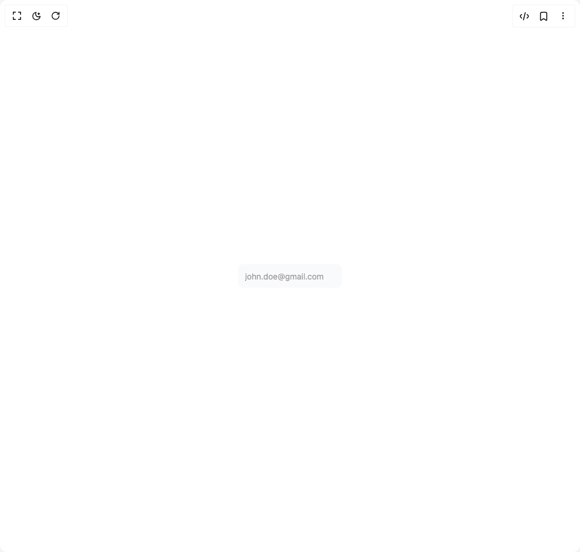

# Build Input in BuilderStudio

> Build this component in our Agentic IDE: [BuilderStudio](https://builderstudio.dev).
>
> Join the BuilderStudio community on [Discord](https://discord.gg/QdWeSGCqfe) and [Reddit](https://reddit.com/r/builderstudio).



## Component

- Author group: `muntasirszn`
- Component: `input`
- Variant: `default`
- Rendered HTML snapshot: [`rendered.html`](rendered.html)

## BuilderStudio prompt

You are implementing a React component based on a component reference.

## Component identity

- Author: muntasirszn
- Component slug: input
- Demo slug: default
- Title: input
- Description: 

## Goal

Recreate this component in a React + TypeScript + Tailwind CSS project. Preserve the visual layout, spacing, colors, border radius, shadows, interaction behavior, animation behavior, responsive behavior, and dark mode behavior shown in the rendered demo.

## Implementation requirements

- Use React and TypeScript.
- Use Tailwind CSS classes whenever possible.
- Keep the component self-contained unless the source files require helper components.
- If the source uses CSS variables, custom CSS, animations, or keyframes, include them.
- If the source uses external packages, list and use the required packages.
- Preserve accessibility attributes, button semantics, links, keyboard behavior, and ARIA attributes when visible in the source.
- Do not replace the component with a simplified placeholder.
- Return complete production-ready code.

## Dependencies

No reference metadata available.

## Rendered DOM snapshot

This is the rendered demo HTML extracted from the live preview. Use it to verify structure, class names, visible content, and layout.

```html
<div id="root"><div class="flex w-full h-screen justify-center items-center"><div class="group/input rounded-lg p-[2px] transition duration-300 relative"><div class="absolute inset-0 rounded-lg" style="background: radial-gradient(0px at 0px 0px, rgb(59, 130, 246), transparent 80%);"></div><input class="relative z-10 shadow-input dark:placeholder-text-neutral-600 flex h-10 w-full rounded-md border-none bg-gray-50 px-3 py-2 text-sm text-black transition duration-400 group-hover/input:shadow-none file:border-0 file:bg-transparent file:text-sm file:font-medium placeholder:text-neutral-400 focus-visible:ring-[2px] focus-visible:ring-neutral-400 focus-visible:outline-none disabled:cursor-not-allowed disabled:opacity-50 dark:bg-zinc-800 dark:text-white dark:shadow-[0px_0px_1px_1px_#404040] dark:focus-visible:ring-neutral-600" placeholder="john.doe@gmail.com" name="email"></div></div></div>
```

## Reference source files

No reference source files were available.
