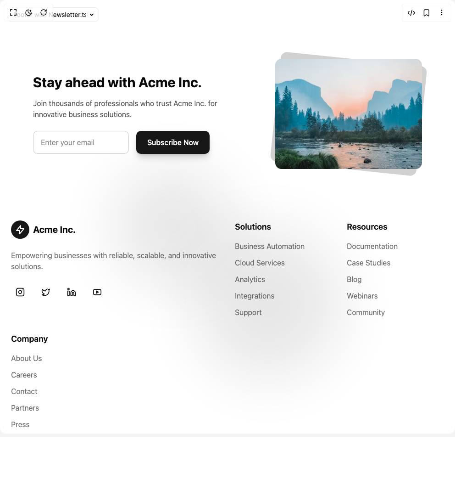

# Build Footer Column in BuilderStudio

> Build this component in our Agentic IDE: [BuilderStudio](https://builderstudio.dev).
>
> Join the BuilderStudio community on [Discord](https://discord.gg/QdWeSGCqfe) and [Reddit](https://reddit.com/r/builderstudio).



## Component

- Author group: `mvp_subha`
- Component: `footer-column`
- Variant: `default`
- Rendered HTML snapshot: [`rendered.html`](rendered.html)

## BuilderStudio prompt

You are implementing a React component based on a component reference.

## Component identity

- Author: mvp_Subha
- Component slug: footer-column
- Demo slug: default
- Title: footer-column
- Description: 

## Goal

Recreate this component in a React + TypeScript + Tailwind CSS project. Preserve the visual layout, spacing, colors, border radius, shadows, interaction behavior, animation behavior, responsive behavior, and dark mode behavior shown in the rendered demo.

## Implementation requirements

- Use React and TypeScript.
- Use Tailwind CSS classes whenever possible.
- Keep the component self-contained unless the source files require helper components.
- If the source uses CSS variables, custom CSS, animations, or keyframes, include them.
- If the source uses external packages, list and use the required packages.
- Preserve accessibility attributes, button semantics, links, keyboard behavior, and ARIA attributes when visible in the source.
- Do not replace the component with a simplified placeholder.
- Return complete production-ready code.

## Dependencies

No reference metadata available.

## Rendered DOM snapshot

This is the rendered demo HTML extracted from the live preview. Use it to verify structure, class names, visible content, and layout.

```html
<div id="root"><div class="w-screen min-h-screen flex justify-center items-center"><div class="fixed top-4 left-4 z-10"><select class="appearance-none h-8 max-w-[200px] text-sm leading-tight rounded-lg pl-3 pr-7 py-0 border bg-background focus:outline-none focus:ring-0"><option value="Footer with Newsletter.tsx_FooterNewsletter">Footer with Newsletter.tsx</option><option value="Glowing Footer.tsx_FooterGlow">Glowing Footer.tsx</option><option value="default.tsx_DemoOne">default.tsx</option></select><div class="absolute top-1/2 transform -translate-y-1/2 right-2 pointer-events-none"><svg class="w-4 h-4 fill-current" viewBox="0 0 20 20"><path d="M5.516 7.548c.436-.446 1.043-.48 1.576 0L10 10.405l2.908-2.857c.533-.48 1.14-.446 1.576 0 .436.445.408 1.197 0 1.615l-3.734 3.705c-.533.534-1.39.534-1.923 0l-3.734-3.705c-.408-.418-.436-1.17 0-1.615z"></path></svg></div></div><div class="w-screen min-h-screen flex justify-center items-center"><footer class="bg-background text-foreground relative w-full pt-20 pb-10"><div class="pointer-events-none absolute top-0 left-0 z-0 h-full w-full overflow-hidden"><div class="bg-primary absolute top-1/3 left-1/4 h-64 w-64 rounded-full opacity-10 blur-3xl"></div><div class="bg-primary absolute right-1/4 bottom-1/4 h-80 w-80 rounded-full opacity-10 blur-3xl"></div></div><div class="relative z-10 mx-auto max-w-7xl px-4 sm:px-6 lg:px-8"><div class="glass-effect mb-16 rounded-2xl p-8 md:p-12"><div class="grid items-center gap-8 md:grid-cols-2"><div><h3 class="mb-4 text-2xl font-bold md:text-3xl">Stay ahead with Acme Inc.</h3><p class="text-foreground/70 mb-6">Join thousands of professionals who trust Acme Inc. for innovative business solutions.</p><div class="flex flex-col gap-4 sm:flex-row"><input placeholder="Enter your email" class="border-foreground/20 bg-background focus:ring-primary rounded-lg border px-4 py-3 focus:ring-2 focus:outline-none" type="email"><button class="bg-primary text-primary-foreground shadow-primary/20 hover:shadow-primary/30 rounded-lg px-6 py-3 font-medium shadow-lg transition">Subscribe Now</button></div></div><div class="hidden justify-end md:flex"><div class="relative"><div class="bg-primary/20 absolute inset-0 rotate-6 rounded-xl"></div></div></div></div></div><div class="mb-16 grid grid-cols-2 gap-8 md:grid-cols-4 lg:grid-cols-5"><div class="col-span-2 lg:col-span-1"><div class="mb-6 flex items-center space-x-2"><div class="bg-primary flex h-10 w-10 items-center justify-center rounded-full"><svg xmlns="http://www.w3.org/2000/svg" class="text-primary-foreground h-6 w-6" fill="none" viewBox="0 0 24 24" stroke="currentColor"><path stroke-linecap="round" stroke-linejoin="round" stroke-width="2" d="M13 10V3L4 14h7v7l9-11h-7z"></path></svg></div><span class="text-xl font-bold">Acme Inc.</span></div><p class="text-foreground/60 mb-6">Empowering businesses with reliable, scalable, and innovative solutions.</p><div class="flex space-x-4"><a href="#" class="glass-effect hover:bg-primary/10 flex h-10 w-10 items-center justify-center rounded-full transition"><svg xmlns="http://www.w3.org/2000/svg" width="24" height="24" viewBox="0 0 24 24" fill="none" stroke="currentColor" stroke-width="2" stroke-linecap="round" stroke-linejoin="round" class="lucide lucide-instagram h-5 w-5" aria-hidden="true"><rect width="20" height="20" x="2" y="2" rx="5" ry="5"></rect><path d="M16 11.37A4 4 0 1 1 12.63 8 4 4 0 0 1 16 11.37z"></path><line x1="17.5" x2="17.51" y1="6.5" y2="6.5"></line></svg></a><a href="#" class="glass-effect hover:bg-primary/10 flex h-10 w-10 items-center justify-center rounded-full transition"><svg xmlns="http://www.w3.org/2000/svg" width="24" height="24" viewBox="0 0 24 24" fill="none" stroke="currentColor" stroke-width="2" stroke-linecap="round" stroke-linejoin="round" class="lucide lucide-twitter h-5 w-5" aria-hidden="true"><path d="M22 4s-.7 2.1-2 3.4c1.6 10-9.4 17.3-18 11.6 2.2.1 4.4-.6 6-2C3 15.5.5 9.6 3 5c2.2 2.6 5.6 4.1 9 4-.9-4.2 4-6.6 7-3.8 1.1 0 3-1.2 3-1.2z"></path></svg></a><a href="#" class="glass-effect hover:bg-primary/10 flex h-10 w-10 items-center justify-center rounded-full transition"><svg xmlns="http://www.w3.org/2000/svg" width="24" height="24" viewBox="0 0 24 24" fill="none" stroke="currentColor" stroke-width="2" stroke-linecap="round" stroke-linejoin="round" class="lucide lucide-linkedin h-5 w-5" aria-hidden="true"><path d="M16 8a6 6 0 0 1 6 6v7h-4v-7a2 2 0 0 0-2-2 2 2 0 0 0-2 2v7h-4v-7a6 6 0 0 1 6-6z"></path><rect width="4" height="12" x="2" y="9"></rect><circle cx="4" cy="4" r="2"></circle></svg></a><a href="#" class="glass-effect hover:bg-primary/10 flex h-10 w-10 items-center justify-center rounded-full transition"><svg xmlns="http://www.w3.org/2000/svg" width="24" height="24" viewBox="0 0 24 24" fill="none" stroke="currentColor" stroke-width="2" stroke-linecap="round" stroke-linejoin="round" class="lucide lucide-youtube h-5 w-5" aria-hidden="true"><path d="M2.5 17a24.12 24.12 0 0 1 0-10 2 2 0 0 1 1.4-1.4 49.56 49.56 0 0 1 16.2 0A2 2 0 0 1 21.5 7a24.12 24.12 0 0 1 0 10 2 2 0 0 1-1.4 1.4 49.55 49.55 0 0 1-16.2 0A2 2 0 0 1 2.5 17"></path><path d="m10 15 5-3-5-3z"></path></svg></a></div></div><div><h4 class="mb-4 text-lg font-semibold">Solutions</h4><ul class="space-y-3"><li><a href="#" class="text-foreground/60 hover:text-foreground transition">Business Automation</a></li><li><a href="#" class="text-foreground/60 hover:text-foreground transition">Cloud Services</a></li><li><a href="#" class="text-foreground/60 hover:text-foreground transition">Analytics</a></li><li><a href="#" class="text-foreground/60 hover:text-foreground transition">Integrations</a></li><li><a href="#" class="text-foreground/60 hover:text-foreground transition">Support</a></li></ul></div><div><h4 class="mb-4 text-lg font-semibold">Resources</h4><ul class="space-y-3"><li><a href="#" class="text-foreground/60 hover:text-foreground transition">Documentation</a></li><li><a href="#" class="text-foreground/60 hover:text-foreground transition">Case Studies</a></li><li><a href="#" class="text-foreground/60 hover:text-foreground transition">Blog</a></li><li><a href="#" class="text-foreground/60 hover:text-foreground transition">Webinars</a></li><li><a href="#" class="text-foreground/60 hover:text-foreground transition">Community</a></li></ul></div><div><h4 class="mb-4 text-lg font-semibold">Company</h4><ul class="space-y-3"><li><a href="#" class="text-foreground/60 hover:text-foreground transition">About Us</a></li><li><a href="#" class="text-foreground/60 hover:text-foreground transition">Careers</a></li><li><a href="#" class="text-foreground/60 hover:text-foreground transition">Contact</a></li><li><a href="#" class="text-foreground/60 hover:text-foreground transition">Partners</a></li><li><a href="#" class="text-foreground/60 hover:text-foreground transition">Press</a></li></ul></div></div><div class="border-foreground/10 flex flex-col items-center justify-between border-t pt-8 md:flex-row"><p class="text-foreground/60 mb-4 text-sm md:mb-0">© 2023 Acme Inc. All rights reserved.</p><div class="flex flex-wrap justify-center gap-6"><a href="#" class="text-foreground/60 hover:text-foreground text-sm">Terms of Service</a><a href="#" class="text-foreground/60 hover:text-foreground text-sm">Privacy Policy</a><a href="#" class="text-foreground/60 hover:text-foreground text-sm">Cookie Settings</a><a href="#" class="text-foreground/60 hover:text-foreground text-sm">Accessibility</a></div></div></div></footer></div></div></div>
```

## Reference source files

No reference source files were available.
