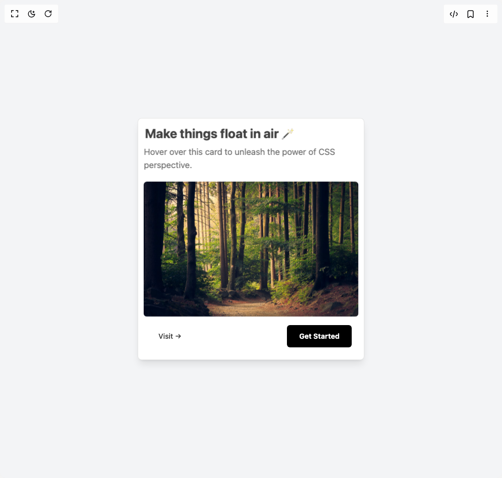

# Build 3d Card in BuilderStudio

> Build this component in our Agentic IDE: [BuilderStudio](https://builderstudio.dev).
>
> Join the BuilderStudio community on [Discord](https://discord.gg/QdWeSGCqfe) and [Reddit](https://reddit.com/r/builderstudio).



## Component

- Author group: `n38693842`
- Component: `3d-card`
- Variant: `default`
- Rendered HTML snapshot: [`rendered.html`](rendered.html)

## BuilderStudio prompt

You are implementing a React component based on a component reference.

## Component identity

- Author: n38693842
- Component slug: 3d-card
- Demo slug: default
- Title: 3d-card
- Description: 

## Goal

Recreate this component in a React + TypeScript + Tailwind CSS project. Preserve the visual layout, spacing, colors, border radius, shadows, interaction behavior, animation behavior, responsive behavior, and dark mode behavior shown in the rendered demo.

## Implementation requirements

- Use React and TypeScript.
- Use Tailwind CSS classes whenever possible.
- Keep the component self-contained unless the source files require helper components.
- If the source uses CSS variables, custom CSS, animations, or keyframes, include them.
- If the source uses external packages, list and use the required packages.
- Preserve accessibility attributes, button semantics, links, keyboard behavior, and ARIA attributes when visible in the source.
- Do not replace the component with a simplified placeholder.
- Return complete production-ready code.

## Dependencies

No reference metadata available.

## Rendered DOM snapshot

This is the rendered demo HTML extracted from the live preview. Use it to verify structure, class names, visible content, and layout.

```html
<div id="root"><div class="w-screen min-h-screen flex justify-center items-center"><div class="w-screen min-h-screen flex justify-center items-center"><div class="flex min-h-screen w-full items-center justify-center bg-gray-100 text-gray-800 transition-colors duration-300 dark:bg-black dark:text-gray-100"><div class="flex w-full justify-center px-4 sm:px-6 md:px-8" style="perspective: 1000px;"><div class="group relative w-full max-w-xs sm:max-w-sm md:max-w-md rounded-md border border-black/10 bg-white p-6 shadow-lg transition-transform duration-300 ease-out hover:shadow-xl dark:border-white/20 dark:bg-[#111111] dark:hover:shadow-2xl dark:hover:shadow-emerald-500/20" style="transform-style: preserve-3d;"><h2 class="text-xl font-bold text-neutral-700 sm:text-2xl dark:text-white" style="transform: translateZ(50px);">Make things float in air 🪄</h2><p class="mt-2 text-sm text-neutral-500 sm:text-base dark:text-neutral-300" style="transform: translateZ(60px);">Hover over this card to unleash the power of CSS perspective.</p><div class="mt-6 w-full px-2" style="transform: translateZ(100px);"></div><div class="mt-8 flex sm:flex-row items-center justify-between gap-4 sm:gap-0"><a href="https://rahulv.dev" target="_blank" rel="noopener noreferrer" class="rounded-xl px-4 py-2 text-xs font-medium text-neutral-700 transition-colors duration-300 hover:text-emerald-600 dark:text-gray-200 dark:hover:text-emerald-400 sm:text-sm" style="transform: translateZ(20px);">Visit →</a><button class="rounded-sm bg-black px-6 py-3 text-xs font-bold text-white transition-colors duration-300 hover:bg-gray-800 dark:bg-white dark:text-black dark:hover:bg-gray-200 sm:text-sm" style="transform: translateZ(20px);">Get Started</button></div></div></div></div></div></div></div>
```

## Reference source files

No reference source files were available.
