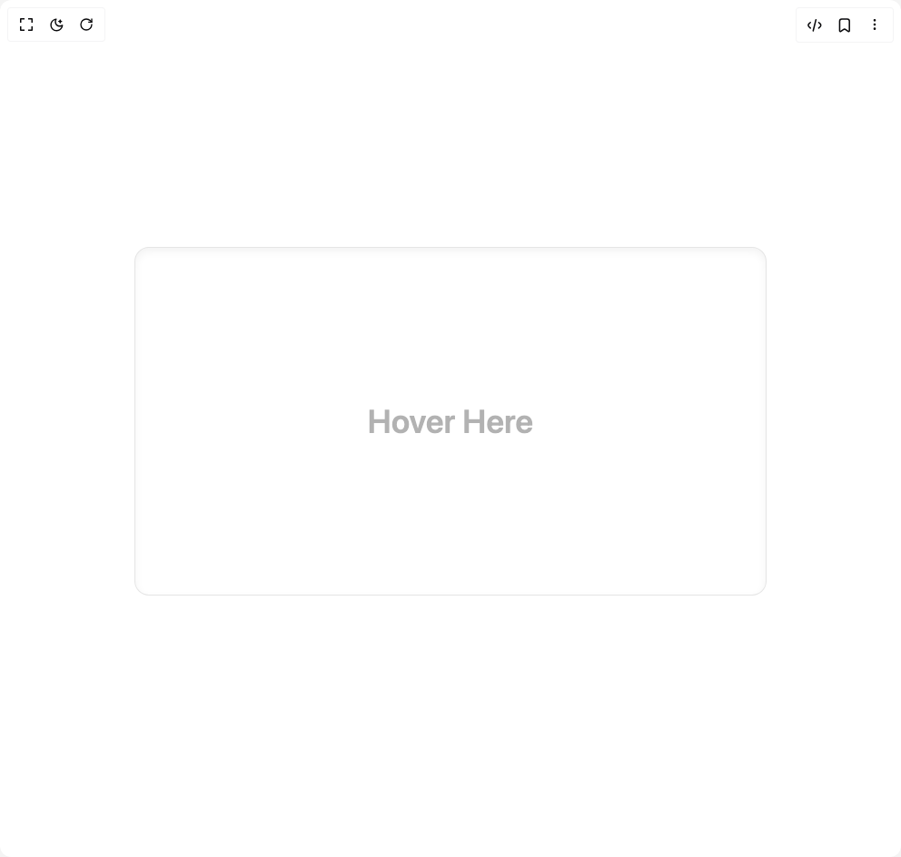
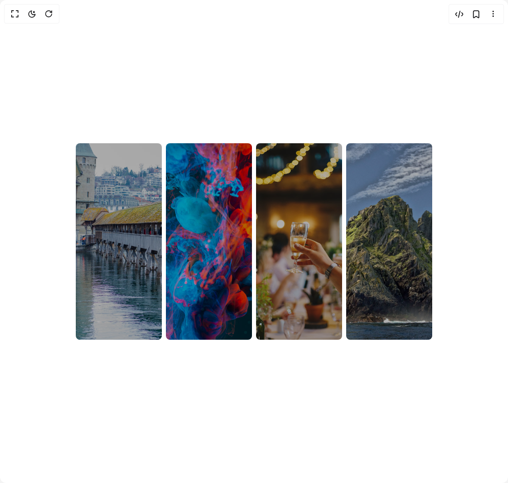
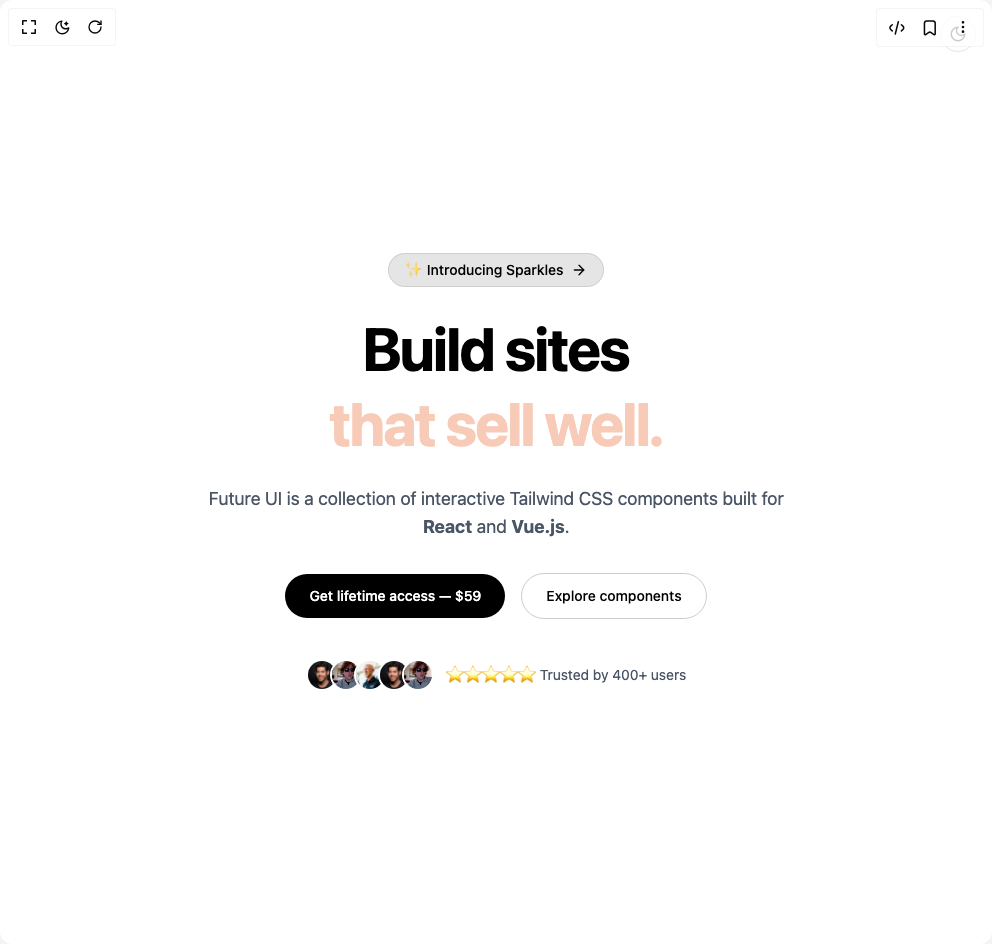
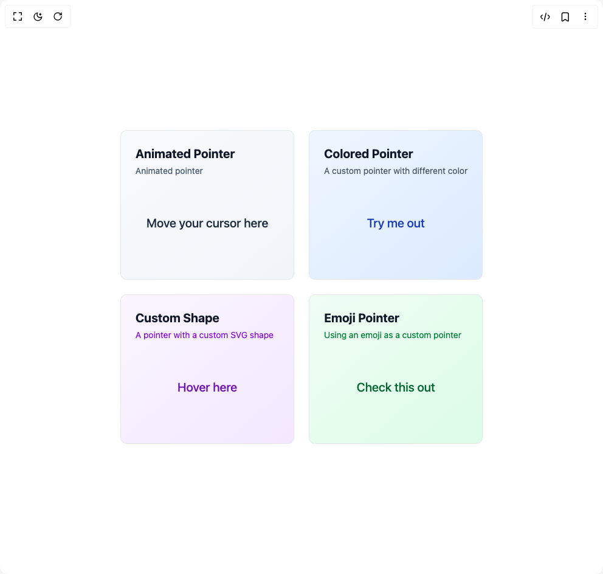
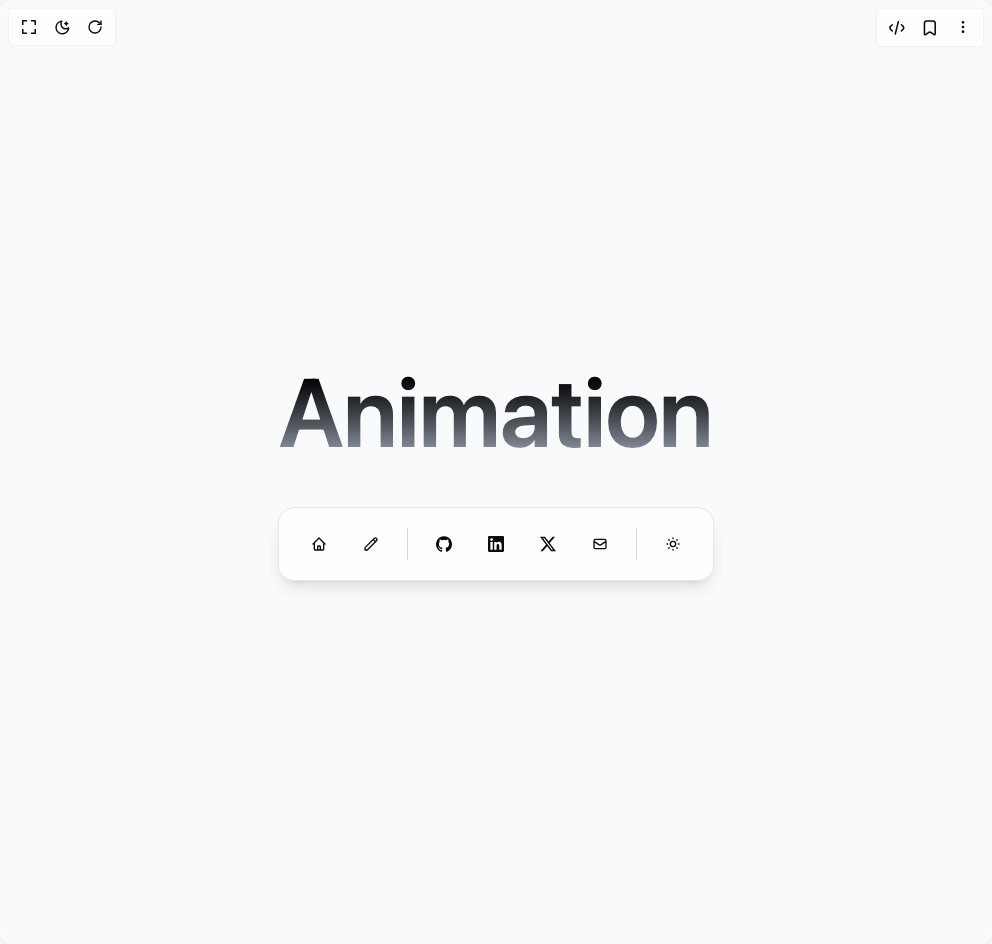
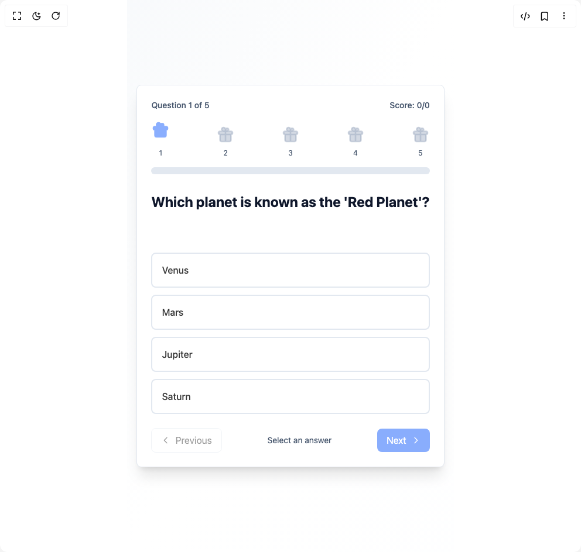

# N38693842 Components

9 components are available in this author group.

> Build any component in [BuilderStudio](https://builderstudio.dev), then share improvements with the community on [Discord](https://discord.gg/QdWeSGCqfe) or [Reddit](https://reddit.com/r/builderstudio).

| Preview | Component | Variant |
| --- | --- | --- |
|  | [3d Card](3d-card/default/README.md) | `default` |
|  | [Animated Card](animated-card/default/README.md) | `default` |
|  | [Download Animation](download-animation/default/README.md) | `default` |
|  | [Gallery Animation](gallery-animation/default/README.md) | `default` |
|  | [Hero Section 1](hero-section-1/default/README.md) | `default` |
|  | [Hover Card Animation](hover-card-animation/default/README.md) | `default` |
|  | [Mac Os Dock](mac-os-dock/default/README.md) | `default` |
|  | [Quiz Section](quiz-section/default/README.md) | `default` |
|  | [Ripple Button](ripple-button/default/README.md) | `default` |
