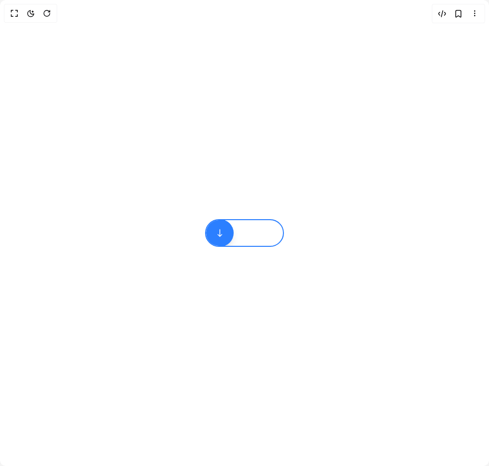

# Build Download Animation in BuilderStudio

> Build this component in our Agentic IDE: [BuilderStudio](https://builderstudio.dev).
>
> Join the BuilderStudio community on [Discord](https://discord.gg/QdWeSGCqfe) and [Reddit](https://reddit.com/r/builderstudio).



## Component

- Author group: `n38693842`
- Component: `download-animation`
- Variant: `default`
- Rendered HTML snapshot: [`rendered.html`](rendered.html)

## BuilderStudio prompt

You are implementing a React component based on a component reference.

## Component identity

- Author: n38693842
- Component slug: download-animation
- Demo slug: default
- Title: download-animation
- Description: 

## Goal

Recreate this component in a React + TypeScript + Tailwind CSS project. Preserve the visual layout, spacing, colors, border radius, shadows, interaction behavior, animation behavior, responsive behavior, and dark mode behavior shown in the rendered demo.

## Implementation requirements

- Use React and TypeScript.
- Use Tailwind CSS classes whenever possible.
- Keep the component self-contained unless the source files require helper components.
- If the source uses CSS variables, custom CSS, animations, or keyframes, include them.
- If the source uses external packages, list and use the required packages.
- Preserve accessibility attributes, button semantics, links, keyboard behavior, and ARIA attributes when visible in the source.
- Do not replace the component with a simplified placeholder.
- Return complete production-ready code.

## Dependencies

No reference metadata available.

## Rendered DOM snapshot

This is the rendered demo HTML extracted from the live preview. Use it to verify structure, class names, visible content, and layout.

```html
<div id="root"><div class="w-screen min-h-screen flex justify-center items-center"><div class="w-screen min-h-screen flex justify-center items-center"><div class="flex justify-center items-center w-full"><button class="relative flex items-center border-2 rounded-full overflow-hidden transition-all
          cursor-pointer border-blue-500" style="min-width: 160px; height: 56px; width: 160px; border-radius: 9999px;"><div class="h-14 w-14 rounded-full bg-blue-500 flex justify-center items-center relative shadow-lg z-10"><div class="absolute top-0 left-0 w-full bg-blue-800 rounded-full" style="z-index: 1; height: 0%;"></div><svg class="w-6 h-6 text-white z-20" fill="none" viewBox="0 0 24 24" stroke="currentColor" style="opacity: 1;"><path stroke-linecap="round" stroke-linejoin="round" stroke-width="1.5" d="M12 19V5m0 14-4-4m4 4 4-4"></path></svg><div class="w-4 h-4 rounded-full bg-white absolute z-20" style="opacity: 0;"></div></div><span class="ml-3 text-white text-base select-none z-10" style="opacity: 1;">Download</span></button></div></div></div></div>
```

## Reference source files

No reference source files were available.
