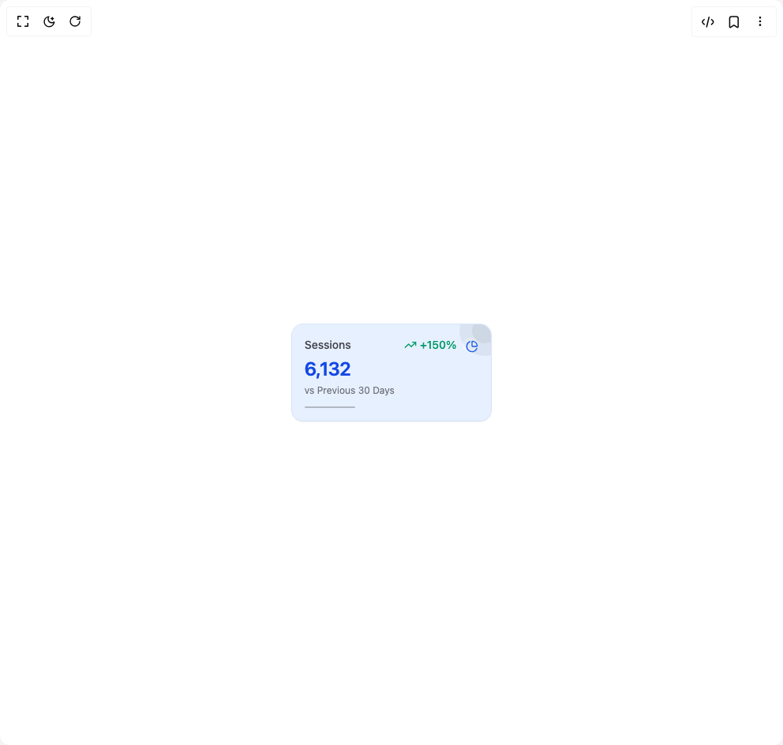
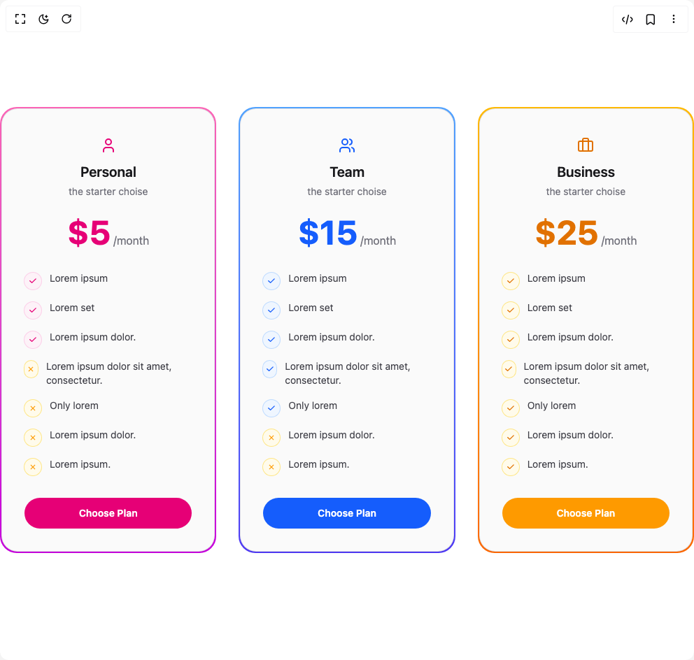
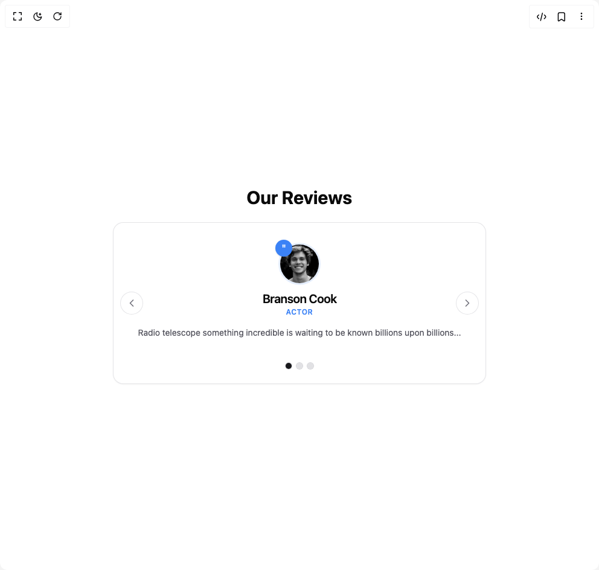
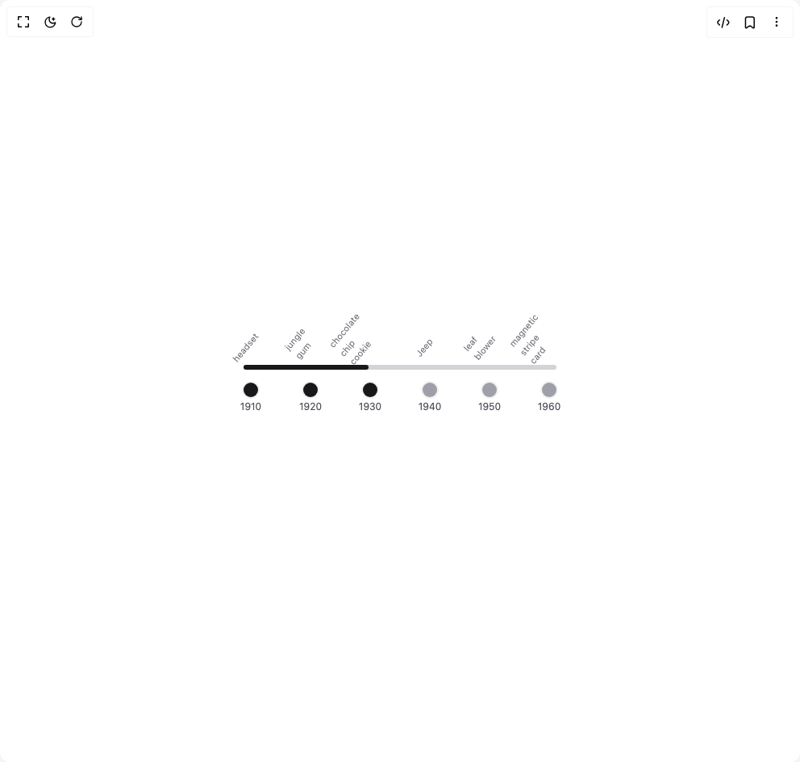
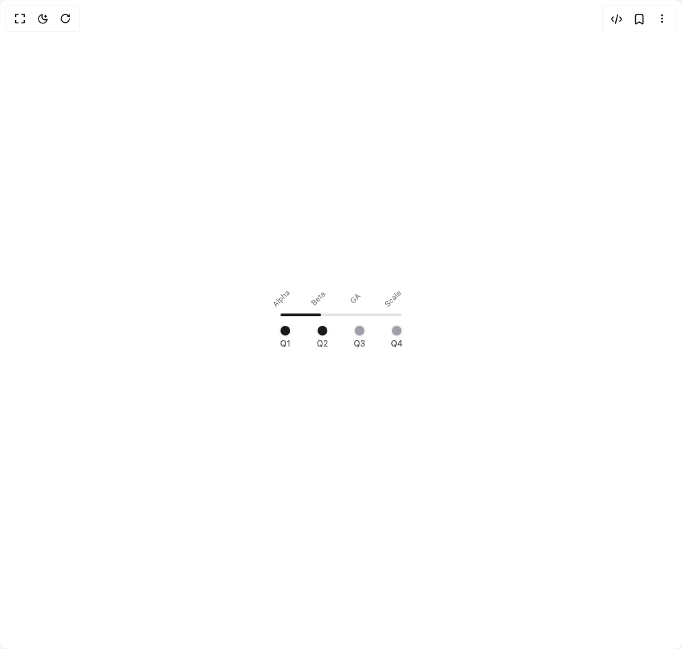
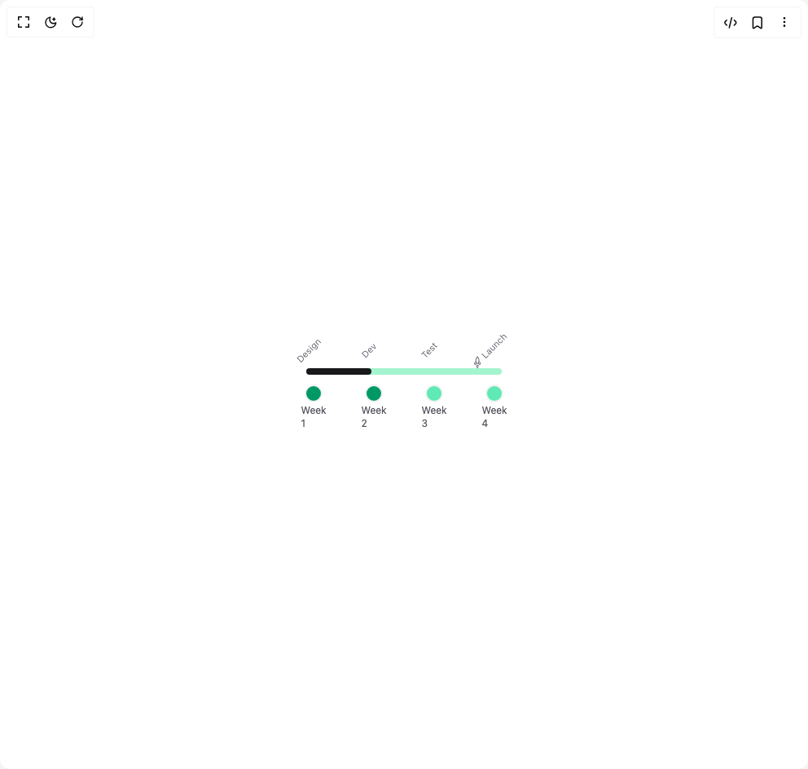

# Nayan Radadiya6 Components

8 components are available in this author group.

> Build any component in [BuilderStudio](https://builderstudio.dev), then share improvements with the community on [Discord](https://discord.gg/QdWeSGCqfe) or [Reddit](https://reddit.com/r/builderstudio).

| Preview | Component | Variant |
| --- | --- | --- |
|  | [Kpi Card](kpi-card/basic-kpi-card/README.md) | `basic-kpi-card` |
|  | [Pricing Card Triple](pricing-card-triple/default/README.md) | `default` |
|  | [Pricing Cart Duo](pricing-cart-duo/default/README.md) | `default` |
|  | [Testimonial](testimonial/custom-slide-testimonial/README.md) | `custom-slide-testimonial` |
|  | [Testimonial](testimonial/default/README.md) | `default` |
|  | [Timeline Rail](timeline-rail/default/README.md) | `default` |
|  | [Timeline Rail](timeline-rail/timeline-rail-variants/README.md) | `timeline-rail-variants` |
|  | [Timeline Rail](timeline-rail/timeline-rail-variants-one/README.md) | `timeline-rail-variants-one` |
