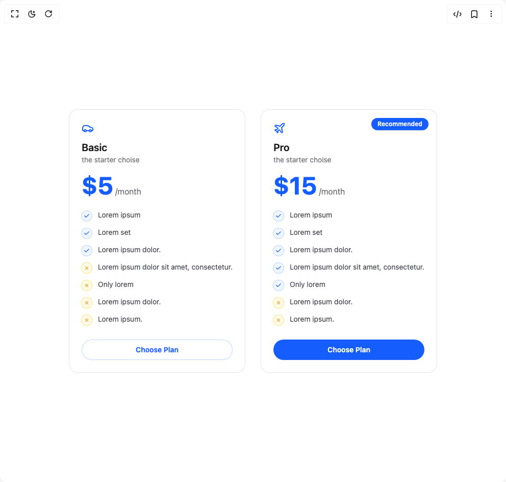

# Build Pricing Cart Duo in BuilderStudio

> Build this component in our Agentic IDE: [BuilderStudio](https://builderstudio.dev).
>
> Join the BuilderStudio community on [Discord](https://discord.gg/QdWeSGCqfe) and [Reddit](https://reddit.com/r/builderstudio).



## Component

- Author group: `nayan_radadiya6`
- Component: `pricing-cart-duo`
- Variant: `default`
- Rendered HTML snapshot: [`rendered.html`](rendered.html)

## BuilderStudio prompt

You are implementing a React component based on a component reference.

## Component identity

- Author: nayan_radadiya6
- Component slug: pricing-cart-duo
- Demo slug: default
- Title: pricing-cart-duo
- Description: 

## Goal

Recreate this component in a React + TypeScript + Tailwind CSS project. Preserve the visual layout, spacing, colors, border radius, shadows, interaction behavior, animation behavior, responsive behavior, and dark mode behavior shown in the rendered demo.

## Implementation requirements

- Use React and TypeScript.
- Use Tailwind CSS classes whenever possible.
- Keep the component self-contained unless the source files require helper components.
- If the source uses CSS variables, custom CSS, animations, or keyframes, include them.
- If the source uses external packages, list and use the required packages.
- Preserve accessibility attributes, button semantics, links, keyboard behavior, and ARIA attributes when visible in the source.
- Do not replace the component with a simplified placeholder.
- Return complete production-ready code.

## Dependencies

No reference metadata available.

## Rendered DOM snapshot

This is the rendered demo HTML extracted from the live preview. Use it to verify structure, class names, visible content, and layout.

```html
<div id="root"><div class="w-screen min-h-screen flex justify-center items-center"><div class="w-screen min-h-screen flex justify-center items-center"><div class="grid gap-8 sm:grid-cols-2"><section aria-label="Basic plan" class="relative rounded-2xl p-6 bg-white dark:bg-zinc-950 ring-1 ring-zinc-200 dark:ring-zinc-800"><div class="mb-3 text-5xl text-blue-600" aria-hidden="true"><svg xmlns="http://www.w3.org/2000/svg" width="24" height="24" viewBox="0 0 24 24" fill="none" stroke="currentColor" stroke-width="2" stroke-linecap="round" stroke-linejoin="round" class="lucide lucide-car" aria-hidden="true"><path d="M19 17h2c.6 0 1-.4 1-1v-3c0-.9-.7-1.7-1.5-1.9C18.7 10.6 16 10 16 10s-1.3-1.4-2.2-2.3c-.5-.4-1.1-.7-1.8-.7H5c-.6 0-1.1.4-1.4.9l-1.4 2.9A3.7 3.7 0 0 0 2 12v4c0 .6.4 1 1 1h2"></path><circle cx="7" cy="17" r="2"></circle><path d="M9 17h6"></path><circle cx="17" cy="17" r="2"></circle></svg></div><h3 class="text-xl font-semibold text-zinc-900 dark:text-zinc-50">Basic</h3><p class="text-sm text-zinc-500 dark:text-zinc-400">the starter choise</p><div class="mt-4 text-blue-600"><span class="text-5xl font-bold leading-none">$5</span><span class="ml-1 text-zinc-500 dark:text-zinc-400">/month</span></div><ul class="mt-6 space-y-3"><li class="flex items-start gap-3 text-sm"><span class="mt-0.5 inline-grid h-5 w-5 place-items-center rounded-full ring-1 bg-blue-50 dark:bg-blue-950/40 ring-blue-200 dark:ring-blue-900/50" aria-hidden="true"><svg viewBox="0 0 20 20" class="h-3.5 w-3.5 text-blue-600 dark:text-blue-400" fill="currentColor"><path d="M16.7 6.3a1 1 0 0 0-1.4-1.4L8 12.2 4.7 8.9a1 1 0 1 0-1.4 1.4L7.3 14a1 1 0 0 0 1.4 0l8-8Z"></path></svg></span><span class="text-zinc-700 dark:text-zinc-300">Lorem ipsum</span></li><li class="flex items-start gap-3 text-sm"><span class="mt-0.5 inline-grid h-5 w-5 place-items-center rounded-full ring-1 bg-blue-50 dark:bg-blue-950/40 ring-blue-200 dark:ring-blue-900/50" aria-hidden="true"><svg viewBox="0 0 20 20" class="h-3.5 w-3.5 text-blue-600 dark:text-blue-400" fill="currentColor"><path d="M16.7 6.3a1 1 0 0 0-1.4-1.4L8 12.2 4.7 8.9a1 1 0 1 0-1.4 1.4L7.3 14a1 1 0 0 0 1.4 0l8-8Z"></path></svg></span><span class="text-zinc-700 dark:text-zinc-300">Lorem set</span></li><li class="flex items-start gap-3 text-sm"><span class="mt-0.5 inline-grid h-5 w-5 place-items-center rounded-full ring-1 bg-blue-50 dark:bg-blue-950/40 ring-blue-200 dark:ring-blue-900/50" aria-hidden="true"><svg viewBox="0 0 20 20" class="h-3.5 w-3.5 text-blue-600 dark:text-blue-400" fill="currentColor"><path d="M16.7 6.3a1 1 0 0 0-1.4-1.4L8 12.2 4.7 8.9a1 1 0 1 0-1.4 1.4L7.3 14a1 1 0 0 0 1.4 0l8-8Z"></path></svg></span><span class="text-zinc-700 dark:text-zinc-300">Lorem ipsum dolor.</span></li><li class="flex items-start gap-3 text-sm"><span class="mt-0.5 inline-grid h-5 w-5 place-items-center rounded-full ring-1 bg-amber-50 dark:bg-amber-950/40 ring-amber-200 dark:ring-amber-900/40" aria-hidden="true"><svg viewBox="0 0 20 20" class="h-3.5 w-3.5 text-amber-500" fill="currentColor"><path d="M6.2 5 5 6.2 8.8 10 5 13.8 6.2 15 10 11.2 13.8 15 15 13.8 11.2 10 15 6.2 13.8 5 10 8.8z"></path></svg></span><span class="text-zinc-700 dark:text-zinc-300">Lorem ipsum dolor sit amet, consectetur.</span></li><li class="flex items-start gap-3 text-sm"><span class="mt-0.5 inline-grid h-5 w-5 place-items-center rounded-full ring-1 bg-amber-50 dark:bg-amber-950/40 ring-amber-200 dark:ring-amber-900/40" aria-hidden="true"><svg viewBox="0 0 20 20" class="h-3.5 w-3.5 text-amber-500" fill="currentColor"><path d="M6.2 5 5 6.2 8.8 10 5 13.8 6.2 15 10 11.2 13.8 15 15 13.8 11.2 10 15 6.2 13.8 5 10 8.8z"></path></svg></span><span class="text-zinc-700 dark:text-zinc-300">Only lorem</span></li><li class="flex items-start gap-3 text-sm"><span class="mt-0.5 inline-grid h-5 w-5 place-items-center rounded-full ring-1 bg-amber-50 dark:bg-amber-950/40 ring-amber-200 dark:ring-amber-900/40" aria-hidden="true"><svg viewBox="0 0 20 20" class="h-3.5 w-3.5 text-amber-500" fill="currentColor"><path d="M6.2 5 5 6.2 8.8 10 5 13.8 6.2 15 10 11.2 13.8 15 15 13.8 11.2 10 15 6.2 13.8 5 10 8.8z"></path></svg></span><span class="text-zinc-700 dark:text-zinc-300">Lorem ipsum dolor.</span></li><li class="flex items-start gap-3 text-sm"><span class="mt-0.5 inline-grid h-5 w-5 place-items-center rounded-full ring-1 bg-amber-50 dark:bg-amber-950/40 ring-amber-200 dark:ring-amber-900/40" aria-hidden="true"><svg viewBox="0 0 20 20" class="h-3.5 w-3.5 text-amber-500" fill="currentColor"><path d="M6.2 5 5 6.2 8.8 10 5 13.8 6.2 15 10 11.2 13.8 15 15 13.8 11.2 10 15 6.2 13.8 5 10 8.8z"></path></svg></span><span class="text-zinc-700 dark:text-zinc-300">Lorem ipsum.</span></li></ul><a href="#" aria-label="Choose Basic" class="mt-7 inline-flex w-full items-center justify-center rounded-full px-4 py-2.5 text-sm font-semibold transition text-blue-600 ring-1 ring-inset ring-blue-200 dark:ring-blue-900/50 hover:bg-black/5 dark:hover:bg-white/5" label="Choose Plan">Choose Plan</a></section><section aria-label="Pro plan" class="relative rounded-2xl p-6 bg-white dark:bg-zinc-950 ring-1 ring-zinc-200 dark:ring-zinc-800"><span class="absolute right-4 top-4 inline-flex items-center rounded-full bg-blue-600 px-3 py-1 text-xs font-semibold text-white shadow-sm">Recommended</span><div class="mb-3 text-5xl text-blue-600" aria-hidden="true"><svg xmlns="http://www.w3.org/2000/svg" width="24" height="24" viewBox="0 0 24 24" fill="none" stroke="currentColor" stroke-width="2" stroke-linecap="round" stroke-linejoin="round" class="lucide lucide-plane" aria-hidden="true"><path d="M17.8 19.2 16 11l3.5-3.5C21 6 21.5 4 21 3c-1-.5-3 0-4.5 1.5L13 8 4.8 6.2c-.5-.1-.9.1-1.1.5l-.3.5c-.2.5-.1 1 .3 1.3L9 12l-2 3H4l-1 1 3 2 2 3 1-1v-3l3-2 3.5 5.3c.3.4.8.5 1.3.3l.5-.2c.4-.3.6-.7.5-1.2z"></path></svg></div><h3 class="text-xl font-semibold text-zinc-900 dark:text-zinc-50">Pro</h3><p class="text-sm text-zinc-500 dark:text-zinc-400">the starter choise</p><div class="mt-4 text-blue-600"><span class="text-5xl font-bold leading-none">$15</span><span class="ml-1 text-zinc-500 dark:text-zinc-400">/month</span></div><ul class="mt-6 space-y-3"><li class="flex items-start gap-3 text-sm"><span class="mt-0.5 inline-grid h-5 w-5 place-items-center rounded-full ring-1 bg-blue-50 dark:bg-blue-950/40 ring-blue-200 dark:ring-blue-900/50" aria-hidden="true"><svg viewBox="0 0 20 20" class="h-3.5 w-3.5 text-blue-600 dark:text-blue-400" fill="currentColor"><path d="M16.7 6.3a1 1 0 0 0-1.4-1.4L8 12.2 4.7 8.9a1 1 0 1 0-1.4 1.4L7.3 14a1 1 0 0 0 1.4 0l8-8Z"></path></svg></span><span class="text-zinc-700 dark:text-zinc-300">Lorem ipsum</span></li><li class="flex items-start gap-3 text-sm"><span class="mt-0.5 inline-grid h-5 w-5 place-items-center rounded-full ring-1 bg-blue-50 dark:bg-blue-950/40 ring-blue-200 dark:ring-blue-900/50" aria-hidden="true"><svg viewBox="0 0 20 20" class="h-3.5 w-3.5 text-blue-600 dark:text-blue-400" fill="currentColor"><path d="M16.7 6.3a1 1 0 0 0-1.4-1.4L8 12.2 4.7 8.9a1 1 0 1 0-1.4 1.4L7.3 14a1 1 0 0 0 1.4 0l8-8Z"></path></svg></span><span class="text-zinc-700 dark:text-zinc-300">Lorem set</span></li><li class="flex items-start gap-3 text-sm"><span class="mt-0.5 inline-grid h-5 w-5 place-items-center rounded-full ring-1 bg-blue-50 dark:bg-blue-950/40 ring-blue-200 dark:ring-blue-900/50" aria-hidden="true"><svg viewBox="0 0 20 20" class="h-3.5 w-3.5 text-blue-600 dark:text-blue-400" fill="currentColor"><path d="M16.7 6.3a1 1 0 0 0-1.4-1.4L8 12.2 4.7 8.9a1 1 0 1 0-1.4 1.4L7.3 14a1 1 0 0 0 1.4 0l8-8Z"></path></svg></span><span class="text-zinc-700 dark:text-zinc-300">Lorem ipsum dolor.</span></li><li class="flex items-start gap-3 text-sm"><span class="mt-0.5 inline-grid h-5 w-5 place-items-center rounded-full ring-1 bg-blue-50 dark:bg-blue-950/40 ring-blue-200 dark:ring-blue-900/50" aria-hidden="true"><svg viewBox="0 0 20 20" class="h-3.5 w-3.5 text-blue-600 dark:text-blue-400" fill="currentColor"><path d="M16.7 6.3a1 1 0 0 0-1.4-1.4L8 12.2 4.7 8.9a1 1 0 1 0-1.4 1.4L7.3 14a1 1 0 0 0 1.4 0l8-8Z"></path></svg></span><span class="text-zinc-700 dark:text-zinc-300">Lorem ipsum dolor sit amet, consectetur.</span></li><li class="flex items-start gap-3 text-sm"><span class="mt-0.5 inline-grid h-5 w-5 place-items-center rounded-full ring-1 bg-blue-50 dark:bg-blue-950/40 ring-blue-200 dark:ring-blue-900/50" aria-hidden="true"><svg viewBox="0 0 20 20" class="h-3.5 w-3.5 text-blue-600 dark:text-blue-400" fill="currentColor"><path d="M16.7 6.3a1 1 0 0 0-1.4-1.4L8 12.2 4.7 8.9a1 1 0 1 0-1.4 1.4L7.3 14a1 1 0 0 0 1.4 0l8-8Z"></path></svg></span><span class="text-zinc-700 dark:text-zinc-300">Only lorem</span></li><li class="flex items-start gap-3 text-sm"><span class="mt-0.5 inline-grid h-5 w-5 place-items-center rounded-full ring-1 bg-amber-50 dark:bg-amber-950/40 ring-amber-200 dark:ring-amber-900/40" aria-hidden="true"><svg viewBox="0 0 20 20" class="h-3.5 w-3.5 text-amber-500" fill="currentColor"><path d="M6.2 5 5 6.2 8.8 10 5 13.8 6.2 15 10 11.2 13.8 15 15 13.8 11.2 10 15 6.2 13.8 5 10 8.8z"></path></svg></span><span class="text-zinc-700 dark:text-zinc-300">Lorem ipsum dolor.</span></li><li class="flex items-start gap-3 text-sm"><span class="mt-0.5 inline-grid h-5 w-5 place-items-center rounded-full ring-1 bg-amber-50 dark:bg-amber-950/40 ring-amber-200 dark:ring-amber-900/40" aria-hidden="true"><svg viewBox="0 0 20 20" class="h-3.5 w-3.5 text-amber-500" fill="currentColor"><path d="M6.2 5 5 6.2 8.8 10 5 13.8 6.2 15 10 11.2 13.8 15 15 13.8 11.2 10 15 6.2 13.8 5 10 8.8z"></path></svg></span><span class="text-zinc-700 dark:text-zinc-300">Lorem ipsum.</span></li></ul><a href="#" aria-label="Choose Pro" class="mt-7 inline-flex w-full items-center justify-center rounded-full px-4 py-2.5 text-sm font-semibold transition bg-blue-600 text-white hover:bg-blue-700" label="Choose Plan">Choose Plan</a></section></div></div></div></div>
```

## Reference source files

No reference source files were available.
