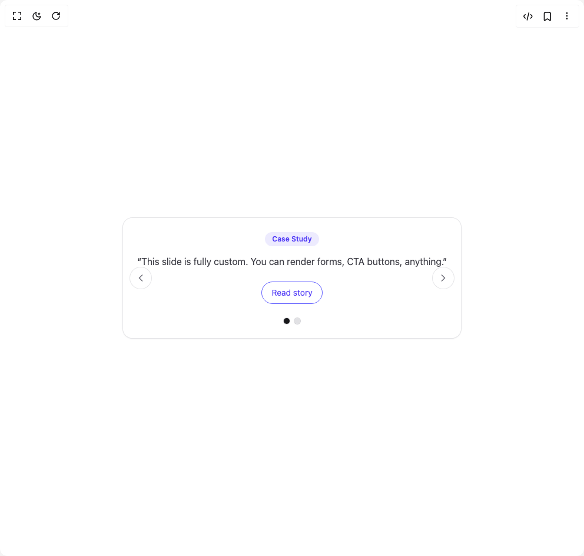

# Build Testimonial in BuilderStudio

> Build this component in our Agentic IDE: [BuilderStudio](https://builderstudio.dev).
>
> Join the BuilderStudio community on [Discord](https://discord.gg/QdWeSGCqfe) and [Reddit](https://reddit.com/r/builderstudio).



## Component

- Author group: `nayan_radadiya6`
- Component: `testimonial`
- Variant: `custom-slide-testimonial`
- Rendered HTML snapshot: [`rendered.html`](rendered.html)

## BuilderStudio prompt

You are implementing a React component based on a component reference.

## Component identity

- Author: nayan_radadiya6
- Component slug: testimonial
- Demo slug: custom-slide-testimonial
- Title: testimonial
- Description: 

## Goal

Recreate this component in a React + TypeScript + Tailwind CSS project. Preserve the visual layout, spacing, colors, border radius, shadows, interaction behavior, animation behavior, responsive behavior, and dark mode behavior shown in the rendered demo.

## Implementation requirements

- Use React and TypeScript.
- Use Tailwind CSS classes whenever possible.
- Keep the component self-contained unless the source files require helper components.
- If the source uses CSS variables, custom CSS, animations, or keyframes, include them.
- If the source uses external packages, list and use the required packages.
- Preserve accessibility attributes, button semantics, links, keyboard behavior, and ARIA attributes when visible in the source.
- Do not replace the component with a simplified placeholder.
- Return complete production-ready code.

## Dependencies

No reference metadata available.

## Rendered DOM snapshot

This is the rendered demo HTML extracted from the live preview. Use it to verify structure, class names, visible content, and layout.

```html
<div id="root"><div class="w-screen min-h-screen flex justify-center items-center"><div class="w-screen min-h-screen flex justify-center items-center"><div class="mx-auto max-w-5xl p-6"><section aria-roledescription="carousel" aria-label="Testimonials" class="relative w-full overflow-hidden rounded-2xl bg-white/60 p-6 shadow-sm ring-1 ring-zinc-200 backdrop-blur dark:bg-zinc-900/40 dark:ring-zinc-800"><button type="button" aria-label="Previous testimonial" class="absolute left-3 top-1/2 -translate-y-1/2 rounded-full p-2 text-zinc-500 ring-1 ring-zinc-200 transition hover:bg-zinc-100 hover:text-zinc-800 dark:text-zinc-300 dark:ring-zinc-700 dark:hover:bg-zinc-800"><svg xmlns="http://www.w3.org/2000/svg" width="24" height="24" viewBox="0 0 24 24" fill="none" stroke="currentColor" stroke-width="2" stroke-linecap="round" stroke-linejoin="round" class="lucide lucide-chevron-left h-5 w-5" aria-hidden="true"><path d="m15 18-6-6 6-6"></path></svg></button><button type="button" aria-label="Next testimonial" class="absolute right-3 top-1/2 -translate-y-1/2 rounded-full p-2 text-zinc-500 ring-1 ring-zinc-200 transition hover:bg-zinc-100 hover:text-zinc-800 dark:text-zinc-300 dark:ring-zinc-700 dark:hover:bg-zinc-800"><svg xmlns="http://www.w3.org/2000/svg" width="24" height="24" viewBox="0 0 24 24" fill="none" stroke="currentColor" stroke-width="2" stroke-linecap="round" stroke-linejoin="round" class="lucide lucide-chevron-right h-5 w-5" aria-hidden="true"><path d="m9 18 6-6-6-6"></path></svg></button><div class="relative mx-auto max-w-3xl"><div class="grid place-items-center" role="group" aria-roledescription="slide" aria-label="1 of 2" style="opacity: 1; transform: none;"><div class="grid place-items-center gap-3"><div class="rounded-full bg-indigo-600/10 px-3 py-1 text-xs font-semibold text-indigo-600">Case Study</div><blockquote class="max-w-xl text-center text-base leading-7 text-zinc-700 dark:text-zinc-300">“This slide is fully custom. You can render forms, CTA buttons, anything.”</blockquote><button class="mt-2 rounded-full border border-indigo-500 px-4 py-2 text-sm text-indigo-600 hover:bg-indigo-50 dark:hover:bg-zinc-800">Read story</button></div></div></div><div class="mt-6 flex items-center justify-center gap-2"><button type="button" aria-label="Go to testimonial 1" class="h-2.5 w-2.5 rounded-full ring-1 ring-zinc-300 transition dark:ring-zinc-700 bg-zinc-900 dark:bg-zinc-100"></button><button type="button" aria-label="Go to testimonial 2" class="h-2.5 w-2.5 rounded-full ring-1 ring-zinc-300 transition dark:ring-zinc-700 bg-zinc-300/70 dark:bg-zinc-700/70"></button></div></section></div></div></div></div>
```

## Reference source files

No reference source files were available.
