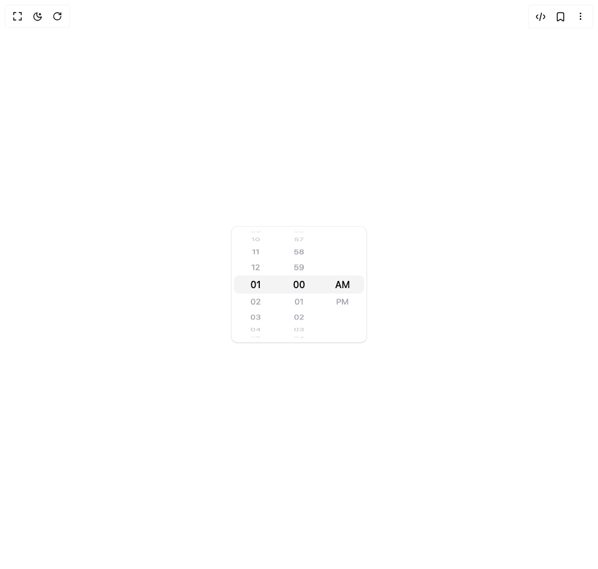

# Build Wheel Picker in BuilderStudio

> Build this component in our Agentic IDE: [BuilderStudio](https://builderstudio.dev).
>
> Join the BuilderStudio community on [Discord](https://discord.gg/QdWeSGCqfe) and [Reddit](https://reddit.com/r/builderstudio).



## Component

- Author group: `ncdai`
- Component: `wheel-picker`
- Variant: `default`
- Rendered HTML snapshot: [`rendered.html`](rendered.html)

## BuilderStudio prompt

You are implementing a React component based on a component reference.

## Component identity

- Author: ncdai
- Component slug: wheel-picker
- Demo slug: default
- Title: wheel-picker
- Description: 

## Goal

Recreate this component in a React + TypeScript + Tailwind CSS project. Preserve the visual layout, spacing, colors, border radius, shadows, interaction behavior, animation behavior, responsive behavior, and dark mode behavior shown in the rendered demo.

## Implementation requirements

- Use React and TypeScript.
- Use Tailwind CSS classes whenever possible.
- Keep the component self-contained unless the source files require helper components.
- If the source uses CSS variables, custom CSS, animations, or keyframes, include them.
- If the source uses external packages, list and use the required packages.
- Preserve accessibility attributes, button semantics, links, keyboard behavior, and ARIA attributes when visible in the source.
- Do not replace the component with a simplified placeholder.
- Return complete production-ready code.

## Dependencies

No reference metadata available.

## Rendered DOM snapshot

This is the rendered demo HTML extracted from the live preview. Use it to verify structure, class names, visible content, and layout.

```html
<div id="root"><div class="flex w-full h-screen justify-center items-center"><div class="w-56"><div class="w-56 rounded-lg bg-white px-1 shadow-sm ring ring-black/5 dark:bg-zinc-900 dark:ring-white/15 [&amp;&gt;[data-rwp]]:first:[&amp;&gt;[data-rwp-highlight-wrapper]]:rounded-s-md [&amp;&gt;[data-rwp]]:last:[&amp;&gt;[data-rwp-highlight-wrapper]]:rounded-e-md" data-rwp-wrapper="true"><div data-rwp="true" style="height: 192px;"><ul data-rwp-options="true" style="transform: translateZ(-92.3305px) rotateX(0deg);"><li class="text-zinc-400 dark:text-zinc-500" data-rwp-option="true" data-index="-5" style="top: -15px; height: 30px; line-height: 30px; transform: rotateX(90deg) translateZ(92.3305px); visibility: visible;">08</li><li class="text-zinc-400 dark:text-zinc-500" data-rwp-option="true" data-index="-4" style="top: -15px; height: 30px; line-height: 30px; transform: rotateX(72deg) translateZ(92.3305px); visibility: visible;">09</li><li class="text-zinc-400 dark:text-zinc-500" data-rwp-option="true" data-index="-3" style="top: -15px; height: 30px; line-height: 30px; transform: rotateX(54deg) translateZ(92.3305px); visibility: visible;">10</li><li class="text-zinc-400 dark:text-zinc-500" data-rwp-option="true" data-index="-2" style="top: -15px; height: 30px; line-height: 30px; transform: rotateX(36deg) translateZ(92.3305px); visibility: visible;">11</li><li class="text-zinc-400 dark:text-zinc-500" data-rwp-option="true" data-index="-1" style="top: -15px; height: 30px; line-height: 30px; transform: rotateX(18deg) translateZ(92.3305px); visibility: visible;">12</li><li class="text-zinc-400 dark:text-zinc-500" data-rwp-option="true" data-index="0" style="top: -15px; height: 30px; line-height: 30px; transform: rotateX(0deg) translateZ(92.3305px); visibility: visible;">01</li><li class="text-zinc-400 dark:text-zinc-500" data-rwp-option="true" data-index="1" style="top: -15px; height: 30px; line-height: 30px; transform: rotateX(-18deg) translateZ(92.3305px); visibility: visible;">02</li><li class="text-zinc-400 dark:text-zinc-500" data-rwp-option="true" data-index="2" style="top: -15px; height: 30px; line-height: 30px; transform: rotateX(-36deg) translateZ(92.3305px); visibility: visible;">03</li><li class="text-zinc-400 dark:text-zinc-500" data-rwp-option="true" data-index="3" style="top: -15px; height: 30px; line-height: 30px; transform: rotateX(-54deg) translateZ(92.3305px); visibility: visible;">04</li><li class="text-zinc-400 dark:text-zinc-500" data-rwp-option="true" data-index="4" style="top: -15px; height: 30px; line-height: 30px; transform: rotateX(-72deg) translateZ(92.3305px); visibility: visible;">05</li><li class="text-zinc-400 dark:text-zinc-500" data-rwp-option="true" data-index="5" style="top: -15px; height: 30px; line-height: 30px; transform: rotateX(-90deg) translateZ(92.3305px); visibility: visible;">06</li><li class="text-zinc-400 dark:text-zinc-500" data-rwp-option="true" data-index="6" style="top: -15px; height: 30px; line-height: 30px; transform: rotateX(-108deg) translateZ(92.3305px); visibility: hidden;">07</li><li class="text-zinc-400 dark:text-zinc-500" data-rwp-option="true" data-index="7" style="top: -15px; height: 30px; line-height: 30px; transform: rotateX(-126deg) translateZ(92.3305px); visibility: hidden;">08</li><li class="text-zinc-400 dark:text-zinc-500" data-rwp-option="true" data-index="8" style="top: -15px; height: 30px; line-height: 30px; transform: rotateX(-144deg) translateZ(92.3305px); visibility: hidden;">09</li><li class="text-zinc-400 dark:text-zinc-500" data-rwp-option="true" data-index="9" style="top: -15px; height: 30px; line-height: 30px; transform: rotateX(-162deg) translateZ(92.3305px); visibility: hidden;">10</li><li class="text-zinc-400 dark:text-zinc-500" data-rwp-option="true" data-index="10" style="top: -15px; height: 30px; line-height: 30px; transform: rotateX(-180deg) translateZ(92.3305px); visibility: hidden;">11</li><li class="text-zinc-400 dark:text-zinc-500" data-rwp-option="true" data-index="11" style="top: -15px; height: 30px; line-height: 30px; transform: rotateX(-198deg) translateZ(92.3305px); visibility: hidden;">12</li><li class="text-zinc-400 dark:text-zinc-500" data-rwp-option="true" data-index="12" style="top: -15px; height: 30px; line-height: 30px; transform: rotateX(-216deg) translateZ(92.3305px); visibility: hidden;">01</li><li class="text-zinc-400 dark:text-zinc-500" data-rwp-option="true" data-index="13" style="top: -15px; height: 30px; line-height: 30px; transform: rotateX(-234deg) translateZ(92.3305px); visibility: hidden;">02</li><li class="text-zinc-400 dark:text-zinc-500" data-rwp-option="true" data-index="14" style="top: -15px; height: 30px; line-height: 30px; transform: rotateX(-252deg) translateZ(92.3305px); visibility: hidden;">03</li><li class="text-zinc-400 dark:text-zinc-500" data-rwp-option="true" data-index="15" style="top: -15px; height: 30px; line-height: 30px; transform: rotateX(-270deg) translateZ(92.3305px); visibility: hidden;">04</li><li class="text-zinc-400 dark:text-zinc-500" data-rwp-option="true" data-index="16" style="top: -15px; height: 30px; line-height: 30px; transform: rotateX(-288deg) translateZ(92.3305px); visibility: hidden;">05</li></ul><div class="bg-zinc-100 text-zinc-950 dark:bg-zinc-800 dark:text-zinc-50" data-rwp-highlight-wrapper="true" style="height: 30px; line-height: 30px;"><ul data-rwp-highlight-list="true" style="top: -30px; transform: translateY(0px);"><li data-slot="highlight-item" style="height: 30px;">12</li><li data-slot="highlight-item" style="height: 30px;">01</li><li data-slot="highlight-item" style="height: 30px;">02</li><li data-slot="highlight-item" style="height: 30px;">03</li><li data-slot="highlight-item" style="height: 30px;">04</li><li data-slot="highlight-item" style="height: 30px;">05</li><li data-slot="highlight-item" style="height: 30px;">06</li><li data-slot="highlight-item" style="height: 30px;">07</li><li data-slot="highlight-item" style="height: 30px;">08</li><li data-slot="highlight-item" style="height: 30px;">09</li><li data-slot="highlight-item" style="height: 30px;">10</li><li data-slot="highlight-item" style="height: 30px;">11</li><li data-slot="highlight-item" style="height: 30px;">12</li><li data-slot="highlight-item" style="height: 30px;">01</li></ul></div></div><div data-rwp="true" style="height: 192px;"><ul data-rwp-options="true" style="transform: translateZ(-92.3305px) rotateX(0deg);"><li class="text-zinc-400 dark:text-zinc-500" data-rwp-option="true" data-index="-5" style="top: -15px; height: 30px; line-height: 30px; transform: rotateX(90deg) translateZ(92.3305px); visibility: visible;">55</li><li class="text-zinc-400 dark:text-zinc-500" data-rwp-option="true" data-index="-4" style="top: -15px; height: 30px; line-height: 30px; transform: rotateX(72deg) translateZ(92.3305px); visibility: visible;">56</li><li class="text-zinc-400 dark:text-zinc-500" data-rwp-option="true" data-index="-3" style="top: -15px; height: 30px; line-height: 30px; transform: rotateX(54deg) translateZ(92.3305px); visibility: visible;">57</li><li class="text-zinc-400 dark:text-zinc-500" data-rwp-option="true" data-index="-2" style="top: -15px; height: 30px; line-height: 30px; transform: rotateX(36deg) translateZ(92.3305px); visibility: visible;">58</li><li class="text-zinc-400 dark:text-zinc-500" data-rwp-option="true" data-index="-1" style="top: -15px; height: 30px; line-height: 30px; transform: rotateX(18deg) translateZ(92.3305px); visibility: visible;">59</li><li class="text-zinc-400 dark:text-zinc-500" data-rwp-option="true" data-index="0" style="top: -15px; height: 30px; line-height: 30px; transform: rotateX(0deg) translateZ(92.3305px); visibility: visible;">00</li><li class="text-zinc-400 dark:text-zinc-500" data-rwp-option="true" data-index="1" style="top: -15px; height: 30px; line-height: 30px; transform: rotateX(-18deg) translateZ(92.3305px); visibility: visible;">01</li><li class="text-zinc-400 dark:text-zinc-500" data-rwp-option="true" data-index="2" style="top: -15px; height: 30px; line-height: 30px; transform: rotateX(-36deg) translateZ(92.3305px); visibility: visible;">02</li><li class="text-zinc-400 dark:text-zinc-500" data-rwp-option="true" data-index="3" style="top: -15px; height: 30px; line-height: 30px; transform: rotateX(-54deg) translateZ(92.3305px); visibility: visible;">03</li><li class="text-zinc-400 dark:text-zinc-500" data-rwp-option="true" data-index="4" style="top: -15px; height: 30px; line-height: 30px; transform: rotateX(-72deg) translateZ(92.3305px); visibility: visible;">04</li><li class="text-zinc-400 dark:text-zinc-500" data-rwp-option="true" data-index="5" style="top: -15px; height: 30px; line-height: 30px; transform: rotateX(-90deg) translateZ(92.3305px); visibility: visible;">05</li><li class="text-zinc-400 dark:text-zinc-500" data-rwp-option="true" data-index="6" style="top: -15px; height: 30px; line-height: 30px; transform: rotateX(-108deg) translateZ(92.3305px); visibility: hidden;">06</li><li class="text-zinc-400 dark:text-zinc-500" data-rwp-option="true" data-index="7" style="top: -15px; height: 30px; line-height: 30px; transform: rotateX(-126deg) translateZ(92.3305px); visibility: hidden;">07</li><li class="text-zinc-400 dark:text-zinc-500" data-rwp-option="true" data-index="8" style="top: -15px; height: 30px; line-height: 30px; transform: rotateX(-144deg) translateZ(92.3305px); visibility: hidden;">08</li><li class="text-zinc-400 dark:text-zinc-500" data-rwp-option="true" data-index="9" style="top: -15px; height: 30px; line-height: 30px; transform: rotateX(-162deg) translateZ(92.3305px); visibility: hidden;">09</li><li class="text-zinc-400 dark:text-zinc-500" data-rwp-option="true" data-index="10" style="top: -15px; height: 30px; line-height: 30px; transform: rotateX(-180deg) translateZ(92.3305px); visibility: hidden;">10</li><li class="text-zinc-400 dark:text-zinc-500" data-rwp-option="true" data-index="11" style="top: -15px; height: 30px; line-height: 30px; transform: rotateX(-198deg) translateZ(92.3305px); visibility: hidden;">11</li><li class="text-zinc-400 dark:text-zinc-500" data-rwp-option="true" data-index="12" style="top: -15px; height: 30px; line-height: 30px; transform: rotateX(-216deg) translateZ(92.3305px); visibility: hidden;">12</li><li class="text-zinc-400 dark:text-zinc-500" data-rwp-option="true" data-index="13" style="top: -15px; height: 30px; line-height: 30px; transform: rotateX(-234deg) translateZ(92.3305px); visibility: hidden;">13</li><li class="text-zinc-400 dark:text-zinc-500" data-rwp-option="true" data-index="14" style="top: -15px; height: 30px; line-height: 30px; transform: rotateX(-252deg) translateZ(92.3305px); visibility: hidden;">14</li><li class="text-zinc-400 dark:text-zinc-500" data-rwp-option="true" data-index="15" style="top: -15px; height: 30px; line-height: 30px; transform: rotateX(-270deg) translateZ(92.3305px); visibility: hidden;">15</li><li class="text-zinc-400 dark:text-zinc-500" data-rwp-option="true" data-index="16" style="top: -15px; height: 30px; line-height: 30px; transform: rotateX(-288deg) translateZ(92.3305px); visibility: hidden;">16</li><li class="text-zinc-400 dark:text-zinc-500" data-rwp-option="true" data-index="17" style="top: -15px; height: 30px; line-height: 30px; transform: rotateX(-306deg) translateZ(92.3305px); visibility: hidden;">17</li><li class="text-zinc-400 dark:text-zinc-500" data-rwp-option="true" data-index="18" style="top: -15px; height: 30px; line-height: 30px; transform: rotateX(-324deg) translateZ(92.3305px); visibility: hidden;">18</li><li class="text-zinc-400 dark:text-zinc-500" data-rwp-option="true" data-index="19" style="top: -15px; height: 30px; line-height: 30px; transform: rotateX(-342deg) translateZ(92.3305px); visibility: hidden;">19</li><li class="text-zinc-400 dark:text-zinc-500" data-rwp-option="true" data-index="20" style="top: -15px; height: 30px; line-height: 30px; transform: rotateX(-360deg) translateZ(92.3305px); visibility: hidden;">20</li><li class="text-zinc-400 dark:text-zinc-500" data-rwp-option="true" data-index="21" style="top: -15px; height: 30px; line-height: 30px; transform: rotateX(-378deg) translateZ(92.3305px); visibility: hidden;">21</li><li class="text-zinc-400 dark:text-zinc-500" data-rwp-option="true" data-index="22" style="top: -15px; height: 30px; line-height: 30px; transform: rotateX(-396deg) translateZ(92.3305px); visibility: hidden;">22</li><li class="text-zinc-400 dark:text-zinc-500" data-rwp-option="true" data-index="23" style="top: -15px; height: 30px; line-height: 30px; transform: rotateX(-414deg) translateZ(92.3305px); visibility: hidden;">23</li><li class="text-zinc-400 dark:text-zinc-500" data-rwp-option="true" data-index="24" style="top: -15px; height: 30px; line-height: 30px; transform: rotateX(-432deg) translateZ(92.3305px); visibility: hidden;">24</li><li class="text-zinc-400 dark:text-zinc-500" data-rwp-option="true" data-index="25" style="top: -15px; height: 30px; line-height: 30px; transform: rotateX(-450deg) translateZ(92.3305px); visibility: hidden;">25</li><li class="text-zinc-400 dark:text-zinc-500" data-rwp-option="true" data-index="26" style="top: -15px; height: 30px; line-height: 30px; transform: rotateX(-468deg) translateZ(92.3305px); visibility: hidden;">26</li><li class="text-zinc-400 dark:text-zinc-500" data-rwp-option="true" data-index="27" style="top: -15px; height: 30px; line-height: 30px; transform: rotateX(-486deg) translateZ(92.3305px); visibility: hidden;">27</li><li class="text-zinc-400 dark:text-zinc-500" data-rwp-option="true" data-index="28" style="top: -15px; height: 30px; line-height: 30px; transform: rotateX(-504deg) translateZ(92.3305px); visibility: hidden;">28</li><li class="text-zinc-400 dark:text-zinc-500" data-rwp-option="true" data-index="29" style="top: -15px; height: 30px; line-height: 30px; transform: rotateX(-522deg) translateZ(92.3305px); visibility: hidden;">29</li><li class="text-zinc-400 dark:text-zinc-500" data-rwp-option="true" data-index="30" style="top: -15px; height: 30px; line-height: 30px; transform: rotateX(-540deg) translateZ(92.3305px); visibility: hidden;">30</li><li class="text-zinc-400 dark:text-zinc-500" data-rwp-option="true" data-index="31" style="top: -15px; height: 30px; line-height: 30px; transform: rotateX(-558deg) translateZ(92.3305px); visibility: hidden;">31</li><li class="text-zinc-400 dark:text-zinc-500" data-rwp-option="true" data-index="32" style="top: -15px; height: 30px; line-height: 30px; transform: rotateX(-576deg) translateZ(92.3305px); visibility: hidden;">32</li><li class="text-zinc-400 dark:text-zinc-500" data-rwp-option="true" data-index="33" style="top: -15px; height: 30px; line-height: 30px; transform: rotateX(-594deg) translateZ(92.3305px); visibility: hidden;">33</li><li class="text-zinc-400 dark:text-zinc-500" data-rwp-option="true" data-index="34" style="top: -15px; height: 30px; line-height: 30px; transform: rotateX(-612deg) translateZ(92.3305px); visibility: hidden;">34</li><li class="text-zinc-400 dark:text-zinc-500" data-rwp-option="true" data-index="35" style="top: -15px; height: 30px; line-height: 30px; transform: rotateX(-630deg) translateZ(92.3305px); visibility: hidden;">35</li><li class="text-zinc-400 dark:text-zinc-500" data-rwp-option="true" data-index="36" style="top: -15px; height: 30px; line-height: 30px; transform: rotateX(-648deg) translateZ(92.3305px); visibility: hidden;">36</li><li class="text-zinc-400 dark:text-zinc-500" data-rwp-option="true" data-index="37" style="top: -15px; height: 30px; line-height: 30px; transform: rotateX(-666deg) translateZ(92.3305px); visibility: hidden;">37</li><li class="text-zinc-400 dark:text-zinc-500" data-rwp-option="true" data-index="38" style="top: -15px; height: 30px; line-height: 30px; transform: rotateX(-684deg) translateZ(92.3305px); visibility: hidden;">38</li><li class="text-zinc-400 dark:text-zinc-500" data-rwp-option="true" data-index="39" style="top: -15px; height: 30px; line-height: 30px; transform: rotateX(-702deg) translateZ(92.3305px); visibility: hidden;">39</li><li class="text-zinc-400 dark:text-zinc-500" data-rwp-option="true" data-index="40" style="top: -15px; height: 30px; line-height: 30px; transform: rotateX(-720deg) translateZ(92.3305px); visibility: hidden;">40</li><li class="text-zinc-400 dark:text-zinc-500" data-rwp-option="true" data-index="41" style="top: -15px; height: 30px; line-height: 30px; transform: rotateX(-738deg) translateZ(92.3305px); visibility: hidden;">41</li><li class="text-zinc-400 dark:text-zinc-500" data-rwp-option="true" data-index="42" style="top: -15px; height: 30px; line-height: 30px; transform: rotateX(-756deg) translateZ(92.3305px); visibility: hidden;">42</li><li class="text-zinc-400 dark:text-zinc-500" data-rwp-option="true" data-index="43" style="top: -15px; height: 30px; line-height: 30px; transform: rotateX(-774deg) translateZ(92.3305px); visibility: hidden;">43</li><li class="text-zinc-400 dark:text-zinc-500" data-rwp-option="true" data-index="44" style="top: -15px; height: 30px; line-height: 30px; transform: rotateX(-792deg) translateZ(92.3305px); visibility: hidden;">44</li><li class="text-zinc-400 dark:text-zinc-500" data-rwp-option="true" data-index="45" style="top: -15px; height: 30px; line-height: 30px; transform: rotateX(-810deg) translateZ(92.3305px); visibility: hidden;">45</li><li class="text-zinc-400 dark:text-zinc-500" data-rwp-option="true" data-index="46" style="top: -15px; height: 30px; line-height: 30px; transform: rotateX(-828deg) translateZ(92.3305px); visibility: hidden;">46</li><li class="text-zinc-400 dark:text-zinc-500" data-rwp-option="true" data-index="47" style="top: -15px; height: 30px; line-height: 30px; transform: rotateX(-846deg) translateZ(92.3305px); visibility: hidden;">47</li><li class="text-zinc-400 dark:text-zinc-500" data-rwp-option="true" data-index="48" style="top: -15px; height: 30px; line-height: 30px; transform: rotateX(-864deg) translateZ(92.3305px); visibility: hidden;">48</li><li class="text-zinc-400 dark:text-zinc-500" data-rwp-option="true" data-index="49" style="top: -15px; height: 30px; line-height: 30px; transform: rotateX(-882deg) translateZ(92.3305px); visibility: hidden;">49</li><li class="text-zinc-400 dark:text-zinc-500" data-rwp-option="true" data-index="50" style="top: -15px; height: 30px; line-height: 30px; transform: rotateX(-900deg) translateZ(92.3305px); visibility: hidden;">50</li><li class="text-zinc-400 dark:text-zinc-500" data-rwp-option="true" data-index="51" style="top: -15px; height: 30px; line-height: 30px; transform: rotateX(-918deg) translateZ(92.3305px); visibility: hidden;">51</li><li class="text-zinc-400 dark:text-zinc-500" data-rwp-option="true" data-index="52" style="top: -15px; height: 30px; line-height: 30px; transform: rotateX(-936deg) translateZ(92.3305px); visibility: hidden;">52</li><li class="text-zinc-400 dark:text-zinc-500" data-rwp-option="true" data-index="53" style="top: -15px; height: 30px; line-height: 30px; transform: rotateX(-954deg) translateZ(92.3305px); visibility: hidden;">53</li><li class="text-zinc-400 dark:text-zinc-500" data-rwp-option="true" data-index="54" style="top: -15px; height: 30px; line-height: 30px; transform: rotateX(-972deg) translateZ(92.3305px); visibility: hidden;">54</li><li class="text-zinc-400 dark:text-zinc-500" data-rwp-option="true" data-index="55" style="top: -15px; height: 30px; line-height: 30px; transform: rotateX(-990deg) translateZ(92.3305px); visibility: hidden;">55</li><li class="text-zinc-400 dark:text-zinc-500" data-rwp-option="true" data-index="56" style="top: -15px; height: 30px; line-height: 30px; transform: rotateX(-1008deg) translateZ(92.3305px); visibility: hidden;">56</li><li class="text-zinc-400 dark:text-zinc-500" data-rwp-option="true" data-index="57" style="top: -15px; height: 30px; line-height: 30px; transform: rotateX(-1026deg) translateZ(92.3305px); visibility: hidden;">57</li><li class="text-zinc-400 dark:text-zinc-500" data-rwp-option="true" data-index="58" style="top: -15px; height: 30px; line-height: 30px; transform: rotateX(-1044deg) translateZ(92.3305px); visibility: hidden;">58</li><li class="text-zinc-400 dark:text-zinc-500" data-rwp-option="true" data-index="59" style="top: -15px; height: 30px; line-height: 30px; transform: rotateX(-1062deg) translateZ(92.3305px); visibility: hidden;">59</li><li class="text-zinc-400 dark:text-zinc-500" data-rwp-option="true" data-index="60" style="top: -15px; height: 30px; line-height: 30px; transform: rotateX(-1080deg) translateZ(92.3305px); visibility: hidden;">00</li><li class="text-zinc-400 dark:text-zinc-500" data-rwp-option="true" data-index="61" style="top: -15px; height: 30px; line-height: 30px; transform: rotateX(-1098deg) translateZ(92.3305px); visibility: hidden;">01</li><li class="text-zinc-400 dark:text-zinc-500" data-rwp-option="true" data-index="62" style="top: -15px; height: 30px; line-height: 30px; transform: rotateX(-1116deg) translateZ(92.3305px); visibility: hidden;">02</li><li class="text-zinc-400 dark:text-zinc-500" data-rwp-option="true" data-index="63" style="top: -15px; height: 30px; line-height: 30px; transform: rotateX(-1134deg) translateZ(92.3305px); visibility: hidden;">03</li><li class="text-zinc-400 dark:text-zinc-500" data-rwp-option="true" data-index="64" style="top: -15px; height: 30px; line-height: 30px; transform: rotateX(-1152deg) translateZ(92.3305px); visibility: hidden;">04</li></ul><div class="bg-zinc-100 text-zinc-950 dark:bg-zinc-800 dark:text-zinc-50" data-rwp-highlight-wrapper="true" style="height: 30px; line-height: 30px;"><ul data-rwp-highlight-list="true" style="top: -30px; transform: translateY(0px);"><li data-slot="highlight-item" style="height: 30px;">59</li><li data-slot="highlight-item" style="height: 30px;">00</li><li data-slot="highlight-item" style="height: 30px;">01</li><li data-slot="highlight-item" style="height: 30px;">02</li><li data-slot="highlight-item" style="height: 30px;">03</li><li data-slot="highlight-item" style="height: 30px;">04</li><li data-slot="highlight-item" style="height: 30px;">05</li><li data-slot="highlight-item" style="height: 30px;">06</li><li data-slot="highlight-item" style="height: 30px;">07</li><li data-slot="highlight-item" style="height: 30px;">08</li><li data-slot="highlight-item" style="height: 30px;">09</li><li data-slot="highlight-item" style="height: 30px;">10</li><li data-slot="highlight-item" style="height: 30px;">11</li><li data-slot="highlight-item" style="height: 30px;">12</li><li data-slot="highlight-item" style="height: 30px;">13</li><li data-slot="highlight-item" style="height: 30px;">14</li><li data-slot="highlight-item" style="height: 30px;">15</li><li data-slot="highlight-item" style="height: 30px;">16</li><li data-slot="highlight-item" style="height: 30px;">17</li><li data-slot="highlight-item" style="height: 30px;">18</li><li data-slot="highlight-item" style="height: 30px;">19</li><li data-slot="highlight-item" style="height: 30px;">20</li><li data-slot="highlight-item" style="height: 30px;">21</li><li data-slot="highlight-item" style="height: 30px;">22</li><li data-slot="highlight-item" style="height: 30px;">23</li><li data-slot="highlight-item" style="height: 30px;">24</li><li data-slot="highlight-item" style="height: 30px;">25</li><li data-slot="highlight-item" style="height: 30px;">26</li><li data-slot="highlight-item" style="height: 30px;">27</li><li data-slot="highlight-item" style="height: 30px;">28</li><li data-slot="highlight-item" style="height: 30px;">29</li><li data-slot="highlight-item" style="height: 30px;">30</li><li data-slot="highlight-item" style="height: 30px;">31</li><li data-slot="highlight-item" style="height: 30px;">32</li><li data-slot="highlight-item" style="height: 30px;">33</li><li data-slot="highlight-item" style="height: 30px;">34</li><li data-slot="highlight-item" style="height: 30px;">35</li><li data-slot="highlight-item" style="height: 30px;">36</li><li data-slot="highlight-item" style="height: 30px;">37</li><li data-slot="highlight-item" style="height: 30px;">38</li><li data-slot="highlight-item" style="height: 30px;">39</li><li data-slot="highlight-item" style="height: 30px;">40</li><li data-slot="highlight-item" style="height: 30px;">41</li><li data-slot="highlight-item" style="height: 30px;">42</li><li data-slot="highlight-item" style="height: 30px;">43</li><li data-slot="highlight-item" style="height: 30px;">44</li><li data-slot="highlight-item" style="height: 30px;">45</li><li data-slot="highlight-item" style="height: 30px;">46</li><li data-slot="highlight-item" style="height: 30px;">47</li><li data-slot="highlight-item" style="height: 30px;">48</li><li data-slot="highlight-item" style="height: 30px;">49</li><li data-slot="highlight-item" style="height: 30px;">50</li><li data-slot="highlight-item" style="height: 30px;">51</li><li data-slot="highlight-item" style="height: 30px;">52</li><li data-slot="highlight-item" style="height: 30px;">53</li><li data-slot="highlight-item" style="height: 30px;">54</li><li data-slot="highlight-item" style="height: 30px;">55</li><li data-slot="highlight-item" style="height: 30px;">56</li><li data-slot="highlight-item" style="height: 30px;">57</li><li data-slot="highlight-item" style="height: 30px;">58</li><li data-slot="highlight-item" style="height: 30px;">59</li><li data-slot="highlight-item" style="height: 30px;">00</li></ul></div></div><div data-rwp="true" style="height: 192px;"><ul data-rwp-options="true" style="transform: translateZ(-92.3305px) rotateX(0deg);"><li class="text-zinc-400 dark:text-zinc-500" data-rwp-option="true" data-index="0" style="top: -15px; height: 30px; line-height: 30px; transform: rotateX(0deg) translateZ(92.3305px); visibility: visible;">AM</li><li class="text-zinc-400 dark:text-zinc-500" data-rwp-option="true" data-index="1" style="top: -15px; height: 30px; line-height: 30px; transform: rotateX(-18deg) translateZ(92.3305px); visibility: visible;">PM</li></ul><div class="bg-zinc-100 text-zinc-950 dark:bg-zinc-800 dark:text-zinc-50" data-rwp-highlight-wrapper="true" style="height: 30px; line-height: 30px;"><ul data-rwp-highlight-list="true" style="transform: translateY(0px);"><li data-slot="highlight-item" style="height: 30px;">AM</li><li data-slot="highlight-item" style="height: 30px;">PM</li></ul></div></div></div></div></div></div>
```

## Reference source files

No reference source files were available.
