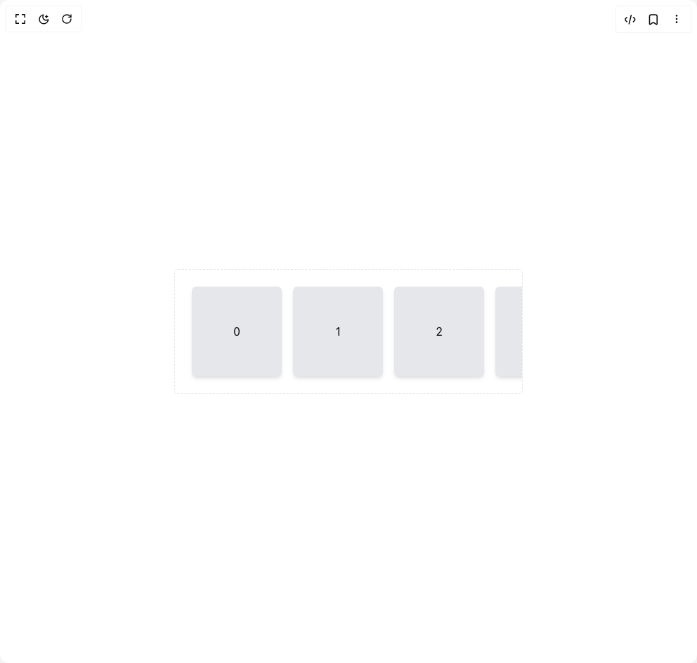

# Build X Scroll in BuilderStudio

> Build this component in our Agentic IDE: [BuilderStudio](https://builderstudio.dev).
>
> Join the BuilderStudio community on [Discord](https://discord.gg/QdWeSGCqfe) and [Reddit](https://reddit.com/r/builderstudio).



## Component

- Author group: `nelwincatalogo`
- Component: `x-scroll`
- Variant: `default`
- Rendered HTML snapshot: [`rendered.html`](rendered.html)

## BuilderStudio prompt

You are implementing a React component based on a component reference.

## Component identity

- Author: nelwincatalogo
- Component slug: x-scroll
- Demo slug: default
- Title: x-scroll
- Description: 

## Goal

Recreate this component in a React + TypeScript + Tailwind CSS project. Preserve the visual layout, spacing, colors, border radius, shadows, interaction behavior, animation behavior, responsive behavior, and dark mode behavior shown in the rendered demo.

## Implementation requirements

- Use React and TypeScript.
- Use Tailwind CSS classes whenever possible.
- Keep the component self-contained unless the source files require helper components.
- If the source uses CSS variables, custom CSS, animations, or keyframes, include them.
- If the source uses external packages, list and use the required packages.
- Preserve accessibility attributes, button semantics, links, keyboard behavior, and ARIA attributes when visible in the source.
- Do not replace the component with a simplified placeholder.
- Return complete production-ready code.

## Dependencies

No reference metadata available.

## Rendered DOM snapshot

This is the rendered demo HTML extracted from the live preview. Use it to verify structure, class names, visible content, and layout.

```html
<div id="root"><div class="relative flex items-center justify-center h-screen w-full m-auto p-16 bg-background text-foreground"><div class="absolute lab-bg inset-0 size-full"><div class="absolute inset-0 bg-[radial-gradient(#00000021_1px,transparent_1px)] dark:bg-[radial-gradient(#ffffff22_1px,transparent_1px)]"></div></div><div class="flex w-full justify-center relative"><div class="grid min-h-screen place-items-center"><div class="mx-auto w-[50vw] rounded-md border border-dashed"><div class="flex"><div dir="ltr" class="relative overflow-hidden w-1 flex-1" style="position: relative; --radix-scroll-area-corner-width: 0px; --radix-scroll-area-corner-height: 0px;"><style>[data-radix-scroll-area-viewport]{scrollbar-width:none;-ms-overflow-style:none;-webkit-overflow-scrolling:touch;}[data-radix-scroll-area-viewport]::-webkit-scrollbar{display:none}</style><div data-radix-scroll-area-viewport="" class="h-full w-full rounded-[inherit]" style="overflow: scroll;"><div style="min-width: 100%; display: table;"><div class="flex gap-4 p-6"><div class="grid size-32 shrink-0 place-items-center rounded-md bg-gray-200 shadow-md">0</div><div class="grid size-32 shrink-0 place-items-center rounded-md bg-gray-200 shadow-md">1</div><div class="grid size-32 shrink-0 place-items-center rounded-md bg-gray-200 shadow-md">2</div><div class="grid size-32 shrink-0 place-items-center rounded-md bg-gray-200 shadow-md">3</div><div class="grid size-32 shrink-0 place-items-center rounded-md bg-gray-200 shadow-md">4</div><div class="grid size-32 shrink-0 place-items-center rounded-md bg-gray-200 shadow-md">5</div><div class="grid size-32 shrink-0 place-items-center rounded-md bg-gray-200 shadow-md">6</div><div class="grid size-32 shrink-0 place-items-center rounded-md bg-gray-200 shadow-md">7</div><div class="grid size-32 shrink-0 place-items-center rounded-md bg-gray-200 shadow-md">8</div><div class="grid size-32 shrink-0 place-items-center rounded-md bg-gray-200 shadow-md">9</div><div class="grid size-32 shrink-0 place-items-center rounded-md bg-gray-200 shadow-md">10</div><div class="grid size-32 shrink-0 place-items-center rounded-md bg-gray-200 shadow-md">11</div><div class="grid size-32 shrink-0 place-items-center rounded-md bg-gray-200 shadow-md">12</div><div class="grid size-32 shrink-0 place-items-center rounded-md bg-gray-200 shadow-md">13</div><div class="grid size-32 shrink-0 place-items-center rounded-md bg-gray-200 shadow-md">14</div><div class="grid size-32 shrink-0 place-items-center rounded-md bg-gray-200 shadow-md">15</div><div class="grid size-32 shrink-0 place-items-center rounded-md bg-gray-200 shadow-md">16</div><div class="grid size-32 shrink-0 place-items-center rounded-md bg-gray-200 shadow-md">17</div><div class="grid size-32 shrink-0 place-items-center rounded-md bg-gray-200 shadow-md">18</div><div class="grid size-32 shrink-0 place-items-center rounded-md bg-gray-200 shadow-md">19</div></div></div></div></div></div></div></div></div></div></div>
```

## Reference source files

No reference source files were available.
