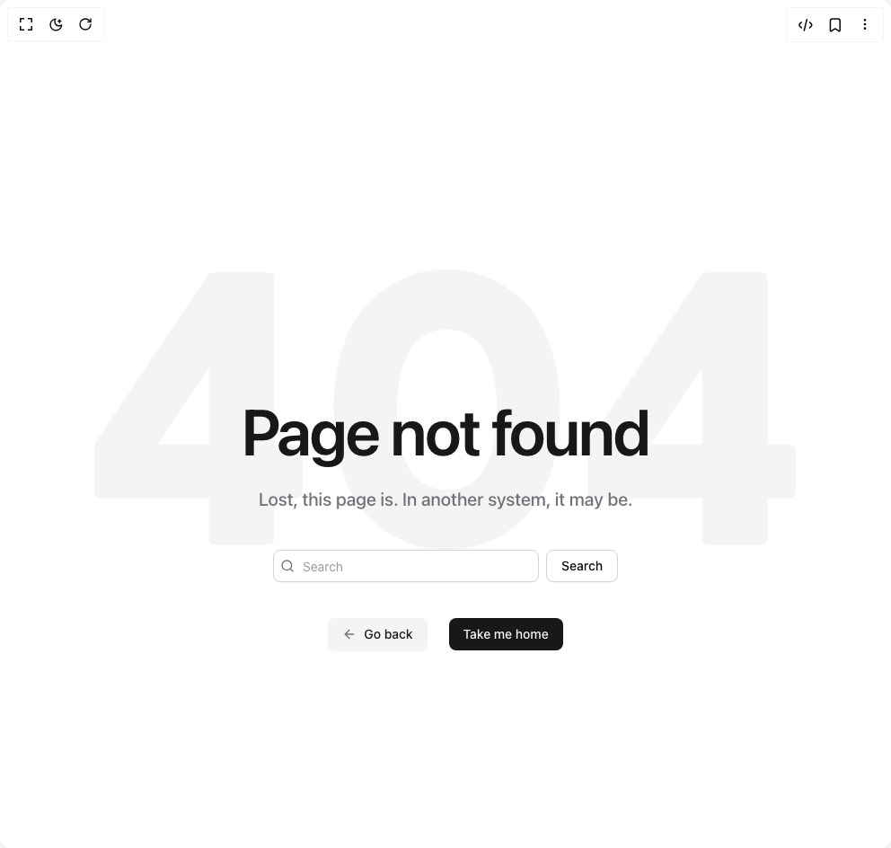

# Build Not Found in BuilderStudio

> Build this component in our Agentic IDE: [BuilderStudio](https://builderstudio.dev).
>
> Join the BuilderStudio community on [Discord](https://discord.gg/QdWeSGCqfe) and [Reddit](https://reddit.com/r/builderstudio).



## Component

- Author group: `nevsky118`
- Component: `not-found`
- Variant: `default`
- Rendered HTML snapshot: [`rendered.html`](rendered.html)

## BuilderStudio prompt

You are implementing a React component based on a component reference.

## Component identity

- Author: nevsky118
- Component slug: not-found
- Demo slug: default
- Title: not-found
- Description: 

## Goal

Recreate this component in a React + TypeScript + Tailwind CSS project. Preserve the visual layout, spacing, colors, border radius, shadows, interaction behavior, animation behavior, responsive behavior, and dark mode behavior shown in the rendered demo.

## Implementation requirements

- Use React and TypeScript.
- Use Tailwind CSS classes whenever possible.
- Keep the component self-contained unless the source files require helper components.
- If the source uses CSS variables, custom CSS, animations, or keyframes, include them.
- If the source uses external packages, list and use the required packages.
- Preserve accessibility attributes, button semantics, links, keyboard behavior, and ARIA attributes when visible in the source.
- Do not replace the component with a simplified placeholder.
- Return complete production-ready code.

## Dependencies

No reference metadata available.

## Rendered DOM snapshot

This is the rendered demo HTML extracted from the live preview. Use it to verify structure, class names, visible content, and layout.

```html
<div id="root"><div class="relative flex items-center justify-center h-screen w-full m-auto p-16 bg-background text-foreground"><div class="absolute lab-bg inset-0 size-full"><div class="absolute inset-0 bg-[radial-gradient(#00000021_1px,transparent_1px)] dark:bg-[radial-gradient(#ffffff22_1px,transparent_1px)]"></div></div><div class="flex w-full justify-center relative"><div class="relative flex flex-col w-full justify-center min-h-svh bg-background p-6 md:p-10"><div class="relative max-w-5xl mx-auto w-full"><svg xmlns="http://www.w3.org/2000/svg" viewBox="0 0 362 145" class="absolute inset-0 w-full h-[50vh] opacity-[0.04] dark:opacity-[0.03] text-foreground"><path fill="currentColor" d="M62.6 142c-2.133 0-3.2-1.067-3.2-3.2V118h-56c-2 0-3-1-3-3V92.8c0-1.333.4-2.733 1.2-4.2L58.2 4c.8-1.333 2.067-2 3.8-2h28c2 0 3 1 3 3v85.4h11.2c.933 0 1.733.333 2.4 1 .667.533 1 1.267 1 2.2v21.2c0 .933-.333 1.733-1 2.4-.667.533-1.467.8-2.4.8H93v20.8c0 2.133-1.067 3.2-3.2 3.2H62.6zM33 90.4h26.4V51.2L33 90.4zM181.67 144.6c-7.333 0-14.333-1.333-21-4-6.666-2.667-12.866-6.733-18.6-12.2-5.733-5.467-10.266-13-13.6-22.6-3.333-9.6-5-20.667-5-33.2 0-12.533 1.667-23.6 5-33.2 3.334-9.6 7.867-17.133 13.6-22.6 5.734-5.467 11.934-9.533 18.6-12.2 6.667-2.8 13.667-4.2 21-4.2 7.467 0 14.534 1.4 21.2 4.2 6.667 2.667 12.8 6.733 18.4 12.2 5.734 5.467 10.267 13 13.6 22.6 3.334 9.6 5 20.667 5 33.2 0 12.533-1.666 23.6-5 33.2-3.333 9.6-7.866 17.133-13.6 22.6-5.6 5.467-11.733 9.533-18.4 12.2-6.666 2.667-13.733 4-21.2 4zm0-31c9.067 0 15.6-3.733 19.6-11.2 4.134-7.6 6.2-17.533 6.2-29.8s-2.066-22.2-6.2-29.8c-4.133-7.6-10.666-11.4-19.6-11.4-8.933 0-15.466 3.8-19.6 11.4-4 7.6-6 17.533-6 29.8s2 22.2 6 29.8c4.134 7.467 10.667 11.2 19.6 11.2zM316.116 142c-2.134 0-3.2-1.067-3.2-3.2V118h-56c-2 0-3-1-3-3V92.8c0-1.333.4-2.733 1.2-4.2l56.6-84.6c.8-1.333 2.066-2 3.8-2h28c2 0 3 1 3 3v85.4h11.2c.933 0 1.733.333 2.4 1 .666.533 1 1.267 1 2.2v21.2c0 .933-.334 1.733-1 2.4-.667.533-1.467.8-2.4.8h-11.2v20.8c0 2.133-1.067 3.2-3.2 3.2h-27.2zm-29.6-51.6h26.4V51.2l-26.4 39.2z"></path></svg><div class="relative text-center z-[1] pt-52"><h1 class="mt-4 text-balance text-5xl font-semibold tracking-tight text-primary sm:text-7xl">Page not found</h1><p class="mt-6 text-pretty text-lg font-medium text-muted-foreground sm:text-xl/8">Lost, this page is. In another system, it may be.</p><div class="mt-10 flex flex-col sm:flex-row gap-y-3 sm:space-x-2 mx-auto sm:max-w-sm"><div class="relative w-full"><svg xmlns="http://www.w3.org/2000/svg" width="24" height="24" viewBox="0 0 24 24" fill="none" stroke="currentColor" stroke-width="2" stroke-linecap="round" stroke-linejoin="round" class="lucide lucide-search absolute left-2 top-2.5 h-4 w-4 text-muted-foreground" aria-hidden="true"><path d="m21 21-4.34-4.34"></path><circle cx="11" cy="11" r="8"></circle></svg><input class="flex h-9 w-full rounded-lg border border-input bg-background px-3 py-2 text-sm text-foreground shadow-sm shadow-black/5 transition-shadow placeholder:text-muted-foreground/70 focus-visible:border-ring focus-visible:outline-none focus-visible:ring-[3px] focus-visible:ring-ring/20 disabled:cursor-not-allowed disabled:opacity-50 pl-8" placeholder="Search"></div><button class="inline-flex items-center justify-center whitespace-nowrap rounded-lg text-sm font-medium transition-colors outline-offset-2 focus-visible:outline-2 focus-visible:outline-ring/70 disabled:pointer-events-none disabled:opacity-50 [&amp;_svg]:pointer-events-none [&amp;_svg]:shrink-0 border border-input bg-background shadow-sm shadow-black/5 hover:bg-accent hover:text-accent-foreground h-9 px-4 py-2">Search</button></div><div class="mt-10 flex flex-col sm:flex-row sm:items-center sm:justify-center gap-y-3 gap-x-6"><a href="#" class="inline-flex items-center justify-center whitespace-nowrap rounded-lg text-sm font-medium transition-colors outline-offset-2 focus-visible:outline-2 focus-visible:outline-ring/70 disabled:pointer-events-none disabled:opacity-50 [&amp;_svg]:pointer-events-none [&amp;_svg]:shrink-0 bg-secondary text-secondary-foreground shadow-sm shadow-black/5 hover:bg-secondary/80 h-9 px-4 py-2 group"><svg xmlns="http://www.w3.org/2000/svg" width="16" height="16" viewBox="0 0 24 24" fill="none" stroke="currentColor" stroke-width="2" stroke-linecap="round" stroke-linejoin="round" class="lucide lucide-arrow-left me-2 ms-0 opacity-60 transition-transform group-hover:-translate-x-0.5" aria-hidden="true"><path d="m12 19-7-7 7-7"></path><path d="M19 12H5"></path></svg>Go back</a><a href="#" class="inline-flex items-center justify-center whitespace-nowrap rounded-lg text-sm font-medium transition-colors outline-offset-2 focus-visible:outline-2 focus-visible:outline-ring/70 disabled:pointer-events-none disabled:opacity-50 [&amp;_svg]:pointer-events-none [&amp;_svg]:shrink-0 bg-primary text-primary-foreground shadow-sm shadow-black/5 hover:bg-primary/90 h-9 px-4 py-2 -order-1 sm:order-none">Take me home</a></div></div></div></div></div></div></div>
```

## Reference source files

No reference source files were available.
