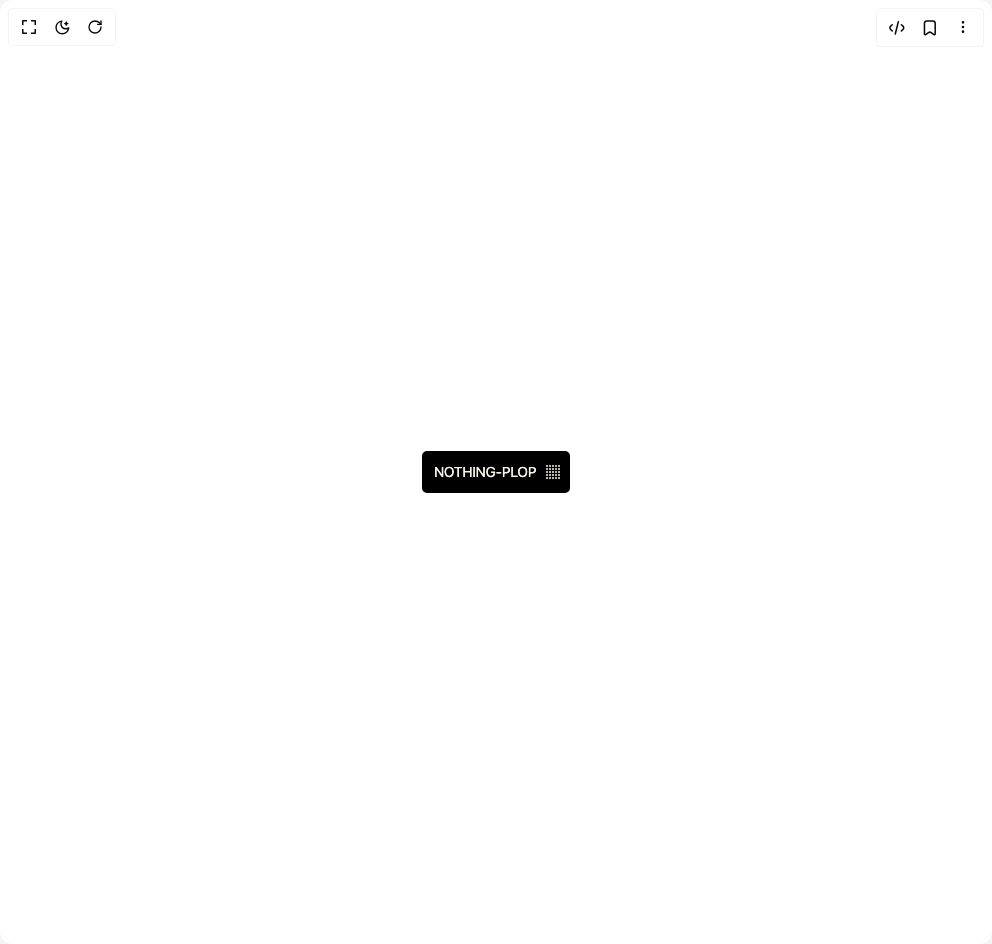
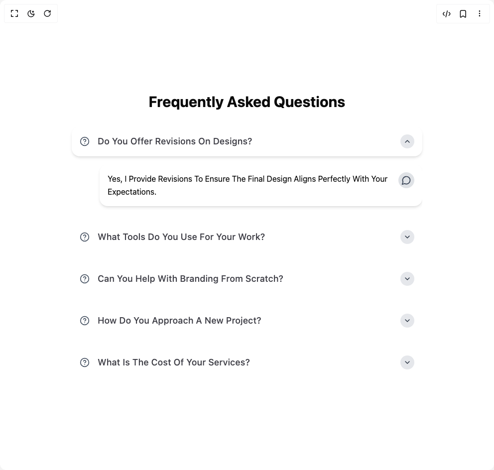
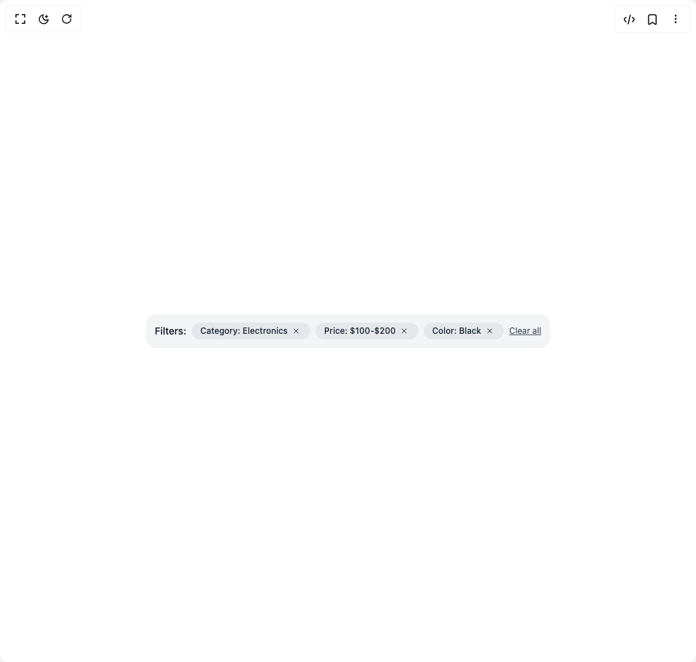
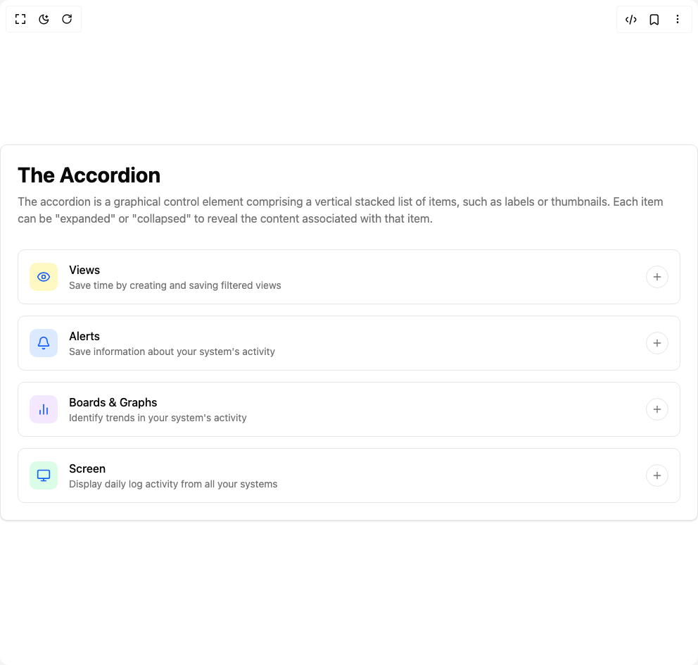
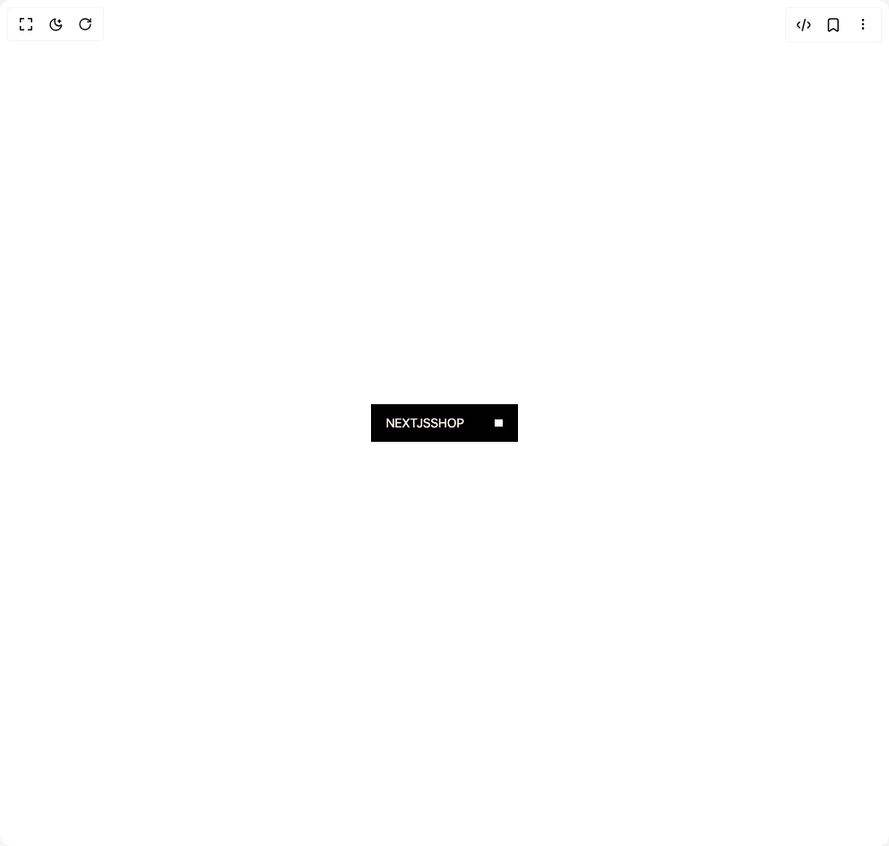
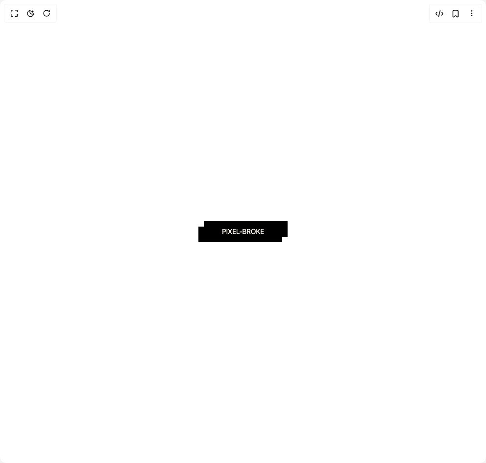
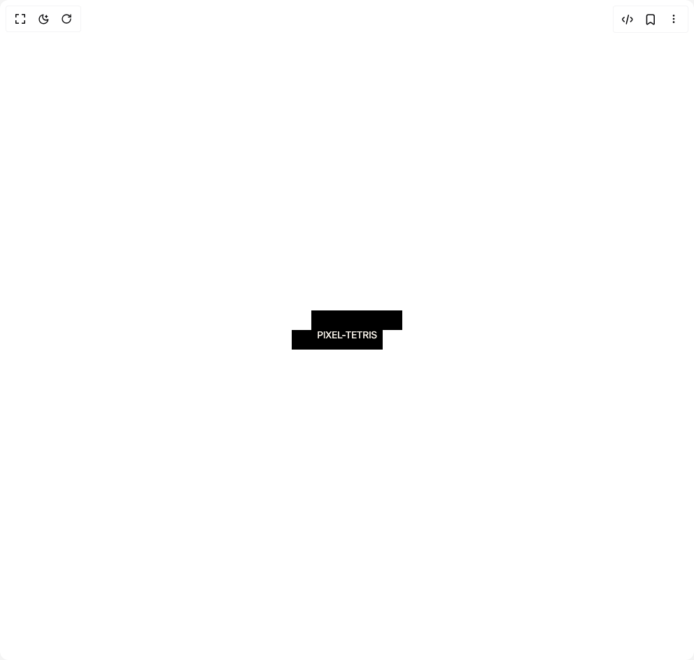
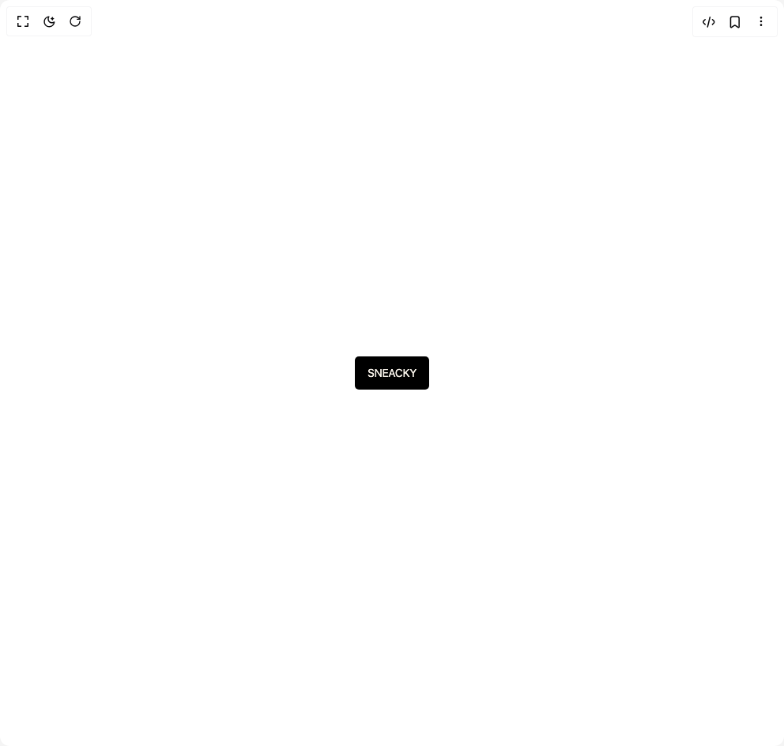
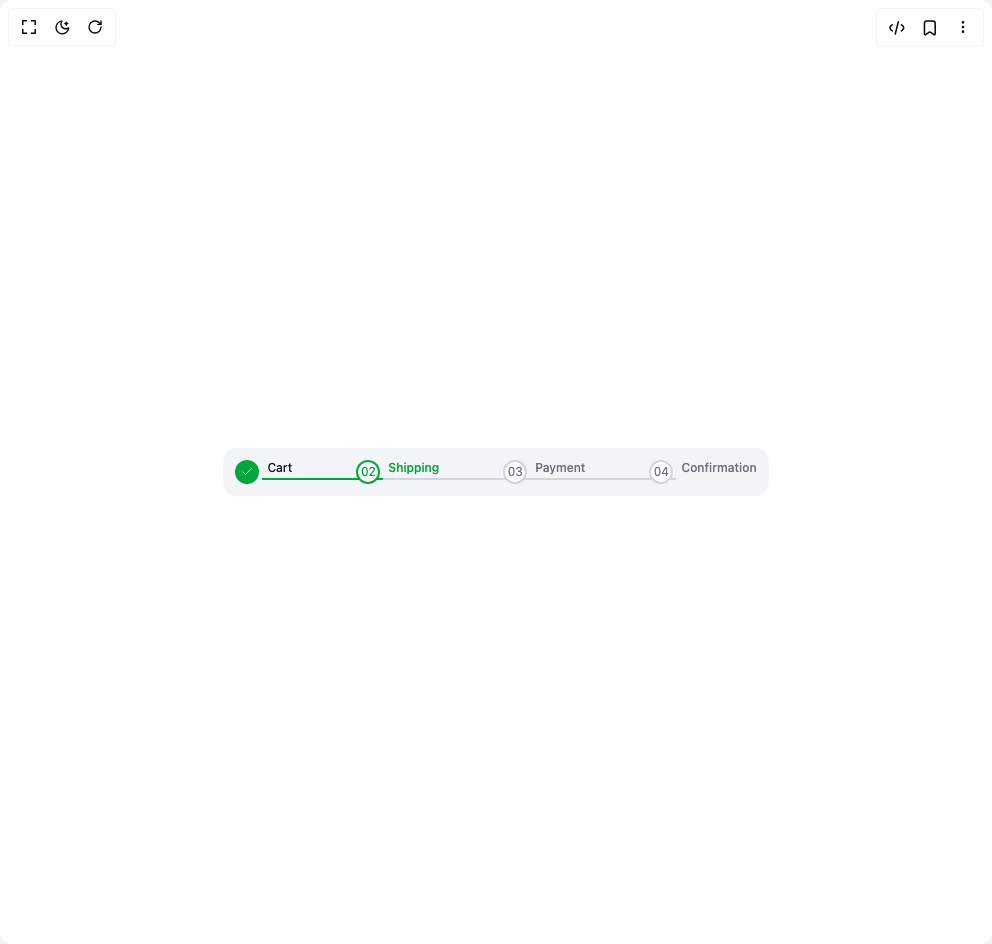
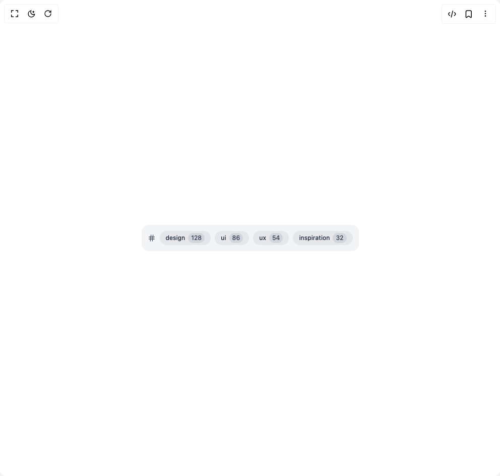

# Nextjsshop Components

12 components are available in this author group.

> Build any component in [BuilderStudio](https://builderstudio.dev), then share improvements with the community on [Discord](https://discord.gg/QdWeSGCqfe) or [Reddit](https://reddit.com/r/builderstudio).

| Preview | Component | Variant |
| --- | --- | --- |
|  | [Animated Arrow Button](animated-arrow-button/default/README.md) | `default` |
|  | [Arrow Dots Button](arrow-dots-button/default/README.md) | `default` |
|  | [Faq Accordion](faq-accordion/default/README.md) | `default` |
|  | [File Upload](file-upload/default/README.md) | `default` |
|  | [Filter Chips Breadcrumb](filter-chips-breadcrumb/default/README.md) | `default` |
|  | [Icon Accordion](icon-accordion/default/README.md) | `default` |
|  | [Nextjsshop Button](nextjsshop-button/default/README.md) | `default` |
|  | [Pixel Broke Button](pixel-broke-button/default/README.md) | `default` |
|  | [Pixel Button](pixel-button/default/README.md) | `default` |
|  | [Sneaky Button](sneaky-button/default/README.md) | `default` |
|  | [Step Breadcrumb](step-breadcrumb/default/README.md) | `default` |
|  | [Tags Breadcrumb](tags-breadcrumb/default/README.md) | `default` |
