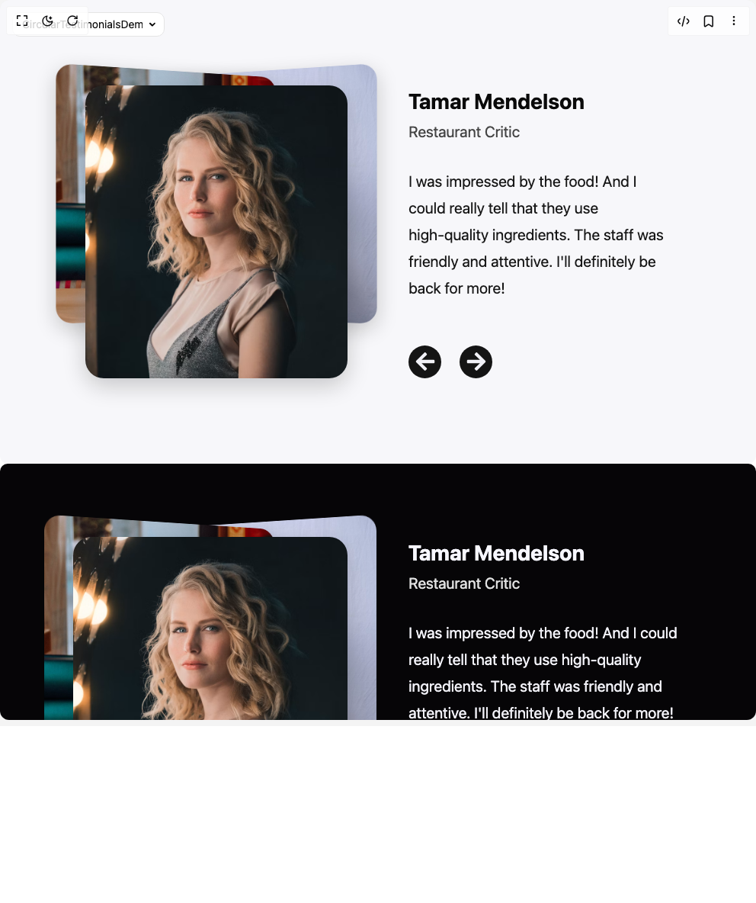
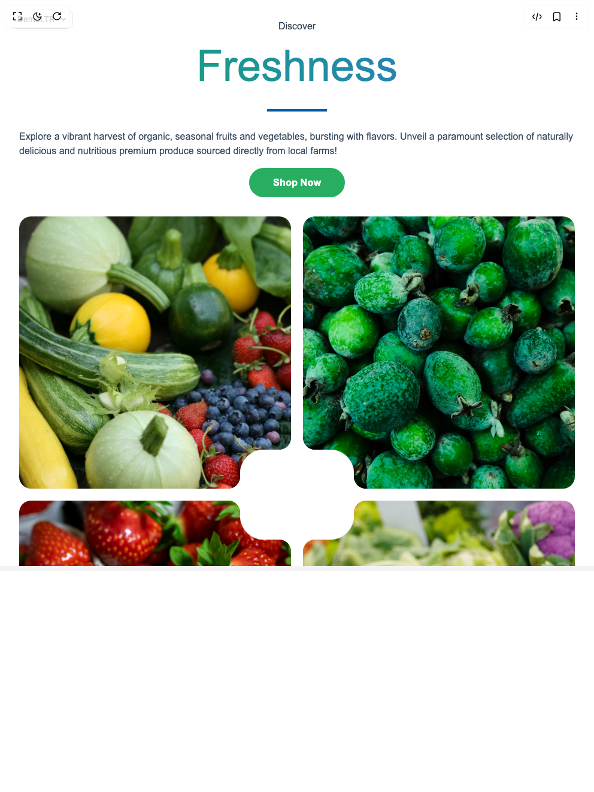
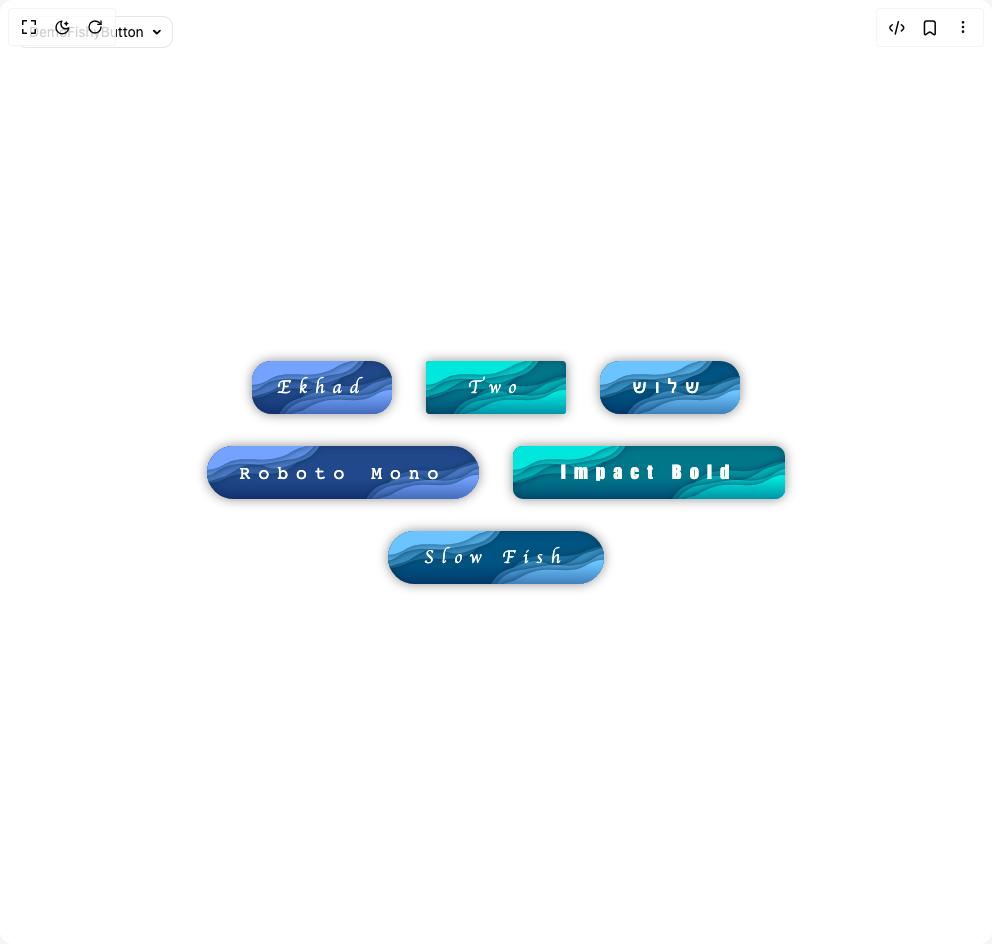
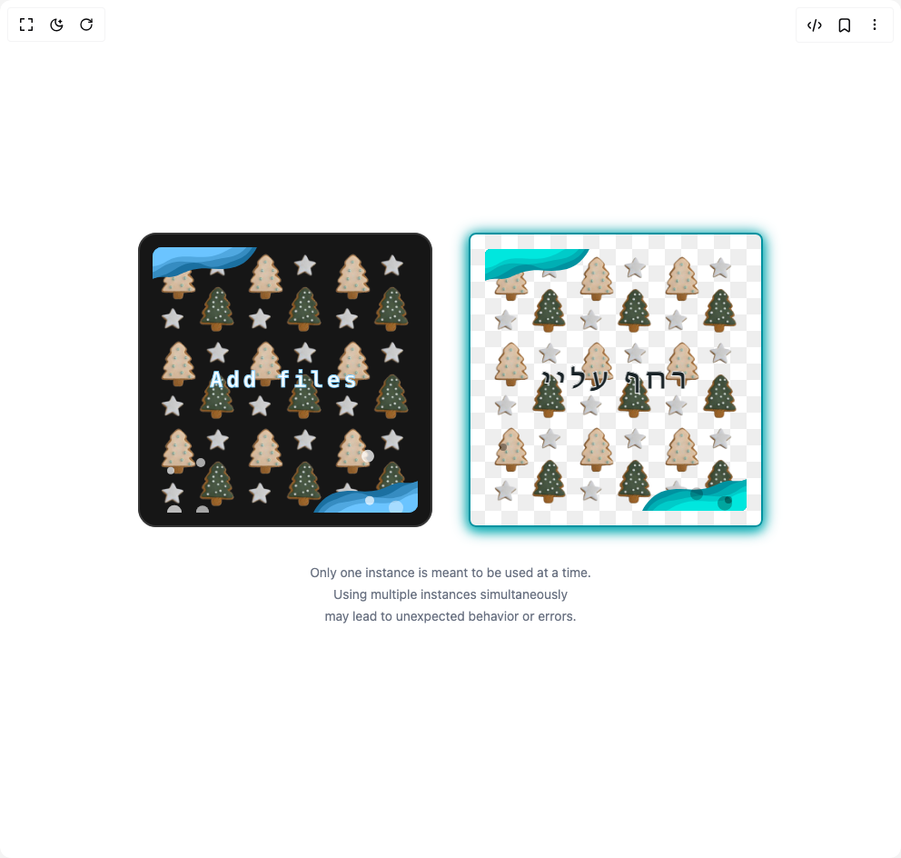
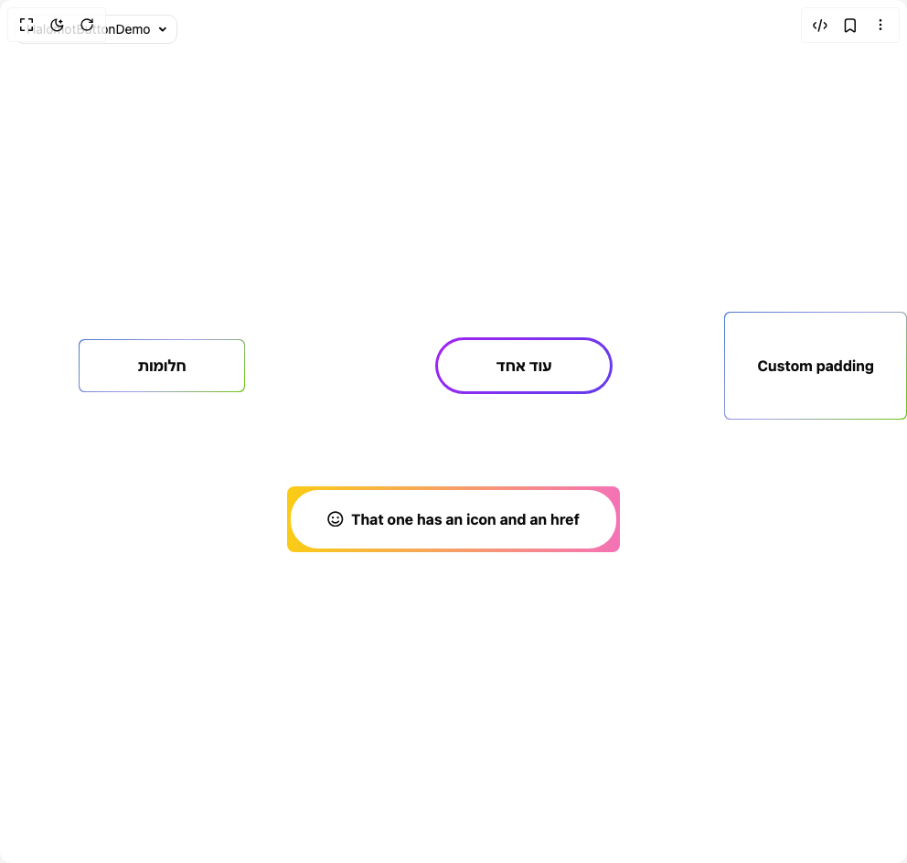
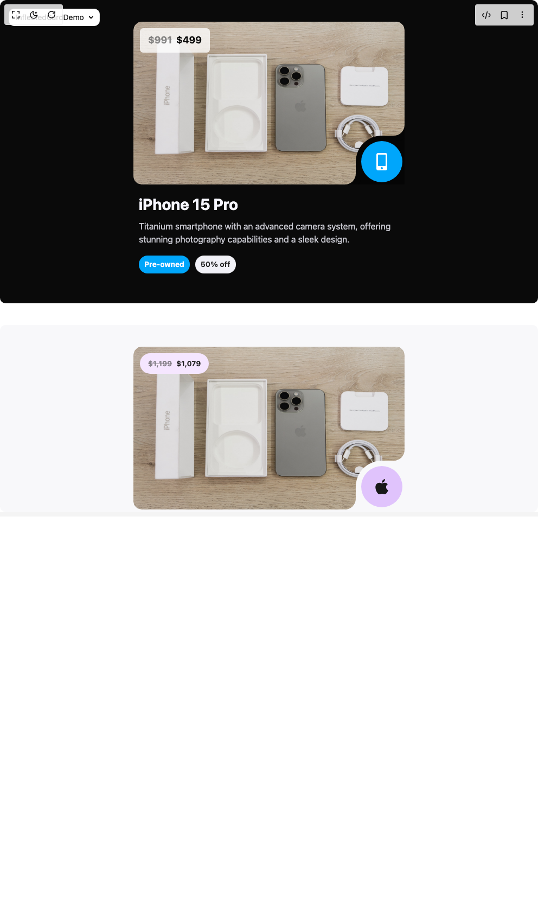
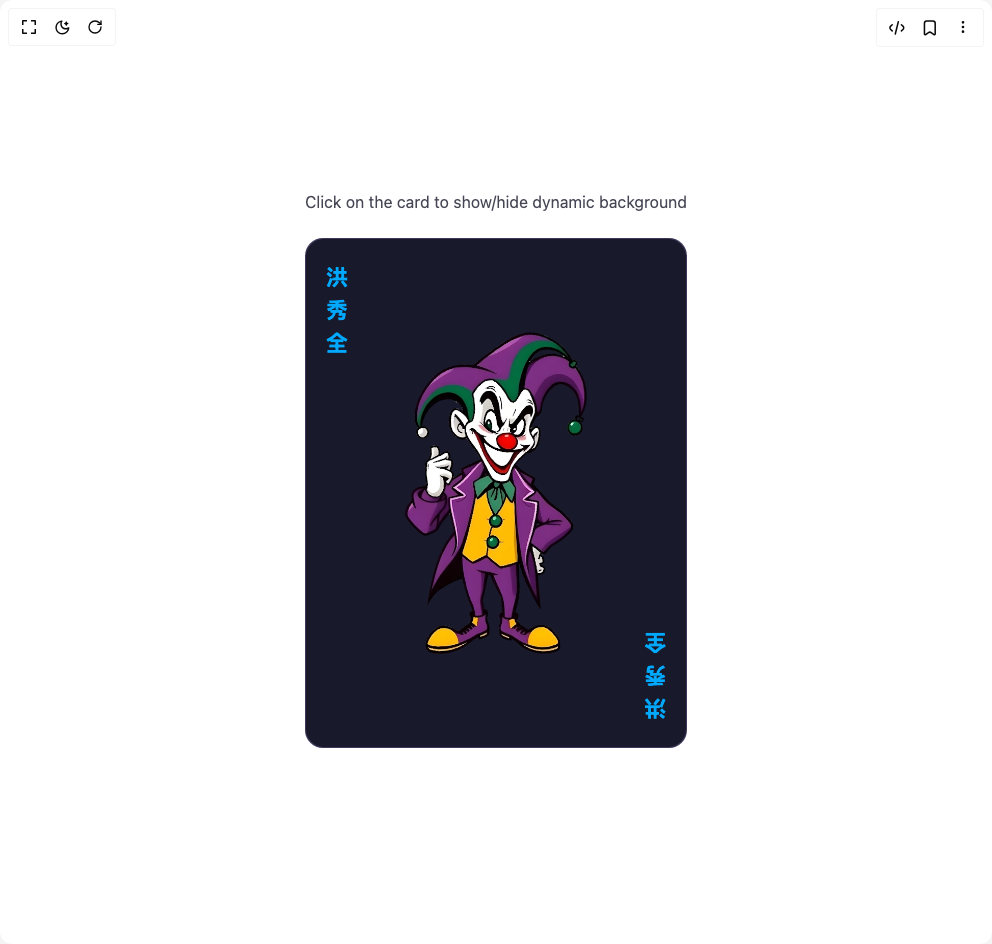
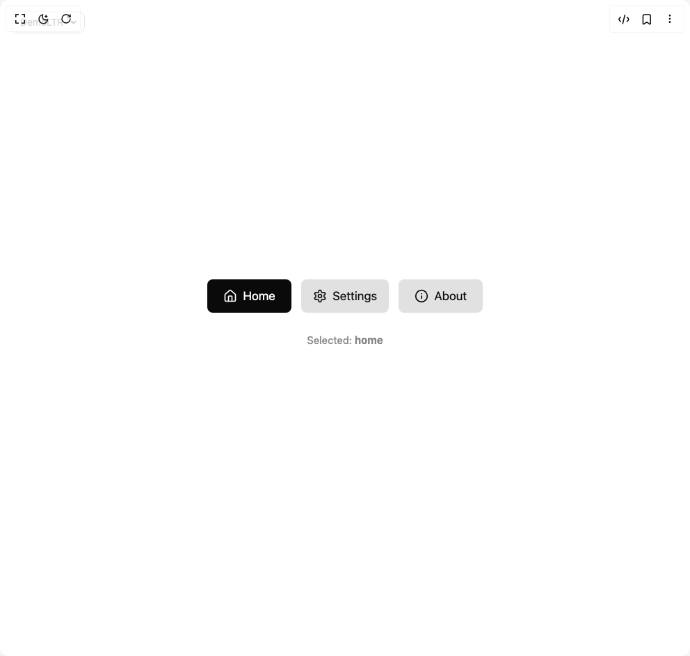
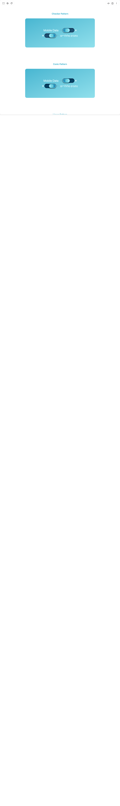
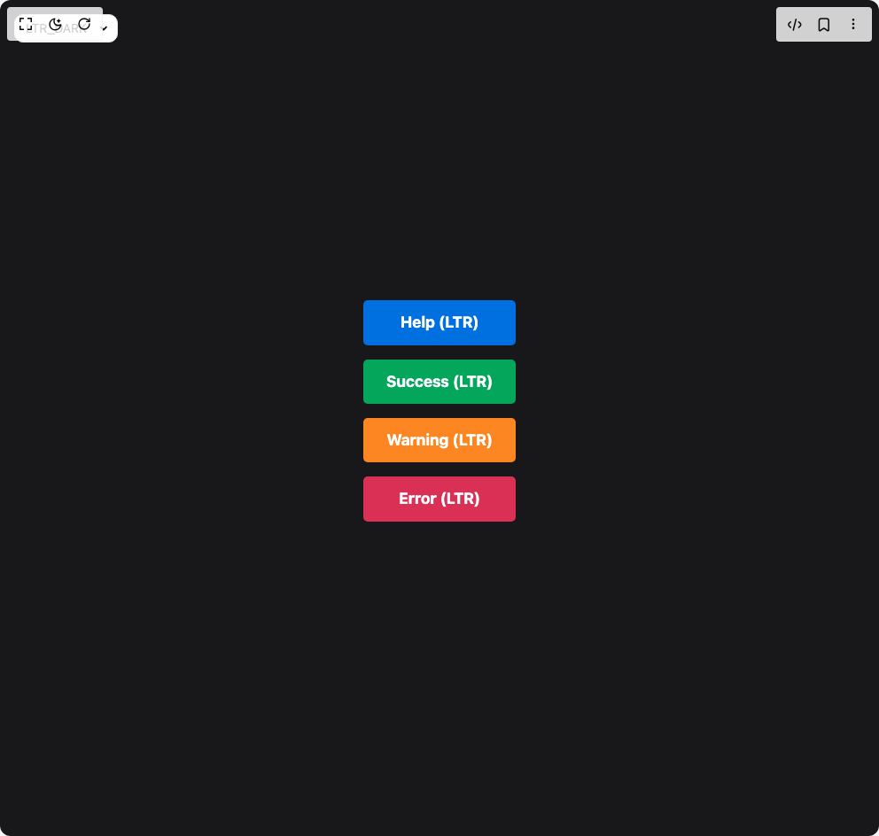

# Northstrix Components

17 components are available in this author group.

> Build any component in [BuilderStudio](https://builderstudio.dev), then share improvements with the community on [Discord](https://discord.gg/QdWeSGCqfe) or [Reddit](https://reddit.com/r/builderstudio).

| Preview | Component | Variant |
| --- | --- | --- |
|  | [Chronicle Button](chronicle-button/default/README.md) | `default` |
|  | [Circular Testimonials](circular-testimonials/default/README.md) | `default` |
|  | [Diced Hero Section](diced-hero-section/default/README.md) | `default` |
|  | [Fancy Card](fancy-card/default/README.md) | `default` |
|  | [Fishy Button](fishy-button/default/README.md) | `default` |
|  | [Fishy File Drop](fishy-file-drop/default/README.md) | `default` |
|  | [Halomot Button](halomot-button/default/README.md) | `default` |
|  | [Inflected Card](inflected-card/default/README.md) | `default` |
|  | [Info Card](info-card/default/README.md) | `default` |
|  | [Metamorphic Loader](metamorphic-loader/default/README.md) | `default` |
|  | [Modern Retro Button](modern-retro-button/default/README.md) | `default` |
|  | [Playing Card](playing-card/default/README.md) | `default` |
|  | [Radio Group](radio-group/default/README.md) | `default` |
|  | [Shamayim Toggle Switch](shamayim-toggle-switch/default/README.md) | `default` |
|  | [Simple Code Block](simple-code-block/default/README.md) | `default` |
|  | [Splashed Push Notifications](splashed-push-notifications/default/README.md) | `default` |
|  | [Truncating Navbar](truncating-navbar/default/README.md) | `default` |
