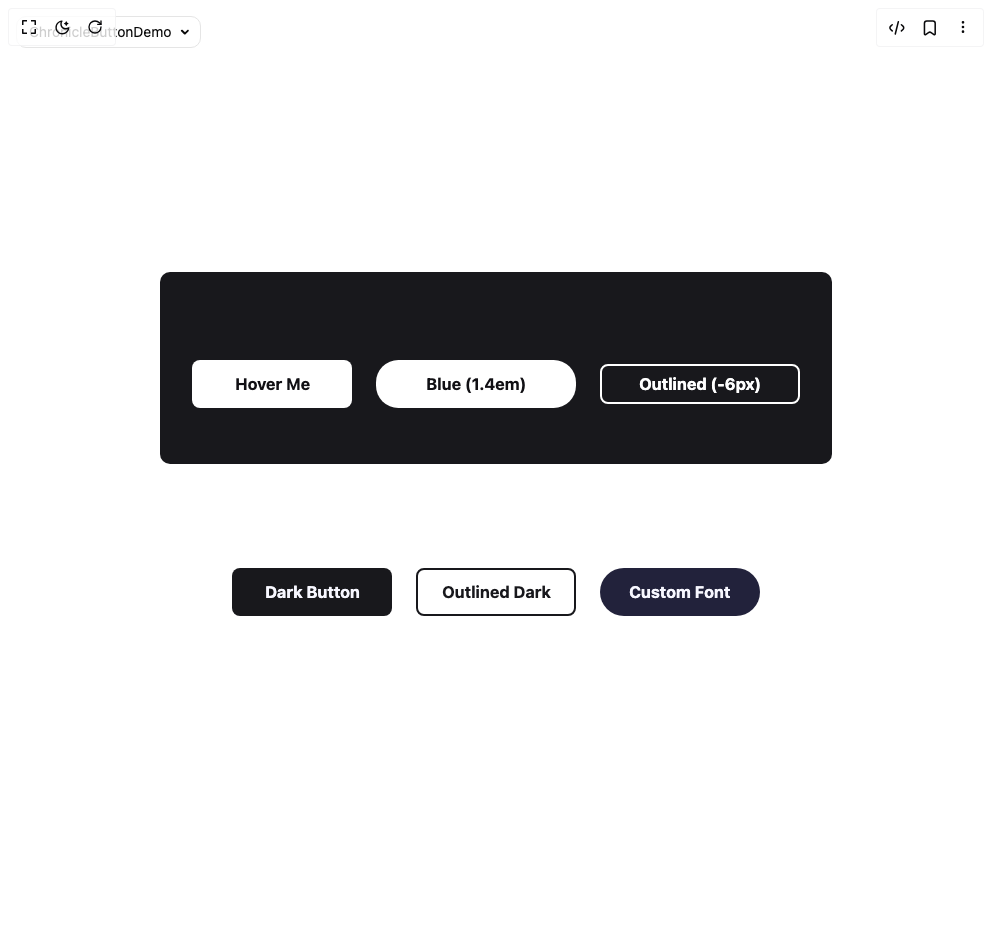

# Build Chronicle Button in BuilderStudio

> Build this component in our Agentic IDE: [BuilderStudio](https://builderstudio.dev).
>
> Join the BuilderStudio community on [Discord](https://discord.gg/QdWeSGCqfe) and [Reddit](https://reddit.com/r/builderstudio).



## Component

- Author group: `northstrix`
- Component: `chronicle-button`
- Variant: `default`
- Rendered HTML snapshot: [`rendered.html`](rendered.html)

## BuilderStudio prompt

You are implementing a React component based on a component reference.

## Component identity

- Author: Northstrix
- Component slug: chronicle-button
- Demo slug: default
- Title: chronicle-button
- Description: 

## Goal

Recreate this component in a React + TypeScript + Tailwind CSS project. Preserve the visual layout, spacing, colors, border radius, shadows, interaction behavior, animation behavior, responsive behavior, and dark mode behavior shown in the rendered demo.

## Implementation requirements

- Use React and TypeScript.
- Use Tailwind CSS classes whenever possible.
- Keep the component self-contained unless the source files require helper components.
- If the source uses CSS variables, custom CSS, animations, or keyframes, include them.
- If the source uses external packages, list and use the required packages.
- Preserve accessibility attributes, button semantics, links, keyboard behavior, and ARIA attributes when visible in the source.
- Do not replace the component with a simplified placeholder.
- Return complete production-ready code.

## Dependencies

No reference metadata available.

## Rendered DOM snapshot

This is the rendered demo HTML extracted from the live preview. Use it to verify structure, class names, visible content, and layout.

```html
<div id="root"><div class="fixed top-4 left-4 z-10"><select class="appearance-none h-8 max-w-[200px] text-sm leading-tight rounded-lg pl-3 pr-7 py-0 border bg-background focus:outline-none focus:ring-0"><option value="named_ChronicleButtonDemo_ChronicleButtonDemo">ChronicleButtonDemo</option></select><div class="absolute top-1/2 transform -translate-y-1/2 right-2 pointer-events-none"><svg class="w-4 h-4 fill-current" viewBox="0 0 20 20"><path d="M5.516 7.548c.436-.446 1.043-.48 1.576 0L10 10.405l2.908-2.857c.533-.48 1.14-.446 1.576 0 .436.445.408 1.197 0 1.615l-3.734 3.705c-.533.534-1.39.534-1.923 0l-3.734-3.705c-.408-.418-.436-1.17 0-1.615z"></path></svg></div></div><div class="w-screen min-h-screen flex justify-center items-center"><section><div class="bg-[#18181c] rounded-lg flex flex-col items-center justify-center relative gap-8 py-14 px-8"><div class="flex gap-6 flex-wrap justify-center items-center mt-8"><button class="chronicleButton" type="button" style="--chronicle-button-background: #fff; --chronicle-button-foreground: #111014; --chronicle-button-hover-background: #a594fd; --chronicle-button-hover-foreground: #111014; --outline-padding-adjustment: 2px; --chronicle-button-border-radius: 8px; --outlined-button-background-on-hover: transparent; width: 160px; border-radius: 8px;"><span><em>Hover Me</em></span><span><em>Hover Me</em></span></button><button class="chronicleButton" type="button" style="--chronicle-button-background: #fff; --chronicle-button-foreground: #111014; --chronicle-button-hover-background: #90BAFD; --chronicle-button-hover-foreground: #111014; --outline-padding-adjustment: 2px; --chronicle-button-border-radius: 1.4em; --outlined-button-background-on-hover: transparent; width: 200px; border-radius: 1.4em;"><span><em>Blue (1.4em)</em></span><span><em>Blue (1.4em)</em></span></button><button class="chronicleButton outlined" type="button" style="--chronicle-button-background: #fff; --chronicle-button-foreground: #111014; --chronicle-button-hover-background: #CC8DFD; --chronicle-button-hover-foreground: #111014; --outline-padding-adjustment: 6px; --chronicle-button-border-radius: 8px; --outlined-button-background-on-hover: transparent; width: 200px; border-radius: 8px;"><span><em>Outlined (-6px)</em></span><span><em>Outlined (-6px)</em></span></button></div></div><div class="bg-white rounded-lg flex flex-col items-center justify-center relative gap-8 py-14 px-8 mt-12"><div class="flex gap-6 flex-wrap justify-center items-center"><button class="chronicleButton" type="button" style="--chronicle-button-background: #18181c; --chronicle-button-foreground: #f7f7ff; --chronicle-button-hover-background: #00a6fb; --chronicle-button-hover-foreground: #0a0a0a; --outline-padding-adjustment: 2px; --chronicle-button-border-radius: 8px; --outlined-button-background-on-hover: transparent; width: 160px; border-radius: 8px;"><span><em>Dark Button</em></span><span><em>Dark Button</em></span></button><button class="chronicleButton outlined" type="button" style="--chronicle-button-background: #18181c; --chronicle-button-foreground: #f7f7ff; --chronicle-button-hover-background: #00affb; --chronicle-button-hover-foreground: #111014; --outline-padding-adjustment: 2px; --chronicle-button-border-radius: 8px; --outlined-button-background-on-hover: transparent; width: 160px; border-radius: 8px;"><span><em>Outlined Dark</em></span><span><em>Outlined Dark</em></span></button><button class="chronicleButton" type="button" style="--chronicle-button-background: #22223b; --chronicle-button-foreground: #f7f7ff; --chronicle-button-hover-background: #9722ff; --chronicle-button-hover-foreground: #f7f7ff; --outline-padding-adjustment: 2px; --chronicle-button-border-radius: 2em; --outlined-button-background-on-hover: transparent; width: 160px; border-radius: 2em;"><span><em>Custom Font</em></span><span><em>Custom Font</em></span></button></div></div></section></div></div>
```

## Reference source files

No reference source files were available.
