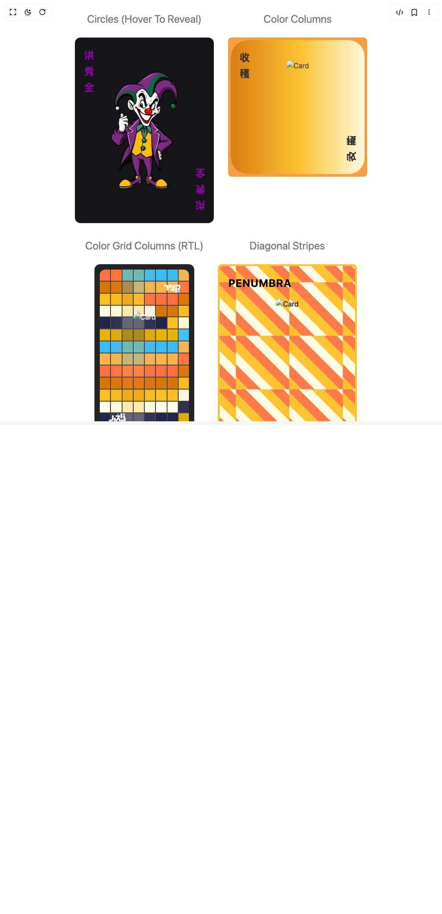

# Build Fancy Card in BuilderStudio

> Build this component in our Agentic IDE: [BuilderStudio](https://builderstudio.dev).
>
> Join the BuilderStudio community on [Discord](https://discord.gg/QdWeSGCqfe) and [Reddit](https://reddit.com/r/builderstudio).



## Component

- Author group: `northstrix`
- Component: `fancy-card`
- Variant: `default`
- Rendered HTML snapshot: [`rendered.html`](rendered.html)

## BuilderStudio prompt

You are implementing a React component based on a component reference.

## Component identity

- Author: Northstrix
- Component slug: fancy-card
- Demo slug: default
- Title: fancy-card
- Description: 

## Goal

Recreate this component in a React + TypeScript + Tailwind CSS project. Preserve the visual layout, spacing, colors, border radius, shadows, interaction behavior, animation behavior, responsive behavior, and dark mode behavior shown in the rendered demo.

## Implementation requirements

- Use React and TypeScript.
- Use Tailwind CSS classes whenever possible.
- Keep the component self-contained unless the source files require helper components.
- If the source uses CSS variables, custom CSS, animations, or keyframes, include them.
- If the source uses external packages, list and use the required packages.
- Preserve accessibility attributes, button semantics, links, keyboard behavior, and ARIA attributes when visible in the source.
- Do not replace the component with a simplified placeholder.
- Return complete production-ready code.

## Dependencies

No reference metadata available.

## Rendered DOM snapshot

This is the rendered demo HTML extracted from the live preview. Use it to verify structure, class names, visible content, and layout.

```html
<div id="root"><div class="w-screen min-h-screen flex justify-center items-center"><div class="w-screen min-h-screen flex justify-center items-center"><div style="padding: 24px;"><div style="display: flex; flex-wrap: wrap; gap: 32px; justify-content: center; align-items: flex-start;"><div style="display: flex; flex-direction: column; align-items: center;"><div style="color: rgb(119, 119, 119); font-size: 24px; margin-bottom: 24px; margin-top: 0px; text-align: center; user-select: none; pointer-events: none;">Circles (Hover To Reveal)</div><div tabindex="0" style="position: relative; background: rgb(51, 49, 61); border-radius: 12.56px; padding: 1px; cursor: pointer; width: 312px; min-width: 120px; max-width: 98vw; aspect-ratio: 3 / 4; overflow: visible; transition: background 0.4s cubic-bezier(0.4, 0, 0.2, 1);"><div style="background: rgb(21, 20, 25); border-radius: 12px; width: 100%; height: 100%; display: flex; flex-direction: column; color: rgb(143, 4, 167); position: relative; overflow: hidden; padding: 0px; box-sizing: border-box; aspect-ratio: 3 / 4;"><div style="opacity: 0; transition: opacity 0.3s cubic-bezier(0.4, 0, 0.2, 1); position: absolute; inset: 0px; width: 100%; height: 100%; z-index: 0; border-radius: 12px; pointer-events: none; background: rgb(36, 34, 43); mask-image: radial-gradient(circle, white 99%, transparent 100%);"><div style="position: absolute; inset: 0px; width: 100%; height: 100%; pointer-events: none; background: repeating-radial-gradient(circle at 10% 10%, rgb(143, 4, 167) 0px, rgb(143, 4, 167) 2px, transparent 3px, transparent 36px), repeating-radial-gradient(circle at 80% 80%, rgb(0, 169, 254) 0px, rgb(0, 169, 254) 2px, transparent 3px, transparent 36px), repeating-radial-gradient(circle, rgb(61, 55, 89) 0px, rgb(61, 55, 89) 1.5px, transparent 2.5px, transparent 34px); opacity: 0.23; filter: blur(0.5px); z-index: 1;"></div><div style="position: absolute; inset: 0px; pointer-events: none; background: radial-gradient(circle, transparent 60%, rgb(35, 36, 74) 100%); z-index: 2; opacity: 0.6;"></div></div><div class="fancy-card-inscription" style="position: absolute; left: 20px; right: 20px; top: 20px; display: flex; flex-direction: column; z-index: 3; font-weight: bold; font-size: 24px; letter-spacing: -2px; user-select: none; pointer-events: none; text-align: left; color: rgb(143, 4, 167);"><div>洪</div><div>秀</div><div>全</div></div><div class="fancy-card-inscription" style="position: absolute; left: 20px; right: 20px; bottom: 20px; display: flex; flex-direction: column; z-index: 3; font-weight: bold; font-size: 24px; letter-spacing: -2px; user-select: none; pointer-events: none; text-align: right; transform: scaleY(-1); color: rgb(143, 4, 167);"><div>洪</div><div>秀</div><div>全</div></div><div style="position: absolute; top: 0px; left: 0px; width: 100%; height: 100%; display: flex; align-items: center; justify-content: center; z-index: 3; pointer-events: none;"></div></div></div></div><div style="display: flex; flex-direction: column; align-items: center;"><div style="color: rgb(119, 119, 119); font-size: 24px; margin-bottom: 24px; margin-top: 0px; text-align: center; user-select: none; pointer-events: none;">Color Columns</div><div tabindex="0" style="position: relative; background: rgb(245, 158, 66); border-radius: 8px; padding: 6px; cursor: pointer; width: 312px; min-width: 120px; max-width: 98vw; aspect-ratio: 1 / 1; overflow: visible; transition: background 0.4s cubic-bezier(0.4, 0, 0.2, 1);"><div style="background: rgb(255, 251, 230); border-radius: 36px; width: 100%; height: 100%; display: flex; flex-direction: column; color: rgb(51, 51, 51); position: relative; overflow: hidden; padding: 0px; box-sizing: border-box; aspect-ratio: 1 / 1;"><div style="opacity: 0.93; position: absolute; inset: 0px; width: 100%; height: 100%; z-index: 0; border-radius: 36px; pointer-events: none; background: linear-gradient(90deg, rgb(255, 179, 71) 0%, rgb(255, 112, 67) 25%, rgb(217, 119, 6) 50%, rgb(251, 191, 36) 75%, rgb(255, 251, 230) 100%) 0% 0% / 200% 100%; animation: 6s cubic-bezier(0.4, 0, 0.2, 1) 0s infinite alternate none running columns-move;"></div><div class="fancy-card-inscription" style="position: absolute; left: 20px; right: 20px; top: 20px; display: flex; flex-direction: column; z-index: 3; font-weight: bold; font-size: 24px; letter-spacing: -2px; user-select: none; pointer-events: none; text-align: left; color: rgb(51, 51, 51);"><div>收</div><div>穫</div></div><div class="fancy-card-inscription" style="position: absolute; left: 20px; right: 20px; bottom: 20px; display: flex; flex-direction: column; z-index: 3; font-weight: bold; font-size: 24px; letter-spacing: -2px; user-select: none; pointer-events: none; text-align: right; transform: scaleY(-1); color: rgb(51, 51, 51);"><div>收</div><div>穫</div></div><div style="position: absolute; top: 0px; left: 0px; width: 100%; height: 100%; display: flex; align-items: center; justify-content: center; z-index: 3; pointer-events: none;"></div></div></div></div><div style="display: flex; flex-direction: column; align-items: center;"><div style="color: rgb(119, 119, 119); font-size: 24px; margin-bottom: 24px; margin-top: 0px; text-align: center; user-select: none; pointer-events: none;">Color Grid Columns (RTL)</div><div tabindex="0" style="position: relative; background: rgb(36, 36, 36); border-radius: 12.56px; padding: 12px; cursor: pointer; width: 224px; min-width: 120px; max-width: 98vw; aspect-ratio: 9 / 16; overflow: visible; transition: background 0.4s cubic-bezier(0.4, 0, 0.2, 1);"><div style="background: rgb(72, 72, 72); border-radius: 12px; width: 100%; height: 100%; display: flex; flex-direction: column; color: rgb(255, 255, 255); position: relative; overflow: hidden; padding: 0px; box-sizing: border-box; aspect-ratio: 9 / 16;"><div style="opacity: 1; position: absolute; inset: 0px; width: 100%; height: 100%; z-index: 0; border-radius: 12px; display: grid; grid-template-columns: repeat(8, 1fr); gap: 2px; background: rgb(72, 72, 72); pointer-events: none;"><div style="display: grid; height: 100%; grid-template-rows: repeat(14, 1fr); gap: 2px;"><div style="width: 100%; height: 100%; background: rgb(255, 179, 71); transition: background-color 0.3s;"></div><div style="width: 100%; height: 100%; background: rgb(255, 112, 67); transition: background-color 0.3s;"></div><div style="width: 100%; height: 100%; background: rgb(217, 119, 6); transition: background-color 0.3s;"></div><div style="width: 100%; height: 100%; background: rgb(251, 191, 36); transition: background-color 0.3s;"></div><div style="width: 100%; height: 100%; background: rgb(255, 251, 230); transition: background-color 0.3s;"></div><div style="width: 100%; height: 100%; background: rgb(35, 36, 74); transition: background-color 0.3s;"></div><div style="width: 100%; height: 100%; background: rgb(234, 179, 8); transition: background-color 0.3s;"></div><div style="width: 100%; height: 100%; background: rgb(56, 189, 248); transition: background-color 0.3s;"></div><div style="width: 100%; height: 100%; background: rgb(255, 179, 71); transition: background-color 0.3s;"></div><div style="width: 100%; height: 100%; background: rgb(255, 112, 67); transition: background-color 0.3s;"></div><div style="width: 100%; height: 100%; background: rgb(217, 119, 6); transition: background-color 0.3s;"></div><div style="width: 100%; height: 100%; background: rgb(251, 191, 36); transition: background-color 0.3s;"></div><div style="width: 100%; height: 100%; background: rgb(255, 251, 230); transition: background-color 0.3s;"></div><div style="width: 100%; height: 100%; background: rgb(35, 36, 74); transition: background-color 0.3s;"></div></div><div style="display: grid; height: 100%; grid-template-rows: repeat(14, 1fr); gap: 2px;"><div style="width: 100%; height: 100%; background: rgb(234, 179, 8); transition: background-color 0.3s;"></div><div style="width: 100%; height: 100%; background: rgb(255, 112, 67); transition: background-color 0.3s;"></div><div style="width: 100%; height: 100%; background: rgb(217, 119, 6); transition: background-color 0.3s;"></div><div style="width: 100%; height: 100%; background: rgb(251, 191, 36); transition: background-color 0.3s;"></div><div style="width: 100%; height: 100%; background: rgb(255, 251, 230); transition: background-color 0.3s;"></div><div style="width: 100%; height: 100%; background: rgb(35, 36, 74); transition: background-color 0.3s;"></div><div style="width: 100%; height: 100%; background: rgb(234, 179, 8); transition: background-color 0.3s;"></div><div style="width: 100%; height: 100%; background: rgb(56, 189, 248); transition: background-color 0.3s;"></div><div style="width: 100%; height: 100%; background: rgb(255, 179, 71); transition: background-color 0.3s;"></div><div style="width: 100%; height: 100%; background: rgb(255, 112, 67); transition: background-color 0.3s;"></div><div style="width: 100%; height: 100%; background: rgb(217, 119, 6); transition: background-color 0.3s;"></div><div style="width: 100%; height: 100%; background: rgb(251, 191, 36); transition: background-color 0.3s;"></div><div style="width: 100%; height: 100%; background: rgb(255, 251, 230); transition: background-color 0.3s;"></div><div style="width: 100%; height: 100%; background: rgb(35, 36, 74); transition: background-color 0.3s;"></div></div><div style="display: grid; height: 100%; grid-template-rows: repeat(14, 1fr); gap: 2px;"><div style="width: 100%; height: 100%; background: rgb(234, 179, 8); transition: background-color 0.3s;"></div><div style="width: 100%; height: 100%; background: rgb(56, 189, 248); transition: background-color 0.3s;"></div><div style="width: 100%; height: 100%; background: rgb(217, 119, 6); transition: background-color 0.3s;"></div><div style="width: 100%; height: 100%; background: rgb(251, 191, 36); transition: background-color 0.3s;"></div><div style="width: 100%; height: 100%; background: rgb(255, 251, 230); transition: background-color 0.3s;"></div><div style="width: 100%; height: 100%; background: rgb(35, 36, 74); transition: background-color 0.3s;"></div><div style="width: 100%; height: 100%; background: rgb(234, 179, 8); transition: background-color 0.3s;"></div><div style="width: 100%; height: 100%; background: rgb(56, 189, 248); transition: background-color 0.3s;"></div><div style="width: 100%; height: 100%; background: rgb(255, 179, 71); transition: background-color 0.3s;"></div><div style="width: 100%; height: 100%; background: rgb(255, 112, 67); transition: background-color 0.3s;"></div><div style="width: 100%; height: 100%; background: rgb(217, 119, 6); transition: background-color 0.3s;"></div><div style="width: 100%; height: 100%; background: rgb(251, 191, 36); transition: background-color 0.3s;"></div><div style="width: 100%; height: 100%; background: rgb(255, 251, 230); transition: background-color 0.3s;"></div><div style="width: 100%; height: 100%; background: rgb(35, 36, 74); transition: background-color 0.3s;"></div></div><div style="display: grid; height: 100%; grid-template-rows: repeat(14, 1fr); gap: 2px;"><div style="width: 100%; height: 100%; background: rgb(234, 179, 8); transition: background-color 0.3s;"></div><div style="width: 100%; height: 100%; background: rgb(56, 189, 248); transition: background-color 0.3s;"></div><div style="width: 100%; height: 100%; background: rgb(255, 179, 71); transition: background-color 0.3s;"></div><div style="width: 100%; height: 100%; background: rgb(251, 191, 36); transition: background-color 0.3s;"></div><div style="width: 100%; height: 100%; background: rgb(255, 251, 230); transition: background-color 0.3s;"></div><div style="width: 100%; height: 100%; background: rgb(35, 36, 74); transition: background-color 0.3s;"></div><div style="width: 100%; height: 100%; background: rgb(234, 179, 8); transition: background-color 0.3s;"></div><div style="width: 100%; height: 100%; background: rgb(56, 189, 248); transition: background-color 0.3s;"></div><div style="width: 100%; height: 100%; background: rgb(255, 179, 71); transition: background-color 0.3s;"></div><div style="width: 100%; height: 100%; background: rgb(255, 112, 67); transition: background-color 0.3s;"></div><div style="width: 100%; height: 100%; background: rgb(217, 119, 6); transition: background-color 0.3s;"></div><div style="width: 100%; height: 100%; background: rgb(251, 191, 36); transition: background-color 0.3s;"></div><div style="width: 100%; height: 100%; background: rgb(255, 251, 230); transition: background-color 0.3s;"></div><div style="width: 100%; height: 100%; background: rgb(35, 36, 74); transition: background-color 0.3s;"></div></div><div style="display: grid; height: 100%; grid-template-rows: repeat(14, 1fr); gap: 2px;"><div style="width: 100%; height: 100%; background: rgb(234, 179, 8); transition: background-color 0.3s;"></div><div style="width: 100%; height: 100%; background: rgb(56, 189, 248); transition: background-color 0.3s;"></div><div style="width: 100%; height: 100%; background: rgb(255, 179, 71); transition: background-color 0.3s;"></div><div style="width: 100%; height: 100%; background: rgb(255, 112, 67); transition: background-color 0.3s;"></div><div style="width: 100%; height: 100%; background: rgb(255, 251, 230); transition: background-color 0.3s;"></div><div style="width: 100%; height: 100%; background: rgb(35, 36, 74); transition: background-color 0.3s;"></div><div style="width: 100%; height: 100%; background: rgb(234, 179, 8); transition: background-color 0.3s;"></div><div style="width: 100%; height: 100%; background: rgb(56, 189, 248); transition: background-color 0.3s;"></div><div style="width: 100%; height: 100%; background: rgb(255, 179, 71); transition: background-color 0.3s;"></div><div style="width: 100%; height: 100%; background: rgb(255, 112, 67); transition: background-color 0.3s;"></div><div style="width: 100%; height: 100%; background: rgb(217, 119, 6); transition: background-color 0.3s;"></div><div style="width: 100%; height: 100%; background: rgb(251, 191, 36); transition: background-color 0.3s;"></div><div style="width: 100%; height: 100%; background: rgb(255, 251, 230); transition: background-color 0.3s;"></div><div style="width: 100%; height: 100%; background: rgb(35, 36, 74); transition: background-color 0.3s;"></div></div><div style="display: grid; height: 100%; grid-template-rows: repeat(14, 1fr); gap: 2px;"><div style="width: 100%; height: 100%; background: rgb(234, 179, 8); transition: background-color 0.3s;"></div><div style="width: 100%; height: 100%; background: rgb(56, 189, 248); transition: background-color 0.3s;"></div><div style="width: 100%; height: 100%; background: rgb(255, 179, 71); transition: background-color 0.3s;"></div><div style="width: 100%; height: 100%; background: rgb(255, 112, 67); transition: background-color 0.3s;"></div><div style="width: 100%; height: 100%; background: rgb(217, 119, 6); transition: background-color 0.3s;"></div><div style="width: 100%; height: 100%; background: rgb(35, 36, 74); transition: background-color 0.3s;"></div><div style="width: 100%; height: 100%; background: rgb(234, 179, 8); transition: background-color 0.3s;"></div><div style="width: 100%; height: 100%; background: rgb(56, 189, 248); transition: background-color 0.3s;"></div><div style="width: 100%; height: 100%; background: rgb(255, 179, 71); transition: background-color 0.3s;"></div><div style="width: 100%; height: 100%; background: rgb(255, 112, 67); transition: background-color 0.3s;"></div><div style="width: 100%; height: 100%; background: rgb(217, 119, 6); transition: background-color 0.3s;"></div><div style="width: 100%; height: 100%; background: rgb(251, 191, 36); transition: background-color 0.3s;"></div><div style="width: 100%; height: 100%; background: rgb(255, 251, 230); transition: background-color 0.3s;"></div><div style="width: 100%; height: 100%; background: rgb(35, 36, 74); transition: background-color 0.3s;"></div></div><div style="display: grid; height: 100%; grid-template-rows: repeat(14, 1fr); gap: 2px;"><div style="width: 100%; height: 100%; background: rgb(56, 189, 248); transition: background-color 0.3s;"></div><div style="width: 100%; height: 100%; background: rgb(255, 179, 71); transition: background-color 0.3s;"></div><div style="width: 100%; height: 100%; background: rgb(255, 112, 67); transition: background-color 0.3s;"></div><div style="width: 100%; height: 100%; background: rgb(217, 119, 6); transition: background-color 0.3s;"></div><div style="width: 100%; height: 100%; background: rgb(251, 191, 36); transition: background-color 0.3s;"></div><div style="width: 100%; height: 100%; background: rgb(234, 179, 8); transition: background-color 0.3s;"></div><div style="width: 100%; height: 100%; background: rgb(56, 189, 248); transition: background-color 0.3s;"></div><div style="width: 100%; height: 100%; background: rgb(255, 179, 71); transition: background-color 0.3s;"></div><div style="width: 100%; height: 100%; background: rgb(255, 112, 67); transition: background-color 0.3s;"></div><div style="width: 100%; height: 100%; background: rgb(217, 119, 6); transition: background-color 0.3s;"></div><div style="width: 100%; height: 100%; background: rgb(251, 191, 36); transition: background-color 0.3s;"></div><div style="width: 100%; height: 100%; background: rgb(255, 251, 230); transition: background-color 0.3s;"></div><div style="width: 100%; height: 100%; background: rgb(35, 36, 74); transition: background-color 0.3s;"></div><div style="width: 100%; height: 100%; background: rgb(234, 179, 8); transition: background-color 0.3s;"></div></div><div style="display: grid; height: 100%; grid-template-rows: repeat(14, 1fr); gap: 2px;"><div style="width: 100%; height: 100%; background: rgb(56, 189, 248); transition: background-color 0.3s;"></div><div style="width: 100%; height: 100%; background: rgb(255, 179, 71); transition: background-color 0.3s;"></div><div style="width: 100%; height: 100%; background: rgb(255, 112, 67); transition: background-color 0.3s;"></div><div style="width: 100%; height: 100%; background: rgb(217, 119, 6); transition: background-color 0.3s;"></div><div style="width: 100%; height: 100%; background: rgb(251, 191, 36); transition: background-color 0.3s;"></div><div style="width: 100%; height: 100%; background: rgb(255, 251, 230); transition: background-color 0.3s;"></div><div style="width: 100%; height: 100%; background: rgb(56, 189, 248); transition: background-color 0.3s;"></div><div style="width: 100%; height: 100%; background: rgb(255, 179, 71); transition: background-color 0.3s;"></div><div style="width: 100%; height: 100%; background: rgb(255, 112, 67); transition: background-color 0.3s;"></div><div style="width: 100%; height: 100%; background: rgb(217, 119, 6); transition: background-color 0.3s;"></div><div style="width: 100%; height: 100%; background: rgb(251, 191, 36); transition: background-color 0.3s;"></div><div style="width: 100%; height: 100%; background: rgb(255, 251, 230); transition: background-color 0.3s;"></div><div style="width: 100%; height: 100%; background: rgb(35, 36, 74); transition: background-color 0.3s;"></div><div style="width: 100%; height: 100%; background: rgb(234, 179, 8); transition: background-color 0.3s;"></div></div></div><div class="fancy-card-inscription" style="position: absolute; left: 20px; right: 20px; top: 20px; display: flex; flex-direction: column; z-index: 3; font-weight: bold; font-size: 24px; letter-spacing: -2px; user-select: none; pointer-events: none; text-align: right; color: rgb(255, 255, 255);"><div>קָצִיר</div></div><div class="fancy-card-inscription" style="position: absolute; left: 20px; right: 20px; bottom: 20px; display: flex; flex-direction: column; z-index: 3; font-weight: bold; font-size: 24px; letter-spacing: -2px; user-select: none; pointer-events: none; text-align: left; transform: scaleY(-1); color: rgb(255, 255, 255);"><div>קָצִיר</div></div><div style="position: absolute; top: 0px; left: 0px; width: 100%; height: 100%; display: flex; align-items: center; justify-content: center; z-index: 3; pointer-events: none;"></div></div></div></div><div style="display: flex; flex-direction: column; align-items: center;"><div style="color: rgb(119, 119, 119); font-size: 24px; margin-bottom: 24px; margin-top: 0px; text-align: center; user-select: none; pointer-events: none;">Diagonal Stripes</div><div tabindex="0" style="position: relative; background: rgb(251, 195, 47); border-radius: 8.34px; padding: 4px; cursor: pointer; width: 312px; min-width: 120px; max-width: 98vw; aspect-ratio: 3 / 4; overflow: visible; transition: background 0.4s cubic-bezier(0.4, 0, 0.2, 1);"><div style="background: rgb(255, 243, 181); border-radius: 8px; width: 100%; height: 100%; display: flex; flex-direction: column; color: rgb(0, 0, 0); position: relative; overflow: hidden; padding: 0px; box-sizing: border-box; aspect-ratio: 3 / 4;"><div style="opacity: 0.92; position: absolute; inset: 0px; width: 100%; height: 100%; z-index: 0; border-radius: 8px; pointer-events: none; background: repeating-linear-gradient(45deg, rgb(251, 191, 36) 0px, rgb(251, 191, 36) 20px, rgb(255, 112, 67) 20px, rgb(255, 112, 67) 40px, rgb(255, 251, 230) 40px, rgb(255, 251, 230) 60px) 0% 0% / 120px 120px; animation: 8s linear 0s infinite alternate none running stripes-move;"></div><div class="fancy-card-inscription" style="position: absolute; left: 20px; right: 20px; top: 20px; display: flex; flex-direction: column; z-index: 3; font-weight: bold; font-size: 24px; letter-spacing: -2px; user-select: none; pointer-events: none; text-align: left; color: rgb(0, 0, 0);"><div>P E N U M B R A</div></div><div class="fancy-card-inscription" style="position: absolute; left: 20px; right: 20px; bottom: 20px; display: flex; flex-direction: column; z-index: 3; font-weight: bold; font-size: 24px; letter-spacing: -2px; user-select: none; pointer-events: none; text-align: right; transform: scaleY(-1); color: rgb(0, 0, 0);"><div>P E N U M B R A</div></div><div style="position: absolute; top: 0px; left: 0px; width: 100%; height: 100%; display: flex; align-items: center; justify-content: center; z-index: 3; pointer-events: none;"></div></div></div></div><div style="display: flex; flex-direction: column; align-items: center;"><div style="color: rgb(119, 119, 119); font-size: 24px; margin-bottom: 24px; margin-top: 0px; text-align: center; user-select: none; pointer-events: none;">Spiral Animation (No Hover)</div><div tabindex="0" style="position: relative; background: rgb(42, 42, 61); border-radius: 18px; padding: 3px; cursor: pointer; width: 312px; min-width: 120px; max-width: 98vw; aspect-ratio: 3 / 4; overflow: visible; transition: background 0.4s cubic-bezier(0.4, 0, 0.2, 1);"><div style="background: rgb(17, 16, 20); border-radius: 16px; width: 100%; height: 100%; display: flex; flex-direction: column; color: rgb(208, 68, 255); position: relative; overflow: hidden; padding: 0px; box-sizing: border-box; aspect-ratio: 3 / 4;"><div style="position: absolute; left: -1px; top: -1px; width: calc(100% + 2px); height: calc(100% + 2px); z-index: 0; border-radius: 0px; pointer-events: auto; background: rgb(24, 25, 43); mask-image: radial-gradient(circle, white 99%, transparent 100%);"><div style="position: absolute; left: 0px; top: 0px; width: 100%; height: 100%; z-index: 2; pointer-events: all; background: transparent;"></div><div style="position: relative; width: 100%; height: 100%; overflow: hidden; pointer-events: none; border-radius: 16px; background: transparent; z-index: 1;"><div style="width: 100%; height: 100%;"><canvas data-engine="three.js r152" width="308" height="412" style="display: block; width: 308px; height: 412px;"></canvas></div></div></div><div style="position: absolute; left: -1px; top: -1px; width: calc(100% + 2px); height: calc(100% + 2px); z-index: 10; border-radius: 0px; pointer-events: all; background: transparent;"></div><div class="fancy-card-inscription" style="position: absolute; left: 20px; right: 20px; top: 20px; display: flex; flex-direction: column; z-index: 3; font-weight: bold; font-size: 24px; letter-spacing: -2px; user-select: none; pointer-events: none; text-align: left; color: rgb(208, 68, 255);"><div>鬼</div><div>札</div></div><div class="fancy-card-inscription" style="position: absolute; left: 20px; right: 20px; bottom: 20px; display: flex; flex-direction: column; z-index: 3; font-weight: bold; font-size: 24px; letter-spacing: -2px; user-select: none; pointer-events: none; text-align: right; transform: scaleY(-1); color: rgb(208, 68, 255);"><div>鬼</div><div>札</div></div><div style="position: absolute; top: 0px; left: 0px; width: 100%; height: 100%; display: flex; align-items: center; justify-content: center; z-index: 3; pointer-events: none;"></div></div></div></div><div style="display: flex; flex-direction: column; align-items: center;"><div style="color: rgb(119, 119, 119); font-size: 24px; margin-bottom: 24px; margin-top: 0px; text-align: center; user-select: none; pointer-events: none;">Shapes Animation (No Hover)</div><div tabindex="0" style="position: relative; background: rgb(42, 42, 61); border-radius: 18px; padding: 3px; cursor: pointer; width: 312px; min-width: 120px; max-width: 98vw; aspect-ratio: 3 / 4; overflow: visible; transition: background 0.4s cubic-bezier(0.4, 0, 0.2, 1);"><div style="background: rgb(17, 16, 20); border-radius: 16px; width: 100%; height: 100%; display: flex; flex-direction: column; color: rgb(51, 140, 255); position: relative; overflow: hidden; padding: 0px; box-sizing: border-box; aspect-ratio: 3 / 4;"><div style="position: absolute; left: -1px; top: -1px; width: calc(100% + 2px); height: calc(100% + 2px); z-index: 0; border-radius: 0px; pointer-events: auto; background: rgb(24, 25, 43); mask-image: radial-gradient(circle, white 99%, transparent 100%);"><div style="position: absolute; left: 0px; top: 0px; width: 100%; height: 100%; z-index: 2; pointer-events: all; background: transparent;"></div><div style="position: relative; width: 100%; height: 100%; overflow: hidden; pointer-events: none; border-radius: 16px; background: transparent; z-index: 1;"><div style="width: 100%; height: 100%;"><canvas data-engine="three.js r152" width="308" height="412" style="display: block; width: 308px; height: 412px;"></canvas></div></div></div><div style="position: absolute; left: -1px; top: -1px; width: calc(100% + 2px); height: calc(100% + 2px); z-index: 10; border-radius: 0px; pointer-events: all; background: transparent;"></div><div class="fancy-card-inscription" style="position: absolute; left: 20px; right: 20px; top: 20px; display: flex; flex-direction: column; z-index: 3; font-weight: bold; font-size: 24px; letter-spacing: -2px; user-select: none; pointer-events: none; text-align: left; color: rgb(51, 140, 255);"><div>鬼</div><div>札</div></div><div class="fancy-card-inscription" style="position: absolute; left: 20px; right: 20px; bottom: 20px; display: flex; flex-direction: column; z-index: 3; font-weight: bold; font-size: 24px; letter-spacing: -2px; user-select: none; pointer-events: none; text-align: right; transform: scaleY(-1); color: rgb(51, 140, 255);"><div>鬼</div><div>札</div></div><div style="position: absolute; top: 0px; left: 0px; width: 100%; height: 100%; display: flex; align-items: center; justify-content: center; z-index: 3; pointer-events: none;"></div></div></div></div><div style="display: flex; flex-direction: column; align-items: center;"><div style="color: rgb(119, 119, 119); font-size: 24px; margin-bottom: 24px; margin-top: 0px; text-align: center; user-select: none; pointer-events: none;">Color Rush (No Hover)</div><div tabindex="0" style="position: relative; background: rgb(54, 54, 54); border-radius: 18px; padding: 3px; cursor: pointer; width: 312px; min-width: 120px; max-width: 98vw; aspect-ratio: 3 / 4; overflow: visible; transition: background 0.4s cubic-bezier(0.4, 0, 0.2, 1);"><div style="background: rgb(24, 22, 28); border-radius: 16px; width: 100%; height: 100%; display: flex; flex-direction: column; color: rgb(255, 255, 255); position: relative; overflow: hidden; padding: 0px; box-sizing: border-box; aspect-ratio: 3 / 4;"><div style="position: absolute; left: -1px; top: -1px; width: calc(100% + 2px); height: calc(100% + 2px); z-index: 0; border-radius: 0px; pointer-events: auto; background: rgb(24, 25, 43); mask-image: radial-gradient(circle, white 99%, transparent 100%);"><div style="position: absolute; left: 0px; top: 0px; width: 100%; height: 100%; z-index: 2; pointer-events: all; background: transparent;"></div><div style="position: relative; width: 100%; height: 100%; overflow: hidden; pointer-events: none; border-radius: 16px; background: transparent; z-index: 1;"><div style="width: 100%; height: 100%;"><canvas data-engine="three.js r152" width="308" height="412" style="display: block; width: 308px; height: 412px;"></canvas></div></div></div><div style="position: absolute; left: -1px; top: -1px; width: calc(100% + 2px); height: calc(100% + 2px); z-index: 10; border-radius: 0px; pointer-events: all; background: transparent;"></div><div class="fancy-card-inscription" style="position: absolute; left: 20px; right: 20px; top: 20px; display: flex; flex-direction: column; z-index: 3; font-weight: bold; font-size: 24px; letter-spacing: -2px; user-select: none; pointer-events: none; text-align: left; color: rgb(255, 255, 255);"><div>紹</div><div>菜</div></div><div class="fancy-card-inscription" style="position: absolute; left: 20px; right: 20px; bottom: 20px; display: flex; flex-direction: column; z-index: 3; font-weight: bold; font-size: 24px; letter-spacing: -2px; user-select: none; pointer-events: none; text-align: right; transform: scaleY(-1); color: rgb(255, 255, 255);"><div>紹</div><div>菜</div></div><div style="position: absolute; top: 0px; left: 0px; width: 100%; height: 100%; display: flex; align-items: center; justify-content: center; z-index: 3; pointer-events: none;"></div></div></div></div></div></div></div></div></div>
```

## Reference source files

No reference source files were available.
