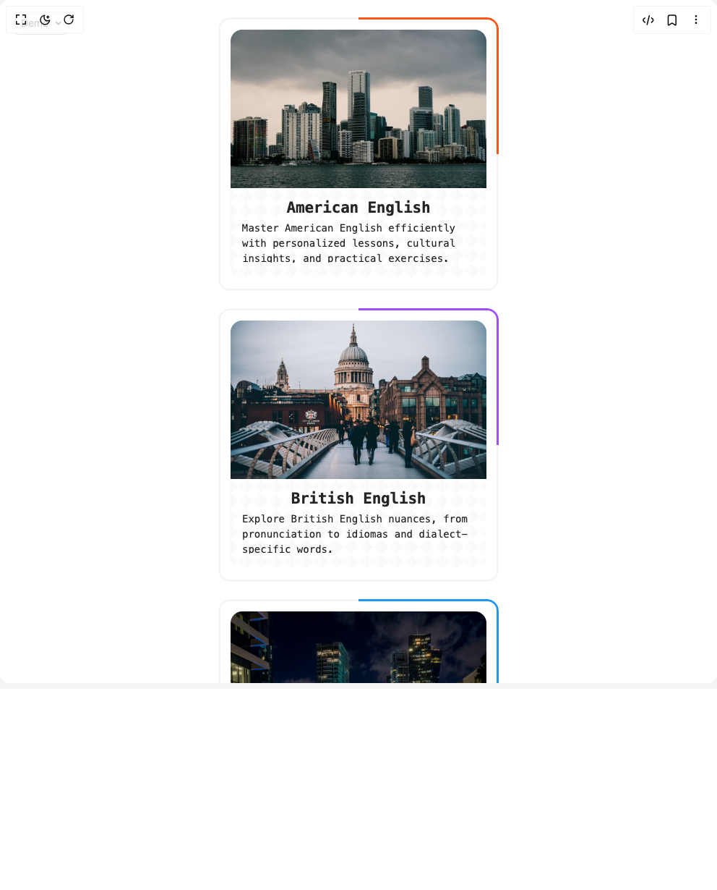

# Build Info Card in BuilderStudio

> Build this component in our Agentic IDE: [BuilderStudio](https://builderstudio.dev).
>
> Join the BuilderStudio community on [Discord](https://discord.gg/QdWeSGCqfe) and [Reddit](https://reddit.com/r/builderstudio).



## Component

- Author group: `northstrix`
- Component: `info-card`
- Variant: `default`
- Rendered HTML snapshot: [`rendered.html`](rendered.html)

## BuilderStudio prompt

You are implementing a React component based on a component reference.

## Component identity

- Author: Northstrix
- Component slug: info-card
- Demo slug: default
- Title: info-card
- Description: 

## Goal

Recreate this component in a React + TypeScript + Tailwind CSS project. Preserve the visual layout, spacing, colors, border radius, shadows, interaction behavior, animation behavior, responsive behavior, and dark mode behavior shown in the rendered demo.

## Implementation requirements

- Use React and TypeScript.
- Use Tailwind CSS classes whenever possible.
- Keep the component self-contained unless the source files require helper components.
- If the source uses CSS variables, custom CSS, animations, or keyframes, include them.
- If the source uses external packages, list and use the required packages.
- Preserve accessibility attributes, button semantics, links, keyboard behavior, and ARIA attributes when visible in the source.
- Do not replace the component with a simplified placeholder.
- Return complete production-ready code.

## Dependencies

No reference metadata available.

## Rendered DOM snapshot

This is the rendered demo HTML extracted from the live preview. Use it to verify structure, class names, visible content, and layout.

```html
<div id="root"><div class="fixed top-4 left-4 z-10"><select class="appearance-none h-8 max-w-[200px] text-sm leading-tight rounded-lg pl-3 pr-7 py-0 border bg-background focus:outline-none focus:ring-0"><option value="named_Demo_Demo">Demo</option></select><div class="absolute top-1/2 transform -translate-y-1/2 right-2 pointer-events-none"><svg class="w-4 h-4 fill-current" viewBox="0 0 20 20"><path d="M5.516 7.548c.436-.446 1.043-.48 1.576 0L10 10.405l2.908-2.857c.533-.48 1.14-.446 1.576 0 .436.445.408 1.197 0 1.615l-3.734 3.705c-.533.534-1.39.534-1.923 0l-3.734-3.705c-.408-.418-.436-1.17 0-1.615z"></path></svg></div></div><div class="w-screen min-h-screen flex justify-center items-center"><div class="container" style="display: flex; gap: 24px; padding: 24px; flex-wrap: wrap; justify-content: center; align-items: flex-start; background: none; font-family: var(--font-family); margin: 0px;"><div class="file-container" id="container1" style="width: 388px; height: 378px; border-radius: 1em; position: relative; overflow: hidden; padding: 0px; cursor: pointer; display: flex; justify-content: center; align-items: center; background: none; box-sizing: border-box; --hover-text-color: #242424;"><div style="width: 388px; height: 378px; border: 3px solid transparent; border-radius: 1em; background-origin: border-box; background-clip: padding-box, border-box; background-image: linear-gradient(var(--card-bg-color), var(--card-bg-color)), conic-gradient(from var(--rotation,0deg), var(--border-color-1) 0deg, var(--border-color-1) 90deg, var(--border-bg-color) 90deg, var(--border-bg-color) 360deg); padding: 14px; box-sizing: border-box; display: flex; align-items: center; justify-content: center; cursor: pointer; user-select: none; transition: box-shadow 0.3s; position: relative; font-family: var(--font-family);"><div style="width: 354px; height: 344px; border-radius: 1em; background-image: linear-gradient(45deg, var(--pattern-color1) 25%, transparent 25%, transparent 75%, var(--pattern-color2) 75%),linear-gradient(-45deg, var(--pattern-color2) 25%, transparent 25%, transparent 75%, var(--pattern-color1) 75%); background-position-x: ; background-position-y: ; background-size: 20.84px 20.84px; background-repeat: ; background-attachment: ; background-origin: ; background-clip: ; background-color: ; overflow: hidden; display: flex; flex-direction: column; box-sizing: border-box; padding: 0px 0px 8px;"><div style="width: 100%; position: relative; overflow: hidden;"></div><div style="flex-grow: 1; display: flex; flex-direction: column; justify-content: space-between; padding: 14.3px 16px; min-height: 0px;"><h1 style="font-size: 21px; font-weight: bold; letter-spacing: -0.01em; line-height: normal; margin-bottom: 5px; color: var(--text-color); transition: color 0.3s; position: relative; overflow: hidden; direction: ltr; width: auto;"><span style="position: relative; z-index: 10; padding: 2px 4px; display: flex; justify-content: center; align-items: center; text-align: center; width: 100%; height: 100%;">American English</span><span style="clip-path: polygon(0px 50%, 100% 50%, 100% 50%, 0px 50%); transform-origin: center center; transition: 0.4s cubic-bezier(0.1, 0.5, 0.5, 1); position: absolute; inset: -4px; z-index: 0; background-color: var(--border-color-1);"></span></h1><p style="font-size: 14px; color: var(--text-color); display: -webkit-box; -webkit-line-clamp: 3; -webkit-box-orient: vertical; overflow: hidden; direction: ltr; margin-bottom: 0px; padding-bottom: 0px; min-height: 0px;">Master American English efficiently with personalized lessons, cultural insights, and practical exercises.</p></div></div></div></div><div class="file-container" id="container2" style="width: 388px; height: 378px; border-radius: 1em; position: relative; overflow: hidden; padding: 0px; cursor: pointer; display: flex; justify-content: center; align-items: center; background: none; box-sizing: border-box; --hover-text-color: #fff;"><div style="width: 388px; height: 378px; border: 3px solid transparent; border-radius: 1em; background-origin: border-box; background-clip: padding-box, border-box; background-image: linear-gradient(var(--card-bg-color), var(--card-bg-color)), conic-gradient(from var(--rotation,0deg), var(--border-color-2) 0deg, var(--border-color-2) 90deg, var(--border-bg-color) 90deg, var(--border-bg-color) 360deg); padding: 14px; box-sizing: border-box; display: flex; align-items: center; justify-content: center; cursor: pointer; user-select: none; transition: box-shadow 0.3s; position: relative; font-family: var(--font-family);"><div style="width: 354px; height: 344px; border-radius: 1em; background-image: linear-gradient(45deg, var(--pattern-color1) 25%, transparent 25%, transparent 75%, var(--pattern-color2) 75%),linear-gradient(-45deg, var(--pattern-color2) 25%, transparent 25%, transparent 75%, var(--pattern-color1) 75%); background-position-x: ; background-position-y: ; background-size: 20.84px 20.84px; background-repeat: ; background-attachment: ; background-origin: ; background-clip: ; background-color: ; overflow: hidden; display: flex; flex-direction: column; box-sizing: border-box; padding: 0px 0px 8px;"><div style="width: 100%; position: relative; overflow: hidden;"></div><div style="flex-grow: 1; display: flex; flex-direction: column; justify-content: space-between; padding: 14.3px 16px; min-height: 0px;"><h1 style="font-size: 21px; font-weight: bold; letter-spacing: -0.01em; line-height: normal; margin-bottom: 5px; color: var(--text-color); transition: color 0.3s; position: relative; overflow: hidden; direction: ltr; width: auto;"><span style="position: relative; z-index: 10; padding: 2px 4px; display: flex; justify-content: center; align-items: center; text-align: center; width: 100%; height: 100%;">British English</span><span style="clip-path: polygon(0px 50%, 100% 50%, 100% 50%, 0px 50%); transform-origin: center center; transition: 0.4s cubic-bezier(0.1, 0.5, 0.5, 1); position: absolute; inset: -4px; z-index: 0; background-color: var(--border-color-2);"></span></h1><p style="font-size: 14px; color: var(--text-color); display: -webkit-box; -webkit-line-clamp: 3; -webkit-box-orient: vertical; overflow: hidden; direction: ltr; margin-bottom: 0px; padding-bottom: 0px; min-height: 0px;">Explore British English nuances, from pronunciation to idiomas and dialect-specific words.</p></div></div></div></div><div class="file-container" id="container3" style="width: 388px; height: 378px; border-radius: 1em; position: relative; overflow: hidden; padding: 0px; cursor: pointer; display: flex; justify-content: center; align-items: center; background: none; box-sizing: border-box; --hover-text-color: #2196F3;"><div style="width: 388px; height: 378px; border: 3px solid transparent; border-radius: 1em; background-origin: border-box; background-clip: padding-box, border-box; background-image: linear-gradient(var(--card-bg-color), var(--card-bg-color)), conic-gradient(from var(--rotation,0deg), var(--border-color-3) 0deg, var(--border-color-3) 90deg, var(--border-bg-color) 90deg, var(--border-bg-color) 360deg); padding: 14px; box-sizing: border-box; display: flex; align-items: center; justify-content: center; cursor: pointer; user-select: none; transition: box-shadow 0.3s; position: relative; font-family: var(--rtl-font-family);"><div style="width: 354px; height: 344px; border-radius: 1em; background-image: linear-gradient(45deg, var(--pattern-color1) 25%, transparent 25%, transparent 75%, var(--pattern-color2) 75%),linear-gradient(-45deg, var(--pattern-color2) 25%, transparent 25%, transparent 75%, var(--pattern-color1) 75%); background-position-x: ; background-position-y: ; background-size: 20.84px 20.84px; background-repeat: ; background-attachment: ; background-origin: ; background-clip: ; background-color: ; overflow: hidden; display: flex; flex-direction: column; box-sizing: border-box; padding: 0px 0px 8px;"><div style="width: 100%; position: relative; overflow: hidden;"></div><div style="flex-grow: 1; display: flex; flex-direction: column; justify-content: space-between; padding: 10px 16px; min-height: 0px;"><h1 style="font-size: 21px; font-weight: bold; letter-spacing: -0.01em; line-height: normal; margin-bottom: 5px; color: var(--text-color); transition: color 0.3s; position: relative; overflow: hidden; direction: rtl; width: auto;"><span style="position: relative; z-index: 10; padding: 2px 4px; display: flex; justify-content: center; align-items: center; text-align: center; width: 100%; height: 100%;">עברית</span><span style="clip-path: polygon(0px 50%, 100% 50%, 100% 50%, 0px 50%); transform-origin: center center; transition: 0.4s cubic-bezier(0.1, 0.5, 0.5, 1); position: absolute; inset: -4px; z-index: 0; background-color: var(--border-color-3);"></span></h1><p style="font-size: 14px; color: var(--text-color); display: -webkit-box; -webkit-line-clamp: 3; -webkit-box-orient: vertical; overflow: hidden; direction: rtl; margin-bottom: 0px; padding-bottom: 0px; min-height: 0px;">לימוד השפה העברית המודרנית, דקדוק ואוצר מילים. שיפור מיומנויות דיבור וכתיבה, חקירת ספרות עברית. הכרת תרבות ישראלית, מנהגים והיסטוריה.</p></div></div></div></div></div></div></div>
```

## Reference source files

No reference source files were available.
