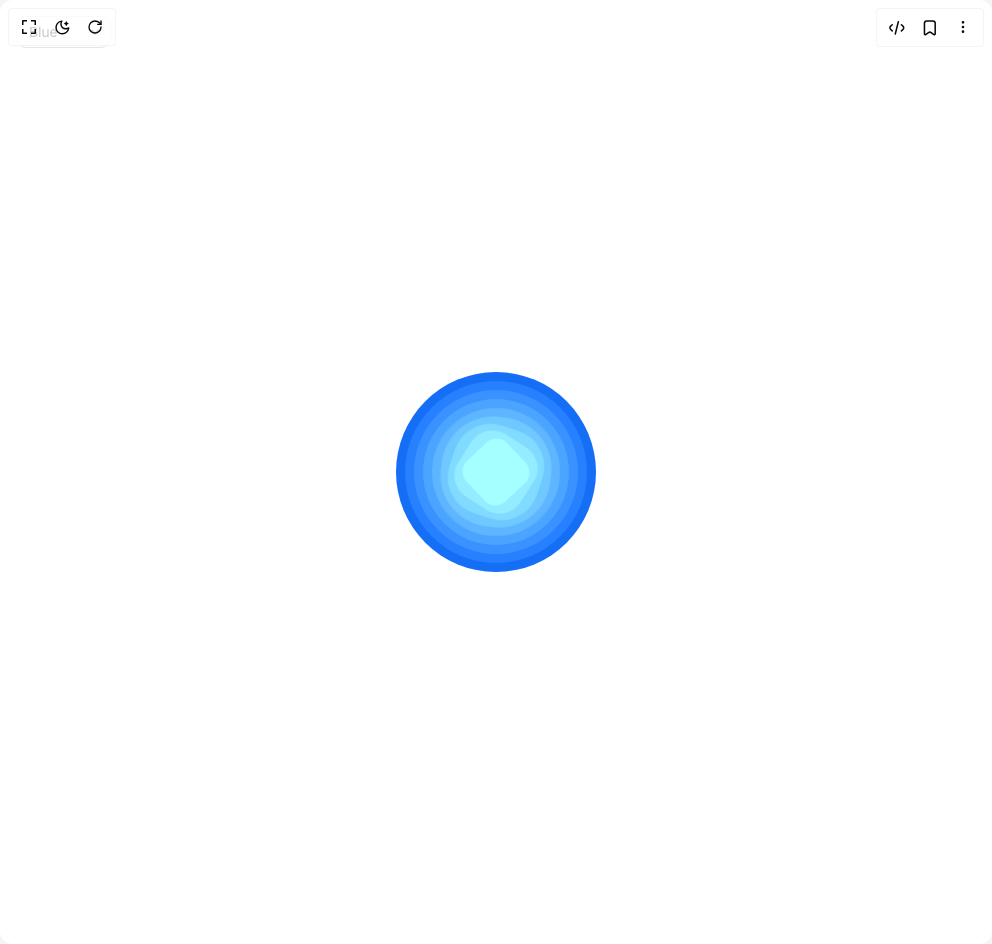

# Build Metamorphic Loader in BuilderStudio

> Build this component in our Agentic IDE: [BuilderStudio](https://builderstudio.dev).
>
> Join the BuilderStudio community on [Discord](https://discord.gg/QdWeSGCqfe) and [Reddit](https://reddit.com/r/builderstudio).



## Component

- Author group: `northstrix`
- Component: `metamorphic-loader`
- Variant: `default`
- Rendered HTML snapshot: [`rendered.html`](rendered.html)

## BuilderStudio prompt

You are implementing a React component based on a component reference.

## Component identity

- Author: Northstrix
- Component slug: metamorphic-loader
- Demo slug: default
- Title: metamorphic-loader
- Description: 

## Goal

Recreate this component in a React + TypeScript + Tailwind CSS project. Preserve the visual layout, spacing, colors, border radius, shadows, interaction behavior, animation behavior, responsive behavior, and dark mode behavior shown in the rendered demo.

## Implementation requirements

- Use React and TypeScript.
- Use Tailwind CSS classes whenever possible.
- Keep the component self-contained unless the source files require helper components.
- If the source uses CSS variables, custom CSS, animations, or keyframes, include them.
- If the source uses external packages, list and use the required packages.
- Preserve accessibility attributes, button semantics, links, keyboard behavior, and ARIA attributes when visible in the source.
- Do not replace the component with a simplified placeholder.
- Return complete production-ready code.

## Dependencies

No reference metadata available.

## Rendered DOM snapshot

This is the rendered demo HTML extracted from the live preview. Use it to verify structure, class names, visible content, and layout.

```html
<div id="root"><div class="fixed top-4 left-4 z-10"><select class="appearance-none h-8 max-w-[200px] text-sm leading-tight rounded-lg pl-3 pr-7 py-0 border bg-background focus:outline-none focus:ring-0"><option value="named_Blue_Blue">Blue</option><option value="named_Emerald_Emerald">Emerald</option><option value="named_Green_Green">Green</option><option value="named_Orange_Orange">Orange</option><option value="named_Purple_Purple">Purple</option></select><div class="absolute top-1/2 transform -translate-y-1/2 right-2 pointer-events-none"><svg class="w-4 h-4 fill-current" viewBox="0 0 20 20"><path d="M5.516 7.548c.436-.446 1.043-.48 1.576 0L10 10.405l2.908-2.857c.533-.48 1.14-.446 1.576 0 .436.445.408 1.197 0 1.615l-3.734 3.705c-.533.534-1.39.534-1.923 0l-3.734-3.705c-.408-.418-.436-1.17 0-1.615z"></path></svg></div></div><div class="w-screen min-h-screen flex justify-center items-center"><div><div style="width: 200px; height: 200px; display: flex; justify-content: center; align-items: center; position: relative; overflow: visible;"><div style="position: absolute; border-radius: 50%; background-color: rgb(21, 110, 246); width: 200px; height: 200px; left: 50%; top: 50%; transform: translate(-50%, -50%); animation: 2s ease 0.1s infinite alternate none running metamorphic-spin;"></div><div style="position: absolute; border-radius: 50%; background-color: rgb(39, 128, 255); width: 182px; height: 182px; left: 50%; top: 50%; transform: translate(-50%, -50%); animation: 2s ease 0.2s infinite alternate none running metamorphic-spin;"></div><div style="position: absolute; border-radius: 50%; background-color: rgb(57, 146, 255); width: 164px; height: 164px; left: 50%; top: 50%; transform: translate(-50%, -50%); animation: 2s ease 0.3s infinite alternate none running metamorphic-spin;"></div><div style="position: absolute; border-radius: 50%; background-color: rgb(75, 164, 255); width: 146px; height: 146px; left: 50%; top: 50%; transform: translate(-50%, -50%); animation: 2s ease 0.4s infinite alternate none running metamorphic-spin;"></div><div style="position: absolute; border-radius: 50%; background-color: rgb(93, 182, 255); width: 128px; height: 128px; left: 50%; top: 50%; transform: translate(-50%, -50%); animation: 2s ease 0.5s infinite alternate none running metamorphic-spin;"></div><div style="position: absolute; border-radius: 50%; background-color: rgb(111, 200, 255); width: 110px; height: 110px; left: 50%; top: 50%; transform: translate(-50%, -50%); animation: 2s ease 0.6s infinite alternate none running metamorphic-spin;"></div><div style="position: absolute; border-radius: 50%; background-color: rgb(129, 218, 255); width: 92px; height: 92px; left: 50%; top: 50%; transform: translate(-50%, -50%); animation: 2s ease 0.7s infinite alternate none running metamorphic-spin;"></div><div style="position: absolute; border-radius: 50%; background-color: rgb(147, 236, 255); width: 74px; height: 74px; left: 50%; top: 50%; transform: translate(-50%, -50%); animation: 2s ease 0.8s infinite alternate none running metamorphic-spin;"></div><div style="position: absolute; border-radius: 50%; background-color: rgb(165, 254, 255); width: 56px; height: 56px; left: 50%; top: 50%; transform: translate(-50%, -50%); animation: 2s ease 0.9s infinite alternate none running metamorphic-spin;"></div><style>
        @keyframes metamorphic-spin {
          0% {
            border-radius: 50%;
            transform: translate(-50%, -50%) rotate(0deg);
          }
          20% {
            border-radius: 50%;
            transform: translate(-50%, -50%) rotate(0deg);
          }
          90% {
            border-radius: 5%;
            transform: translate(-50%, -50%) rotate(90deg);
          }
          100% {
            border-radius: 5%;
            transform: translate(-50%, -50%) rotate(90deg);
          }
        }
      </style></div></div></div></div>
```

## Reference source files

No reference source files were available.
