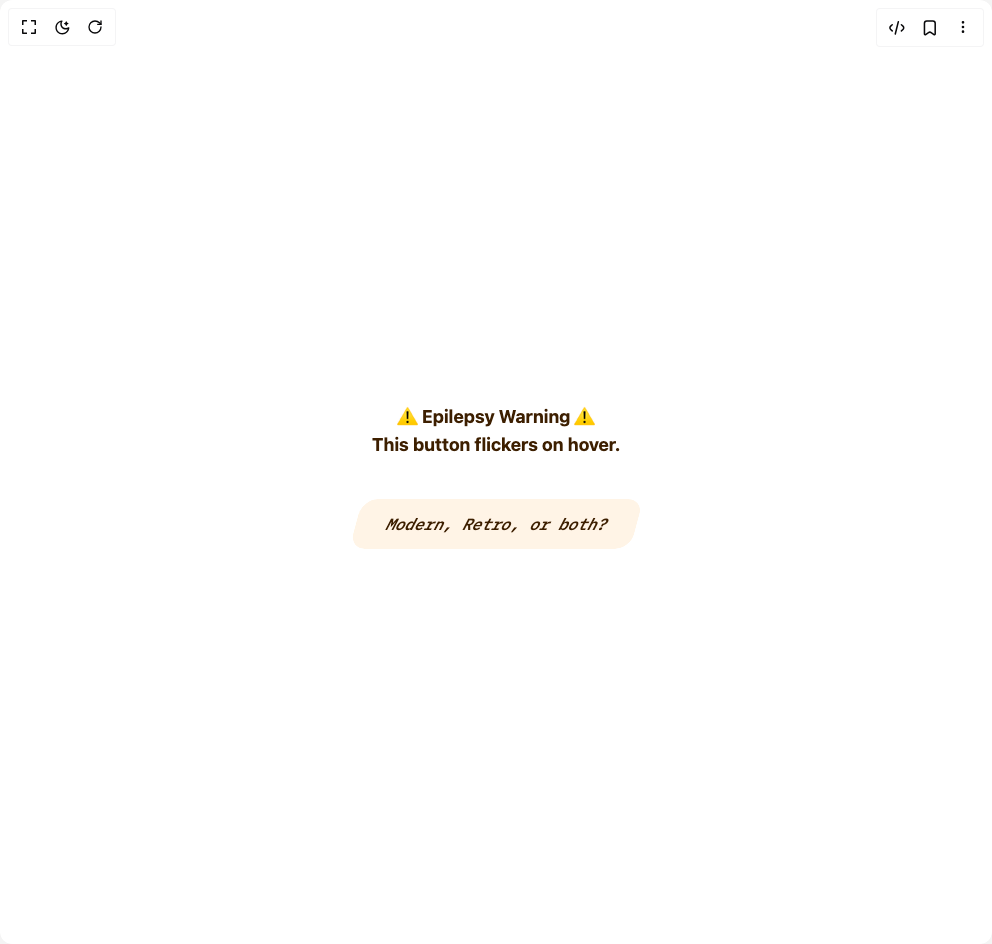

# Build Modern Retro Button in BuilderStudio

> Build this component in our Agentic IDE: [BuilderStudio](https://builderstudio.dev).
>
> Join the BuilderStudio community on [Discord](https://discord.gg/QdWeSGCqfe) and [Reddit](https://reddit.com/r/builderstudio).



## Component

- Author group: `northstrix`
- Component: `modern-retro-button`
- Variant: `default`
- Rendered HTML snapshot: [`rendered.html`](rendered.html)

## BuilderStudio prompt

You are implementing a React component based on a component reference.

## Component identity

- Author: Northstrix
- Component slug: modern-retro-button
- Demo slug: default
- Title: modern-retro-button
- Description: 

## Goal

Recreate this component in a React + TypeScript + Tailwind CSS project. Preserve the visual layout, spacing, colors, border radius, shadows, interaction behavior, animation behavior, responsive behavior, and dark mode behavior shown in the rendered demo.

## Implementation requirements

- Use React and TypeScript.
- Use Tailwind CSS classes whenever possible.
- Keep the component self-contained unless the source files require helper components.
- If the source uses CSS variables, custom CSS, animations, or keyframes, include them.
- If the source uses external packages, list and use the required packages.
- Preserve accessibility attributes, button semantics, links, keyboard behavior, and ARIA attributes when visible in the source.
- Do not replace the component with a simplified placeholder.
- Return complete production-ready code.

## Dependencies

No reference metadata available.

## Rendered DOM snapshot

This is the rendered demo HTML extracted from the live preview. Use it to verify structure, class names, visible content, and layout.

```html
<div id="root"><div class="w-screen min-h-screen flex justify-center items-center"><div class="w-screen min-h-screen flex justify-center items-center"><div class="flex flex-col items-center justify-center min-h-screen space-y-8"><div class="text-center text-lg font-bold px-4 py-2 rounded" role="alert" style="color: var(--modern-retro-button-text-default);">⚠️ Epilepsy Warning ⚠️<br>This button flickers on hover.</div><button class="retro-button" style="box-shadow: var(--modern-retro-button-box-shadow); position: relative; background: transparent;"><svg class="bg-svg" width="100%" height="100%" style="position: absolute; left: 0px; top: 0px; width: 100%; height: 100%; z-index: 0; border-radius: 15px; pointer-events: none;"><rect x="0" y="0" width="100%" height="100%" rx="15" fill="var(--modern-retro-button-background)"></rect></svg><svg class="bars-svg" width="100%" height="100%" style="position: absolute; left: 0px; top: 0px; width: 100%; height: 100%; z-index: 1; border-radius: 15px; pointer-events: none;"><g class="left"><rect class="bar" x="-100%" y="0" width="100%" height="2" fill="var(--modern-retro-button-svg-rect)"></rect><rect class="bar" x="-100%" y="2" width="100%" height="2" fill="var(--modern-retro-button-svg-rect)"></rect><rect class="bar" x="-100%" y="4" width="100%" height="2" fill="var(--modern-retro-button-svg-rect)"></rect><rect class="bar" x="-100%" y="6" width="100%" height="2" fill="var(--modern-retro-button-svg-rect)"></rect><rect class="bar" x="-100%" y="8" width="100%" height="2" fill="var(--modern-retro-button-svg-rect)"></rect><rect class="bar" x="-100%" y="10" width="100%" height="2" fill="var(--modern-retro-button-svg-rect)"></rect><rect class="bar" x="-100%" y="12" width="100%" height="2" fill="var(--modern-retro-button-svg-rect)"></rect><rect class="bar" x="-100%" y="14" width="100%" height="2" fill="var(--modern-retro-button-svg-rect)"></rect><rect class="bar" x="-100%" y="16" width="100%" height="2" fill="var(--modern-retro-button-svg-rect)"></rect><rect class="bar" x="-100%" y="18" width="100%" height="2" fill="var(--modern-retro-button-svg-rect)"></rect><rect class="bar" x="-100%" y="20" width="100%" height="2" fill="var(--modern-retro-button-svg-rect)"></rect><rect class="bar" x="-100%" y="22" width="100%" height="2" fill="var(--modern-retro-button-svg-rect)"></rect><rect class="bar" x="-100%" y="24" width="100%" height="2" fill="var(--modern-retro-button-svg-rect)"></rect><rect class="bar" x="-100%" y="26" width="100%" height="2" fill="var(--modern-retro-button-svg-rect)"></rect><rect class="bar" x="-100%" y="28" width="100%" height="2" fill="var(--modern-retro-button-svg-rect)"></rect><rect class="bar" x="-100%" y="30" width="100%" height="2" fill="var(--modern-retro-button-svg-rect)"></rect><rect class="bar" x="-100%" y="32" width="100%" height="2" fill="var(--modern-retro-button-svg-rect)"></rect><rect class="bar" x="-100%" y="34" width="100%" height="2" fill="var(--modern-retro-button-svg-rect)"></rect><rect class="bar" x="-100%" y="36" width="100%" height="2" fill="var(--modern-retro-button-svg-rect)"></rect><rect class="bar" x="-100%" y="38" width="100%" height="2" fill="var(--modern-retro-button-svg-rect)"></rect><rect class="bar" x="-100%" y="40" width="100%" height="2" fill="var(--modern-retro-button-svg-rect)"></rect><rect class="bar" x="-100%" y="42" width="100%" height="2" fill="var(--modern-retro-button-svg-rect)"></rect><rect class="bar" x="-100%" y="44" width="100%" height="2" fill="var(--modern-retro-button-svg-rect)"></rect><rect class="bar" x="-100%" y="46" width="100%" height="2" fill="var(--modern-retro-button-svg-rect)"></rect><rect class="bar" x="-100%" y="48" width="100%" height="2" fill="var(--modern-retro-button-svg-rect)"></rect></g></svg><span style="color: var(--modern-retro-button-text-default); z-index: 2; position: relative;">Modern, Retro, or both?</span><style>
        @import url("https://fonts.googleapis.com/css2?family=IBM+Plex+Mono:wght@500&display=swap");
        .retro-button {
          cursor: pointer;
          display: flex;
          font-weight: 500;
          font-style: italic;
          align-items: center;
          justify-content: center;
          font-family: "IBM Plex Mono", monospace;
          height: 50px;
          padding: 0 30px;
          border-radius: 15px;
          outline: none;
          transform: skew(-15deg);
          overflow: hidden;
          transition: transform 350ms, box-shadow 350ms;
        }
        .retro-button:hover {
          transform: scale(1.05) skew(-15deg);
        }
        span {
          transition: color 350ms;
        }
      </style></button></div></div></div></div>
```

## Reference source files

No reference source files were available.
