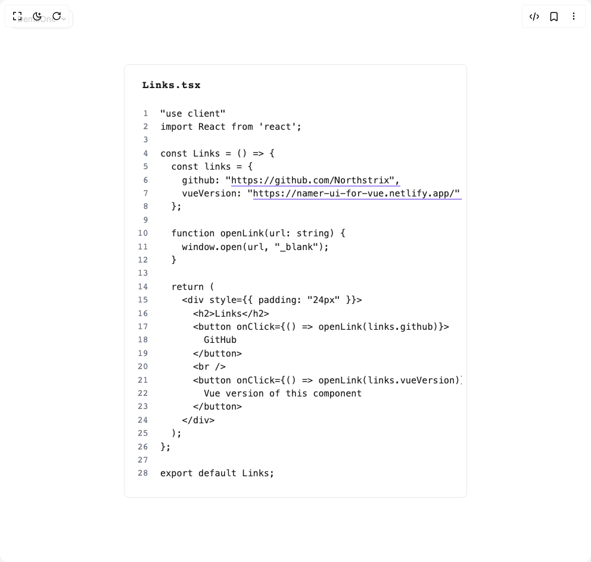

# Build Simple Code Block in BuilderStudio

> Build this component in our Agentic IDE: [BuilderStudio](https://builderstudio.dev).
>
> Join the BuilderStudio community on [Discord](https://discord.gg/QdWeSGCqfe) and [Reddit](https://reddit.com/r/builderstudio).



## Component

- Author group: `northstrix`
- Component: `simple-code-block`
- Variant: `default`
- Rendered HTML snapshot: [`rendered.html`](rendered.html)

## BuilderStudio prompt

You are implementing a React component based on a component reference.

## Component identity

- Author: Northstrix
- Component slug: simple-code-block
- Demo slug: default
- Title: simple-code-block
- Description: 

## Goal

Recreate this component in a React + TypeScript + Tailwind CSS project. Preserve the visual layout, spacing, colors, border radius, shadows, interaction behavior, animation behavior, responsive behavior, and dark mode behavior shown in the rendered demo.

## Implementation requirements

- Use React and TypeScript.
- Use Tailwind CSS classes whenever possible.
- Keep the component self-contained unless the source files require helper components.
- If the source uses CSS variables, custom CSS, animations, or keyframes, include them.
- If the source uses external packages, list and use the required packages.
- Preserve accessibility attributes, button semantics, links, keyboard behavior, and ARIA attributes when visible in the source.
- Do not replace the component with a simplified placeholder.
- Return complete production-ready code.

## Dependencies

No reference metadata available.

## Rendered DOM snapshot

This is the rendered demo HTML extracted from the live preview. Use it to verify structure, class names, visible content, and layout.

```html
<div id="root"><div class="fixed top-4 left-4 z-10"><select class="appearance-none h-8 max-w-[200px] text-sm leading-tight rounded-lg pl-3 pr-7 py-0 border bg-background focus:outline-none focus:ring-0"><option value="named_DemoOne_DemoOne">DemoOne</option></select><div class="absolute top-1/2 transform -translate-y-1/2 right-2 pointer-events-none"><svg class="w-4 h-4 fill-current" viewBox="0 0 20 20"><path d="M5.516 7.548c.436-.446 1.043-.48 1.576 0L10 10.405l2.908-2.857c.533-.48 1.14-.446 1.576 0 .436.445.408 1.197 0 1.615l-3.734 3.705c-.533.534-1.39.534-1.923 0l-3.734-3.705c-.408-.418-.436-1.17 0-1.615z"></path></svg></div></div><div class="w-screen min-h-screen flex justify-center items-center"><div style="display: flex; justify-content: center; width: 100%; margin: 0px auto; max-width: 576px;"><div class="codeblock-root" style="background: var(--simple-code-block-backgroundcolor); border-color: var(--simple-code-block-bordercolor); border-radius: 8px; border-width: 1px; border-style: solid; padding: 12px 8px; font-family: &quot;Roboto Mono&quot;, monospace;"><div class="codeblock-header" style="color: var(--simple-code-block-filenamecolor); z-index: 3; font-size: 1.1rem;"><span class="codeblock-filename" style="color: var(--simple-code-block-filenamecolor); font-size: 1.1rem;">Links.tsx</span></div><div class="codeblock-wrapper"><div class="codeblock-linenumbers-bg" style="width: calc(44px); background: var(--simple-code-block-backgroundcolor);"></div><div class="codeblock-linenumbers" aria-hidden="true" style="color: var(--simple-code-block-linenumbercolor); transform: translateX(-4px); background: var(--simple-code-block-backgroundcolor); z-index: 2; font-size: 0.95rem; line-height: 1.4rem; font-family: &quot;Roboto Mono&quot;, monospace;"><span style="display: block;">1</span><span style="display: block;">2</span><span style="display: block;">3</span><span style="display: block;">4</span><span style="display: block;">5</span><span style="display: block;">6</span><span style="display: block;">7</span><span style="display: block;">8</span><span style="display: block;">9</span><span style="display: block;">10</span><span style="display: block;">11</span><span style="display: block;">12</span><span style="display: block;">13</span><span style="display: block;">14</span><span style="display: block;">15</span><span style="display: block;">16</span><span style="display: block;">17</span><span style="display: block;">18</span><span style="display: block;">19</span><span style="display: block;">20</span><span style="display: block;">21</span><span style="display: block;">22</span><span style="display: block;">23</span><span style="display: block;">24</span><span style="display: block;">25</span><span style="display: block;">26</span><span style="display: block;">27</span><span style="display: block;">28</span></div><div class="codeblock-scrollarea"><pre class="codeblock-pre" style="background: var(--simple-code-block-backgroundcolor); color: var(--simple-code-block-codetextcolor); padding: 16px 16px 16px 52px; margin-right: 16px; font-size: 0.95rem; line-height: 1.4rem; font-family: &quot;Roboto Mono&quot;, monospace;"><code>"use client"
import React from 'react';
&nbsp;
const Links = () =&gt; {
  const links = {
    github: "<a href="https://github.com/Northstrix&quot;," target="_blank" rel="noopener noreferrer" class="codeblock-hyperlink">https://github.com/Northstrix",</a>
    vueVersion: "<a href="https://namer-ui-for-vue.netlify.app/&quot;," target="_blank" rel="noopener noreferrer" class="codeblock-hyperlink">https://namer-ui-for-vue.netlify.app/",</a>
  };
&nbsp;
  function openLink(url: string) {
    window.open(url, "_blank");
  }
&nbsp;
  return (
    &lt;div style={{ padding: "24px" }}&gt;
      &lt;h2&gt;Links&lt;/h2&gt;
      &lt;button onClick={() =&gt; openLink(links.github)}&gt;
        GitHub
      &lt;/button&gt;
      &lt;br /&gt;
      &lt;button onClick={() =&gt; openLink(links.vueVersion)}&gt;
        Vue version of this component
      &lt;/button&gt;
    &lt;/div&gt;
  );
};
&nbsp;
export default Links;</code></pre></div></div><style>
        .codeblock-root {
          width: 100%;
          box-sizing: border-box;
          overflow-x: auto;
          overflow-y: hidden;
          max-width: 100%;
          position: relative;
        }
        .codeblock-header {
          display: flex;
          align-items: center;
          justify-content: flex-start;
          padding: 8px 22px;
        }
        .codeblock-filename {
          font-weight: 600;
          letter-spacing: 0.02em;
        }
        .codeblock-wrapper {
          display: flex;
          position: relative;
          width: 100%;
        }
        .codeblock-linenumbers-bg {
          position: absolute;
          left: 0;
          top: 0;
          bottom: 0;
          z-index: 1;
          pointer-events: none;
          user-select: none;
        }
        .codeblock-linenumbers {
          user-select: none;
          pointer-events: none;
          text-align: right;
          padding: 16px 12px 16px 0;
          min-width: 48px;
          position: absolute;
          left: 0;
          top: 0;
          height: 100%;
          overflow: hidden;
        }
        .codeblock-scrollarea {
          width: 100%;
          overflow-x: hidden;
          overflow-y: hidden;
        }
        .codeblock-pre {
          margin: 0;
          border-radius: 0 0 10px 10px;
          overflow-x: hidden;
          overflow-y: hidden;
          box-sizing: border-box;
          width: 100%;
          max-width: 100%;
        }
        .codeblock-pre code {
          display: block;
          white-space: pre;
          position: relative;
        }
        .codeblock-hyperlink {
          color: inherit;
          text-decoration: none;
          border-bottom: 1px solid var(--simple-code-block-hyperlinkunderlinecolor);
          cursor: pointer;
        }
        .codeblock-hyperlink:hover {
          border-bottom: 2px solid var(--simple-code-block-hyperlinkunderlinecolor);
        }
      </style></div></div></div></div>
```

## Reference source files

No reference source files were available.
