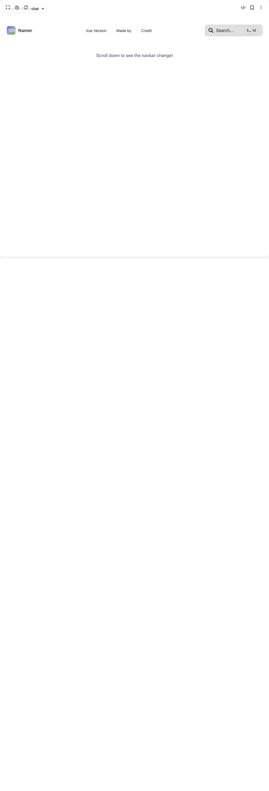

# Build Truncating Navbar in BuilderStudio

> Build this component in our Agentic IDE: [BuilderStudio](https://builderstudio.dev).
>
> Join the BuilderStudio community on [Discord](https://discord.gg/QdWeSGCqfe) and [Reddit](https://reddit.com/r/builderstudio).



## Component

- Author group: `northstrix`
- Component: `truncating-navbar`
- Variant: `default`
- Rendered HTML snapshot: [`rendered.html`](rendered.html)

## BuilderStudio prompt

You are implementing a React component based on a component reference.

## Component identity

- Author: Northstrix
- Component slug: truncating-navbar
- Demo slug: default
- Title: truncating-navbar
- Description: 

## Goal

Recreate this component in a React + TypeScript + Tailwind CSS project. Preserve the visual layout, spacing, colors, border radius, shadows, interaction behavior, animation behavior, responsive behavior, and dark mode behavior shown in the rendered demo.

## Implementation requirements

- Use React and TypeScript.
- Use Tailwind CSS classes whenever possible.
- Keep the component self-contained unless the source files require helper components.
- If the source uses CSS variables, custom CSS, animations, or keyframes, include them.
- If the source uses external packages, list and use the required packages.
- Preserve accessibility attributes, button semantics, links, keyboard behavior, and ARIA attributes when visible in the source.
- Do not replace the component with a simplified placeholder.
- Return complete production-ready code.

## Dependencies

No reference metadata available.

## Rendered DOM snapshot

This is the rendered demo HTML extracted from the live preview. Use it to verify structure, class names, visible content, and layout.

```html
<div id="root"><div class="fixed top-4 left-4 z-10"><select class="appearance-none h-8 max-w-[200px] text-sm leading-tight rounded-lg pl-3 pr-7 py-0 border bg-background focus:outline-none focus:ring-0"><option value="named_TruncatingNavbar_TruncatingNavbar">TruncatingNavbar</option></select><div class="absolute top-1/2 transform -translate-y-1/2 right-2 pointer-events-none"><svg class="w-4 h-4 fill-current" viewBox="0 0 20 20"><path d="M5.516 7.548c.436-.446 1.043-.48 1.576 0L10 10.405l2.908-2.857c.533-.48 1.14-.446 1.576 0 .436.445.408 1.197 0 1.615l-3.734 3.705c-.533.534-1.39.534-1.923 0l-3.734-3.705c-.408-.418-.436-1.17 0-1.615z"></path></svg></div></div><div class="w-screen min-h-screen flex justify-center items-center"><div class="w-full min-h-[300vh] px-6 mt-20"><nav class="resizable-navbar" style="background: transparent; border: 1px solid transparent; border-radius: 0px; height: 64px; top: 0px; margin-top: 0px; padding-left: 0px; padding-right: 0px; box-shadow: none; transition: 0.2s cubic-bezier(0.4, 0, 0.2, 1); z-index: 1; position: sticky; display: flex; align-items: center; justify-content: space-between; width: 100%; box-sizing: border-box; min-width: 0px; left: 0px; right: 0px;"><a class="navbar-logo" href="https://namer-ui.netlify.app/"><span class="app-name">Namer</span></a><div class="nav-items"><a href="https://namer-ui-for-vue.netlify.app" target="_blank" rel="noopener noreferrer" class="nav-link"><span class="nav-link-text" style="font-size: 0.875rem;">Vue Version</span></a><a href="https://maxim-bortnikov.netlify.app/" target="_blank" rel="noopener noreferrer" class="nav-link"><span class="nav-link-text" style="font-size: 0.875rem;">Made by</span></a><a href="https://ui.aceternity.com/components/resizable-navbar" target="_blank" rel="noopener noreferrer" class="nav-link"><span class="nav-link-text" style="font-size: 0.875rem;">Credit</span></a></div><button class="navbar-search-btn" type="button" style="outline: 1px solid var(--truncating-navbar-search-outline); font-size: 1rem; background: var(--truncating-navbar-search-bg); color: var(--truncating-navbar-search-text);"><svg stroke="currentColor" fill="currentColor" stroke-width="0" viewBox="0 0 512 512" color="var(--truncating-navbar-text)" height="18" width="18" xmlns="http://www.w3.org/2000/svg" style="color: var(--truncating-navbar-text);"><path d="M505 442.7L405.3 343c-4.5-4.5-10.6-7-17-7H372c27.6-35.3 44-79.7 44-128C416 93.1 322.9 0 208 0S0 93.1 0 208s93.1 208 208 208c48.3 0 92.7-16.4 128-44v16.3c0 6.4 2.5 12.5 7 17l99.7 99.7c9.4 9.4 24.6 9.4 33.9 0l28.3-28.3c9.4-9.4 9.4-24.6.1-34zM208 336c-70.7 0-128-57.2-128-128 0-70.7 57.2-128 128-128 70.7 0 128 57.2 128 128 0 70.7-57.2 128-128 128z"></path></svg><span class="search-placeholder">Search...</span><span class="search-shortcut" style="outline: 1px solid var(--truncating-navbar-search-outline); background: var(--truncating-navbar-search-bg);"><svg stroke="currentColor" fill="currentColor" stroke-width="0" viewBox="0 0 640 512" color="var(--truncating-navbar-text)" height="16" width="16" xmlns="http://www.w3.org/2000/svg" style="color: var(--truncating-navbar-text);"><path d="M257.981 272.971L63.638 467.314c-9.373 9.373-24.569 9.373-33.941 0L7.029 444.647c-9.357-9.357-9.375-24.522-.04-33.901L161.011 256 6.99 101.255c-9.335-9.379-9.317-24.544.04-33.901l22.667-22.667c9.373-9.373 24.569-9.373 33.941 0L257.981 239.03c9.373 9.372 9.373 24.568 0 33.941zM640 456v-32c0-13.255-10.745-24-24-24H312c-13.255 0-24 10.745-24 24v32c0 13.255 10.745 24 24 24h304c13.255 0 24-10.745 24-24z"></path></svg><span>M</span></span></button></nav><style>
        .resizable-navbar {
          display: flex;
          align-items: center;
          justify-content: space-between;
          width: 100%;
          background: transparent;
          border-bottom: 1px solid transparent;
          box-sizing: border-box;
          min-width: 0;
          left: 0;
          right: 0;
          transition: all 0.2s cubic-bezier(0.4, 0, 0.2, 1);
        }
        .navbar-logo {
          display: flex;
          align-items: center;
          gap: 10px;
          text-decoration: none;
          color: var(--truncating-navbar-logo-text);
          font-weight: 600;
          font-size: 1.2rem;
          letter-spacing: 0.02em;
          transition: color 0.2s;
        }
        .navbar-logo:hover {
          color: var(--truncating-navbar-logo-text-hover);
        }
        .app-name {
          font-size: 1rem;
          font-weight: 600;
          letter-spacing: 0.02em;
          color: var(--truncating-navbar-logo-text);
          transition: color 0.2s;
        }
        .nav-items {
          display: flex;
          flex: 1 1 0;
          justify-content: center;
          transition: gap 0.2s;
        }
        .nav-link {
          color: var(--truncating-navbar-text);
          text-decoration: none;
          font-size: 1rem;
          padding: 8px 18px;
          border-radius: 6px;
          position: relative;
          overflow: hidden;
          text-overflow: ellipsis;
          white-space: nowrap;
          display: flex;
          align-items: center;
          transition: color 0.3s, background 0.3s, font-size 0.2s;
        }
        .nav-link:hover {
          background: var(--truncating-navbar-bg-hover);
          color: var(--truncating-navbar-text-hover);
        }
        .nav-link .nav-link-text {
          width: 100%;
          overflow: hidden;
          text-overflow: ellipsis;
          white-space: nowrap;
          transition: font-size 0.2s;
        }
        .navbar-search-btn {
          display: flex;
          align-items: center;
          gap: 10px;
          background: var(--truncating-navbar-search-bg);
          color: var(--truncating-navbar-search-text);
          border-radius: 8px;
          border: none;
          outline: 1px solid var(--truncating-navbar-search-outline);
          padding: 7px 16px 7px 12px;
          font-size: 1rem;
          cursor: pointer;
          min-width: 210px;
          transition: outline 0.2s, background 0.2s, color 0.2s;
          margin-left: auto;
        }
        .navbar-search-btn:hover {
          background: var(--truncating-navbar-search-bg-hover);
          color: var(--truncating-navbar-search-text-hover);
        }
        .navbar-search-btn:active,
        .navbar-search-btn:focus {
          outline-width: 2px;
        }
        .search-placeholder {
          flex: 1;
          text-align: left;
          color: var(--truncating-navbar-text);
          transition: color 0.3s;
          cursor: pointer;
        }
        .search-placeholder.hovered {
          color: var(--truncating-navbar-text-hover);
        }
        .search-shortcut {
          display: flex;
          align-items: center;
          gap: 2px;
          margin-left: 10px;
          font-size: 14.4px;
          border-radius: 8px;
          padding: 2px 7px;
          outline: 1px solid var(--truncating-navbar-search-outline);
          background: var(--truncating-navbar-search-bg);
          transition: outline 0.2s, background 0.2s;
        }
        .search-shortcut svg {
          border-radius: 6px;
          margin-right: 2px;
        }
        .search-shortcut span:last-child {
          color: var(--truncating-navbar-search-text);
          margin-left: 2px;
        }
        .mobile-nav-toggle {
          display: none;
        }
        @media (max-width: 909px) {
          .nav-items {
            display: none !important;
          }
          .navbar-search-btn {
            display: none !important;
          }
          .mobile-nav-toggle {
            display: block;
            margin-left: 0;
            font-size: 2rem;
            color: var(--truncating-navbar-logo-text);
            background: none;
            border: none;
            cursor: pointer;
            padding: 0;
            transition: color 0.2s;
          }
        }
        .mobile-nav-overlay {
          position: fixed;
          inset: 0;
          z-index: 2000;
          background: var(--truncating-navbar-bg-mobile-menu);
          display: flex;
          align-items: flex-start;
          justify-content: center;
          transition: background 0.2s;
        }
        .mobile-nav-menu {
          width: 100vw;
          min-height: 100vh;
          display: flex;
          flex-direction: column;
          gap: 2rem;
          padding: 18px 23px 23px 23px;
          z-index: 100;
          animation: fade-in 0.2s;
          background: var(--truncating-navbar-bg-mobile-menu);
          color: var(--truncating-navbar-mobile-menu-text);
        }
        .mobile-nav-header {
          display: flex;
          align-items: center;
          justify-content: space-between;
          margin-bottom: 2rem;
        }
        .mobile-nav-close {
          background: none;
          border: none;
          color: var(--truncating-navbar-mobile-menu-text);
          cursor: pointer;
          padding: 0 2px;
          transition: color 0.2s;
          display: flex;
          align-items: center;
        }
        .mobile-nav-close:hover {
          color: var(--truncating-navbar-mobile-menu-text-hover);
        }
        .mobile-nav-links {
          display: flex;
          flex-direction: column;
          gap: 1rem;
        }
        .mobile-nav-link {
          padding: 10px;
          border-radius: 6px;
          background: transparent;
          cursor: pointer;
          transition: background 0.15s;
          display: flex;
          flex-direction: column;
          gap: 2px;
          color: var(--truncating-navbar-mobile-menu-text);
          font-size: 1.1rem;
          text-decoration: none;
        }
        .mobile-nav-link:hover {
          background: var(--truncating-navbar-mobile-menu-bg-hover);
          color: var(--truncating-navbar-mobile-menu-text-hover);
        }
        .navbar-search-btn.mobile {
          display: flex !important;
          width: 100%;
          margin-top: 10px;
        }
        .fade-enter-active,
        .fade-leave-active {
          transition: opacity 0.2s;
        }
        .fade-enter-from,
        .fade-leave-to {
          opacity: 0;
        }
      </style><div class="mt-12 w-full text-center text-base text-gray-500 font-medium">Scroll down to see the navbar change!</div></div></div></div>
```

## Reference source files

No reference source files were available.
