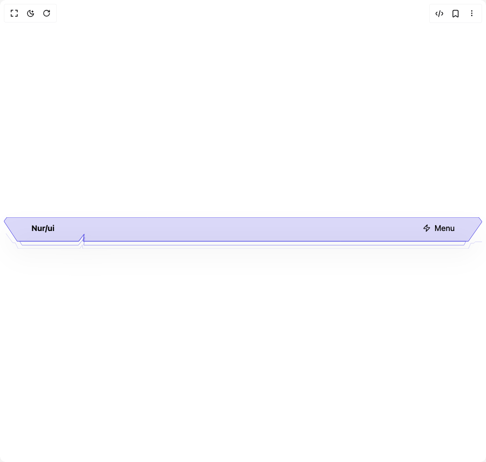
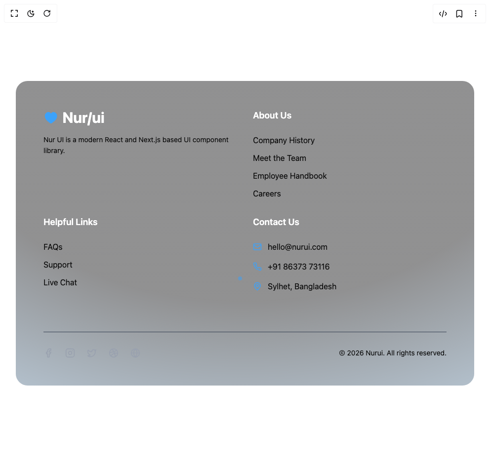

# Nurui Components

5 components are available in this author group.

> Build any component in [BuilderStudio](https://builderstudio.dev), then share improvements with the community on [Discord](https://discord.gg/QdWeSGCqfe) or [Reddit](https://reddit.com/r/builderstudio).

| Preview | Component | Variant |
| --- | --- | --- |
|  | [Banner](banner/default/README.md) | `default` |
|  | [Counter Loader](counter-loader/default/README.md) | `default` |
|  | [Future Navbar](future-navbar/default/README.md) | `default` |
|  | [Hover Footer](hover-footer/default/README.md) | `default` |
|  | [Tech Curosr](tech-curosr/default/README.md) | `default` |
