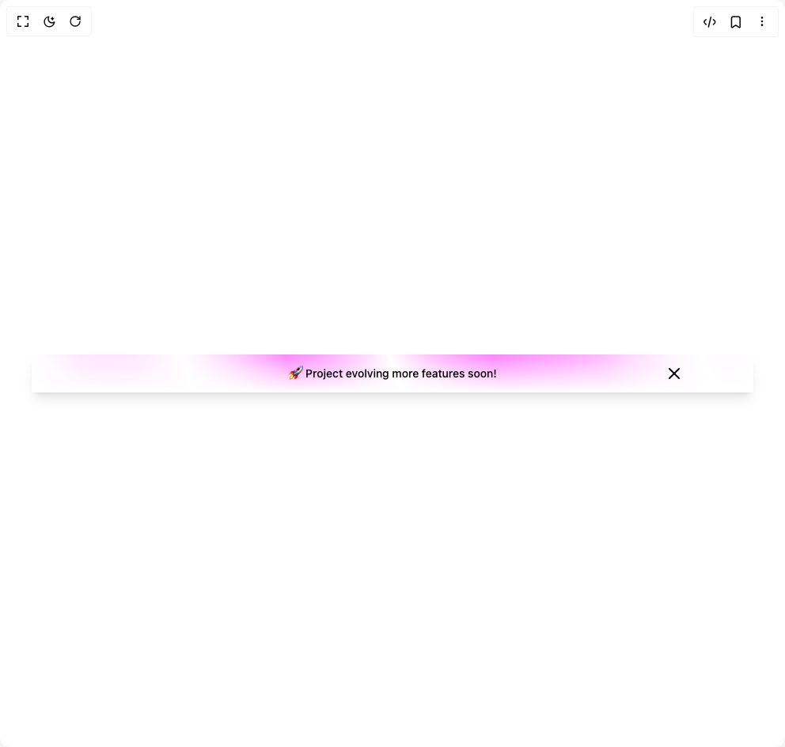

# Build Banner in BuilderStudio

> Build this component in our Agentic IDE: [BuilderStudio](https://builderstudio.dev).
>
> Join the BuilderStudio community on [Discord](https://discord.gg/QdWeSGCqfe) and [Reddit](https://reddit.com/r/builderstudio).



## Component

- Author group: `nurui`
- Component: `banner`
- Variant: `default`
- Rendered HTML snapshot: [`rendered.html`](rendered.html)

## BuilderStudio prompt

You are implementing a React component based on a component reference.

## Component identity

- Author: nurui
- Component slug: banner
- Demo slug: default
- Title: banner
- Description: 

## Goal

Recreate this component in a React + TypeScript + Tailwind CSS project. Preserve the visual layout, spacing, colors, border radius, shadows, interaction behavior, animation behavior, responsive behavior, and dark mode behavior shown in the rendered demo.

## Implementation requirements

- Use React and TypeScript.
- Use Tailwind CSS classes whenever possible.
- Keep the component self-contained unless the source files require helper components.
- If the source uses CSS variables, custom CSS, animations, or keyframes, include them.
- If the source uses external packages, list and use the required packages.
- Preserve accessibility attributes, button semantics, links, keyboard behavior, and ARIA attributes when visible in the source.
- Do not replace the component with a simplified placeholder.
- Return complete production-ready code.

## Dependencies

No reference metadata available.

## Rendered DOM snapshot

This is the rendered demo HTML extracted from the live preview. Use it to verify structure, class names, visible content, and layout.

```html
<div id="root"><div class="w-screen min-h-screen flex justify-center items-center"><div class="w-screen min-h-screen flex justify-center items-center"><div class="p-10 w-full"><div id="banner-id" class="sticky top-0 z-40 flex flex-row items-center justify-center px-4 text-center text-sm font-medium shadow-lg bg-white dark:bg-transparent" style="height: 3rem;"><style>:root:not(.nd-banner-banner-id) { --fd-banner-height: 3rem; }</style><style>.nd-banner-banner-id #banner-id { display: none; }</style><script>if (localStorage.getItem('nd-banner-banner-id') === 'true') document.documentElement.classList.add('nd-banner-banner-id');</script><div class="absolute inset-0 z-[-1]" style="mask-image: linear-gradient(white, transparent), radial-gradient(circle at center top, white, transparent); mask-composite: intersect; animation: 20s linear 0s infinite normal none running fd-moving-banner; background-image: repeating-linear-gradient(70deg, rgba(231, 77, 255, 0.77) 0%, rgba(231, 77, 255, 0.77) 7.14286%, transparent 14.2857%, rgba(231, 77, 255, 0.77) 21.4286%, transparent 28.5714%, rgba(231, 77, 255, 0.77) 35.7143%, transparent 42.8571%, rgba(231, 77, 255, 0.77) 50%); background-size: 200% 100%; filter: saturate(2);"></div><style>@keyframes fd-moving-banner {
            from { background-position: 0% 0;  }
            to { background-position: 100% 0;  }
         }</style>🚀 Project evolving more features soon!<button type="button" aria-label="Close Banner" class="inline-flex items-center justify-center whitespace-nowrap rounded-md text-sm font-medium ring-offset-background transition-colors focus-visible:outline-none focus-visible:ring-2 focus-visible:ring-ring focus-visible:ring-offset-2 disabled:pointer-events-none disabled:opacity-50 hover:bg-accent hover:text-accent-foreground h-10 w-10 absolute cursor-pointer end-2 md:end-20 top-1/2 -translate-y-1/2 text-fd-muted-foreground/50"><svg xmlns="http://www.w3.org/2000/svg" width="24" height="24" viewBox="0 0 24 24" fill="none" stroke="currentColor" stroke-width="2" stroke-linecap="round" stroke-linejoin="round" class="lucide lucide-x" aria-hidden="true"><path d="M18 6 6 18"></path><path d="m6 6 12 12"></path></svg></button></div></div></div></div></div>
```

## Reference source files

No reference source files were available.
