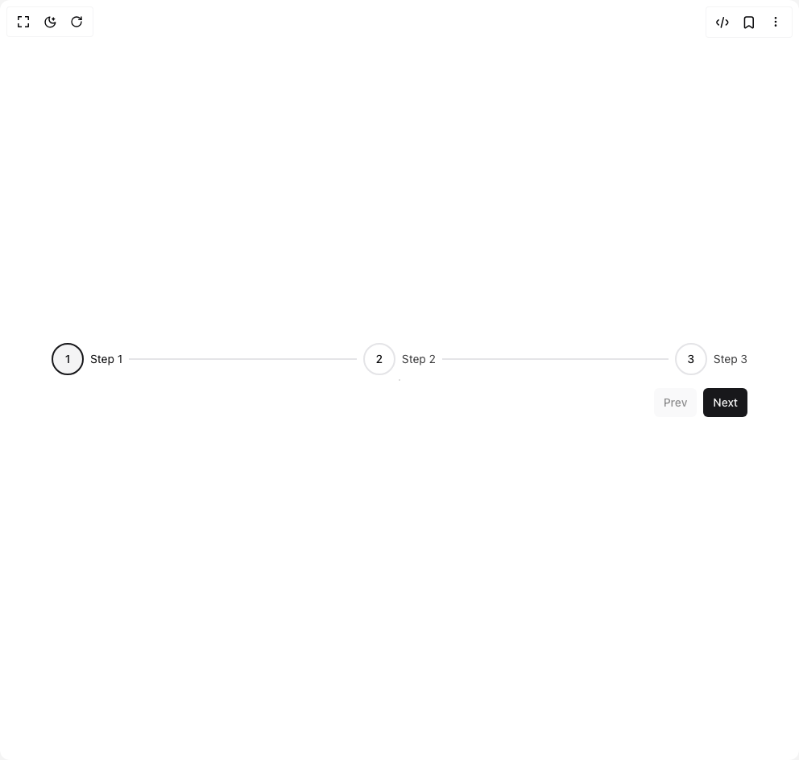

# Build Stepper in BuilderStudio

> Build this component in our Agentic IDE: [BuilderStudio](https://builderstudio.dev).
>
> Join the BuilderStudio community on [Discord](https://discord.gg/QdWeSGCqfe) and [Reddit](https://reddit.com/r/builderstudio).



## Component

- Author group: `nyxbui`
- Component: `stepper`
- Variant: `default`
- Rendered HTML snapshot: [`rendered.html`](rendered.html)

## BuilderStudio prompt

You are implementing a React component based on a component reference.

## Component identity

- Author: nyxbui
- Component slug: stepper
- Demo slug: default
- Title: stepper
- Description: 

## Goal

Recreate this component in a React + TypeScript + Tailwind CSS project. Preserve the visual layout, spacing, colors, border radius, shadows, interaction behavior, animation behavior, responsive behavior, and dark mode behavior shown in the rendered demo.

## Implementation requirements

- Use React and TypeScript.
- Use Tailwind CSS classes whenever possible.
- Keep the component self-contained unless the source files require helper components.
- If the source uses CSS variables, custom CSS, animations, or keyframes, include them.
- If the source uses external packages, list and use the required packages.
- Preserve accessibility attributes, button semantics, links, keyboard behavior, and ARIA attributes when visible in the source.
- Do not replace the component with a simplified placeholder.
- Return complete production-ready code.

## Dependencies

No reference metadata available.

## Rendered DOM snapshot

This is the rendered demo HTML extracted from the live preview. Use it to verify structure, class names, visible content, and layout.

```html
<div id="root"><div class="relative flex items-center justify-center h-screen w-full m-auto p-16 bg-background text-foreground"><div class="absolute lab-bg inset-0 size-full"><div class="absolute inset-0 bg-[radial-gradient(#00000021_1px,transparent_1px)] dark:bg-[radial-gradient(#ffffff22_1px,transparent_1px)]"></div></div><div class="flex w-full justify-center relative"><div class="flex w-full flex-col gap-4"><div class="stepper__main-container flex w-full flex-wrap justify-between flex-row" style="--step-icon-size: 40px; --step-gap: 8px;"><div aria-disabled="false" class="stepper__horizontal-step relative flex items-center transition-all duration-200 [&amp;:not(:last-child)]:flex-1 [&amp;:not(:last-child)]:after:transition-all [&amp;:not(:last-child)]:after:duration-200 [&amp;:not(:last-child)]:after:bg-border [&amp;:not(:last-child)]:after:h-[2px] [&amp;:not(:last-child)]:after:content-[''] data-[completed=true]:[&amp;:not(:last-child)]:after:bg-primary data-[invalid=true]:[&amp;:not(:last-child)]:after:bg-destructive [&amp;:not(:last-child)]:after:me-[var(--step-gap)] [&amp;:not(:last-child)]:after:ms-[var(--step-gap)] [&amp;:not(:last-child)]:after:flex-1" data-completed="false" data-active="false" data-invalid="false" data-clickable="false"><div class="stepper__horizontal-step-container flex items-center"><button class="whitespace-nowrap text-sm font-medium ring-offset-background transition-colors focus-visible:outline-none focus-visible:ring-2 focus-visible:ring-ring focus-visible:ring-offset-2 disabled:pointer-events-none disabled:opacity-50 hover:bg-accent hover:text-accent-foreground stepper__step-button-container pointer-events-none p-0 size-[var(--step-icon-size)] flex items-center justify-center rounded-full border-2 data-[clickable=true]:pointer-events-auto data-[active=true]:bg-primary data-[active=true]:border-primary data-[active=true]:text-primary-foreground data-[current=true]:border-primary data-[current=true]:bg-secondary data-[invalid=true]:bg-destructive data-[invalid=true]:border-destructive data-[invalid=true]:text-destructive-foreground" tabindex="-1" aria-current="step" data-current="true" data-invalid="false" data-active="false" data-clickable="false" data-loading="false"><span class="text-md text-center font-medium">1</span></button><div aria-current="step" class="stepper__step-label-container flex flex-col ms-2" style="opacity: 1;"><span class="stepper__step-label text-sm">Step 1</span></div></div></div><div aria-disabled="true" class="stepper__horizontal-step relative flex items-center transition-all duration-200 [&amp;:not(:last-child)]:flex-1 [&amp;:not(:last-child)]:after:transition-all [&amp;:not(:last-child)]:after:duration-200 [&amp;:not(:last-child)]:after:bg-border [&amp;:not(:last-child)]:after:h-[2px] [&amp;:not(:last-child)]:after:content-[''] data-[completed=true]:[&amp;:not(:last-child)]:after:bg-primary data-[invalid=true]:[&amp;:not(:last-child)]:after:bg-destructive [&amp;:not(:last-child)]:after:me-[var(--step-gap)] [&amp;:not(:last-child)]:after:ms-[var(--step-gap)] [&amp;:not(:last-child)]:after:flex-1" data-completed="false" data-active="false" data-invalid="false" data-clickable="false"><div class="stepper__horizontal-step-container flex items-center"><button class="whitespace-nowrap text-sm font-medium ring-offset-background transition-colors focus-visible:outline-none focus-visible:ring-2 focus-visible:ring-ring focus-visible:ring-offset-2 disabled:pointer-events-none disabled:opacity-50 hover:bg-accent hover:text-accent-foreground stepper__step-button-container pointer-events-none p-0 size-[var(--step-icon-size)] flex items-center justify-center rounded-full border-2 data-[clickable=true]:pointer-events-auto data-[active=true]:bg-primary data-[active=true]:border-primary data-[active=true]:text-primary-foreground data-[current=true]:border-primary data-[current=true]:bg-secondary data-[invalid=true]:bg-destructive data-[invalid=true]:border-destructive data-[invalid=true]:text-destructive-foreground" tabindex="-1" data-current="false" data-invalid="false" data-active="false" data-clickable="false" data-loading="false"><span class="text-md text-center font-medium">2</span></button><div class="stepper__step-label-container flex flex-col ms-2" style="opacity: 0.8;"><span class="stepper__step-label text-sm">Step 2</span></div></div></div><div aria-disabled="true" class="stepper__horizontal-step relative flex items-center transition-all duration-200 [&amp;:not(:last-child)]:flex-1 [&amp;:not(:last-child)]:after:transition-all [&amp;:not(:last-child)]:after:duration-200 [&amp;:not(:last-child)]:after:bg-border [&amp;:not(:last-child)]:after:h-[2px] [&amp;:not(:last-child)]:after:content-[''] data-[completed=true]:[&amp;:not(:last-child)]:after:bg-primary data-[invalid=true]:[&amp;:not(:last-child)]:after:bg-destructive [&amp;:not(:last-child)]:after:me-[var(--step-gap)] [&amp;:not(:last-child)]:after:ms-[var(--step-gap)] [&amp;:not(:last-child)]:after:flex-1" data-completed="false" data-active="false" data-invalid="false" data-clickable="false"><div class="stepper__horizontal-step-container flex items-center"><button class="whitespace-nowrap text-sm font-medium ring-offset-background transition-colors focus-visible:outline-none focus-visible:ring-2 focus-visible:ring-ring focus-visible:ring-offset-2 disabled:pointer-events-none disabled:opacity-50 hover:bg-accent hover:text-accent-foreground stepper__step-button-container pointer-events-none p-0 size-[var(--step-icon-size)] flex items-center justify-center rounded-full border-2 data-[clickable=true]:pointer-events-auto data-[active=true]:bg-primary data-[active=true]:border-primary data-[active=true]:text-primary-foreground data-[current=true]:border-primary data-[current=true]:bg-secondary data-[invalid=true]:bg-destructive data-[invalid=true]:border-destructive data-[invalid=true]:text-destructive-foreground" tabindex="-1" data-current="false" data-invalid="false" data-active="false" data-clickable="false" data-loading="false"><span class="text-md text-center font-medium">3</span></button><div class="stepper__step-label-container flex flex-col ms-2" style="opacity: 0.8;"><span class="stepper__step-label text-sm">Step 3</span></div></div></div></div><div class="flex w-full justify-end gap-2"><button class="inline-flex items-center justify-center whitespace-nowrap text-sm font-medium ring-offset-background transition-colors focus-visible:outline-none focus-visible:ring-2 focus-visible:ring-ring focus-visible:ring-offset-2 disabled:pointer-events-none disabled:opacity-50 bg-secondary text-secondary-foreground hover:bg-secondary/80 h-9 rounded-md px-3" disabled="">Prev</button><button class="inline-flex items-center justify-center whitespace-nowrap text-sm font-medium ring-offset-background transition-colors focus-visible:outline-none focus-visible:ring-2 focus-visible:ring-ring focus-visible:ring-offset-2 disabled:pointer-events-none disabled:opacity-50 bg-primary text-primary-foreground hover:bg-primary/90 h-9 rounded-md px-3">Next</button></div></div></div></div></div>
```

## Reference source files

No reference source files were available.
