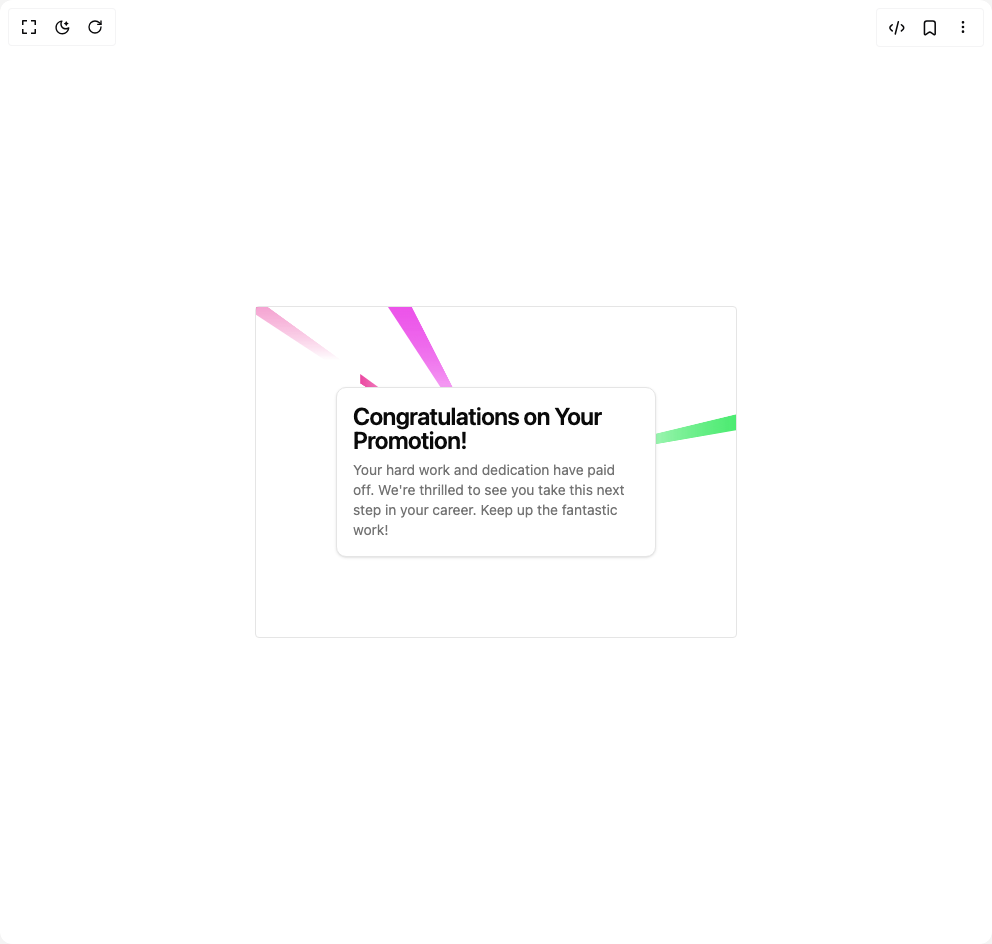

# Build Warp Background in BuilderStudio

> Build this component in our Agentic IDE: [BuilderStudio](https://builderstudio.dev).
>
> Join the BuilderStudio community on [Discord](https://discord.gg/QdWeSGCqfe) and [Reddit](https://reddit.com/r/builderstudio).



## Component

- Author group: `nyxbui`
- Component: `warp-background`
- Variant: `default`
- Rendered HTML snapshot: [`rendered.html`](rendered.html)

## BuilderStudio prompt

You are implementing a React component based on a component reference.

## Component identity

- Author: nyxbui
- Component slug: warp-background
- Demo slug: default
- Title: warp-background
- Description: 

## Goal

Recreate this component in a React + TypeScript + Tailwind CSS project. Preserve the visual layout, spacing, colors, border radius, shadows, interaction behavior, animation behavior, responsive behavior, and dark mode behavior shown in the rendered demo.

## Implementation requirements

- Use React and TypeScript.
- Use Tailwind CSS classes whenever possible.
- Keep the component self-contained unless the source files require helper components.
- If the source uses CSS variables, custom CSS, animations, or keyframes, include them.
- If the source uses external packages, list and use the required packages.
- Preserve accessibility attributes, button semantics, links, keyboard behavior, and ARIA attributes when visible in the source.
- Do not replace the component with a simplified placeholder.
- Return complete production-ready code.

## Dependencies

No reference metadata available.

## Rendered DOM snapshot

This is the rendered demo HTML extracted from the live preview. Use it to verify structure, class names, visible content, and layout.

```html
<div id="root"><div class="w-screen min-h-screen flex justify-center items-center"><div class="w-screen min-h-screen flex justify-center items-center"><div class="flex w-full min-h-screen justify-center items-center bg-background p-4"><div class="relative rounded border p-20"><div class="pointer-events-none absolute left-0 top-0 size-full overflow-hidden [clip-path:inset(0)] [container-type:size] [perspective:var(--perspective)] [transform-style:preserve-3d]" style="--perspective: 100px; --grid-color: hsl(var(--border)); --beam-size: 5%;"><div class="absolute [transform-style:preserve-3d] [background-size:var(--beam-size)_var(--beam-size)] [background:linear-gradient(var(--grid-color)_0_1px,_transparent_1px_var(--beam-size))_50%_-0.5px_/var(--beam-size)_var(--beam-size),linear-gradient(90deg,_var(--grid-color)_0_1px,_transparent_1px_var(--beam-size))_50%_50%_/var(--beam-size)_var(--beam-size)] [container-type:inline-size] [height:100cqmax] [transform-origin:50%_0%] [transform:rotateX(-90deg)] [width:100cqi]"><div class="absolute left-[var(--x)] top-0 [aspect-ratio:1/var(--aspect-ratio)] [background:var(--background)] [width:var(--width)]" style="--x: 0%; --width: 5%; --aspect-ratio: 4; --background: linear-gradient(hsl(326 80% 60%), transparent); transform: translateX(-50%) translateY(-42.3442px);"></div><div class="absolute left-[var(--x)] top-0 [aspect-ratio:1/var(--aspect-ratio)] [background:var(--background)] [width:var(--width)]" style="--x: 30%; --width: 5%; --aspect-ratio: 10; --background: linear-gradient(hsl(301 80% 60%), transparent); transform: translateX(-50%) translateY(-7.20395px);"></div><div class="absolute left-[var(--x)] top-0 [aspect-ratio:1/var(--aspect-ratio)] [background:var(--background)] [width:var(--width)]" style="--x: 65%; --width: 5%; --aspect-ratio: 2; --background: linear-gradient(hsl(185 80% 60%), transparent); transform: translateX(-50%) translateY(358.661px);"></div></div><div class="absolute top-full [transform-style:preserve-3d] [background-size:var(--beam-size)_var(--beam-size)] [background:linear-gradient(var(--grid-color)_0_1px,_transparent_1px_var(--beam-size))_50%_-0.5px_/var(--beam-size)_var(--beam-size),linear-gradient(90deg,_var(--grid-color)_0_1px,_transparent_1px_var(--beam-size))_50%_50%_/var(--beam-size)_var(--beam-size)] [container-type:inline-size] [height:100cqmax] [transform-origin:50%_0%] [transform:rotateX(-90deg)] [width:100cqi]"><div class="absolute left-[var(--x)] top-0 [aspect-ratio:1/var(--aspect-ratio)] [background:var(--background)] [width:var(--width)]" style="--x: 0%; --width: 5%; --aspect-ratio: 1; --background: linear-gradient(hsl(130 80% 60%), transparent); transform: translateX(-50%) translateY(294.93px);"></div><div class="absolute left-[var(--x)] top-0 [aspect-ratio:1/var(--aspect-ratio)] [background:var(--background)] [width:var(--width)]" style="--x: 30%; --width: 5%; --aspect-ratio: 9; --background: linear-gradient(hsl(226 80% 60%), transparent); transform: translateX(-50%) translateY(281.364px);"></div><div class="absolute left-[var(--x)] top-0 [aspect-ratio:1/var(--aspect-ratio)] [background:var(--background)] [width:var(--width)]" style="--x: 65%; --width: 5%; --aspect-ratio: 10; --background: linear-gradient(hsl(63 80% 60%), transparent); transform: translateX(-50%) translateY(389.874px);"></div></div><div class="absolute left-0 top-0 [transform-style:preserve-3d] [background-size:var(--beam-size)_var(--beam-size)] [background:linear-gradient(var(--grid-color)_0_1px,_transparent_1px_var(--beam-size))_50%_-0.5px_/var(--beam-size)_var(--beam-size),linear-gradient(90deg,_var(--grid-color)_0_1px,_transparent_1px_var(--beam-size))_50%_50%_/var(--beam-size)_var(--beam-size)] [container-type:inline-size] [height:100cqmax] [transform-origin:0%_0%] [transform:rotate(90deg)_rotateX(-90deg)] [width:100cqh]"><div class="absolute left-[var(--x)] top-0 [aspect-ratio:1/var(--aspect-ratio)] [background:var(--background)] [width:var(--width)]" style="--x: 0%; --width: 5%; --aspect-ratio: 6; --background: linear-gradient(hsl(327 80% 60%), transparent); transform: translateX(-50%) translateY(81.3171px);"></div><div class="absolute left-[var(--x)] top-0 [aspect-ratio:1/var(--aspect-ratio)] [background:var(--background)] [width:var(--width)]" style="--x: 30%; --width: 5%; --aspect-ratio: 1; --background: linear-gradient(hsl(8 80% 60%), transparent); transform: translateX(-50%) translateY(276.967px);"></div><div class="absolute left-[var(--x)] top-0 [aspect-ratio:1/var(--aspect-ratio)] [background:var(--background)] [width:var(--width)]" style="--x: 65%; --width: 5%; --aspect-ratio: 4; --background: linear-gradient(hsl(232 80% 60%), transparent); transform: translateX(-50%) translateY(315.202px);"></div></div><div class="absolute right-0 top-0 [transform-style:preserve-3d] [background-size:var(--beam-size)_var(--beam-size)] [background:linear-gradient(var(--grid-color)_0_1px,_transparent_1px_var(--beam-size))_50%_-0.5px_/var(--beam-size)_var(--beam-size),linear-gradient(90deg,_var(--grid-color)_0_1px,_transparent_1px_var(--beam-size))_50%_50%_/var(--beam-size)_var(--beam-size)] [container-type:inline-size] [height:100cqmax] [width:100cqh] [transform-origin:100%_0%] [transform:rotate(-90deg)_rotateX(-90deg)]"><div class="absolute left-[var(--x)] top-0 [aspect-ratio:1/var(--aspect-ratio)] [background:var(--background)] [width:var(--width)]" style="--x: 0%; --width: 5%; --aspect-ratio: 1; --background: linear-gradient(hsl(59 80% 60%), transparent); transform: translateX(-50%) translateY(129.676px);"></div><div class="absolute left-[var(--x)] top-0 [aspect-ratio:1/var(--aspect-ratio)] [background:var(--background)] [width:var(--width)]" style="--x: 30%; --width: 5%; --aspect-ratio: 1; --background: linear-gradient(hsl(316 80% 60%), transparent); transform: translateX(-50%) translateY(296.737px);"></div><div class="absolute left-[var(--x)] top-0 [aspect-ratio:1/var(--aspect-ratio)] [background:var(--background)] [width:var(--width)]" style="--x: 65%; --width: 5%; --aspect-ratio: 7; --background: linear-gradient(hsl(134 80% 60%), transparent); transform: translateX(-50%) translateY(1.77206px);"></div></div></div><div class="relative"><div class="rounded-lg border bg-card text-card-foreground shadow-sm w-80"><div class="flex flex-col gap-2 p-4"><h3 class="text-2xl font-semibold leading-none tracking-tight">Congratulations on Your Promotion!</h3><p class="text-sm text-muted-foreground">Your hard work and dedication have paid off. We're thrilled to see you take this next step in your career. Keep up the fantastic work!</p></div></div></div></div></div></div></div></div>
```

## Reference source files

No reference source files were available.
