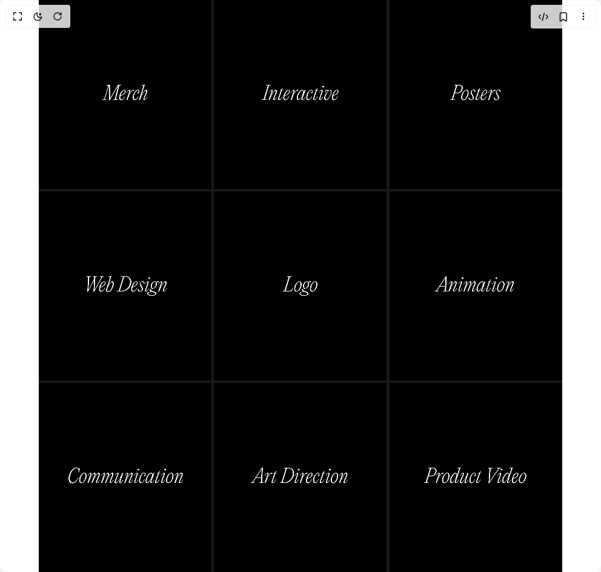

# Build Dynamic Frame Layout in BuilderStudio

> Build this component in our Agentic IDE: [BuilderStudio](https://builderstudio.dev).
>
> Join the BuilderStudio community on [Discord](https://discord.gg/QdWeSGCqfe) and [Reddit](https://reddit.com/r/builderstudio).



## Component

- Author group: `oeneco`
- Component: `dynamic-frame-layout`
- Variant: `default`
- Rendered HTML snapshot: [`rendered.html`](rendered.html)

## BuilderStudio prompt

You are implementing a React component based on a component reference.

## Component identity

- Author: oeneco
- Component slug: dynamic-frame-layout
- Demo slug: default
- Title: dynamic-frame-layout
- Description: 

## Goal

Recreate this component in a React + TypeScript + Tailwind CSS project. Preserve the visual layout, spacing, colors, border radius, shadows, interaction behavior, animation behavior, responsive behavior, and dark mode behavior shown in the rendered demo.

## Implementation requirements

- Use React and TypeScript.
- Use Tailwind CSS classes whenever possible.
- Keep the component self-contained unless the source files require helper components.
- If the source uses CSS variables, custom CSS, animations, or keyframes, include them.
- If the source uses external packages, list and use the required packages.
- Preserve accessibility attributes, button semantics, links, keyboard behavior, and ARIA attributes when visible in the source.
- Do not replace the component with a simplified placeholder.
- Return complete production-ready code.

## Dependencies

No reference metadata available.

## Rendered DOM snapshot

This is the rendered demo HTML extracted from the live preview. Use it to verify structure, class names, visible content, and layout.

```html
<div id="root"><div class="relative flex items-center justify-center h-screen w-full m-auto p-16 bg-background text-foreground"><div class="absolute lab-bg inset-0 size-full"><div class="absolute inset-0 bg-[radial-gradient(#00000021_1px,transparent_1px)] dark:bg-[radial-gradient(#ffffff22_1px,transparent_1px)]"></div></div><div class="flex w-full justify-center relative"><div class="h-screen w-screen bg-zinc-900"><div class="relative w-full h-full w-full h-full" style="display: grid; grid-template-rows: 4fr 4fr 4fr; grid-template-columns: 4fr 4fr 4fr; gap: 4px; transition: grid-template-rows 0.4s, grid-template-columns 0.4s;"><div class="relative" style="transform-origin: left top; transition: transform 0.4s;"><div class="relative absolute inset-0" style="width: 100%; height: 100%; transition: width 0.3s ease-in-out, height 0.3s ease-in-out;"><div class="relative w-full h-full overflow-hidden"><div class="absolute inset-0 flex items-center justify-center" style="z-index: 1; transition: 0.3s ease-in-out; padding: 0px; width: 100%; height: 100%; left: 0px; top: 0px;"><div class="w-full h-full overflow-hidden" style="transform: scale(1); transform-origin: center center; transition: transform 0.3s ease-in-out;"><video class="w-full h-full object-cover" src="https://static.cdn-luma.com/files/981e483f71aa764b/Company%20Thing%20Exported.mp4" loop="" playsinline=""></video></div></div></div></div></div><div class="relative" style="transform-origin: center top; transition: transform 0.4s;"><div class="relative absolute inset-0" style="width: 100%; height: 100%; transition: width 0.3s ease-in-out, height 0.3s ease-in-out;"><div class="relative w-full h-full overflow-hidden"><div class="absolute inset-0 flex items-center justify-center" style="z-index: 1; transition: 0.3s ease-in-out; padding: 0px; width: 100%; height: 100%; left: 0px; top: 0px;"><div class="w-full h-full overflow-hidden" style="transform: scale(1); transform-origin: center center; transition: transform 0.3s ease-in-out;"><video class="w-full h-full object-cover" src="https://static.cdn-luma.com/files/58ab7363888153e3/WebGL%20Exported%20(1).mp4" loop="" playsinline=""></video></div></div></div></div></div><div class="relative" style="transform-origin: right top; transition: transform 0.4s;"><div class="relative absolute inset-0" style="width: 100%; height: 100%; transition: width 0.3s ease-in-out, height 0.3s ease-in-out;"><div class="relative w-full h-full overflow-hidden"><div class="absolute inset-0 flex items-center justify-center" style="z-index: 1; transition: 0.3s ease-in-out; padding: 0px; width: 100%; height: 100%; left: 0px; top: 0px;"><div class="w-full h-full overflow-hidden" style="transform: scale(1); transform-origin: center center; transition: transform 0.3s ease-in-out;"><video class="w-full h-full object-cover" src="https://static.cdn-luma.com/files/58ab7363888153e3/Jitter%20Exported%20Poster.mp4" loop="" playsinline=""></video></div></div></div></div></div><div class="relative" style="transform-origin: left center; transition: transform 0.4s;"><div class="relative absolute inset-0" style="width: 100%; height: 100%; transition: width 0.3s ease-in-out, height 0.3s ease-in-out;"><div class="relative w-full h-full overflow-hidden"><div class="absolute inset-0 flex items-center justify-center" style="z-index: 1; transition: 0.3s ease-in-out; padding: 0px; width: 100%; height: 100%; left: 0px; top: 0px;"><div class="w-full h-full overflow-hidden" style="transform: scale(1); transform-origin: center center; transition: transform 0.3s ease-in-out;"><video class="w-full h-full object-cover" src="https://static.cdn-luma.com/files/58ab7363888153e3/Exported%20Web%20Video.mp4" loop="" playsinline=""></video></div></div></div></div></div><div class="relative" style="transform-origin: center center; transition: transform 0.4s;"><div class="relative absolute inset-0" style="width: 100%; height: 100%; transition: width 0.3s ease-in-out, height 0.3s ease-in-out;"><div class="relative w-full h-full overflow-hidden"><div class="absolute inset-0 flex items-center justify-center" style="z-index: 1; transition: 0.3s ease-in-out; padding: 0px; width: 100%; height: 100%; left: 0px; top: 0px;"><div class="w-full h-full overflow-hidden" style="transform: scale(1); transform-origin: center center; transition: transform 0.3s ease-in-out;"><video class="w-full h-full object-cover" src="https://static.cdn-luma.com/files/58ab7363888153e3/Logo%20Exported.mp4" loop="" playsinline=""></video></div></div></div></div></div><div class="relative" style="transform-origin: right center; transition: transform 0.4s;"><div class="relative absolute inset-0" style="width: 100%; height: 100%; transition: width 0.3s ease-in-out, height 0.3s ease-in-out;"><div class="relative w-full h-full overflow-hidden"><div class="absolute inset-0 flex items-center justify-center" style="z-index: 1; transition: 0.3s ease-in-out; padding: 0px; width: 100%; height: 100%; left: 0px; top: 0px;"><div class="w-full h-full overflow-hidden" style="transform: scale(1); transform-origin: center center; transition: transform 0.3s ease-in-out;"><video class="w-full h-full object-cover" src="https://static.cdn-luma.com/files/58ab7363888153e3/Animation%20Exported%20(4).mp4" loop="" playsinline=""></video></div></div></div></div></div><div class="relative" style="transform-origin: left bottom; transition: transform 0.4s;"><div class="relative absolute inset-0" style="width: 100%; height: 100%; transition: width 0.3s ease-in-out, height 0.3s ease-in-out;"><div class="relative w-full h-full overflow-hidden"><div class="absolute inset-0 flex items-center justify-center" style="z-index: 1; transition: 0.3s ease-in-out; padding: 0px; width: 100%; height: 100%; left: 0px; top: 0px;"><div class="w-full h-full overflow-hidden" style="transform: scale(1); transform-origin: center center; transition: transform 0.3s ease-in-out;"><video class="w-full h-full object-cover" src="https://static.cdn-luma.com/files/58ab7363888153e3/Illustration%20Exported%20(1).mp4" loop="" playsinline=""></video></div></div></div></div></div><div class="relative" style="transform-origin: center bottom; transition: transform 0.4s;"><div class="relative absolute inset-0" style="width: 100%; height: 100%; transition: width 0.3s ease-in-out, height 0.3s ease-in-out;"><div class="relative w-full h-full overflow-hidden"><div class="absolute inset-0 flex items-center justify-center" style="z-index: 1; transition: 0.3s ease-in-out; padding: 0px; width: 100%; height: 100%; left: 0px; top: 0px;"><div class="w-full h-full overflow-hidden" style="transform: scale(1); transform-origin: center center; transition: transform 0.3s ease-in-out;"><video class="w-full h-full object-cover" src="https://static.cdn-luma.com/files/58ab7363888153e3/Art%20Direction%20Exported.mp4" loop="" playsinline=""></video></div></div></div></div></div><div class="relative" style="transform-origin: right bottom; transition: transform 0.4s;"><div class="relative absolute inset-0" style="width: 100%; height: 100%; transition: width 0.3s ease-in-out, height 0.3s ease-in-out;"><div class="relative w-full h-full overflow-hidden"><div class="absolute inset-0 flex items-center justify-center" style="z-index: 1; transition: 0.3s ease-in-out; padding: 0px; width: 100%; height: 100%; left: 0px; top: 0px;"><div class="w-full h-full overflow-hidden" style="transform: scale(1); transform-origin: center center; transition: transform 0.3s ease-in-out;"><video class="w-full h-full object-cover" src="https://static.cdn-luma.com/files/58ab7363888153e3/Product%20Video.mp4" loop="" playsinline=""></video></div></div></div></div></div></div></div></div></div></div>
```

## Reference source files

No reference source files were available.
