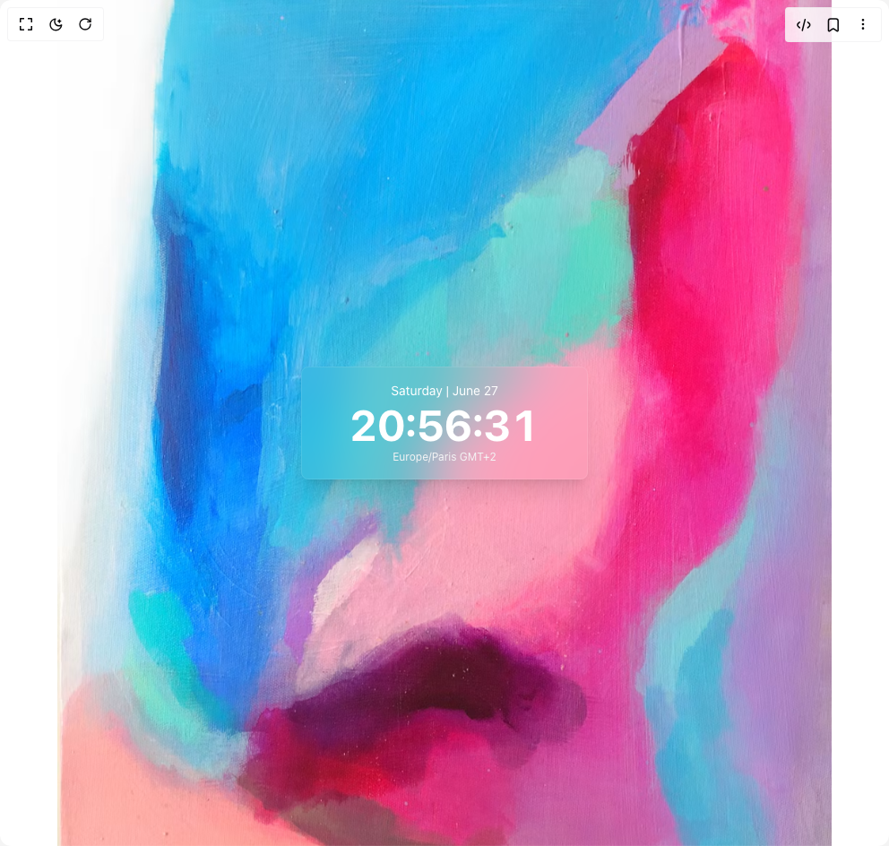
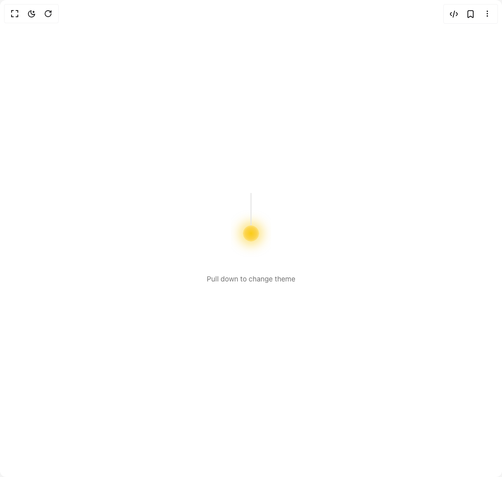
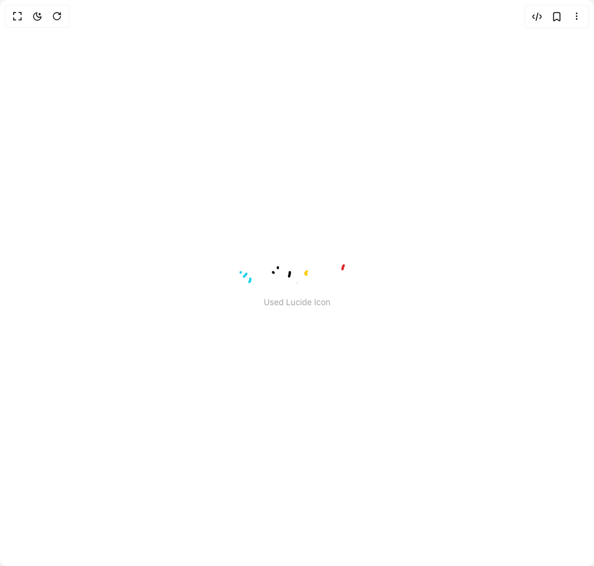
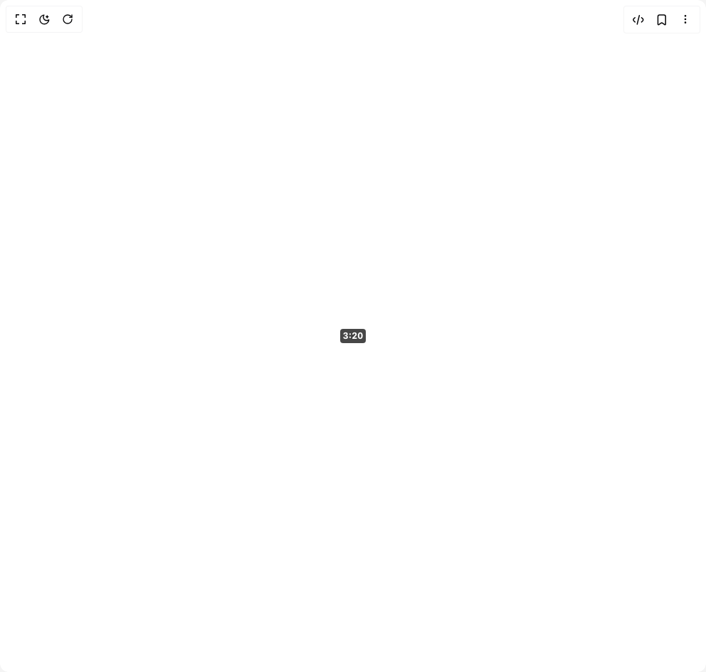

# Oldkong88 Components

5 components are available in this author group.

> Build any component in [BuilderStudio](https://builderstudio.dev), then share improvements with the community on [Discord](https://discord.gg/QdWeSGCqfe) or [Reddit](https://reddit.com/r/builderstudio).

| Preview | Component | Variant |
| --- | --- | --- |
|  | [Cartoon Button](cartoon-button/default/README.md) | `default` |
|  | [Glass Time Card](glass-time-card/glass-time-card/README.md) | `glass-time-card` |
|  | [Light Pull Theme Switcher](light-pull-theme-switcher/pull-down-to-change-theme/README.md) | `pull-down-to-change-theme` |
|  | [Lucide Icon Drawer](lucide-icon-drawer/icon-drawer-with-lucide-and-anime-js/README.md) | `icon-drawer-with-lucide-and-anime-js` |
|  | [Timestamp](timestamp/duration-badge/README.md) | `duration-badge` |
