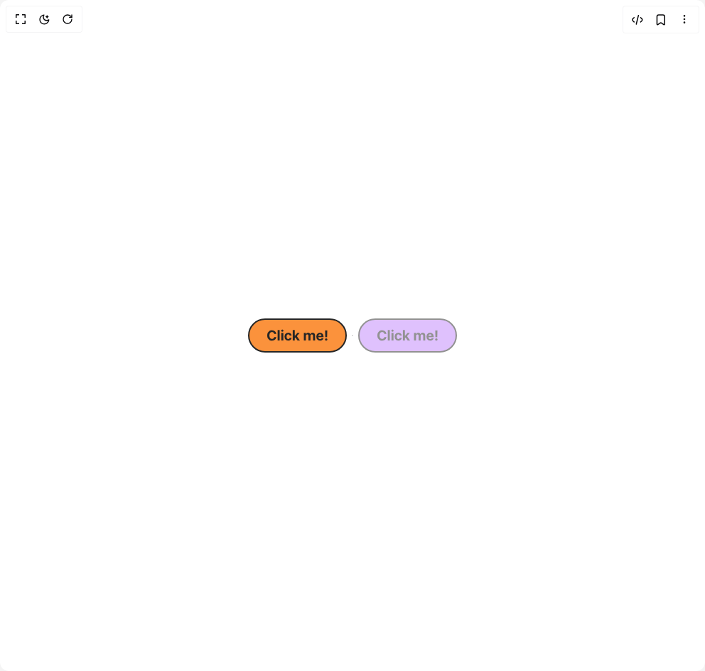

# Build Cartoon Button in BuilderStudio

> Build this component in our Agentic IDE: [BuilderStudio](https://builderstudio.dev).
>
> Join the BuilderStudio community on [Discord](https://discord.gg/QdWeSGCqfe) and [Reddit](https://reddit.com/r/builderstudio).



## Component

- Author group: `oldkong88`
- Component: `cartoon-button`
- Variant: `default`
- Rendered HTML snapshot: [`rendered.html`](rendered.html)

## BuilderStudio prompt

You are implementing a React component based on a component reference.

## Component identity

- Author: oldkong88
- Component slug: cartoon-button
- Demo slug: default
- Title: cartoon-button
- Description: 

## Goal

Recreate this component in a React + TypeScript + Tailwind CSS project. Preserve the visual layout, spacing, colors, border radius, shadows, interaction behavior, animation behavior, responsive behavior, and dark mode behavior shown in the rendered demo.

## Implementation requirements

- Use React and TypeScript.
- Use Tailwind CSS classes whenever possible.
- Keep the component self-contained unless the source files require helper components.
- If the source uses CSS variables, custom CSS, animations, or keyframes, include them.
- If the source uses external packages, list and use the required packages.
- Preserve accessibility attributes, button semantics, links, keyboard behavior, and ARIA attributes when visible in the source.
- Do not replace the component with a simplified placeholder.
- Return complete production-ready code.

## Dependencies

No reference metadata available.

## Rendered DOM snapshot

This is the rendered demo HTML extracted from the live preview. Use it to verify structure, class names, visible content, and layout.

```html
<div id="root"><div class="relative flex items-center justify-center h-screen w-full m-auto p-16 bg-background text-foreground"><div class="absolute lab-bg inset-0 size-full"><div class="absolute inset-0 bg-[radial-gradient(#00000021_1px,transparent_1px)] dark:bg-[radial-gradient(#ffffff22_1px,transparent_1px)]"></div></div><div class="flex w-full justify-center relative"><div class="flex flex-row gap-4"><div class="inline-block cursor-pointer"><button class="relative h-12 px-6 text-xl rounded-full font-bold text-neutral-800 border-2 border-neutral-800 transition-all duration-150 overflow-hidden group
        bg-orange-400 hover:shadow-[0_4px_0_0_#262626]
        hover:-translate-y-1 active:translate-y-0 active:shadow-none"><span class="relative z-10 whitespace-nowrap">Click me!</span><div class="absolute top-1/2 left-[-100%] w-16 h-24 bg-white/50 -translate-y-1/2 rotate-12 transition-all duration-500 ease-in-out group-hover:left-[200%]"></div></button></div><div class="inline-block cursor-not-allowed"><button disabled="" class="relative h-12 px-6 text-xl rounded-full font-bold text-neutral-800 border-2 border-neutral-800 transition-all duration-150 overflow-hidden group
        bg-purple-400 hover:shadow-[0_4px_0_0_#262626]
        opacity-50 pointer-events-none"><span class="relative z-10 whitespace-nowrap">Click me!</span></button></div></div></div></div></div>
```

## Reference source files

No reference source files were available.
