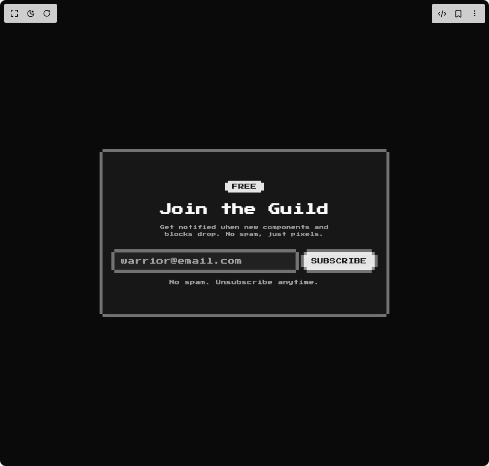

# Build 8bit Advanced3 in BuilderStudio

> Build this component in our Agentic IDE: [BuilderStudio](https://builderstudio.dev).
>
> Join the BuilderStudio community on [Discord](https://discord.gg/QdWeSGCqfe) and [Reddit](https://reddit.com/r/builderstudio).



## Component

- Author group: `orcdev`
- Component: `8bit-advanced3`
- Variant: `default`
- Rendered HTML snapshot: [`rendered.html`](rendered.html)

## BuilderStudio prompt

You are implementing a React component based on a component reference.

## Component identity

- Author: OrcDev
- Component slug: 8bit-advanced3
- Demo slug: default
- Title: 8bit-advanced3
- Description: 

## Goal

Recreate this component in a React + TypeScript + Tailwind CSS project. Preserve the visual layout, spacing, colors, border radius, shadows, interaction behavior, animation behavior, responsive behavior, and dark mode behavior shown in the rendered demo.

## Implementation requirements

- Use React and TypeScript.
- Use Tailwind CSS classes whenever possible.
- Keep the component self-contained unless the source files require helper components.
- If the source uses CSS variables, custom CSS, animations, or keyframes, include them.
- If the source uses external packages, list and use the required packages.
- Preserve accessibility attributes, button semantics, links, keyboard behavior, and ARIA attributes when visible in the source.
- Do not replace the component with a simplified placeholder.
- Return complete production-ready code.

## Dependencies

No reference metadata available.

## Rendered DOM snapshot

This is the rendered demo HTML extracted from the live preview. Use it to verify structure, class names, visible content, and layout.

```html
<div id="root"><div class="w-screen min-h-screen flex justify-center items-center"><div class="w-screen min-h-screen flex justify-center items-center"><div class="dark flex w-full min-h-screen items-center justify-center bg-background p-8 retro"><section class="w-full px-4 py-16"><div class="mx-auto max-w-xl"><div class="relative bg-card text-card-foreground border-y-6 border-foreground dark:border-ring p-0!"><div data-slot="card" class="flex flex-col gap-6 rounded-xl border bg-card py-6 text-card-foreground shadow-sm rounded-none border-0 w-full! h-full flex flex-col bg-card text-card-foreground shadow-none retro"><div data-slot="card-content" class="px-6 pt-8 pb-8"><div class="text-center"><div class="mb-4"><div class="relative inline-flex items-stretch"><span data-slot="badge" data-variant="default" class="inline-flex w-fit shrink-0 items-center justify-center gap-1 overflow-hidden rounded-full border border-transparent px-2 py-0.5 text-xs font-medium whitespace-nowrap transition-[color,box-shadow] focus-visible:border-ring focus-visible:ring-[3px] focus-visible:ring-ring/50 aria-invalid:border-destructive aria-invalid:ring-destructive/20 dark:aria-invalid:ring-destructive/40 [&amp;&gt;svg]:pointer-events-none [&amp;&gt;svg]:size-3 bg-primary text-primary-foreground [a&amp;]:hover:bg-primary/90 h-full rounded-none w-full retro">FREE</span><div class="-left-1.5 absolute inset-y-[4px] w-1.5 border-primary bg-primary"></div><div class="-right-1.5 absolute inset-y-[4px] w-1.5 border-primary bg-primary"></div></div></div><h2 class="retro mb-3 font-bold text-2xl tracking-tight">Join the Guild</h2><p class="mx-auto mb-6 max-w-sm text-muted-foreground retro text-[9px] leading-relaxed">Get notified when new components and blocks drop. No spam, just pixels.</p><div class="flex flex-col md:flex-row items-center gap-4"><div class="relative border-y-6 border-foreground dark:border-ring !p-0 flex items-center retro flex-1 text-xs"><input data-slot="input" class="h-9 w-full min-w-0 rounded-md border border-input bg-transparent px-3 py-1 text-base shadow-xs transition-[color,box-shadow] outline-none selection:bg-primary selection:text-primary-foreground file:inline-flex file:h-7 file:border-0 file:bg-transparent file:text-sm file:font-medium file:text-foreground placeholder:text-muted-foreground disabled:pointer-events-none disabled:cursor-not-allowed disabled:opacity-50 md:text-sm dark:bg-input/30 focus-visible:border-ring focus-visible:ring-[3px] focus-visible:ring-ring/50 aria-invalid:border-destructive aria-invalid:ring-destructive/20 dark:aria-invalid:ring-destructive/40 rounded-none ring-0 !w-full retro retro flex-1 text-xs" placeholder="warrior@email.com" type="email"><div class="absolute inset-0 border-x-6 -mx-1.5 border-foreground dark:border-ring pointer-events-none" aria-hidden="true"></div></div><button data-slot="button" data-variant="default" data-size="default" class="inline-flex shrink-0 items-center justify-center gap-2 rounded-md text-sm font-medium whitespace-nowrap transition-all outline-none focus-visible:border-ring focus-visible:ring-[3px] focus-visible:ring-ring/50 disabled:pointer-events-none disabled:opacity-50 aria-invalid:border-destructive aria-invalid:ring-destructive/20 dark:aria-invalid:ring-destructive/40 [&amp;_svg]:pointer-events-none [&amp;_svg]:shrink-0 [&amp;_svg:not([class*='size-'])]:size-4 bg-primary text-primary-foreground hover:bg-primary/90 h-9 px-4 py-2 has-[&gt;svg]:px-3 rounded-none active:translate-y-1 transition-transform relative inline-flex items-center justify-center gap-1.5 border-none retro text-xs">SUBSCRIBE<div class="absolute -top-1.5 w-1/2 left-1.5 h-1.5 bg-foreground dark:bg-ring"></div><div class="absolute -top-1.5 w-1/2 right-1.5 h-1.5 bg-foreground dark:bg-ring"></div><div class="absolute -bottom-1.5 w-1/2 left-1.5 h-1.5 bg-foreground dark:bg-ring"></div><div class="absolute -bottom-1.5 w-1/2 right-1.5 h-1.5 bg-foreground dark:bg-ring"></div><div class="absolute top-0 left-0 size-1.5 bg-foreground dark:bg-ring"></div><div class="absolute top-0 right-0 size-1.5 bg-foreground dark:bg-ring"></div><div class="absolute bottom-0 left-0 size-1.5 bg-foreground dark:bg-ring"></div><div class="absolute bottom-0 right-0 size-1.5 bg-foreground dark:bg-ring"></div><div class="absolute top-1.5 -left-1.5 h-[calc(100%-12px)] w-1.5 bg-foreground dark:bg-ring"></div><div class="absolute top-1.5 -right-1.5 h-[calc(100%-12px)] w-1.5 bg-foreground dark:bg-ring"></div><div class="absolute top-0 left-0 w-full h-1.5 bg-foreground/20"></div><div class="absolute top-1.5 left-0 w-3 h-1.5 bg-foreground/20"></div><div class="absolute bottom-0 left-0 w-full h-1.5 bg-foreground/20"></div><div class="absolute bottom-1.5 right-0 w-3 h-1.5 bg-foreground/20"></div></button></div><p class="retro mt-3 text-muted-foreground text-[10px]">No spam. Unsubscribe anytime.</p></div></div></div><div class="absolute inset-0 border-x-6 -mx-1.5 border-inherit pointer-events-none" aria-hidden="true"></div></div></div></section></div></div></div></div>
```

## Reference source files

No reference source files were available.
