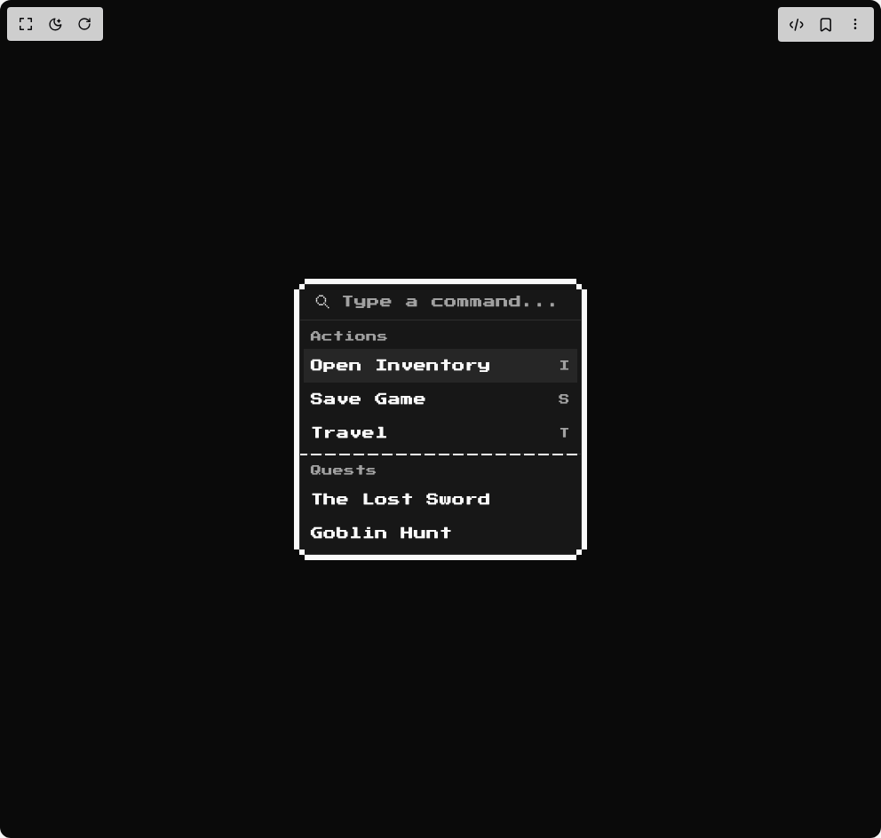

# Build 8bit Command in BuilderStudio

> Build this component in our Agentic IDE: [BuilderStudio](https://builderstudio.dev).
>
> Join the BuilderStudio community on [Discord](https://discord.gg/QdWeSGCqfe) and [Reddit](https://reddit.com/r/builderstudio).



## Component

- Author group: `orcdev`
- Component: `8bit-command`
- Variant: `default`
- Rendered HTML snapshot: [`rendered.html`](rendered.html)

## BuilderStudio prompt

You are implementing a React component based on a component reference.

## Component identity

- Author: OrcDev
- Component slug: 8bit-command
- Demo slug: default
- Title: 8bit-command
- Description: 

## Goal

Recreate this component in a React + TypeScript + Tailwind CSS project. Preserve the visual layout, spacing, colors, border radius, shadows, interaction behavior, animation behavior, responsive behavior, and dark mode behavior shown in the rendered demo.

## Implementation requirements

- Use React and TypeScript.
- Use Tailwind CSS classes whenever possible.
- Keep the component self-contained unless the source files require helper components.
- If the source uses CSS variables, custom CSS, animations, or keyframes, include them.
- If the source uses external packages, list and use the required packages.
- Preserve accessibility attributes, button semantics, links, keyboard behavior, and ARIA attributes when visible in the source.
- Do not replace the component with a simplified placeholder.
- Return complete production-ready code.

## Dependencies

No reference metadata available.

## Rendered DOM snapshot

This is the rendered demo HTML extracted from the live preview. Use it to verify structure, class names, visible content, and layout.

```html
<div id="root"><div class="w-screen min-h-screen flex justify-center items-center"><div class="w-screen min-h-screen flex justify-center items-center"><div class="flex w-full min-h-screen items-center justify-center bg-background p-8 overflow-hidden font-pixel"><div class="relative !p-0 rounded-md border w-80"><div class="relative p-0"><div tabindex="-1" data-slot="command" class="retro bg-popover text-popover-foreground flex h-full !w-full flex-col overflow-hidden retro rounded-md border w-80" cmdk-root=""><label cmdk-label="" for="radix-«r2»" id="radix-«r1»" style="position: absolute; width: 1px; height: 1px; padding: 0px; margin: -1px; overflow: hidden; clip: rect(0px, 0px, 0px, 0px); white-space: nowrap; border-width: 0px;"></label><div data-slot="command-input-wrapper" class="flex h-10 items-center gap-2 border-b px-3"><svg width="30" height="30" viewBox="0 0 256 256" fill="currentColor" xmlns="http://www.w3.org/2000/svg" stroke="currentColor" stroke-width="0.25" aria-label="search"><rect x="88" y="56" width="14" height="14" rx="1"></rect><rect x="72" y="72" width="14" height="14" rx="1"></rect><rect x="56" y="88" width="14" height="14" rx="1"></rect><rect x="56" y="104" width="14" height="14" rx="1"></rect><rect x="56" y="120" width="14" height="14" rx="1"></rect><rect x="72" y="136" width="14" height="14" rx="1"></rect><rect x="88" y="152" width="14" height="14" rx="1"></rect><rect x="104" y="152" width="14" height="14" rx="1"></rect><rect x="120" y="152" width="14" height="14" rx="1"></rect><rect x="136" y="136" width="14" height="14" rx="1"></rect><rect x="152" y="120" width="14" height="14" rx="1"></rect><rect x="152" y="104" width="14" height="14" rx="1"></rect><rect x="152" y="88" width="14" height="14" rx="1"></rect><rect x="136" y="72" width="14" height="14" rx="1"></rect><rect x="120" y="56" width="14" height="14" rx="1"></rect><rect x="104" y="56" width="14" height="14" rx="1"></rect><rect x="152" y="152" width="14" height="14" rx="1"></rect><rect x="168" y="168" width="14" height="14" rx="1"></rect><rect x="184" y="184" width="14" height="14" rx="1"></rect></svg><input data-slot="command-input" class="placeholder:text-muted-foreground flex h-10 w-full rounded-md bg-transparent py-3 text-sm outline-hidden disabled:cursor-not-allowed disabled:opacity-50" placeholder="Type a command..." cmdk-input="" autocomplete="off" autocorrect="off" spellcheck="false" aria-autocomplete="list" role="combobox" aria-expanded="true" aria-controls="radix-«r0»" aria-labelledby="radix-«r1»" id="radix-«r2»" type="text" value=""></div><div data-slot="command-list" class="max-h-[320px] scroll-py-1 overflow-x-hidden overflow-y-auto retro" cmdk-list="" role="listbox" tabindex="-1" aria-label="Suggestions" id="radix-«r0»" style="--cmdk-list-height: 263.0px;"><div cmdk-list-sizer=""><div data-slot="command-group" class="text-foreground [&amp;_[cmdk-group-heading]]:text-muted-foreground overflow-hidden p-1 [&amp;_[cmdk-group-heading]]:px-2 [&amp;_[cmdk-group-heading]]:py-1.5 [&amp;_[cmdk-group-heading]]:text-xs [&amp;_[cmdk-group-heading]]:font-medium retro" cmdk-group="" role="presentation" data-value="Actions"><div cmdk-group-heading="" aria-hidden="true" id="radix-«r4»">Actions</div><div cmdk-group-items="" role="group" aria-labelledby="radix-«r4»"><div data-slot="command-item" class="data-[selected=true]:bg-accent data-[selected=true]:text-accent-foreground [&amp;_svg:not([class*='text-'])]:text-muted-foreground relative flex cursor-default items-center gap-2 px-2 py-1.5 text-sm outline-hidden select-none data-[disabled=true]:pointer-events-none data-[disabled=true]:opacity-50 [&amp;_svg]:pointer-events-none [&amp;_svg]:shrink-0 [&amp;_svg:not([class*='size-'])]:size-4 rounded-none border-dashed border-y-3 border-ring/0 hover:border-foreground dark:hover:border-ring" id="radix-«r5»" cmdk-item="" role="option" aria-disabled="false" aria-selected="true" data-disabled="false" data-selected="true" data-value="Open Inventory I">Open Inventory <span data-slot="command-shortcut" class="text-muted-foreground ml-auto text-xs tracking-widest retro">I</span></div><div data-slot="command-item" class="data-[selected=true]:bg-accent data-[selected=true]:text-accent-foreground [&amp;_svg:not([class*='text-'])]:text-muted-foreground relative flex cursor-default items-center gap-2 px-2 py-1.5 text-sm outline-hidden select-none data-[disabled=true]:pointer-events-none data-[disabled=true]:opacity-50 [&amp;_svg]:pointer-events-none [&amp;_svg]:shrink-0 [&amp;_svg:not([class*='size-'])]:size-4 rounded-none border-dashed border-y-3 border-ring/0 hover:border-foreground dark:hover:border-ring" id="radix-«r6»" cmdk-item="" role="option" aria-disabled="false" aria-selected="false" data-disabled="false" data-selected="false" data-value="Save Game S">Save Game <span data-slot="command-shortcut" class="text-muted-foreground ml-auto text-xs tracking-widest retro">S</span></div><div data-slot="command-item" class="data-[selected=true]:bg-accent data-[selected=true]:text-accent-foreground [&amp;_svg:not([class*='text-'])]:text-muted-foreground relative flex cursor-default items-center gap-2 px-2 py-1.5 text-sm outline-hidden select-none data-[disabled=true]:pointer-events-none data-[disabled=true]:opacity-50 [&amp;_svg]:pointer-events-none [&amp;_svg]:shrink-0 [&amp;_svg:not([class*='size-'])]:size-4 rounded-none border-dashed border-y-3 border-ring/0 hover:border-foreground dark:hover:border-ring" id="radix-«r7»" cmdk-item="" role="option" aria-disabled="false" aria-selected="false" data-disabled="false" data-selected="false" data-value="Travel T">Travel <span data-slot="command-shortcut" class="text-muted-foreground ml-auto text-xs tracking-widest retro">T</span></div></div></div><div data-slot="command-separator" class="bg-border -mx-1 h-px data-[orientation=horizontal]:bg-[length:16px_8px] data-[orientation=horizontal]:bg-[linear-gradient(90deg,var(--foreground)_75%,transparent_75%)] dark:data-[orientation=horizontal]:bg-[linear-gradient(90deg,var(--ring)_75%,transparent_75%)] shrink-0 data-[orientation=horizontal]:h-0.5 data-[orientation=horizontal]:w-full data-[orientation=vertical]:h-full data-[orientation=vertical]:w-0.5 data-[orientation=vertical]:bg-[length:2px_16px] data-[orientation=vertical]:bg-[linear-gradient(0deg,var(--foreground)_75%,transparent_75%)] dark:data-[orientation=vertical]:bg-[linear-gradient(0deg,var(--ring)_75%,transparent_75%)] retro" cmdk-separator="" role="separator"><div data-orientation="horizontal" role="none" data-slot="separator-root" class="data-[orientation=horizontal]:bg-[length:16px_8px] data-[orientation=horizontal]:bg-[linear-gradient(90deg,var(--foreground)_75%,transparent_75%)] dark:data-[orientation=horizontal]:bg-[linear-gradient(90deg,var(--ring)_75%,transparent_75%)] shrink-0 data-[orientation=horizontal]:h-0.5 data-[orientation=horizontal]:w-full data-[orientation=vertical]:h-full data-[orientation=vertical]:w-0.5 data-[orientation=vertical]:bg-[length:2px_16px] data-[orientation=vertical]:bg-[linear-gradient(0deg,var(--foreground)_75%,transparent_75%)] dark:data-[orientation=vertical]:bg-[linear-gradient(0deg,var(--ring)_75%,transparent_75%)]"></div></div><div data-slot="command-group" class="text-foreground [&amp;_[cmdk-group-heading]]:text-muted-foreground overflow-hidden p-1 [&amp;_[cmdk-group-heading]]:px-2 [&amp;_[cmdk-group-heading]]:py-1.5 [&amp;_[cmdk-group-heading]]:text-xs [&amp;_[cmdk-group-heading]]:font-medium retro" cmdk-group="" role="presentation" data-value="Quests"><div cmdk-group-heading="" aria-hidden="true" id="radix-«r9»">Quests</div><div cmdk-group-items="" role="group" aria-labelledby="radix-«r9»"><div data-slot="command-item" class="data-[selected=true]:bg-accent data-[selected=true]:text-accent-foreground [&amp;_svg:not([class*='text-'])]:text-muted-foreground relative flex cursor-default items-center gap-2 px-2 py-1.5 text-sm outline-hidden select-none data-[disabled=true]:pointer-events-none data-[disabled=true]:opacity-50 [&amp;_svg]:pointer-events-none [&amp;_svg]:shrink-0 [&amp;_svg:not([class*='size-'])]:size-4 rounded-none border-dashed border-y-3 border-ring/0 hover:border-foreground dark:hover:border-ring" id="radix-«ra»" cmdk-item="" role="option" aria-disabled="false" aria-selected="false" data-disabled="false" data-selected="false" data-value="The Lost Sword">The Lost Sword</div><div data-slot="command-item" class="data-[selected=true]:bg-accent data-[selected=true]:text-accent-foreground [&amp;_svg:not([class*='text-'])]:text-muted-foreground relative flex cursor-default items-center gap-2 px-2 py-1.5 text-sm outline-hidden select-none data-[disabled=true]:pointer-events-none data-[disabled=true]:opacity-50 [&amp;_svg]:pointer-events-none [&amp;_svg]:shrink-0 [&amp;_svg:not([class*='size-'])]:size-4 rounded-none border-dashed border-y-3 border-ring/0 hover:border-foreground dark:hover:border-ring" id="radix-«rb»" cmdk-item="" role="option" aria-disabled="false" aria-selected="false" data-disabled="false" data-selected="false" data-value="Goblin Hunt">Goblin Hunt</div></div></div></div></div></div></div><div class="absolute -top-1.5 w-1/2 left-1.5 h-1.5 bg-foreground dark:bg-ring"></div><div class="absolute -top-1.5 w-1/2 right-1.5 h-1.5 bg-foreground dark:bg-ring"></div><div class="absolute -bottom-1.5 w-1/2 left-1.5 h-1.5 bg-foreground dark:bg-ring"></div><div class="absolute -bottom-1.5 w-1/2 right-1.5 h-1.5 bg-foreground dark:bg-ring"></div><div class="absolute top-0 left-0 size-1.5 bg-foreground dark:bg-ring"></div><div class="absolute top-0 right-0 size-1.5 bg-foreground dark:bg-ring"></div><div class="absolute bottom-0 left-0 size-1.5 bg-foreground dark:bg-ring"></div><div class="absolute bottom-0 right-0 size-1.5 bg-foreground dark:bg-ring"></div><div class="absolute top-1.5 -left-1.5 h-1/2 w-1.5 bg-foreground dark:bg-ring"></div><div class="absolute top-1.5 -right-1.5 h-1/2 w-1.5 bg-foreground dark:bg-ring"></div><div class="absolute bottom-1.5 -left-1.5 h-1/2 w-1.5 bg-foreground dark:bg-ring"></div><div class="absolute bottom-1.5 -right-1.5 h-1/2 w-1.5 bg-foreground dark:bg-ring"></div></div></div></div></div></div>
```

## Reference source files

No reference source files were available.
