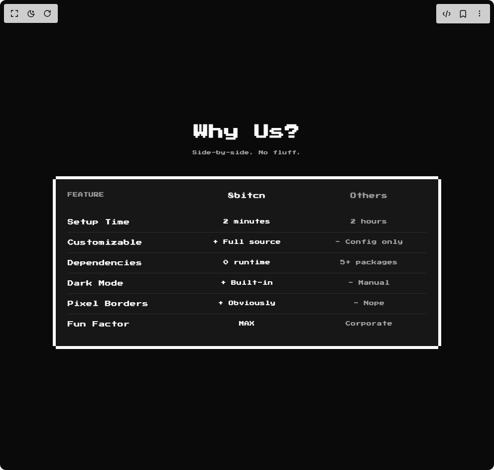

# Build 8bit Cta1 in BuilderStudio

> Build this component in our Agentic IDE: [BuilderStudio](https://builderstudio.dev).
>
> Join the BuilderStudio community on [Discord](https://discord.gg/QdWeSGCqfe) and [Reddit](https://reddit.com/r/builderstudio).



## Component

- Author group: `orcdev`
- Component: `8bit-cta1`
- Variant: `default`
- Rendered HTML snapshot: [`rendered.html`](rendered.html)

## BuilderStudio prompt

You are implementing a React component based on a component reference.

## Component identity

- Author: OrcDev
- Component slug: 8bit-cta1
- Demo slug: default
- Title: 8bit-cta1
- Description: 

## Goal

Recreate this component in a React + TypeScript + Tailwind CSS project. Preserve the visual layout, spacing, colors, border radius, shadows, interaction behavior, animation behavior, responsive behavior, and dark mode behavior shown in the rendered demo.

## Implementation requirements

- Use React and TypeScript.
- Use Tailwind CSS classes whenever possible.
- Keep the component self-contained unless the source files require helper components.
- If the source uses CSS variables, custom CSS, animations, or keyframes, include them.
- If the source uses external packages, list and use the required packages.
- Preserve accessibility attributes, button semantics, links, keyboard behavior, and ARIA attributes when visible in the source.
- Do not replace the component with a simplified placeholder.
- Return complete production-ready code.

## Dependencies

No reference metadata available.

## Rendered DOM snapshot

This is the rendered demo HTML extracted from the live preview. Use it to verify structure, class names, visible content, and layout.

```html
<div id="root"><div class="w-screen min-h-screen flex justify-center items-center"><div class="w-screen min-h-screen flex justify-center items-center"><div class="retro flex min-h-screen w-full items-center justify-center p-6"><section class="w-full px-4 py-16"><div class="mx-auto max-w-3xl"><div class="mb-10 text-center"><h2 class="retro mb-3 font-bold text-2xl tracking-tight md:text-3xl">Why Us?</h2><p class="retro text-muted-foreground text-[9px]">Side-by-side. No fluff.</p></div><div class="relative bg-card text-card-foreground border-y-6 border-foreground dark:border-ring p-0!"><div class="rounded-none border-0 w-full! h-full flex flex-col gap-6 py-6 bg-card text-card-foreground shadow-none retro"><div class="flex flex-col gap-1.5 px-6 retro"><div class="grid md:grid-cols-3 gap-4"><div class="font-semibold retro retro text-[10px] text-muted-foreground">FEATURE</div><div class="font-semibold retro retro text-center text-xs text-primary">8bitcn</div><div class="font-semibold retro retro text-center text-xs text-muted-foreground">Others</div></div></div><div class="px-6 flex-1 retro"><div class="flex flex-col divide-y"><div class="grid md:grid-cols-3 gap-4 py-3"><span class="text-xs font-medium">Setup Time</span><span class="retro text-center text-[10px]">2 minutes</span><span class="retro text-center text-[10px] text-muted-foreground">2 hours</span></div><div class="grid md:grid-cols-3 gap-4 py-3"><span class="text-xs font-medium">Customizable</span><span class="retro text-center text-[10px]">+ Full source</span><span class="retro text-center text-[10px] text-muted-foreground">- Config only</span></div><div class="grid md:grid-cols-3 gap-4 py-3"><span class="text-xs font-medium">Dependencies</span><span class="retro text-center text-[10px]">0 runtime</span><span class="retro text-center text-[10px] text-muted-foreground">5+ packages</span></div><div class="grid md:grid-cols-3 gap-4 py-3"><span class="text-xs font-medium">Dark Mode</span><span class="retro text-center text-[10px]">+ Built-in</span><span class="retro text-center text-[10px] text-muted-foreground">- Manual</span></div><div class="grid md:grid-cols-3 gap-4 py-3"><span class="text-xs font-medium">Pixel Borders</span><span class="retro text-center text-[10px]">+ Obviously</span><span class="retro text-center text-[10px] text-muted-foreground">- Nope</span></div><div class="grid md:grid-cols-3 gap-4 py-3"><span class="text-xs font-medium">Fun Factor</span><span class="retro text-center text-[10px]">MAX</span><span class="retro text-center text-[10px] text-muted-foreground">Corporate</span></div></div></div></div><div class="absolute inset-0 border-x-6 -mx-1.5 border-inherit pointer-events-none" aria-hidden="true"></div></div></div></section></div></div></div></div>
```

## Reference source files

No reference source files were available.
