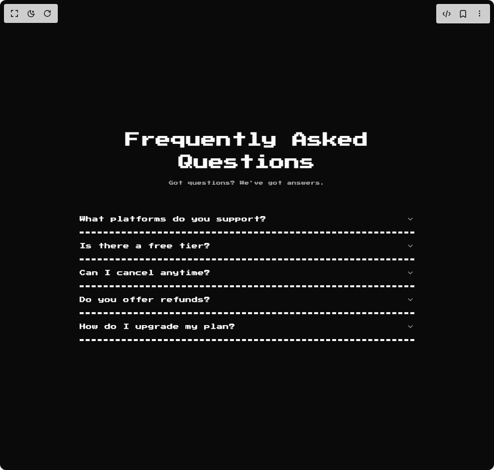

# Build 8bit Faq1 in BuilderStudio

> Build this component in our Agentic IDE: [BuilderStudio](https://builderstudio.dev).
>
> Join the BuilderStudio community on [Discord](https://discord.gg/QdWeSGCqfe) and [Reddit](https://reddit.com/r/builderstudio).



## Component

- Author group: `orcdev`
- Component: `8bit-faq1`
- Variant: `default`
- Rendered HTML snapshot: [`rendered.html`](rendered.html)

## BuilderStudio prompt

You are implementing a React component based on a component reference.

## Component identity

- Author: OrcDev
- Component slug: 8bit-faq1
- Demo slug: default
- Title: 8bit-faq1
- Description: 

## Goal

Recreate this component in a React + TypeScript + Tailwind CSS project. Preserve the visual layout, spacing, colors, border radius, shadows, interaction behavior, animation behavior, responsive behavior, and dark mode behavior shown in the rendered demo.

## Implementation requirements

- Use React and TypeScript.
- Use Tailwind CSS classes whenever possible.
- Keep the component self-contained unless the source files require helper components.
- If the source uses CSS variables, custom CSS, animations, or keyframes, include them.
- If the source uses external packages, list and use the required packages.
- Preserve accessibility attributes, button semantics, links, keyboard behavior, and ARIA attributes when visible in the source.
- Do not replace the component with a simplified placeholder.
- Return complete production-ready code.

## Dependencies

No reference metadata available.

## Rendered DOM snapshot

This is the rendered demo HTML extracted from the live preview. Use it to verify structure, class names, visible content, and layout.

```html
<div id="root"><div class="w-screen min-h-screen flex justify-center items-center"><div class="w-screen min-h-screen flex justify-center items-center"><div class="flex w-full min-h-screen items-center justify-center bg-background p-4 retro"><section class="w-full px-4 py-16"><div class="mx-auto max-w-2xl"><div class="mb-10 text-center"><h2 class="retro mb-3 font-bold text-2xl tracking-tight md:text-3xl">Frequently Asked Questions</h2><p class="retro mx-auto max-w-xl text-muted-foreground text-[9px]">Got questions? We've got answers.</p></div><div data-orientation="vertical"><div data-state="closed" data-orientation="vertical" class="border-dashed border-b-4 border-foreground dark:border-ring relative"><h3 data-orientation="vertical" data-state="closed" class="flex"><button type="button" aria-controls="radix-«r1»" aria-expanded="false" data-state="closed" data-orientation="vertical" id="radix-«r0»" class="flex flex-1 items-center justify-between py-4 font-medium transition-all hover:underline [&amp;[data-state=open]&gt;svg]:rotate-180 retro retro text-left text-xs" data-radix-collection-item="">What platforms do you support?<svg xmlns="http://www.w3.org/2000/svg" width="24" height="24" viewBox="0 0 24 24" fill="none" stroke="currentColor" stroke-width="2" stroke-linecap="round" stroke-linejoin="round" class="lucide lucide-chevron-down size-4 shrink-0 text-muted-foreground transition-transform duration-200" aria-hidden="true"><path d="m6 9 6 6 6-6"></path></svg></button></h3><div class="relative"><div data-state="closed" id="radix-«r1»" hidden="" role="region" aria-labelledby="radix-«r0»" data-orientation="vertical" class="overflow-hidden text-sm data-[state=closed]:animate-accordion-up data-[state=open]:animate-accordion-down" style="--radix-accordion-content-height: var(--radix-collapsible-content-height); --radix-accordion-content-width: var(--radix-collapsible-content-width);"></div></div></div><div data-state="closed" data-orientation="vertical" class="border-dashed border-b-4 border-foreground dark:border-ring relative"><h3 data-orientation="vertical" data-state="closed" class="flex"><button type="button" aria-controls="radix-«r3»" aria-expanded="false" data-state="closed" data-orientation="vertical" id="radix-«r2»" class="flex flex-1 items-center justify-between py-4 font-medium transition-all hover:underline [&amp;[data-state=open]&gt;svg]:rotate-180 retro retro text-left text-xs" data-radix-collection-item="">Is there a free tier?<svg xmlns="http://www.w3.org/2000/svg" width="24" height="24" viewBox="0 0 24 24" fill="none" stroke="currentColor" stroke-width="2" stroke-linecap="round" stroke-linejoin="round" class="lucide lucide-chevron-down size-4 shrink-0 text-muted-foreground transition-transform duration-200" aria-hidden="true"><path d="m6 9 6 6 6-6"></path></svg></button></h3><div class="relative"><div data-state="closed" id="radix-«r3»" hidden="" role="region" aria-labelledby="radix-«r2»" data-orientation="vertical" class="overflow-hidden text-sm data-[state=closed]:animate-accordion-up data-[state=open]:animate-accordion-down" style="--radix-accordion-content-height: var(--radix-collapsible-content-height); --radix-accordion-content-width: var(--radix-collapsible-content-width);"></div></div></div><div data-state="closed" data-orientation="vertical" class="border-dashed border-b-4 border-foreground dark:border-ring relative"><h3 data-orientation="vertical" data-state="closed" class="flex"><button type="button" aria-controls="radix-«r5»" aria-expanded="false" data-state="closed" data-orientation="vertical" id="radix-«r4»" class="flex flex-1 items-center justify-between py-4 font-medium transition-all hover:underline [&amp;[data-state=open]&gt;svg]:rotate-180 retro retro text-left text-xs" data-radix-collection-item="">Can I cancel anytime?<svg xmlns="http://www.w3.org/2000/svg" width="24" height="24" viewBox="0 0 24 24" fill="none" stroke="currentColor" stroke-width="2" stroke-linecap="round" stroke-linejoin="round" class="lucide lucide-chevron-down size-4 shrink-0 text-muted-foreground transition-transform duration-200" aria-hidden="true"><path d="m6 9 6 6 6-6"></path></svg></button></h3><div class="relative"><div data-state="closed" id="radix-«r5»" hidden="" role="region" aria-labelledby="radix-«r4»" data-orientation="vertical" class="overflow-hidden text-sm data-[state=closed]:animate-accordion-up data-[state=open]:animate-accordion-down" style="--radix-accordion-content-height: var(--radix-collapsible-content-height); --radix-accordion-content-width: var(--radix-collapsible-content-width);"></div></div></div><div data-state="closed" data-orientation="vertical" class="border-dashed border-b-4 border-foreground dark:border-ring relative"><h3 data-orientation="vertical" data-state="closed" class="flex"><button type="button" aria-controls="radix-«r7»" aria-expanded="false" data-state="closed" data-orientation="vertical" id="radix-«r6»" class="flex flex-1 items-center justify-between py-4 font-medium transition-all hover:underline [&amp;[data-state=open]&gt;svg]:rotate-180 retro retro text-left text-xs" data-radix-collection-item="">Do you offer refunds?<svg xmlns="http://www.w3.org/2000/svg" width="24" height="24" viewBox="0 0 24 24" fill="none" stroke="currentColor" stroke-width="2" stroke-linecap="round" stroke-linejoin="round" class="lucide lucide-chevron-down size-4 shrink-0 text-muted-foreground transition-transform duration-200" aria-hidden="true"><path d="m6 9 6 6 6-6"></path></svg></button></h3><div class="relative"><div data-state="closed" id="radix-«r7»" hidden="" role="region" aria-labelledby="radix-«r6»" data-orientation="vertical" class="overflow-hidden text-sm data-[state=closed]:animate-accordion-up data-[state=open]:animate-accordion-down" style="--radix-accordion-content-height: var(--radix-collapsible-content-height); --radix-accordion-content-width: var(--radix-collapsible-content-width);"></div></div></div><div data-state="closed" data-orientation="vertical" class="border-dashed border-b-4 border-foreground dark:border-ring relative"><h3 data-orientation="vertical" data-state="closed" class="flex"><button type="button" aria-controls="radix-«r9»" aria-expanded="false" data-state="closed" data-orientation="vertical" id="radix-«r8»" class="flex flex-1 items-center justify-between py-4 font-medium transition-all hover:underline [&amp;[data-state=open]&gt;svg]:rotate-180 retro retro text-left text-xs" data-radix-collection-item="">How do I upgrade my plan?<svg xmlns="http://www.w3.org/2000/svg" width="24" height="24" viewBox="0 0 24 24" fill="none" stroke="currentColor" stroke-width="2" stroke-linecap="round" stroke-linejoin="round" class="lucide lucide-chevron-down size-4 shrink-0 text-muted-foreground transition-transform duration-200" aria-hidden="true"><path d="m6 9 6 6 6-6"></path></svg></button></h3><div class="relative"><div data-state="closed" id="radix-«r9»" hidden="" role="region" aria-labelledby="radix-«r8»" data-orientation="vertical" class="overflow-hidden text-sm data-[state=closed]:animate-accordion-up data-[state=open]:animate-accordion-down" style="--radix-accordion-content-height: var(--radix-collapsible-content-height); --radix-accordion-content-width: var(--radix-collapsible-content-width);"></div></div></div></div></div></section></div></div></div></div>
```

## Reference source files

No reference source files were available.
