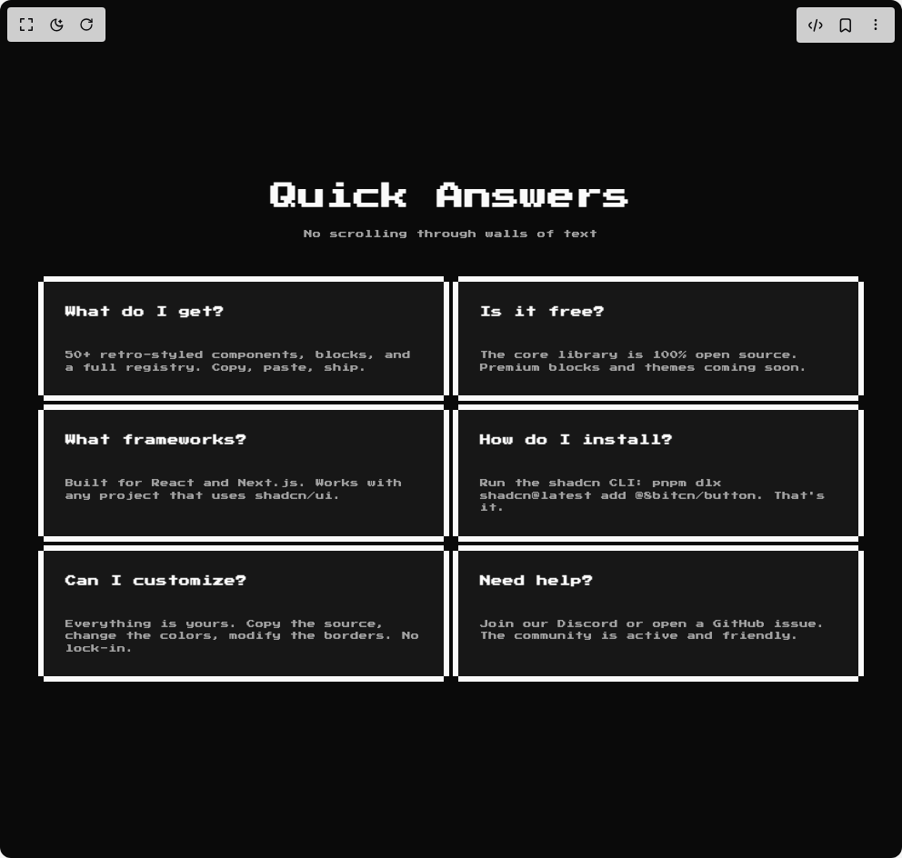

# Build 8bit Faq2 in BuilderStudio

> Build this component in our Agentic IDE: [BuilderStudio](https://builderstudio.dev).
>
> Join the BuilderStudio community on [Discord](https://discord.gg/QdWeSGCqfe) and [Reddit](https://reddit.com/r/builderstudio).



## Component

- Author group: `orcdev`
- Component: `8bit-faq2`
- Variant: `default`
- Rendered HTML snapshot: [`rendered.html`](rendered.html)

## BuilderStudio prompt

You are implementing a React component based on a component reference.

## Component identity

- Author: OrcDev
- Component slug: 8bit-faq2
- Demo slug: default
- Title: 8bit-faq2
- Description: 

## Goal

Recreate this component in a React + TypeScript + Tailwind CSS project. Preserve the visual layout, spacing, colors, border radius, shadows, interaction behavior, animation behavior, responsive behavior, and dark mode behavior shown in the rendered demo.

## Implementation requirements

- Use React and TypeScript.
- Use Tailwind CSS classes whenever possible.
- Keep the component self-contained unless the source files require helper components.
- If the source uses CSS variables, custom CSS, animations, or keyframes, include them.
- If the source uses external packages, list and use the required packages.
- Preserve accessibility attributes, button semantics, links, keyboard behavior, and ARIA attributes when visible in the source.
- Do not replace the component with a simplified placeholder.
- Return complete production-ready code.

## Dependencies

No reference metadata available.

## Rendered DOM snapshot

This is the rendered demo HTML extracted from the live preview. Use it to verify structure, class names, visible content, and layout.

```html
<div id="root"><div class="w-screen min-h-screen flex justify-center items-center"><div class="w-screen min-h-screen flex justify-center items-center"><div class="retro flex min-h-screen w-full items-center justify-center p-6"><section class="w-full px-4 py-16"><div class="mx-auto max-w-4xl"><div class="mb-10 text-center"><h2 class="retro mb-3 font-bold text-2xl tracking-tight md:text-3xl">Quick Answers</h2><p class="retro mx-auto max-w-xl text-muted-foreground text-[9px]">No scrolling through walls of text</p></div><div class="grid gap-x-4 gap-y-1 sm:grid-cols-2"><div class="relative bg-card text-card-foreground border-y-6 border-foreground dark:border-ring p-0!"><div class="rounded-none border-0 w-full! h-full flex flex-col gap-6 py-6 bg-card text-card-foreground shadow-none retro"><div class="flex flex-col gap-1.5 px-6 retro pb-2"><div class="font-semibold retro retro text-xs">What do I get?</div></div><div class="px-6 flex-1 retro"><p class="retro text-[9px] leading-relaxed text-muted-foreground">50+ retro-styled components, blocks, and a full reference metadata. Copy, paste, ship.</p></div></div><div class="absolute inset-0 border-x-6 -mx-1.5 border-inherit pointer-events-none" aria-hidden="true"></div></div><div class="relative bg-card text-card-foreground border-y-6 border-foreground dark:border-ring p-0!"><div class="rounded-none border-0 w-full! h-full flex flex-col gap-6 py-6 bg-card text-card-foreground shadow-none retro"><div class="flex flex-col gap-1.5 px-6 retro pb-2"><div class="font-semibold retro retro text-xs">Is it free?</div></div><div class="px-6 flex-1 retro"><p class="retro text-[9px] leading-relaxed text-muted-foreground">The core library is 100% open source. Premium blocks and themes coming soon.</p></div></div><div class="absolute inset-0 border-x-6 -mx-1.5 border-inherit pointer-events-none" aria-hidden="true"></div></div><div class="relative bg-card text-card-foreground border-y-6 border-foreground dark:border-ring p-0!"><div class="rounded-none border-0 w-full! h-full flex flex-col gap-6 py-6 bg-card text-card-foreground shadow-none retro"><div class="flex flex-col gap-1.5 px-6 retro pb-2"><div class="font-semibold retro retro text-xs">What frameworks?</div></div><div class="px-6 flex-1 retro"><p class="retro text-[9px] leading-relaxed text-muted-foreground">Built for React and Next.js. Works with any project that uses shadcn/ui.</p></div></div><div class="absolute inset-0 border-x-6 -mx-1.5 border-inherit pointer-events-none" aria-hidden="true"></div></div><div class="relative bg-card text-card-foreground border-y-6 border-foreground dark:border-ring p-0!"><div class="rounded-none border-0 w-full! h-full flex flex-col gap-6 py-6 bg-card text-card-foreground shadow-none retro"><div class="flex flex-col gap-1.5 px-6 retro pb-2"><div class="font-semibold retro retro text-xs">How do I install?</div></div><div class="px-6 flex-1 retro"><p class="retro text-[9px] leading-relaxed text-muted-foreground">Run the shadcn CLI: pnpm dlx shadcn@latest add @8bitcn/button. That's it.</p></div></div><div class="absolute inset-0 border-x-6 -mx-1.5 border-inherit pointer-events-none" aria-hidden="true"></div></div><div class="relative bg-card text-card-foreground border-y-6 border-foreground dark:border-ring p-0!"><div class="rounded-none border-0 w-full! h-full flex flex-col gap-6 py-6 bg-card text-card-foreground shadow-none retro"><div class="flex flex-col gap-1.5 px-6 retro pb-2"><div class="font-semibold retro retro text-xs">Can I customize?</div></div><div class="px-6 flex-1 retro"><p class="retro text-[9px] leading-relaxed text-muted-foreground">Everything is yours. Copy the source, change the colors, modify the borders. No lock-in.</p></div></div><div class="absolute inset-0 border-x-6 -mx-1.5 border-inherit pointer-events-none" aria-hidden="true"></div></div><div class="relative bg-card text-card-foreground border-y-6 border-foreground dark:border-ring p-0!"><div class="rounded-none border-0 w-full! h-full flex flex-col gap-6 py-6 bg-card text-card-foreground shadow-none retro"><div class="flex flex-col gap-1.5 px-6 retro pb-2"><div class="font-semibold retro retro text-xs">Need help?</div></div><div class="px-6 flex-1 retro"><p class="retro text-[9px] leading-relaxed text-muted-foreground">Join our Discord or open a GitHub issue. The community is active and friendly.</p></div></div><div class="absolute inset-0 border-x-6 -mx-1.5 border-inherit pointer-events-none" aria-hidden="true"></div></div></div></div></section></div></div></div></div>
```

## Reference source files

No reference source files were available.
