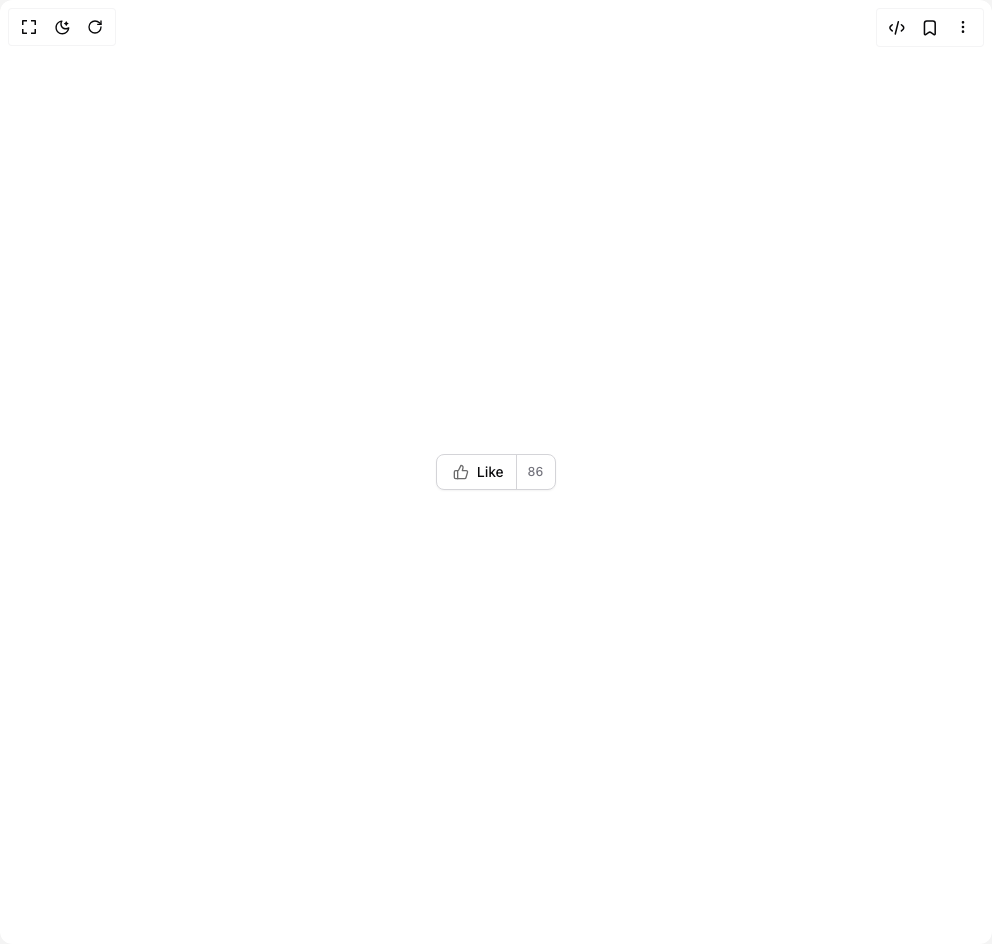

# Build Button in BuilderStudio

> Build this component in our Agentic IDE: [BuilderStudio](https://builderstudio.dev).
>
> Join the BuilderStudio community on [Discord](https://discord.gg/QdWeSGCqfe) and [Reddit](https://reddit.com/r/builderstudio).



## Component

- Author group: `originui`
- Component: `button`
- Variant: `button-with-separate-number`
- Rendered HTML snapshot: [`rendered.html`](rendered.html)

## BuilderStudio prompt

You are implementing a React component based on a component reference.

## Component identity

- Author: originui
- Component slug: button
- Demo slug: button-with-separate-number
- Title: button
- Description: 

## Goal

Recreate this component in a React + TypeScript + Tailwind CSS project. Preserve the visual layout, spacing, colors, border radius, shadows, interaction behavior, animation behavior, responsive behavior, and dark mode behavior shown in the rendered demo.

## Implementation requirements

- Use React and TypeScript.
- Use Tailwind CSS classes whenever possible.
- Keep the component self-contained unless the source files require helper components.
- If the source uses CSS variables, custom CSS, animations, or keyframes, include them.
- If the source uses external packages, list and use the required packages.
- Preserve accessibility attributes, button semantics, links, keyboard behavior, and ARIA attributes when visible in the source.
- Do not replace the component with a simplified placeholder.
- Return complete production-ready code.

## Dependencies

No reference metadata available.

## Rendered DOM snapshot

This is the rendered demo HTML extracted from the live preview. Use it to verify structure, class names, visible content, and layout.

```html
<div id="root"><div class="relative flex items-center justify-center h-screen w-full m-auto p-16 bg-background text-foreground"><div class="absolute lab-bg inset-0 size-full"><div class="absolute inset-0 bg-[radial-gradient(#00000021_1px,transparent_1px)] dark:bg-[radial-gradient(#ffffff22_1px,transparent_1px)]"></div></div><div class="flex w-full justify-center relative"><button class="inline-flex items-center justify-center whitespace-nowrap rounded-lg text-sm font-medium transition-colors outline-offset-2 focus-visible:outline-2 focus-visible:outline-ring/70 disabled:pointer-events-none disabled:opacity-50 [&amp;_svg]:pointer-events-none [&amp;_svg]:shrink-0 border border-input bg-background shadow-sm shadow-black/5 hover:bg-accent hover:text-accent-foreground h-9 px-4 py-0 pe-0"><svg xmlns="http://www.w3.org/2000/svg" width="16" height="16" viewBox="0 0 24 24" fill="none" stroke="currentColor" stroke-width="2" stroke-linecap="round" stroke-linejoin="round" class="lucide lucide-thumbs-up me-2 opacity-60" aria-hidden="true"><path d="M7 10v12"></path><path d="M15 5.88 14 10h5.83a2 2 0 0 1 1.92 2.56l-2.33 8A2 2 0 0 1 17.5 22H4a2 2 0 0 1-2-2v-8a2 2 0 0 1 2-2h2.76a2 2 0 0 0 1.79-1.11L12 2a3.13 3.13 0 0 1 3 3.88Z"></path></svg>Like<span class="relative ms-3 inline-flex h-full items-center justify-center rounded-full px-3 text-xs font-medium text-muted-foreground before:absolute before:inset-0 before:left-0 before:w-px before:bg-input">86</span></button></div></div></div>
```

## Reference source files

No reference source files were available.
