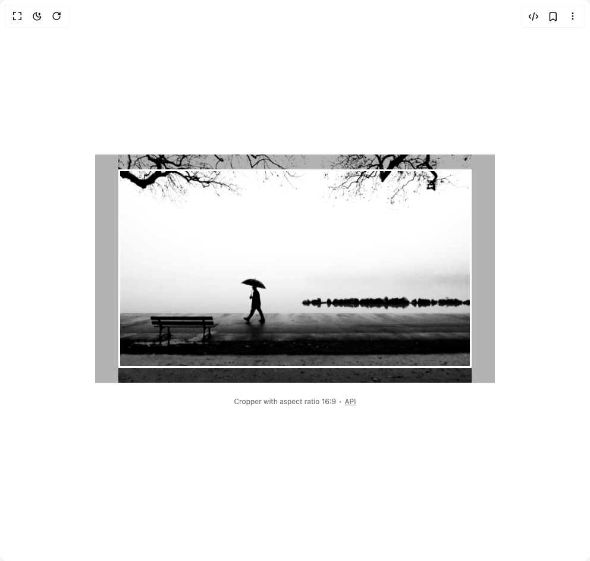

# Build Image Crop in BuilderStudio

> Build this component in our Agentic IDE: [BuilderStudio](https://builderstudio.dev).
>
> Join the BuilderStudio community on [Discord](https://discord.gg/QdWeSGCqfe) and [Reddit](https://reddit.com/r/builderstudio).



## Component

- Author group: `originui`
- Component: `image-crop`
- Variant: `image-cropper-1`
- Rendered HTML snapshot: [`rendered.html`](rendered.html)

## BuilderStudio prompt

You are implementing a React component based on a component reference.

## Component identity

- Author: originui
- Component slug: image-crop
- Demo slug: image-cropper-1
- Title: image-crop
- Description: 

## Goal

Recreate this component in a React + TypeScript + Tailwind CSS project. Preserve the visual layout, spacing, colors, border radius, shadows, interaction behavior, animation behavior, responsive behavior, and dark mode behavior shown in the rendered demo.

## Implementation requirements

- Use React and TypeScript.
- Use Tailwind CSS classes whenever possible.
- Keep the component self-contained unless the source files require helper components.
- If the source uses CSS variables, custom CSS, animations, or keyframes, include them.
- If the source uses external packages, list and use the required packages.
- Preserve accessibility attributes, button semantics, links, keyboard behavior, and ARIA attributes when visible in the source.
- Do not replace the component with a simplified placeholder.
- Return complete production-ready code.

## Dependencies

No reference metadata available.

## Rendered DOM snapshot

This is the rendered demo HTML extracted from the live preview. Use it to verify structure, class names, visible content, and layout.

```html
<div id="root"><div class="w-screen min-h-screen flex justify-center items-center"><div class="w-screen min-h-screen flex justify-center items-center"><div class="flex min-h-screen w-full flex-col items-center justify-center gap-4 bg-background p-8"><div class="relative flex cursor-move touch-none items-center justify-center overflow-hidden focus:outline-none h-96 w-full max-w-2xl" tabindex="0" role="application" aria-label="Interactive image cropper" aria-describedby="«r0»" aria-valuemin="1" aria-valuemax="3" aria-valuenow="1" aria-valuetext="Zoom: 100%" data-slot="cropper"><div id="«r0»" class="sr-only" data-slot="cropper-description">Use mouse wheel or pinch gesture to zoom. Drag with mouse or touch, or use arrow keys to pan the image within the crop area.</div><div style="width: 593.778px; height: 395.01px; transform: translate3d(0px, 0px, 0px) scale(1); position: absolute; left: calc(50% - 296.889px); top: calc(50% - 197.505px); will-change: transform;"></div><div aria-hidden="true" class="pointer-events-none absolute border-3 border-white shadow-[0_0_0_9999px_rgba(0,0,0,0.3)] in-[[data-slot=cropper]:focus-visible]:ring-[3px] in-[[data-slot=cropper]:focus-visible]:ring-white/50" data-slot="cropper-crop-area" style="width: 593.778px; height: 334px;"></div></div><p aria-live="polite" role="region" class="text-muted-foreground mt-2 text-xs">Cropper with aspect ratio 16:9 ∙ <a href="https://github.com/origin-space/image-cropper" class="hover:text-foreground underline" target="_blank">API</a></p></div></div></div></div>
```

## Reference source files

No reference source files were available.
