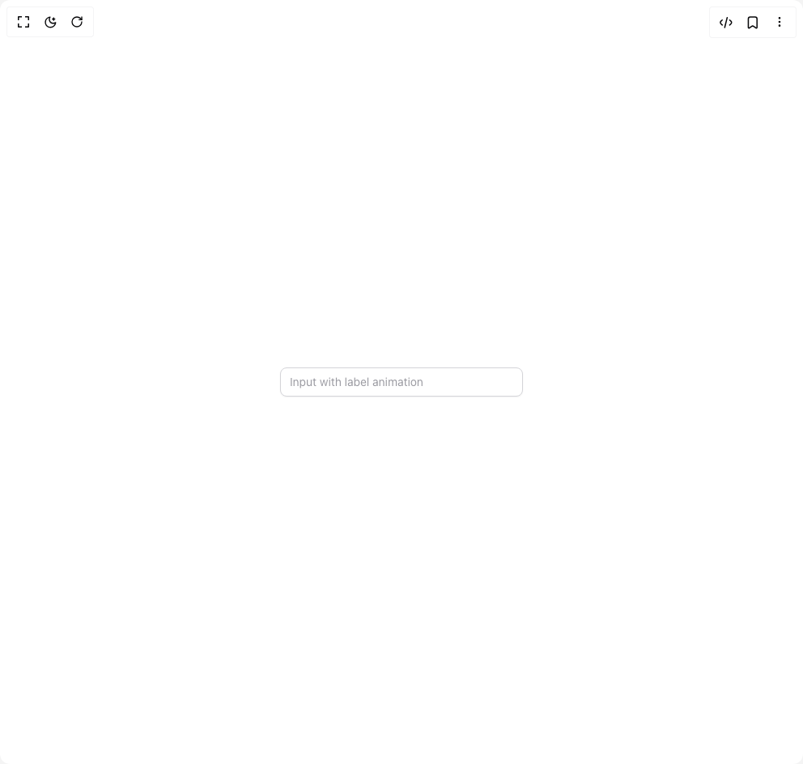

# Build Input in BuilderStudio

> Build this component in our Agentic IDE: [BuilderStudio](https://builderstudio.dev).
>
> Join the BuilderStudio community on [Discord](https://discord.gg/QdWeSGCqfe) and [Reddit](https://reddit.com/r/builderstudio).



## Component

- Author group: `originui`
- Component: `input`
- Variant: `input-with-label-animation`
- Rendered HTML snapshot: [`rendered.html`](rendered.html)

## BuilderStudio prompt

You are implementing a React component based on a component reference.

## Component identity

- Author: originui
- Component slug: input
- Demo slug: input-with-label-animation
- Title: input
- Description: 

## Goal

Recreate this component in a React + TypeScript + Tailwind CSS project. Preserve the visual layout, spacing, colors, border radius, shadows, interaction behavior, animation behavior, responsive behavior, and dark mode behavior shown in the rendered demo.

## Implementation requirements

- Use React and TypeScript.
- Use Tailwind CSS classes whenever possible.
- Keep the component self-contained unless the source files require helper components.
- If the source uses CSS variables, custom CSS, animations, or keyframes, include them.
- If the source uses external packages, list and use the required packages.
- Preserve accessibility attributes, button semantics, links, keyboard behavior, and ARIA attributes when visible in the source.
- Do not replace the component with a simplified placeholder.
- Return complete production-ready code.

## Dependencies

No reference metadata available.

## Rendered DOM snapshot

This is the rendered demo HTML extracted from the live preview. Use it to verify structure, class names, visible content, and layout.

```html
<div id="root"><div class="relative flex items-center justify-center h-screen w-full m-auto p-16 bg-background text-foreground"><div class="absolute lab-bg inset-0 size-full"><div class="absolute inset-0 bg-[radial-gradient(#00000021_1px,transparent_1px)] dark:bg-[radial-gradient(#ffffff22_1px,transparent_1px)]"></div></div><div class="flex w-full justify-center relative"><div class="group relative min-w-[300px]"><label for="«r0»" class="origin-start absolute top-1/2 block -translate-y-1/2 cursor-text px-1 text-sm text-muted-foreground/70 transition-all group-focus-within:pointer-events-none group-focus-within:top-0 group-focus-within:cursor-default group-focus-within:text-xs group-focus-within:font-medium group-focus-within:text-foreground has-[+input:not(:placeholder-shown)]:pointer-events-none has-[+input:not(:placeholder-shown)]:top-0 has-[+input:not(:placeholder-shown)]:cursor-default has-[+input:not(:placeholder-shown)]:text-xs has-[+input:not(:placeholder-shown)]:font-medium has-[+input:not(:placeholder-shown)]:text-foreground"><span class="inline-flex bg-background px-2">Input with label animation</span></label><input class="flex h-9 w-full rounded-lg border border-input bg-background px-3 py-2 text-sm text-foreground shadow-sm shadow-black/5 transition-shadow placeholder:text-muted-foreground/70 focus-visible:border-ring focus-visible:outline-none focus-visible:ring-[3px] focus-visible:ring-ring/20 disabled:cursor-not-allowed disabled:opacity-50" id="«r0»" placeholder="" type="email"></div></div></div></div>
```

## Reference source files

No reference source files were available.
