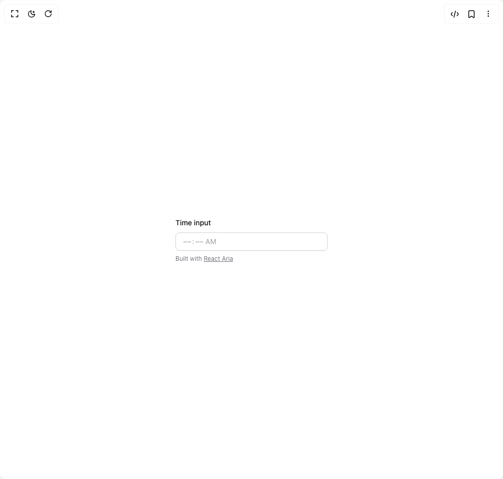

# Build Input in BuilderStudio

> Build this component in our Agentic IDE: [BuilderStudio](https://builderstudio.dev).
>
> Join the BuilderStudio community on [Discord](https://discord.gg/QdWeSGCqfe) and [Reddit](https://reddit.com/r/builderstudio).



## Component

- Author group: `originui`
- Component: `input`
- Variant: `time-input`
- Rendered HTML snapshot: [`rendered.html`](rendered.html)

## BuilderStudio prompt

You are implementing a React component based on a component reference.

## Component identity

- Author: originui
- Component slug: input
- Demo slug: time-input
- Title: input
- Description: 

## Goal

Recreate this component in a React + TypeScript + Tailwind CSS project. Preserve the visual layout, spacing, colors, border radius, shadows, interaction behavior, animation behavior, responsive behavior, and dark mode behavior shown in the rendered demo.

## Implementation requirements

- Use React and TypeScript.
- Use Tailwind CSS classes whenever possible.
- Keep the component self-contained unless the source files require helper components.
- If the source uses CSS variables, custom CSS, animations, or keyframes, include them.
- If the source uses external packages, list and use the required packages.
- Preserve accessibility attributes, button semantics, links, keyboard behavior, and ARIA attributes when visible in the source.
- Do not replace the component with a simplified placeholder.
- Return complete production-ready code.

## Dependencies

No reference metadata available.

## Rendered DOM snapshot

This is the rendered demo HTML extracted from the live preview. Use it to verify structure, class names, visible content, and layout.

```html
<div id="root"><div class="relative flex items-center justify-center h-screen w-full m-auto p-16 bg-background text-foreground"><div class="absolute lab-bg inset-0 size-full"><div class="absolute inset-0 bg-[radial-gradient(#00000021_1px,transparent_1px)] dark:bg-[radial-gradient(#ffffff22_1px,transparent_1px)]"></div></div><div class="flex w-full justify-center relative"><div class="min-w-[300px] space-y-2" data-rac=""><span class="text-sm font-medium text-foreground" id="react-aria2151915632-«r1»">Time input</span><div id="react-aria2151915632-«r0»" aria-labelledby="react-aria2151915632-«r1»" role="group" data-react-aria-pressable="true" class="relative inline-flex h-9 w-full items-center overflow-hidden whitespace-nowrap rounded-lg border border-input bg-background px-3 py-2 text-sm shadow-sm shadow-black/5 transition-shadow data-[focus-within]:border-ring data-[disabled]:opacity-50 data-[focus-within]:outline-none data-[focus-within]:ring-[3px] data-[focus-within]:ring-ring/20" data-rac="" style="unicode-bidi: isolate;"><span aria-hidden="true" class="inline rounded p-0.5 text-foreground caret-transparent outline outline-0 data-[disabled]:cursor-not-allowed data-[focused]:bg-accent data-[invalid]:data-[focused]:bg-destructive data-[type=literal]:px-0 data-[focused]:data-[placeholder]:text-foreground data-[focused]:text-foreground data-[invalid]:data-[focused]:data-[placeholder]:text-destructive-foreground data-[invalid]:data-[focused]:text-destructive-foreground data-[invalid]:data-[placeholder]:text-destructive data-[invalid]:text-destructive data-[placeholder]:text-muted-foreground/70 data-[type=literal]:text-muted-foreground/70 data-[disabled]:opacity-50" data-rac="" data-readonly="true" data-type="literal">⁦</span><span role="spinbutton" aria-valuenow="0" aria-valuetext="Empty" aria-valuemin="0" aria-valuemax="11" id="react-aria2151915632-«r7»" aria-label="hour, " aria-labelledby="react-aria2151915632-«r7» react-aria2151915632-«r1»" data-placeholder="true" contenteditable="true" spellcheck="false" autocorrect="off" enterkeyhint="next" inputmode="numeric" tabindex="0" class="inline rounded p-0.5 text-foreground caret-transparent outline outline-0 data-[disabled]:cursor-not-allowed data-[focused]:bg-accent data-[invalid]:data-[focused]:bg-destructive data-[type=literal]:px-0 data-[focused]:data-[placeholder]:text-foreground data-[focused]:text-foreground data-[invalid]:data-[focused]:data-[placeholder]:text-destructive-foreground data-[invalid]:data-[focused]:text-destructive-foreground data-[invalid]:data-[placeholder]:text-destructive data-[invalid]:text-destructive data-[placeholder]:text-muted-foreground/70 data-[type=literal]:text-muted-foreground/70 data-[disabled]:opacity-50" data-rac="" data-type="hour" style="caret-color: transparent;">––</span><span aria-hidden="true" class="inline rounded p-0.5 text-foreground caret-transparent outline outline-0 data-[disabled]:cursor-not-allowed data-[focused]:bg-accent data-[invalid]:data-[focused]:bg-destructive data-[type=literal]:px-0 data-[focused]:data-[placeholder]:text-foreground data-[focused]:text-foreground data-[invalid]:data-[focused]:data-[placeholder]:text-destructive-foreground data-[invalid]:data-[focused]:text-destructive-foreground data-[invalid]:data-[placeholder]:text-destructive data-[invalid]:text-destructive data-[placeholder]:text-muted-foreground/70 data-[type=literal]:text-muted-foreground/70 data-[disabled]:opacity-50" data-rac="" data-readonly="true" data-type="literal">:</span><span role="spinbutton" aria-valuenow="0" aria-valuetext="Empty" aria-valuemin="0" aria-valuemax="59" id="react-aria2151915632-«rb»" aria-label="minute, " aria-labelledby="react-aria2151915632-«rb» react-aria2151915632-«r1»" data-placeholder="true" contenteditable="true" spellcheck="false" autocorrect="off" enterkeyhint="next" inputmode="numeric" tabindex="0" class="inline rounded p-0.5 text-foreground caret-transparent outline outline-0 data-[disabled]:cursor-not-allowed data-[focused]:bg-accent data-[invalid]:data-[focused]:bg-destructive data-[type=literal]:px-0 data-[focused]:data-[placeholder]:text-foreground data-[focused]:text-foreground data-[invalid]:data-[focused]:data-[placeholder]:text-destructive-foreground data-[invalid]:data-[focused]:text-destructive-foreground data-[invalid]:data-[placeholder]:text-destructive data-[invalid]:text-destructive data-[placeholder]:text-muted-foreground/70 data-[type=literal]:text-muted-foreground/70 data-[disabled]:opacity-50" data-rac="" data-type="minute" style="caret-color: transparent;">––</span><span aria-hidden="true" class="inline rounded p-0.5 text-foreground caret-transparent outline outline-0 data-[disabled]:cursor-not-allowed data-[focused]:bg-accent data-[invalid]:data-[focused]:bg-destructive data-[type=literal]:px-0 data-[focused]:data-[placeholder]:text-foreground data-[focused]:text-foreground data-[invalid]:data-[focused]:data-[placeholder]:text-destructive-foreground data-[invalid]:data-[focused]:text-destructive-foreground data-[invalid]:data-[placeholder]:text-destructive data-[invalid]:text-destructive data-[placeholder]:text-muted-foreground/70 data-[type=literal]:text-muted-foreground/70 data-[disabled]:opacity-50" data-rac="" data-readonly="true" data-type="literal">⁩</span><span aria-hidden="true" class="inline rounded p-0.5 text-foreground caret-transparent outline outline-0 data-[disabled]:cursor-not-allowed data-[focused]:bg-accent data-[invalid]:data-[focused]:bg-destructive data-[type=literal]:px-0 data-[focused]:data-[placeholder]:text-foreground data-[focused]:text-foreground data-[invalid]:data-[focused]:data-[placeholder]:text-destructive-foreground data-[invalid]:data-[focused]:text-destructive-foreground data-[invalid]:data-[placeholder]:text-destructive data-[invalid]:text-destructive data-[placeholder]:text-muted-foreground/70 data-[type=literal]:text-muted-foreground/70 data-[disabled]:opacity-50" data-rac="" data-readonly="true" data-type="literal"> </span><span role="spinbutton" aria-valuenow="0" aria-valuetext="Empty" aria-valuemin="0" aria-valuemax="12" id="react-aria2151915632-«rh»" aria-label="AM/PM, " aria-labelledby="react-aria2151915632-«rh» react-aria2151915632-«r1»" data-placeholder="true" contenteditable="true" spellcheck="false" autocorrect="off" enterkeyhint="next" tabindex="0" class="inline rounded p-0.5 text-foreground caret-transparent outline outline-0 data-[disabled]:cursor-not-allowed data-[focused]:bg-accent data-[invalid]:data-[focused]:bg-destructive data-[type=literal]:px-0 data-[focused]:data-[placeholder]:text-foreground data-[focused]:text-foreground data-[invalid]:data-[focused]:data-[placeholder]:text-destructive-foreground data-[invalid]:data-[focused]:text-destructive-foreground data-[invalid]:data-[placeholder]:text-destructive data-[invalid]:text-destructive data-[placeholder]:text-muted-foreground/70 data-[type=literal]:text-muted-foreground/70 data-[disabled]:opacity-50" data-rac="" data-type="dayPeriod" style="caret-color: transparent;">AM</span></div><input hidden="" class="react-aria-Input" data-rac="" type="text" value="" title=""><p class="mt-2 text-xs text-muted-foreground" role="region" aria-live="polite">Built with <a class="underline hover:text-foreground" href="https://react-spectrum.adobe.com/react-aria/DateField.html" target="_blank" rel="noopener nofollow">React Aria</a></p></div></div></div></div>
```

## Reference source files

No reference source files were available.
