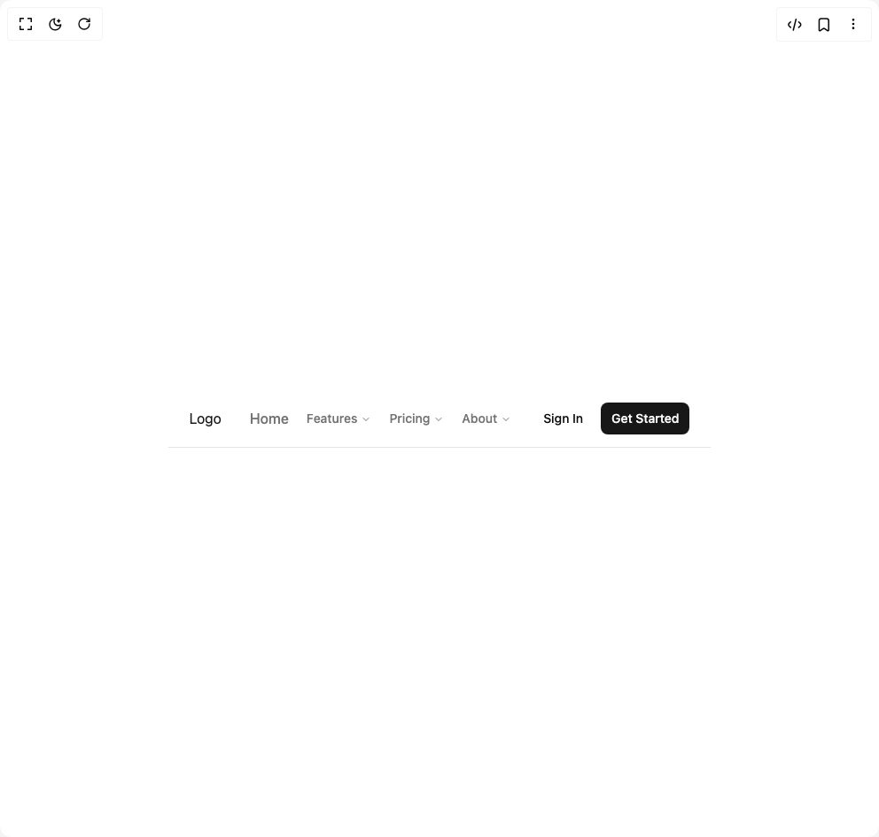

# Build Navigation Menu 4 in BuilderStudio

> Build this component in our Agentic IDE: [BuilderStudio](https://builderstudio.dev).
>
> Join the BuilderStudio community on [Discord](https://discord.gg/QdWeSGCqfe) and [Reddit](https://reddit.com/r/builderstudio).



## Component

- Author group: `originui`
- Component: `navigation-menu-4`
- Variant: `default`
- Rendered HTML snapshot: [`rendered.html`](rendered.html)

## BuilderStudio prompt

You are implementing a React component based on a component reference.

## Component identity

- Author: originui
- Component slug: navigation-menu-4
- Demo slug: default
- Title: navigation-menu-4
- Description: 

## Goal

Recreate this component in a React + TypeScript + Tailwind CSS project. Preserve the visual layout, spacing, colors, border radius, shadows, interaction behavior, animation behavior, responsive behavior, and dark mode behavior shown in the rendered demo.

## Implementation requirements

- Use React and TypeScript.
- Use Tailwind CSS classes whenever possible.
- Keep the component self-contained unless the source files require helper components.
- If the source uses CSS variables, custom CSS, animations, or keyframes, include them.
- If the source uses external packages, list and use the required packages.
- Preserve accessibility attributes, button semantics, links, keyboard behavior, and ARIA attributes when visible in the source.
- Do not replace the component with a simplified placeholder.
- Return complete production-ready code.

## Dependencies

No reference metadata available.

## Rendered DOM snapshot

This is the rendered demo HTML extracted from the live preview. Use it to verify structure, class names, visible content, and layout.

```html
<div id="root"><div class="w-screen min-h-screen flex justify-center items-center"><div class="w-screen min-h-screen flex justify-center items-center"><header class="border-b px-4 md:px-6"><div class="flex h-16 items-center justify-between gap-4"><div class="flex items-center gap-2"><button class="inline-flex items-center justify-center whitespace-nowrap rounded-md text-sm font-medium ring-offset-background transition-colors focus-visible:outline-none focus-visible:ring-2 focus-visible:ring-ring focus-visible:ring-offset-2 disabled:pointer-events-none disabled:opacity-50 hover:bg-accent hover:text-accent-foreground group size-8 md:hidden" type="button" aria-haspopup="dialog" aria-expanded="false" aria-controls="radix-«r0»" data-state="closed"><svg class="pointer-events-none" width="16" height="16" viewBox="0 0 24 24" fill="none" stroke="currentColor" stroke-width="2" stroke-linecap="round" stroke-linejoin="round" xmlns="http://www.w3.org/2000/svg"><path d="M4 12L20 12" class="origin-center -translate-y-[7px] transition-all duration-300 ease-[cubic-bezier(.5,.85,.25,1.1)] group-aria-expanded:translate-x-0 group-aria-expanded:translate-y-0 group-aria-expanded:rotate-[315deg]"></path><path d="M4 12H20" class="origin-center transition-all duration-300 ease-[cubic-bezier(.5,.85,.25,1.8)] group-aria-expanded:rotate-45"></path><path d="M4 12H20" class="origin-center translate-y-[7px] transition-all duration-300 ease-[cubic-bezier(.5,.85,.25,1.1)] group-aria-expanded:translate-y-0 group-aria-expanded:rotate-[135deg]"></path></svg></button><div class="flex items-center gap-6"><a href="#" class="text-primary hover:text-primary/90">Logo</a><div class="max-md:hidden"><nav aria-label="Main" data-orientation="horizontal" dir="ltr" class="relative z-10 flex max-w-max flex-1 items-center justify-center"><div style="position: relative;"><ul data-orientation="horizontal" class="group flex flex-1 list-none items-center justify-center space-x-1" dir="ltr"><li><a href="#" class="text-muted-foreground hover:text-primary py-1.5 px-2 font-medium" data-radix-collection-item="">Home</a></li><li><button id="radix-«r1»-trigger-radix-«r3»" data-state="closed" aria-expanded="false" aria-controls="radix-«r1»-content-radix-«r3»" class="group inline-flex h-10 w-max items-center justify-center rounded-md text-sm transition-colors hover:bg-accent focus:bg-accent focus:text-accent-foreground focus:outline-none disabled:pointer-events-none disabled:opacity-50 data-[active]:bg-accent/50 data-[state=open]:bg-accent/50 group text-muted-foreground hover:text-primary bg-transparent px-2 py-1.5 font-medium" data-radix-collection-item="">Features <svg xmlns="http://www.w3.org/2000/svg" width="24" height="24" viewBox="0 0 24 24" fill="none" stroke="currentColor" stroke-width="2" stroke-linecap="round" stroke-linejoin="round" class="lucide lucide-chevron-down relative top-[1px] ml-1 h-3 w-3 transition duration-200 group-data-[state=open]:rotate-180" aria-hidden="true"><path d="m6 9 6 6 6-6"></path></svg></button></li><li><button id="radix-«r1»-trigger-radix-«r4»" data-state="closed" aria-expanded="false" aria-controls="radix-«r1»-content-radix-«r4»" class="group inline-flex h-10 w-max items-center justify-center rounded-md text-sm transition-colors hover:bg-accent focus:bg-accent focus:text-accent-foreground focus:outline-none disabled:pointer-events-none disabled:opacity-50 data-[active]:bg-accent/50 data-[state=open]:bg-accent/50 group text-muted-foreground hover:text-primary bg-transparent px-2 py-1.5 font-medium" data-radix-collection-item="">Pricing <svg xmlns="http://www.w3.org/2000/svg" width="24" height="24" viewBox="0 0 24 24" fill="none" stroke="currentColor" stroke-width="2" stroke-linecap="round" stroke-linejoin="round" class="lucide lucide-chevron-down relative top-[1px] ml-1 h-3 w-3 transition duration-200 group-data-[state=open]:rotate-180" aria-hidden="true"><path d="m6 9 6 6 6-6"></path></svg></button></li><li><button id="radix-«r1»-trigger-radix-«r5»" data-state="closed" aria-expanded="false" aria-controls="radix-«r1»-content-radix-«r5»" class="group inline-flex h-10 w-max items-center justify-center rounded-md text-sm transition-colors hover:bg-accent focus:bg-accent focus:text-accent-foreground focus:outline-none disabled:pointer-events-none disabled:opacity-50 data-[active]:bg-accent/50 data-[state=open]:bg-accent/50 group text-muted-foreground hover:text-primary bg-transparent px-2 py-1.5 font-medium" data-radix-collection-item="">About <svg xmlns="http://www.w3.org/2000/svg" width="24" height="24" viewBox="0 0 24 24" fill="none" stroke="currentColor" stroke-width="2" stroke-linecap="round" stroke-linejoin="round" class="lucide lucide-chevron-down relative top-[1px] ml-1 h-3 w-3 transition duration-200 group-data-[state=open]:rotate-180" aria-hidden="true"><path d="m6 9 6 6 6-6"></path></svg></button></li></ul></div><div class="absolute left-0 top-full flex justify-center"></div><div class="absolute left-0 top-full flex justify-center"></div></nav></div></div></div><div class="flex items-center gap-2"><a href="#" class="inline-flex items-center justify-center whitespace-nowrap font-medium ring-offset-background transition-colors focus-visible:outline-none focus-visible:ring-2 focus-visible:ring-ring focus-visible:ring-offset-2 disabled:pointer-events-none disabled:opacity-50 hover:bg-accent hover:text-accent-foreground h-9 rounded-md px-3 text-sm">Sign In</a><a href="#" class="inline-flex items-center justify-center whitespace-nowrap font-medium ring-offset-background transition-colors focus-visible:outline-none focus-visible:ring-2 focus-visible:ring-ring focus-visible:ring-offset-2 disabled:pointer-events-none disabled:opacity-50 bg-primary text-primary-foreground hover:bg-primary/90 h-9 rounded-md px-3 text-sm">Get Started</a></div></div></header></div></div></div>
```

## Reference source files

No reference source files were available.
