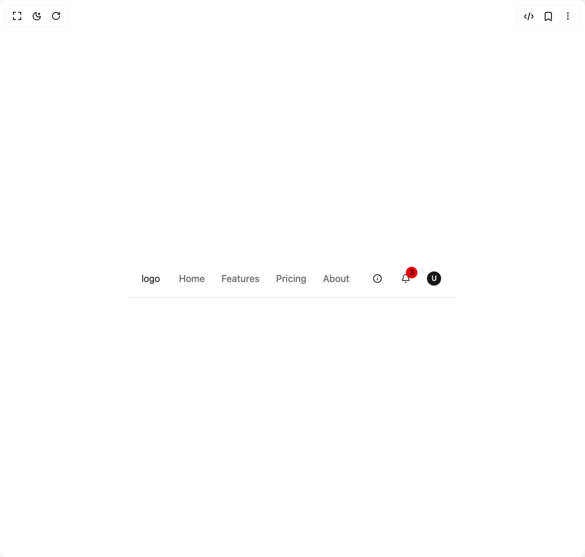

# Build Navigation Menu 4 in BuilderStudio

> Build this component in our Agentic IDE: [BuilderStudio](https://builderstudio.dev).
>
> Join the BuilderStudio community on [Discord](https://discord.gg/QdWeSGCqfe) and [Reddit](https://reddit.com/r/builderstudio).



## Component

- Author group: `originui`
- Component: `navigation-menu-4`
- Variant: `navbar3`
- Rendered HTML snapshot: [`rendered.html`](rendered.html)

## BuilderStudio prompt

You are implementing a React component based on a component reference.

## Component identity

- Author: originui
- Component slug: navigation-menu-4
- Demo slug: navbar3
- Title: navigation-menu-4
- Description: 

## Goal

Recreate this component in a React + TypeScript + Tailwind CSS project. Preserve the visual layout, spacing, colors, border radius, shadows, interaction behavior, animation behavior, responsive behavior, and dark mode behavior shown in the rendered demo.

## Implementation requirements

- Use React and TypeScript.
- Use Tailwind CSS classes whenever possible.
- Keep the component self-contained unless the source files require helper components.
- If the source uses CSS variables, custom CSS, animations, or keyframes, include them.
- If the source uses external packages, list and use the required packages.
- Preserve accessibility attributes, button semantics, links, keyboard behavior, and ARIA attributes when visible in the source.
- Do not replace the component with a simplified placeholder.
- Return complete production-ready code.

## Dependencies

No reference metadata available.

## Rendered DOM snapshot

This is the rendered demo HTML extracted from the live preview. Use it to verify structure, class names, visible content, and layout.

```html
<div id="root"><div class="w-screen min-h-screen flex justify-center items-center"><div class="w-screen min-h-screen flex justify-center items-center"><header class="border-b px-4 md:px-6"><div class="flex h-16 items-center justify-between gap-8"><div class="flex items-center gap-6"><button class="inline-flex items-center justify-center whitespace-nowrap rounded-md text-sm font-medium ring-offset-background transition-colors focus-visible:outline-none focus-visible:ring-2 focus-visible:ring-ring focus-visible:ring-offset-2 disabled:pointer-events-none disabled:opacity-50 hover:bg-accent hover:text-accent-foreground group size-8 md:hidden" type="button" aria-haspopup="dialog" aria-expanded="false" aria-controls="radix-«r0»" data-state="closed"><svg class="pointer-events-none" width="16" height="16" viewBox="0 0 24 24" fill="none" stroke="currentColor" stroke-width="2" stroke-linecap="round" stroke-linejoin="round" xmlns="http://www.w3.org/2000/svg"><path d="M4 12L20 12" class="origin-center -translate-y-[7px] transition-all duration-300 ease-[cubic-bezier(.5,.85,.25,1.1)] group-aria-expanded:translate-x-0 group-aria-expanded:translate-y-0 group-aria-expanded:rotate-[315deg]"></path><path d="M4 12H20" class="origin-center transition-all duration-300 ease-[cubic-bezier(.5,.85,.25,1.8)] group-aria-expanded:rotate-45"></path><path d="M4 12H20" class="origin-center translate-y-[7px] transition-all duration-300 ease-[cubic-bezier(.5,.85,.25,1.1)] group-aria-expanded:translate-y-0 group-aria-expanded:rotate-[135deg]"></path></svg></button><div class="flex items-center gap-8"><a href="#" class="text-primary hover:text-primary/90"><h2>logo</h2></a><nav aria-label="Main" data-orientation="horizontal" dir="ltr" class="relative z-10 flex max-w-max flex-1 items-center justify-center max-md:hidden"><div style="position: relative;"><ul data-orientation="horizontal" class="group flex flex-1 list-none items-center justify-center space-x-1 gap-6" dir="ltr"><li><a href="#" class="text-muted-foreground hover:text-primary py-1.5 font-medium" data-radix-collection-item="">Home</a></li><li><a href="#" class="text-muted-foreground hover:text-primary py-1.5 font-medium" data-radix-collection-item="">Features</a></li><li><a href="#" class="text-muted-foreground hover:text-primary py-1.5 font-medium" data-radix-collection-item="">Pricing</a></li><li><a href="#" class="text-muted-foreground hover:text-primary py-1.5 font-medium" data-radix-collection-item="">About</a></li></ul></div><div class="absolute left-0 top-full flex justify-center"></div></nav></div></div><div class="flex items-center gap-4"><div class="flex items-center gap-4"><button class="inline-flex items-center justify-center whitespace-nowrap rounded-md text-sm font-medium ring-offset-background transition-colors focus-visible:outline-none focus-visible:ring-2 focus-visible:ring-ring focus-visible:ring-offset-2 disabled:pointer-events-none disabled:opacity-50 hover:bg-accent hover:text-accent-foreground size-8" type="button" id="radix-«r6»" aria-haspopup="menu" aria-expanded="false" data-state="closed"><svg xmlns="http://www.w3.org/2000/svg" width="24" height="24" viewBox="0 0 24 24" fill="none" stroke="currentColor" stroke-width="2" stroke-linecap="round" stroke-linejoin="round" class="lucide lucide-info h-4 w-4" aria-hidden="true"><circle cx="12" cy="12" r="10"></circle><path d="M12 16v-4"></path><path d="M12 8h.01"></path></svg></button><button class="inline-flex items-center justify-center whitespace-nowrap rounded-md text-sm font-medium ring-offset-background transition-colors focus-visible:outline-none focus-visible:ring-2 focus-visible:ring-ring focus-visible:ring-offset-2 disabled:pointer-events-none disabled:opacity-50 hover:bg-accent hover:text-accent-foreground size-8 relative" type="button" id="radix-«r8»" aria-haspopup="menu" aria-expanded="false" data-state="closed"><svg xmlns="http://www.w3.org/2000/svg" width="24" height="24" viewBox="0 0 24 24" fill="none" stroke="currentColor" stroke-width="2" stroke-linecap="round" stroke-linejoin="round" class="lucide lucide-bell h-4 w-4" aria-hidden="true"><path d="M10.268 21a2 2 0 0 0 3.464 0"></path><path d="M3.262 15.326A1 1 0 0 0 4 17h16a1 1 0 0 0 .74-1.673C19.41 13.956 18 12.499 18 8A6 6 0 0 0 6 8c0 4.499-1.411 5.956-2.738 7.326"></path></svg><div class="border font-medium transition-colors outline-offset-2 focus-visible:outline-2 focus-visible:outline-ring/70 border-transparent bg-destructive text-destructive-foreground absolute -top-1 -right-1 h-5 w-5 rounded-full p-0 text-xs flex items-center justify-center">3</div></button></div><button class="inline-flex items-center justify-center whitespace-nowrap text-sm font-medium ring-offset-background transition-colors focus-visible:outline-none focus-visible:ring-2 focus-visible:ring-ring focus-visible:ring-offset-2 disabled:pointer-events-none disabled:opacity-50 hover:bg-accent hover:text-accent-foreground size-8 rounded-full" type="button" id="radix-«ra»" aria-haspopup="menu" aria-expanded="false" data-state="closed"><div class="h-6 w-6 rounded-full bg-primary text-primary-foreground flex items-center justify-center text-xs font-medium">U</div></button></div></div></header></div></div></div>
```

## Reference source files

No reference source files were available.
