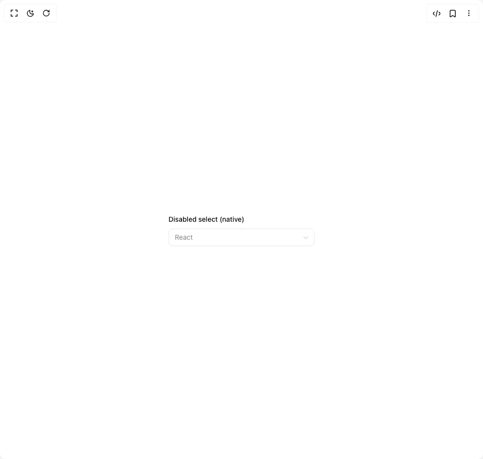

# Build Select Native in BuilderStudio

> Build this component in our Agentic IDE: [BuilderStudio](https://builderstudio.dev).
>
> Join the BuilderStudio community on [Discord](https://discord.gg/QdWeSGCqfe) and [Reddit](https://reddit.com/r/builderstudio).



## Component

- Author group: `originui`
- Component: `select-native`
- Variant: `disabled-select-native`
- Rendered HTML snapshot: [`rendered.html`](rendered.html)

## BuilderStudio prompt

You are implementing a React component based on a component reference.

## Component identity

- Author: originui
- Component slug: select-native
- Demo slug: disabled-select-native
- Title: select-native
- Description: 

## Goal

Recreate this component in a React + TypeScript + Tailwind CSS project. Preserve the visual layout, spacing, colors, border radius, shadows, interaction behavior, animation behavior, responsive behavior, and dark mode behavior shown in the rendered demo.

## Implementation requirements

- Use React and TypeScript.
- Use Tailwind CSS classes whenever possible.
- Keep the component self-contained unless the source files require helper components.
- If the source uses CSS variables, custom CSS, animations, or keyframes, include them.
- If the source uses external packages, list and use the required packages.
- Preserve accessibility attributes, button semantics, links, keyboard behavior, and ARIA attributes when visible in the source.
- Do not replace the component with a simplified placeholder.
- Return complete production-ready code.

## Dependencies

No reference metadata available.

## Rendered DOM snapshot

This is the rendered demo HTML extracted from the live preview. Use it to verify structure, class names, visible content, and layout.

```html
<div id="root"><div class="relative flex items-center justify-center h-screen w-full m-auto p-16 bg-background text-foreground"><div class="absolute lab-bg inset-0 size-full"><div class="absolute inset-0 bg-[radial-gradient(#00000021_1px,transparent_1px)] dark:bg-[radial-gradient(#ffffff22_1px,transparent_1px)]"></div></div><div class="flex w-full justify-center relative"><div class="space-y-2 min-w-[300px]"><label class="text-sm font-medium leading-4 text-foreground peer-disabled:cursor-not-allowed peer-disabled:opacity-70" for="«r0»">Disabled select (native)</label><div class="relative"><select class="peer inline-flex w-full cursor-pointer appearance-none items-center rounded-lg border border-input bg-background text-sm text-foreground shadow-sm shadow-black/5 transition-shadow focus-visible:border-ring focus-visible:outline-none focus-visible:ring-[3px] focus-visible:ring-ring/20 disabled:pointer-events-none disabled:cursor-not-allowed disabled:opacity-50 has-[option[disabled]:checked]:text-muted-foreground h-9 pe-8 ps-3" id="«r0»" disabled=""><option value="1">React</option><option value="2">Next.js</option><option value="3">Astro</option><option value="4">Gatsby</option></select><span class="pointer-events-none absolute inset-y-0 end-0 flex h-full w-9 items-center justify-center text-muted-foreground/80 peer-disabled:opacity-50"><svg width="15" height="15" viewBox="0 0 15 15" fill="none" xmlns="http://www.w3.org/2000/svg" class="h-4 w-4" stroke-width="2" aria-hidden="true"><path d="M3.13523 6.15803C3.3241 5.95657 3.64052 5.94637 3.84197 6.13523L7.5 9.56464L11.158 6.13523C11.3595 5.94637 11.6759 5.95657 11.8648 6.15803C12.0536 6.35949 12.0434 6.67591 11.842 6.86477L7.84197 10.6148C7.64964 10.7951 7.35036 10.7951 7.15803 10.6148L3.15803 6.86477C2.95657 6.67591 2.94637 6.35949 3.13523 6.15803Z" fill="currentColor" fill-rule="evenodd" clip-rule="evenodd"></path></svg></span></div></div></div></div></div>
```

## Reference source files

No reference source files were available.
