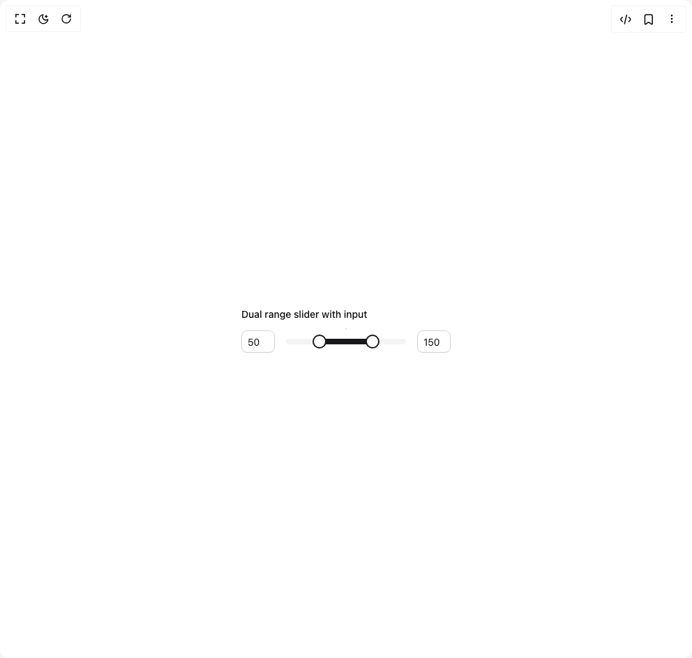

# Build Slider in BuilderStudio

> Build this component in our Agentic IDE: [BuilderStudio](https://builderstudio.dev).
>
> Join the BuilderStudio community on [Discord](https://discord.gg/QdWeSGCqfe) and [Reddit](https://reddit.com/r/builderstudio).



## Component

- Author group: `originui`
- Component: `slider`
- Variant: `dual-range-slider-with-input`
- Rendered HTML snapshot: [`rendered.html`](rendered.html)

## BuilderStudio prompt

You are implementing a React component based on a component reference.

## Component identity

- Author: originui
- Component slug: slider
- Demo slug: dual-range-slider-with-input
- Title: slider
- Description: 

## Goal

Recreate this component in a React + TypeScript + Tailwind CSS project. Preserve the visual layout, spacing, colors, border radius, shadows, interaction behavior, animation behavior, responsive behavior, and dark mode behavior shown in the rendered demo.

## Implementation requirements

- Use React and TypeScript.
- Use Tailwind CSS classes whenever possible.
- Keep the component self-contained unless the source files require helper components.
- If the source uses CSS variables, custom CSS, animations, or keyframes, include them.
- If the source uses external packages, list and use the required packages.
- Preserve accessibility attributes, button semantics, links, keyboard behavior, and ARIA attributes when visible in the source.
- Do not replace the component with a simplified placeholder.
- Return complete production-ready code.

## Dependencies

No reference metadata available.

## Rendered DOM snapshot

This is the rendered demo HTML extracted from the live preview. Use it to verify structure, class names, visible content, and layout.

```html
<div id="root"><div class="relative flex items-center justify-center h-screen w-full m-auto p-16 bg-background text-foreground"><div class="absolute lab-bg inset-0 size-full"><div class="absolute inset-0 bg-[radial-gradient(#00000021_1px,transparent_1px)] dark:bg-[radial-gradient(#ffffff22_1px,transparent_1px)]"></div></div><div class="flex w-full justify-center relative"><div class="space-y-3 min-w-[300px]"><label class="text-sm font-medium leading-4 text-foreground peer-disabled:cursor-not-allowed peer-disabled:opacity-70">Dual range slider with input</label><div class="flex items-center gap-4"><input class="flex rounded-lg border border-input bg-background text-sm text-foreground shadow-sm shadow-black/5 transition-shadow placeholder:text-muted-foreground/70 focus-visible:border-ring focus-visible:outline-none focus-visible:ring-[3px] focus-visible:ring-ring/20 disabled:cursor-not-allowed disabled:opacity-50 h-8 w-12 px-2 py-1" inputmode="decimal" aria-label="Enter minimum value" type="text" value="50"><span dir="ltr" data-orientation="horizontal" aria-disabled="false" class="relative flex w-full touch-none select-none items-center data-[orientation=vertical]:h-full data-[orientation=vertical]:w-auto data-[orientation=vertical]:flex-col data-[disabled]:opacity-50 grow" aria-label="Dual range slider with input" style="--radix-slider-thumb-transform: translateX(-50%);"><span data-orientation="horizontal" class="relative grow overflow-hidden rounded-full bg-secondary data-[orientation=horizontal]:h-2 data-[orientation=vertical]:h-full data-[orientation=horizontal]:w-full data-[orientation=vertical]:w-2"><span data-orientation="horizontal" class="absolute bg-primary data-[orientation=horizontal]:h-full data-[orientation=vertical]:w-full" style="left: 25%; right: 25%;"></span></span><span style="transform: var(--radix-slider-thumb-transform); position: absolute; left: calc(25% + 5px);"><span role="slider" aria-valuemin="0" aria-valuemax="200" aria-orientation="horizontal" data-orientation="horizontal" tabindex="0" class="block h-5 w-5 rounded-full border-2 border-primary bg-background transition-colors focus-visible:outline focus-visible:outline-[3px] focus-visible:outline-ring/40 data-[disabled]:cursor-not-allowed" data-radix-collection-item="" aria-label="Minimum" aria-valuenow="50" style=""></span></span><span style="transform: var(--radix-slider-thumb-transform); position: absolute; left: calc(75% - 5px);"><span role="slider" aria-valuemin="0" aria-valuemax="200" aria-orientation="horizontal" data-orientation="horizontal" tabindex="0" class="block h-5 w-5 rounded-full border-2 border-primary bg-background transition-colors focus-visible:outline focus-visible:outline-[3px] focus-visible:outline-ring/40 data-[disabled]:cursor-not-allowed" data-radix-collection-item="" aria-label="Maximum" aria-valuenow="150" style=""></span></span></span><input class="flex rounded-lg border border-input bg-background text-sm text-foreground shadow-sm shadow-black/5 transition-shadow placeholder:text-muted-foreground/70 focus-visible:border-ring focus-visible:outline-none focus-visible:ring-[3px] focus-visible:ring-ring/20 disabled:cursor-not-allowed disabled:opacity-50 h-8 w-12 px-2 py-1" inputmode="decimal" aria-label="Enter maximum value" type="text" value="150"></div></div></div></div></div>
```

## Reference source files

No reference source files were available.
