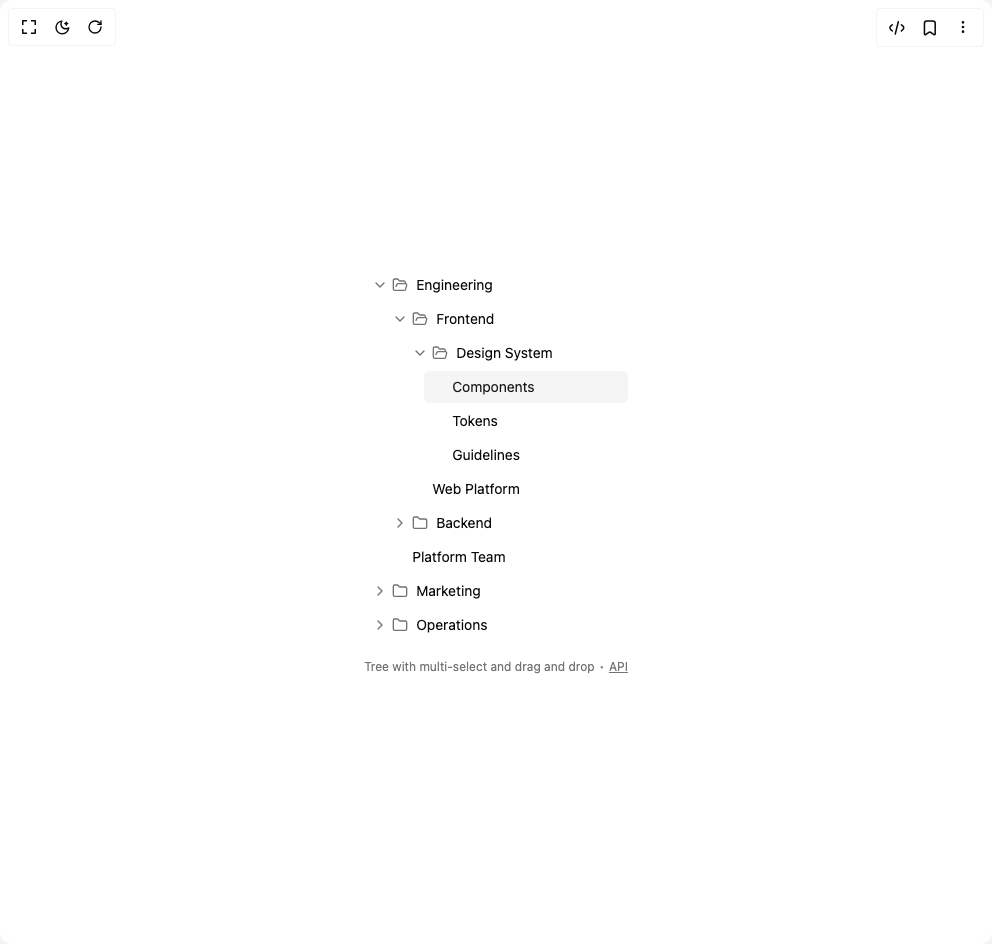

# Build Tree in BuilderStudio

> Build this component in our Agentic IDE: [BuilderStudio](https://builderstudio.dev).
>
> Join the BuilderStudio community on [Discord](https://discord.gg/QdWeSGCqfe) and [Reddit](https://reddit.com/r/builderstudio).



## Component

- Author group: `originui`
- Component: `tree`
- Variant: `tree-with-multi-select-and-drag-and-drop`
- Rendered HTML snapshot: [`rendered.html`](rendered.html)

## BuilderStudio prompt

You are implementing a React component based on a component reference.

## Component identity

- Author: originui
- Component slug: tree
- Demo slug: tree-with-multi-select-and-drag-and-drop
- Title: tree
- Description: 

## Goal

Recreate this component in a React + TypeScript + Tailwind CSS project. Preserve the visual layout, spacing, colors, border radius, shadows, interaction behavior, animation behavior, responsive behavior, and dark mode behavior shown in the rendered demo.

## Implementation requirements

- Use React and TypeScript.
- Use Tailwind CSS classes whenever possible.
- Keep the component self-contained unless the source files require helper components.
- If the source uses CSS variables, custom CSS, animations, or keyframes, include them.
- If the source uses external packages, list and use the required packages.
- Preserve accessibility attributes, button semantics, links, keyboard behavior, and ARIA attributes when visible in the source.
- Do not replace the component with a simplified placeholder.
- Return complete production-ready code.

## Dependencies

No reference metadata available.

## Rendered DOM snapshot

This is the rendered demo HTML extracted from the live preview. Use it to verify structure, class names, visible content, and layout.

```html
<div id="root"><div class="w-screen min-h-screen flex justify-center items-center"><div class="w-screen min-h-screen flex justify-center items-center"><div class="flex h-full flex-col gap-2 *:first:grow"><div data-slot="tree" class="flex flex-col" role="tree" aria-label="" style="position: relative; --tree-indent: 20px;"><span aria-live="assertive" style="position: absolute; margin: -1px; width: 1px; height: 1px; overflow: hidden; clip: rect(0px, 0px, 0px, 0px);">Press Control+Shift+KeyD to move selected items</span><button data-slot="tree-item" class="z-10 ps-(--tree-padding) outline-hidden select-none not-last:pb-0.5 focus:z-20 data-[disabled]:pointer-events-none data-[disabled]:opacity-50" data-focus="true" data-folder="true" data-selected="false" data-drag-target="false" aria-expanded="true" role="treeitem" aria-setsize="3" aria-posinset="0" aria-selected="false" aria-label="Engineering" aria-level="0" tabindex="0" draggable="true" style="--tree-padding: 0px;"><span data-slot="tree-item-label" class="in-focus-visible:ring-ring/50 bg-background hover:bg-accent in-data-[selected=true]:bg-accent in-data-[selected=true]:text-accent-foreground in-data-[drag-target=true]:bg-accent flex items-center gap-1 rounded-sm px-2 py-1.5 text-sm transition-colors not-in-data-[folder=true]:ps-7 in-focus-visible:ring-[3px] in-data-[search-match=true]:bg-blue-50! [&amp;_svg]:pointer-events-none [&amp;_svg]:shrink-0"><svg xmlns="http://www.w3.org/2000/svg" width="24" height="24" viewBox="0 0 24 24" fill="none" stroke="currentColor" stroke-width="2" stroke-linecap="round" stroke-linejoin="round" class="lucide lucide-chevron-down text-muted-foreground size-4 in-aria-[expanded=false]:-rotate-90" aria-hidden="true"><path d="m6 9 6 6 6-6"></path></svg><span class="flex items-center gap-2"><svg xmlns="http://www.w3.org/2000/svg" width="24" height="24" viewBox="0 0 24 24" fill="none" stroke="currentColor" stroke-width="2" stroke-linecap="round" stroke-linejoin="round" class="lucide lucide-folder-open text-muted-foreground pointer-events-none size-4" aria-hidden="true"><path d="m6 14 1.5-2.9A2 2 0 0 1 9.24 10H20a2 2 0 0 1 1.94 2.5l-1.54 6a2 2 0 0 1-1.95 1.5H4a2 2 0 0 1-2-2V5a2 2 0 0 1 2-2h3.9a2 2 0 0 1 1.69.9l.81 1.2a2 2 0 0 0 1.67.9H18a2 2 0 0 1 2 2v2"></path></svg>Engineering</span></span></button><button data-slot="tree-item" class="z-10 ps-(--tree-padding) outline-hidden select-none not-last:pb-0.5 focus:z-20 data-[disabled]:pointer-events-none data-[disabled]:opacity-50" data-focus="false" data-folder="true" data-selected="false" data-drag-target="false" aria-expanded="true" role="treeitem" aria-setsize="3" aria-posinset="0" aria-selected="false" aria-label="Frontend" aria-level="1" tabindex="-1" draggable="true" style="--tree-padding: 20px;"><span data-slot="tree-item-label" class="in-focus-visible:ring-ring/50 bg-background hover:bg-accent in-data-[selected=true]:bg-accent in-data-[selected=true]:text-accent-foreground in-data-[drag-target=true]:bg-accent flex items-center gap-1 rounded-sm px-2 py-1.5 text-sm transition-colors not-in-data-[folder=true]:ps-7 in-focus-visible:ring-[3px] in-data-[search-match=true]:bg-blue-50! [&amp;_svg]:pointer-events-none [&amp;_svg]:shrink-0"><svg xmlns="http://www.w3.org/2000/svg" width="24" height="24" viewBox="0 0 24 24" fill="none" stroke="currentColor" stroke-width="2" stroke-linecap="round" stroke-linejoin="round" class="lucide lucide-chevron-down text-muted-foreground size-4 in-aria-[expanded=false]:-rotate-90" aria-hidden="true"><path d="m6 9 6 6 6-6"></path></svg><span class="flex items-center gap-2"><svg xmlns="http://www.w3.org/2000/svg" width="24" height="24" viewBox="0 0 24 24" fill="none" stroke="currentColor" stroke-width="2" stroke-linecap="round" stroke-linejoin="round" class="lucide lucide-folder-open text-muted-foreground pointer-events-none size-4" aria-hidden="true"><path d="m6 14 1.5-2.9A2 2 0 0 1 9.24 10H20a2 2 0 0 1 1.94 2.5l-1.54 6a2 2 0 0 1-1.95 1.5H4a2 2 0 0 1-2-2V5a2 2 0 0 1 2-2h3.9a2 2 0 0 1 1.69.9l.81 1.2a2 2 0 0 0 1.67.9H18a2 2 0 0 1 2 2v2"></path></svg>Frontend</span></span></button><button data-slot="tree-item" class="z-10 ps-(--tree-padding) outline-hidden select-none not-last:pb-0.5 focus:z-20 data-[disabled]:pointer-events-none data-[disabled]:opacity-50" data-focus="false" data-folder="true" data-selected="false" data-drag-target="false" aria-expanded="true" role="treeitem" aria-setsize="2" aria-posinset="0" aria-selected="false" aria-label="Design System" aria-level="2" tabindex="-1" draggable="true" style="--tree-padding: 40px;"><span data-slot="tree-item-label" class="in-focus-visible:ring-ring/50 bg-background hover:bg-accent in-data-[selected=true]:bg-accent in-data-[selected=true]:text-accent-foreground in-data-[drag-target=true]:bg-accent flex items-center gap-1 rounded-sm px-2 py-1.5 text-sm transition-colors not-in-data-[folder=true]:ps-7 in-focus-visible:ring-[3px] in-data-[search-match=true]:bg-blue-50! [&amp;_svg]:pointer-events-none [&amp;_svg]:shrink-0"><svg xmlns="http://www.w3.org/2000/svg" width="24" height="24" viewBox="0 0 24 24" fill="none" stroke="currentColor" stroke-width="2" stroke-linecap="round" stroke-linejoin="round" class="lucide lucide-chevron-down text-muted-foreground size-4 in-aria-[expanded=false]:-rotate-90" aria-hidden="true"><path d="m6 9 6 6 6-6"></path></svg><span class="flex items-center gap-2"><svg xmlns="http://www.w3.org/2000/svg" width="24" height="24" viewBox="0 0 24 24" fill="none" stroke="currentColor" stroke-width="2" stroke-linecap="round" stroke-linejoin="round" class="lucide lucide-folder-open text-muted-foreground pointer-events-none size-4" aria-hidden="true"><path d="m6 14 1.5-2.9A2 2 0 0 1 9.24 10H20a2 2 0 0 1 1.94 2.5l-1.54 6a2 2 0 0 1-1.95 1.5H4a2 2 0 0 1-2-2V5a2 2 0 0 1 2-2h3.9a2 2 0 0 1 1.69.9l.81 1.2a2 2 0 0 0 1.67.9H18a2 2 0 0 1 2 2v2"></path></svg>Design System</span></span></button><button data-slot="tree-item" class="z-10 ps-(--tree-padding) outline-hidden select-none not-last:pb-0.5 focus:z-20 data-[disabled]:pointer-events-none data-[disabled]:opacity-50" data-focus="false" data-folder="false" data-selected="true" data-drag-target="false" aria-expanded="false" role="treeitem" aria-setsize="3" aria-posinset="0" aria-selected="true" aria-label="Components" aria-level="3" tabindex="-1" draggable="true" style="--tree-padding: 60px;"><span data-slot="tree-item-label" class="in-focus-visible:ring-ring/50 bg-background hover:bg-accent in-data-[selected=true]:bg-accent in-data-[selected=true]:text-accent-foreground in-data-[drag-target=true]:bg-accent flex items-center gap-1 rounded-sm px-2 py-1.5 text-sm transition-colors not-in-data-[folder=true]:ps-7 in-focus-visible:ring-[3px] in-data-[search-match=true]:bg-blue-50! [&amp;_svg]:pointer-events-none [&amp;_svg]:shrink-0"><span class="flex items-center gap-2">Components</span></span></button><button data-slot="tree-item" class="z-10 ps-(--tree-padding) outline-hidden select-none not-last:pb-0.5 focus:z-20 data-[disabled]:pointer-events-none data-[disabled]:opacity-50" data-focus="false" data-folder="false" data-selected="false" data-drag-target="false" aria-expanded="false" role="treeitem" aria-setsize="3" aria-posinset="1" aria-selected="false" aria-label="Tokens" aria-level="3" tabindex="-1" draggable="true" style="--tree-padding: 60px;"><span data-slot="tree-item-label" class="in-focus-visible:ring-ring/50 bg-background hover:bg-accent in-data-[selected=true]:bg-accent in-data-[selected=true]:text-accent-foreground in-data-[drag-target=true]:bg-accent flex items-center gap-1 rounded-sm px-2 py-1.5 text-sm transition-colors not-in-data-[folder=true]:ps-7 in-focus-visible:ring-[3px] in-data-[search-match=true]:bg-blue-50! [&amp;_svg]:pointer-events-none [&amp;_svg]:shrink-0"><span class="flex items-center gap-2">Tokens</span></span></button><button data-slot="tree-item" class="z-10 ps-(--tree-padding) outline-hidden select-none not-last:pb-0.5 focus:z-20 data-[disabled]:pointer-events-none data-[disabled]:opacity-50" data-focus="false" data-folder="false" data-selected="false" data-drag-target="false" aria-expanded="false" role="treeitem" aria-setsize="3" aria-posinset="2" aria-selected="false" aria-label="Guidelines" aria-level="3" tabindex="-1" draggable="true" style="--tree-padding: 60px;"><span data-slot="tree-item-label" class="in-focus-visible:ring-ring/50 bg-background hover:bg-accent in-data-[selected=true]:bg-accent in-data-[selected=true]:text-accent-foreground in-data-[drag-target=true]:bg-accent flex items-center gap-1 rounded-sm px-2 py-1.5 text-sm transition-colors not-in-data-[folder=true]:ps-7 in-focus-visible:ring-[3px] in-data-[search-match=true]:bg-blue-50! [&amp;_svg]:pointer-events-none [&amp;_svg]:shrink-0"><span class="flex items-center gap-2">Guidelines</span></span></button><button data-slot="tree-item" class="z-10 ps-(--tree-padding) outline-hidden select-none not-last:pb-0.5 focus:z-20 data-[disabled]:pointer-events-none data-[disabled]:opacity-50" data-focus="false" data-folder="false" data-selected="false" data-drag-target="false" aria-expanded="false" role="treeitem" aria-setsize="2" aria-posinset="1" aria-selected="false" aria-label="Web Platform" aria-level="2" tabindex="-1" draggable="true" style="--tree-padding: 40px;"><span data-slot="tree-item-label" class="in-focus-visible:ring-ring/50 bg-background hover:bg-accent in-data-[selected=true]:bg-accent in-data-[selected=true]:text-accent-foreground in-data-[drag-target=true]:bg-accent flex items-center gap-1 rounded-sm px-2 py-1.5 text-sm transition-colors not-in-data-[folder=true]:ps-7 in-focus-visible:ring-[3px] in-data-[search-match=true]:bg-blue-50! [&amp;_svg]:pointer-events-none [&amp;_svg]:shrink-0"><span class="flex items-center gap-2">Web Platform</span></span></button><button data-slot="tree-item" class="z-10 ps-(--tree-padding) outline-hidden select-none not-last:pb-0.5 focus:z-20 data-[disabled]:pointer-events-none data-[disabled]:opacity-50" data-focus="false" data-folder="true" data-selected="false" data-drag-target="false" aria-expanded="false" role="treeitem" aria-setsize="3" aria-posinset="1" aria-selected="false" aria-label="Backend" aria-level="1" tabindex="-1" draggable="true" style="--tree-padding: 20px;"><span data-slot="tree-item-label" class="in-focus-visible:ring-ring/50 bg-background hover:bg-accent in-data-[selected=true]:bg-accent in-data-[selected=true]:text-accent-foreground in-data-[drag-target=true]:bg-accent flex items-center gap-1 rounded-sm px-2 py-1.5 text-sm transition-colors not-in-data-[folder=true]:ps-7 in-focus-visible:ring-[3px] in-data-[search-match=true]:bg-blue-50! [&amp;_svg]:pointer-events-none [&amp;_svg]:shrink-0"><svg xmlns="http://www.w3.org/2000/svg" width="24" height="24" viewBox="0 0 24 24" fill="none" stroke="currentColor" stroke-width="2" stroke-linecap="round" stroke-linejoin="round" class="lucide lucide-chevron-down text-muted-foreground size-4 in-aria-[expanded=false]:-rotate-90" aria-hidden="true"><path d="m6 9 6 6 6-6"></path></svg><span class="flex items-center gap-2"><svg xmlns="http://www.w3.org/2000/svg" width="24" height="24" viewBox="0 0 24 24" fill="none" stroke="currentColor" stroke-width="2" stroke-linecap="round" stroke-linejoin="round" class="lucide lucide-folder text-muted-foreground pointer-events-none size-4" aria-hidden="true"><path d="M20 20a2 2 0 0 0 2-2V8a2 2 0 0 0-2-2h-7.9a2 2 0 0 1-1.69-.9L9.6 3.9A2 2 0 0 0 7.93 3H4a2 2 0 0 0-2 2v13a2 2 0 0 0 2 2Z"></path></svg>Backend</span></span></button><button data-slot="tree-item" class="z-10 ps-(--tree-padding) outline-hidden select-none not-last:pb-0.5 focus:z-20 data-[disabled]:pointer-events-none data-[disabled]:opacity-50" data-focus="false" data-folder="false" data-selected="false" data-drag-target="false" aria-expanded="false" role="treeitem" aria-setsize="3" aria-posinset="2" aria-selected="false" aria-label="Platform Team" aria-level="1" tabindex="-1" draggable="true" style="--tree-padding: 20px;"><span data-slot="tree-item-label" class="in-focus-visible:ring-ring/50 bg-background hover:bg-accent in-data-[selected=true]:bg-accent in-data-[selected=true]:text-accent-foreground in-data-[drag-target=true]:bg-accent flex items-center gap-1 rounded-sm px-2 py-1.5 text-sm transition-colors not-in-data-[folder=true]:ps-7 in-focus-visible:ring-[3px] in-data-[search-match=true]:bg-blue-50! [&amp;_svg]:pointer-events-none [&amp;_svg]:shrink-0"><span class="flex items-center gap-2">Platform Team</span></span></button><button data-slot="tree-item" class="z-10 ps-(--tree-padding) outline-hidden select-none not-last:pb-0.5 focus:z-20 data-[disabled]:pointer-events-none data-[disabled]:opacity-50" data-focus="false" data-folder="true" data-selected="false" data-drag-target="false" aria-expanded="false" role="treeitem" aria-setsize="3" aria-posinset="1" aria-selected="false" aria-label="Marketing" aria-level="0" tabindex="-1" draggable="true" style="--tree-padding: 0px;"><span data-slot="tree-item-label" class="in-focus-visible:ring-ring/50 bg-background hover:bg-accent in-data-[selected=true]:bg-accent in-data-[selected=true]:text-accent-foreground in-data-[drag-target=true]:bg-accent flex items-center gap-1 rounded-sm px-2 py-1.5 text-sm transition-colors not-in-data-[folder=true]:ps-7 in-focus-visible:ring-[3px] in-data-[search-match=true]:bg-blue-50! [&amp;_svg]:pointer-events-none [&amp;_svg]:shrink-0"><svg xmlns="http://www.w3.org/2000/svg" width="24" height="24" viewBox="0 0 24 24" fill="none" stroke="currentColor" stroke-width="2" stroke-linecap="round" stroke-linejoin="round" class="lucide lucide-chevron-down text-muted-foreground size-4 in-aria-[expanded=false]:-rotate-90" aria-hidden="true"><path d="m6 9 6 6 6-6"></path></svg><span class="flex items-center gap-2"><svg xmlns="http://www.w3.org/2000/svg" width="24" height="24" viewBox="0 0 24 24" fill="none" stroke="currentColor" stroke-width="2" stroke-linecap="round" stroke-linejoin="round" class="lucide lucide-folder text-muted-foreground pointer-events-none size-4" aria-hidden="true"><path d="M20 20a2 2 0 0 0 2-2V8a2 2 0 0 0-2-2h-7.9a2 2 0 0 1-1.69-.9L9.6 3.9A2 2 0 0 0 7.93 3H4a2 2 0 0 0-2 2v13a2 2 0 0 0 2 2Z"></path></svg>Marketing</span></span></button><button data-slot="tree-item" class="z-10 ps-(--tree-padding) outline-hidden select-none not-last:pb-0.5 focus:z-20 data-[disabled]:pointer-events-none data-[disabled]:opacity-50" data-focus="false" data-folder="true" data-selected="false" data-drag-target="false" aria-expanded="false" role="treeitem" aria-setsize="3" aria-posinset="2" aria-selected="false" aria-label="Operations" aria-level="0" tabindex="-1" draggable="true" style="--tree-padding: 0px;"><span data-slot="tree-item-label" class="in-focus-visible:ring-ring/50 bg-background hover:bg-accent in-data-[selected=true]:bg-accent in-data-[selected=true]:text-accent-foreground in-data-[drag-target=true]:bg-accent flex items-center gap-1 rounded-sm px-2 py-1.5 text-sm transition-colors not-in-data-[folder=true]:ps-7 in-focus-visible:ring-[3px] in-data-[search-match=true]:bg-blue-50! [&amp;_svg]:pointer-events-none [&amp;_svg]:shrink-0"><svg xmlns="http://www.w3.org/2000/svg" width="24" height="24" viewBox="0 0 24 24" fill="none" stroke="currentColor" stroke-width="2" stroke-linecap="round" stroke-linejoin="round" class="lucide lucide-chevron-down text-muted-foreground size-4 in-aria-[expanded=false]:-rotate-90" aria-hidden="true"><path d="m6 9 6 6 6-6"></path></svg><span class="flex items-center gap-2"><svg xmlns="http://www.w3.org/2000/svg" width="24" height="24" viewBox="0 0 24 24" fill="none" stroke="currentColor" stroke-width="2" stroke-linecap="round" stroke-linejoin="round" class="lucide lucide-folder text-muted-foreground pointer-events-none size-4" aria-hidden="true"><path d="M20 20a2 2 0 0 0 2-2V8a2 2 0 0 0-2-2h-7.9a2 2 0 0 1-1.69-.9L9.6 3.9A2 2 0 0 0 7.93 3H4a2 2 0 0 0-2 2v13a2 2 0 0 0 2 2Z"></path></svg>Operations</span></span></button><div class="bg-primary before:bg-background before:border-primary absolute z-30 -mt-px h-0.5 w-[unset] before:absolute before:-top-[3px] before:left-0 before:size-2 before:rounded-full before:border-2" style="display: none;"></div></div><p aria-live="polite" role="region" class="text-muted-foreground mt-2 text-xs">Tree with multi-select and drag and drop ∙ <a href="https://headless-tree.lukasbach.com" class="hover:text-foreground underline" target="_blank" rel="noopener noreferrer">API</a></p></div></div></div></div>
```

## Reference source files

No reference source files were available.
