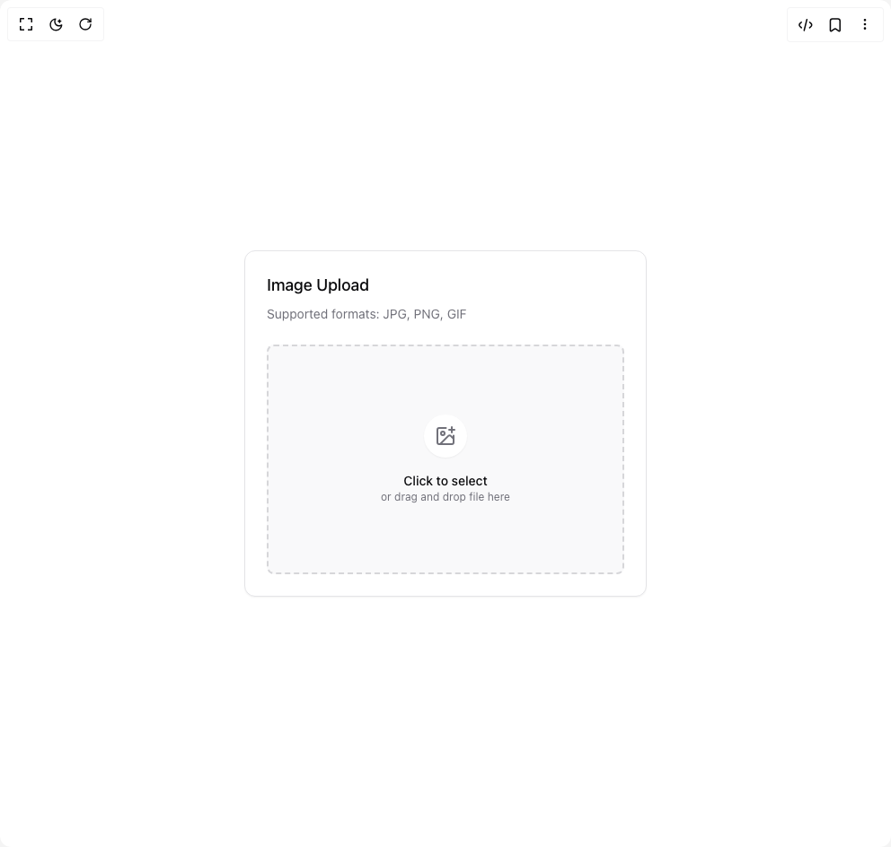

# Build Use Image Upload in BuilderStudio

> Build this component in our Agentic IDE: [BuilderStudio](https://builderstudio.dev).
>
> Join the BuilderStudio community on [Discord](https://discord.gg/QdWeSGCqfe) and [Reddit](https://reddit.com/r/builderstudio).



## Component

- Author group: `originui`
- Component: `use-image-upload`
- Variant: `default`
- Rendered HTML snapshot: [`rendered.html`](rendered.html)

## BuilderStudio prompt

You are implementing a React component based on a component reference.

## Component identity

- Author: originui
- Component slug: use-image-upload
- Demo slug: default
- Title: use-image-upload
- Description: 

## Goal

Recreate this component in a React + TypeScript + Tailwind CSS project. Preserve the visual layout, spacing, colors, border radius, shadows, interaction behavior, animation behavior, responsive behavior, and dark mode behavior shown in the rendered demo.

## Implementation requirements

- Use React and TypeScript.
- Use Tailwind CSS classes whenever possible.
- Keep the component self-contained unless the source files require helper components.
- If the source uses CSS variables, custom CSS, animations, or keyframes, include them.
- If the source uses external packages, list and use the required packages.
- Preserve accessibility attributes, button semantics, links, keyboard behavior, and ARIA attributes when visible in the source.
- Do not replace the component with a simplified placeholder.
- Return complete production-ready code.

## Dependencies

No reference metadata available.

## Rendered DOM snapshot

This is the rendered demo HTML extracted from the live preview. Use it to verify structure, class names, visible content, and layout.

```html
<div id="root"><div class="relative flex items-center justify-center h-screen w-full m-auto p-16 bg-background text-foreground"><div class="absolute lab-bg inset-0 size-full"><div class="absolute inset-0 bg-[radial-gradient(#00000021_1px,transparent_1px)] dark:bg-[radial-gradient(#ffffff22_1px,transparent_1px)]"></div></div><div class="flex w-full justify-center relative"><div class="w-full max-w-md space-y-6 rounded-xl border border-border bg-card p-6 shadow-sm"><div class="space-y-2"><h3 class="text-lg font-medium">Image Upload</h3><p class="text-sm text-muted-foreground">Supported formats: JPG, PNG, GIF</p></div><input class="h-9 w-full rounded-lg border border-input bg-background text-sm shadow-sm shadow-black/5 transition-shadow placeholder:text-muted-foreground/70 focus-visible:border-ring focus-visible:outline-none focus-visible:ring-[3px] focus-visible:ring-ring/20 disabled:cursor-not-allowed disabled:opacity-50 p-0 pr-3 italic text-muted-foreground/70 file:me-3 file:h-full file:border-0 file:border-r file:border-solid file:border-input file:bg-transparent file:px-3 file:text-sm file:font-medium file:not-italic file:text-foreground hidden" accept="image/*" type="file"><div class="flex h-64 cursor-pointer flex-col items-center justify-center gap-4 rounded-lg border-2 border-dashed border-muted-foreground/25 bg-muted/50 transition-colors hover:bg-muted"><div class="rounded-full bg-background p-3 shadow-sm"><svg xmlns="http://www.w3.org/2000/svg" width="24" height="24" viewBox="0 0 24 24" fill="none" stroke="currentColor" stroke-width="2" stroke-linecap="round" stroke-linejoin="round" class="lucide lucide-image-plus h-6 w-6 text-muted-foreground" aria-hidden="true"><path d="M16 5h6"></path><path d="M19 2v6"></path><path d="M21 11.5V19a2 2 0 0 1-2 2H5a2 2 0 0 1-2-2V5a2 2 0 0 1 2-2h7.5"></path><path d="m21 15-3.086-3.086a2 2 0 0 0-2.828 0L6 21"></path><circle cx="9" cy="9" r="2"></circle></svg></div><div class="text-center"><p class="text-sm font-medium">Click to select</p><p class="text-xs text-muted-foreground">or drag and drop file here</p></div></div></div></div></div></div>
```

## Reference source files

No reference source files were available.
