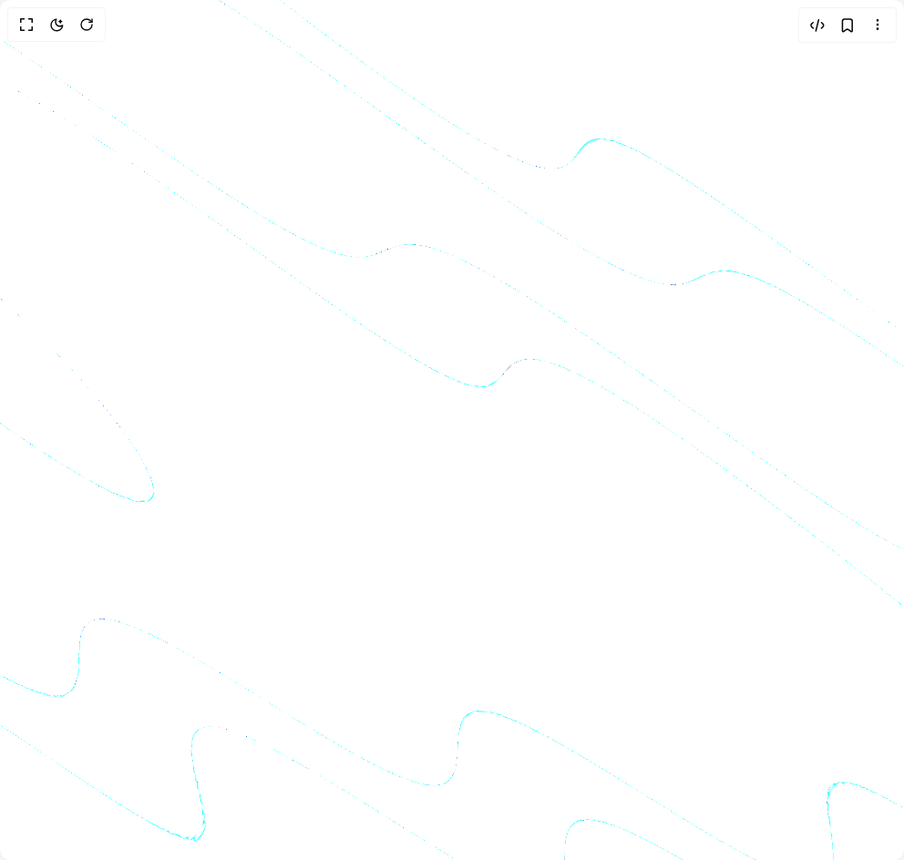
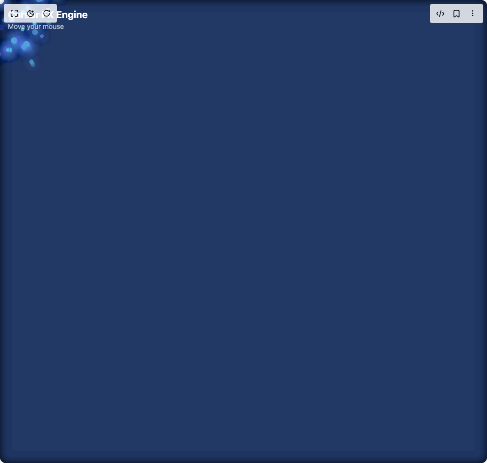
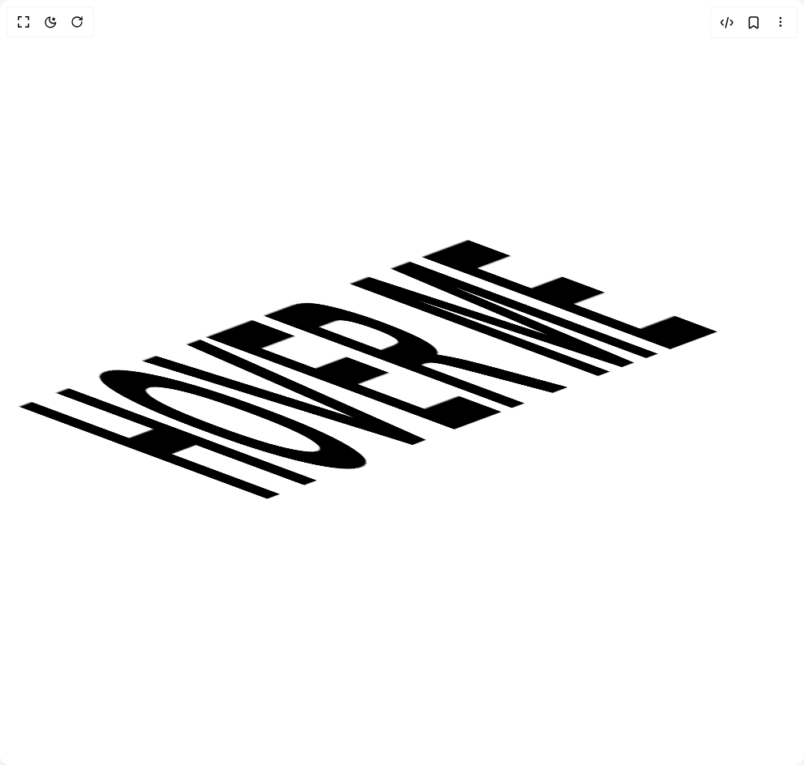
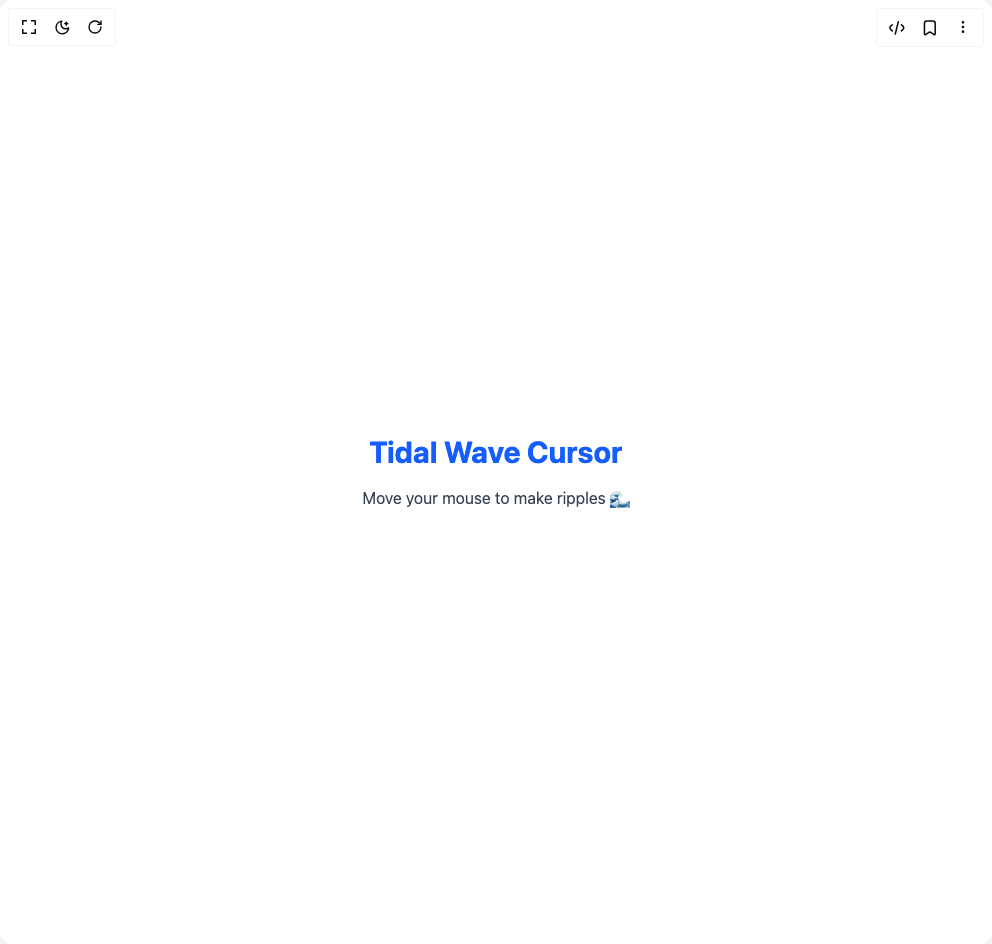

# Osint619 Components

6 components are available in this author group.

> Build any component in [BuilderStudio](https://builderstudio.dev), then share improvements with the community on [Discord](https://discord.gg/QdWeSGCqfe) or [Reddit](https://reddit.com/r/builderstudio).

| Preview | Component | Variant |
| --- | --- | --- |
|  | [Bloodline](bloodline/default/README.md) | `default` |
|  | [Cursor](cursor/default/README.md) | `default` |
|  | [Robot Flyby](robot-flyby/default/README.md) | `default` |
|  | [Sneak](sneak/default/README.md) | `default` |
|  | [Tidal Cursor](tidal-cursor/default/README.md) | `default` |
|  | [Wilderness](wilderness/default/README.md) | `default` |
