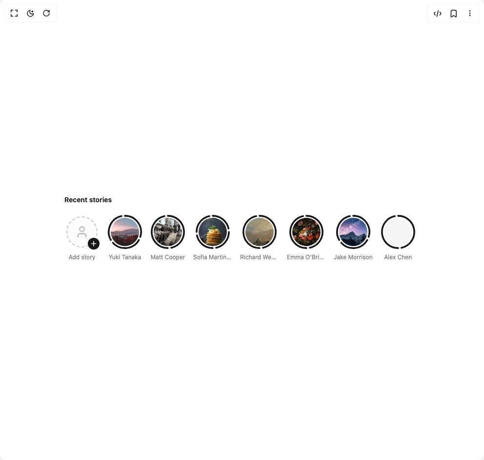

# Build Story Viewer in BuilderStudio

> Build this component in our Agentic IDE: [BuilderStudio](https://builderstudio.dev).
>
> Join the BuilderStudio community on [Discord](https://discord.gg/QdWeSGCqfe) and [Reddit](https://reddit.com/r/builderstudio).



## Component

- Author group: `osiris-balonga`
- Component: `story-viewer`
- Variant: `default`
- Rendered HTML snapshot: [`rendered.html`](rendered.html)

## BuilderStudio prompt

You are implementing a React component based on a component reference.

## Component identity

- Author: osiris-balonga
- Component slug: story-viewer
- Demo slug: default
- Title: story-viewer
- Description: 

## Goal

Recreate this component in a React + TypeScript + Tailwind CSS project. Preserve the visual layout, spacing, colors, border radius, shadows, interaction behavior, animation behavior, responsive behavior, and dark mode behavior shown in the rendered demo.

## Implementation requirements

- Use React and TypeScript.
- Use Tailwind CSS classes whenever possible.
- Keep the component self-contained unless the source files require helper components.
- If the source uses CSS variables, custom CSS, animations, or keyframes, include them.
- If the source uses external packages, list and use the required packages.
- Preserve accessibility attributes, button semantics, links, keyboard behavior, and ARIA attributes when visible in the source.
- Do not replace the component with a simplified placeholder.
- Return complete production-ready code.

## Dependencies

No reference metadata available.

## Rendered DOM snapshot

This is the rendered demo HTML extracted from the live preview. Use it to verify structure, class names, visible content, and layout.

```html
<div id="root"><div class="w-screen min-h-screen flex justify-center items-center"><div class="w-screen min-h-screen flex justify-center items-center"><div class="w-full max-w-3xl mx-auto px-4"><h3 class="text-sm font-semibold mb-3 px-1">Recent stories</h3><div class="flex gap-4 overflow-x-auto py-2 px-1 [&amp;::-webkit-scrollbar]:hidden md:[&amp;::-webkit-scrollbar]:block md:[&amp;::-webkit-scrollbar]:h-1.5 [&amp;::-webkit-scrollbar-track]:bg-transparent [&amp;::-webkit-scrollbar-thumb]:bg-muted-foreground/20 [&amp;::-webkit-scrollbar-thumb]:rounded-full hover:[&amp;::-webkit-scrollbar-thumb]:bg-muted-foreground/30"><button class="relative flex flex-col items-center gap-2 group cursor-pointer" aria-label="Add your story"><div class="relative"><div class="w-[72px] h-[72px] rounded-full p-1"><div class="w-full h-full rounded-full flex items-center justify-center border-2 border-dashed border-muted-foreground/40 bg-muted/30 transition-all duration-200 group-hover:border-muted-foreground/60 group-hover:bg-muted/50"><svg xmlns="http://www.w3.org/2000/svg" width="24" height="24" viewBox="0 0 24 24" fill="none" stroke="currentColor" stroke-width="2" stroke-linecap="round" stroke-linejoin="round" class="lucide lucide-user w-7 h-7 text-muted-foreground/50" aria-hidden="true"><path d="M19 21v-2a4 4 0 0 0-4-4H9a4 4 0 0 0-4 4v2"></path><circle cx="12" cy="7" r="4"></circle></svg></div></div><div class="absolute bottom-0 right-0 w-6 h-6 rounded-full bg-primary flex items-center justify-center shadow-sm" tabindex="0"><svg xmlns="http://www.w3.org/2000/svg" width="24" height="24" viewBox="0 0 24 24" fill="none" stroke="currentColor" stroke-width="2.5" stroke-linecap="round" stroke-linejoin="round" class="lucide lucide-plus w-4 h-4 text-primary-foreground" aria-hidden="true"><path d="M5 12h14"></path><path d="M12 5v14"></path></svg></div></div><span class="text-xs text-muted-foreground truncate max-w-[80px]">Add story</span></button><div><div><button type="button" class="relative flex flex-col items-center gap-2 group cursor-pointer bg-transparent border-none outline-none focus-visible:ring-2 focus-visible:ring-ring focus-visible:ring-offset-2 rounded-lg" aria-label="View Yuki Tanaka's stories"><div class="relative w-[72px] h-[72px]"><svg class="absolute inset-0 w-full h-full" viewBox="0 0 100 100"><path d="M 50 4 A 46 46 0 0 1 93.74859974957707 64.21478174124758" fill="none" stroke-width="5" stroke-linecap="round" class="transition-colors duration-300 stroke-primary"></path><path d="M 89.83716857408419 73 A 46 46 0 0 1 15.815338028039875 80.78000789250748" fill="none" stroke-width="5" stroke-linecap="round" class="transition-colors duration-300 stroke-primary"></path><path d="M 10.162831425915819 73 A 46 46 0 0 1 40.43606222238305 5.005210366244945" fill="none" stroke-width="5" stroke-linecap="round" class="transition-colors duration-300 stroke-primary"></path></svg><div class="absolute inset-[5px] rounded-full bg-background p-[2px]"><div class="w-full h-full rounded-full overflow-hidden bg-muted"></div></div></div><span class="text-xs text-muted-foreground truncate max-w-[80px]">Yuki Tanaka</span></button></div></div><div><div><button type="button" class="relative flex flex-col items-center gap-2 group cursor-pointer bg-transparent border-none outline-none focus-visible:ring-2 focus-visible:ring-ring focus-visible:ring-offset-2 rounded-lg" aria-label="View Matt Cooper's stories"><div class="relative w-[72px] h-[72px]"><svg class="absolute inset-0 w-full h-full" viewBox="0 0 100 100"><path d="M 50 4 A 46 46 0 0 1 59.563937777616935 94.99478963375506" fill="none" stroke-width="5" stroke-linecap="round" class="transition-colors duration-300 stroke-primary"></path><path d="M 50 96 A 46 46 0 0 1 40.43606222238305 5.005210366244945" fill="none" stroke-width="5" stroke-linecap="round" class="transition-colors duration-300 stroke-primary"></path></svg><div class="absolute inset-[5px] rounded-full bg-background p-[2px]"><div class="w-full h-full rounded-full overflow-hidden bg-muted"></div></div></div><span class="text-xs text-muted-foreground truncate max-w-[80px]">Matt Cooper</span></button></div></div><div><div><button type="button" class="relative flex flex-col items-center gap-2 group cursor-pointer bg-transparent border-none outline-none focus-visible:ring-2 focus-visible:ring-ring focus-visible:ring-offset-2 rounded-lg" aria-label="View Sofia Martinez's stories"><div class="relative w-[72px] h-[72px]"><svg class="absolute inset-0 w-full h-full" viewBox="0 0 100 100"><path d="M 50 4 A 46 46 0 0 1 94.99478963375506 40.43606222238307" fill="none" stroke-width="5" stroke-linecap="round" class="transition-colors duration-300 stroke-primary"></path><path d="M 96 50 A 46 46 0 0 1 59.563937777616935 94.99478963375506" fill="none" stroke-width="5" stroke-linecap="round" class="transition-colors duration-300 stroke-primary"></path><path d="M 50 96 A 46 46 0 0 1 5.005210366244938 59.56393777761693" fill="none" stroke-width="5" stroke-linecap="round" class="transition-colors duration-300 stroke-primary"></path><path d="M 4 50.00000000000001 A 46 46 0 0 1 40.43606222238305 5.005210366244945" fill="none" stroke-width="5" stroke-linecap="round" class="transition-colors duration-300 stroke-primary"></path></svg><div class="absolute inset-[5px] rounded-full bg-background p-[2px]"><div class="w-full h-full rounded-full overflow-hidden bg-muted"></div></div></div><span class="text-xs text-muted-foreground truncate max-w-[80px]">Sofia Martinez</span></button></div></div><div><div><button type="button" class="relative flex flex-col items-center gap-2 group cursor-pointer bg-transparent border-none outline-none focus-visible:ring-2 focus-visible:ring-ring focus-visible:ring-offset-2 rounded-lg" aria-label="View Richard Weber's stories"><div class="relative w-[72px] h-[72px]"><svg class="absolute inset-0 w-full h-full" viewBox="0 0 100 100"><path d="M 50 4 A 46 46 0 0 1 59.563937777616935 94.99478963375506" fill="none" stroke-width="5" stroke-linecap="round" class="transition-colors duration-300 stroke-primary"></path><path d="M 50 96 A 46 46 0 0 1 40.43606222238305 5.005210366244945" fill="none" stroke-width="5" stroke-linecap="round" class="transition-colors duration-300 stroke-primary"></path></svg><div class="absolute inset-[5px] rounded-full bg-background p-[2px]"><div class="w-full h-full rounded-full overflow-hidden bg-muted"><video src="https://commondatastorage.googleapis.com/gtv-videos-bucket/sample/ForBiggerFun.mp4" poster="https://images.unsplash.com/photo-1469474968028-56623f02e42e?w=800&amp;h=1200&amp;fit=crop" class="w-full h-full object-cover transition-transform duration-300 group-hover:scale-110" playsinline="" preload="metadata"></video></div></div></div><span class="text-xs text-muted-foreground truncate max-w-[80px]">Richard Weber</span></button></div></div><div><div><button type="button" class="relative flex flex-col items-center gap-2 group cursor-pointer bg-transparent border-none outline-none focus-visible:ring-2 focus-visible:ring-ring focus-visible:ring-offset-2 rounded-lg" aria-label="View Emma O'Brien's stories"><div class="relative w-[72px] h-[72px]"><svg class="absolute inset-0 w-full h-full" viewBox="0 0 100 100"><path d="M 50 4 A 46 46 0 0 1 59.563937777616935 94.99478963375506" fill="none" stroke-width="5" stroke-linecap="round" class="transition-colors duration-300 stroke-primary"></path><path d="M 50 96 A 46 46 0 0 1 40.43606222238305 5.005210366244945" fill="none" stroke-width="5" stroke-linecap="round" class="transition-colors duration-300 stroke-primary"></path></svg><div class="absolute inset-[5px] rounded-full bg-background p-[2px]"><div class="w-full h-full rounded-full overflow-hidden bg-muted"><video src="https://commondatastorage.googleapis.com/gtv-videos-bucket/sample/ForBiggerMeltdowns.mp4" poster="https://images.unsplash.com/photo-1579783902614-a3fb3927b6a5?w=800&amp;h=1200&amp;fit=crop" class="w-full h-full object-cover transition-transform duration-300 group-hover:scale-110" playsinline="" preload="metadata"></video></div></div></div><span class="text-xs text-muted-foreground truncate max-w-[80px]">Emma O'Brien</span></button></div></div><div><div><button type="button" class="relative flex flex-col items-center gap-2 group cursor-pointer bg-transparent border-none outline-none focus-visible:ring-2 focus-visible:ring-ring focus-visible:ring-offset-2 rounded-lg" aria-label="View Jake Morrison's stories"><div class="relative w-[72px] h-[72px]"><svg class="absolute inset-0 w-full h-full" viewBox="0 0 100 100"><path d="M 50 4 A 46 46 0 0 1 93.74859974957707 64.21478174124758" fill="none" stroke-width="5" stroke-linecap="round" class="transition-colors duration-300 stroke-primary"></path><path d="M 89.83716857408419 73 A 46 46 0 0 1 15.815338028039875 80.78000789250748" fill="none" stroke-width="5" stroke-linecap="round" class="transition-colors duration-300 stroke-primary"></path><path d="M 10.162831425915819 73 A 46 46 0 0 1 40.43606222238305 5.005210366244945" fill="none" stroke-width="5" stroke-linecap="round" class="transition-colors duration-300 stroke-primary"></path></svg><div class="absolute inset-[5px] rounded-full bg-background p-[2px]"><div class="w-full h-full rounded-full overflow-hidden bg-muted"></div></div></div><span class="text-xs text-muted-foreground truncate max-w-[80px]">Jake Morrison</span></button></div></div><div><div><button type="button" class="relative flex flex-col items-center gap-2 group cursor-pointer bg-transparent border-none outline-none focus-visible:ring-2 focus-visible:ring-ring focus-visible:ring-offset-2 rounded-lg" aria-label="View Alex Chen's stories"><div class="relative w-[72px] h-[72px]"><svg class="absolute inset-0 w-full h-full" viewBox="0 0 100 100"><path d="M 50 4 A 46 46 0 0 1 59.563937777616935 94.99478963375506" fill="none" stroke-width="5" stroke-linecap="round" class="transition-colors duration-300 stroke-primary"></path><path d="M 50 96 A 46 46 0 0 1 40.43606222238305 5.005210366244945" fill="none" stroke-width="5" stroke-linecap="round" class="transition-colors duration-300 stroke-primary"></path></svg><div class="absolute inset-[5px] rounded-full bg-background p-[2px]"><div class="w-full h-full rounded-full overflow-hidden bg-muted"><video src="https://commondatastorage.googleapis.com/gtv-videos-bucket/sample/ForBiggerEscapes.mp4" class="w-full h-full object-cover transition-transform duration-300 group-hover:scale-110" playsinline="" preload="metadata"></video></div></div></div><span class="text-xs text-muted-foreground truncate max-w-[80px]">Alex Chen</span></button></div></div></div></div></div></div></div>
```

## Reference source files

No reference source files were available.
