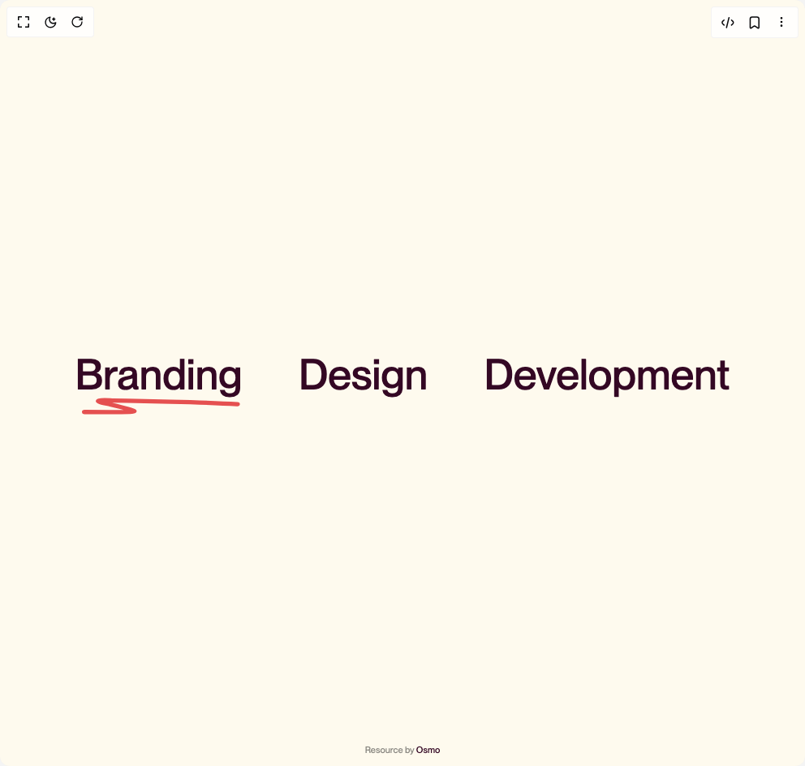

# Build Draw Random Underline in BuilderStudio

> Build this component in our Agentic IDE: [BuilderStudio](https://builderstudio.dev).
>
> Join the BuilderStudio community on [Discord](https://discord.gg/QdWeSGCqfe) and [Reddit](https://reddit.com/r/builderstudio).



## Component

- Author group: `osmosupply`
- Component: `draw-random-underline`
- Variant: `default`
- Rendered HTML snapshot: [`rendered.html`](rendered.html)

## BuilderStudio prompt

You are implementing a React component based on a component reference.

## Component identity

- Author: osmosupply
- Component slug: draw-random-underline
- Demo slug: default
- Title: draw-random-underline
- Description: 

## Goal

Recreate this component in a React + TypeScript + Tailwind CSS project. Preserve the visual layout, spacing, colors, border radius, shadows, interaction behavior, animation behavior, responsive behavior, and dark mode behavior shown in the rendered demo.

## Implementation requirements

- Use React and TypeScript.
- Use Tailwind CSS classes whenever possible.
- Keep the component self-contained unless the source files require helper components.
- If the source uses CSS variables, custom CSS, animations, or keyframes, include them.
- If the source uses external packages, list and use the required packages.
- Preserve accessibility attributes, button semantics, links, keyboard behavior, and ARIA attributes when visible in the source.
- Do not replace the component with a simplified placeholder.
- Return complete production-ready code.

## Dependencies

No reference metadata available.

## Rendered DOM snapshot

This is the rendered demo HTML extracted from the live preview. Use it to verify structure, class names, visible content, and layout.

```html
<div id="root"><div class="w-screen min-h-screen flex justify-center items-center"><div class="w-screen min-h-screen flex justify-center items-center"><div style="position: relative; width: 100%; min-height: 100vh; display: flex; flex-direction: column;"><section class="cloneable"><a href="#" class="text-draw w-inline-block"><p class="text-draw__p">Branding</p><div class="text-draw__box"><svg class="text-draw__box-svg" preserveAspectRatio="none" viewBox="0 0 310 41" fill="none" xmlns="http://www.w3.org/2000/svg"><path d="M17.0039 33.582C32.2307 33.7406 47.4552 33.7271 62.676 33.7113C67.3044 33.7064 96.546 33.9549 104.728 32.9769C113.615 31.9146 104.516 29.2022 102.022 28.1821C89.9573 23.2459 77.3751 19.9248 65.0451 15.9546C57.8987 13.6536 37.2813 9.3934 44.2314 7.00157C50.9667 4.68363 64.2873 6.71856 70.4249 6.86582C105.866 7.71618 141.306 8.48751 176.75 9.49827C217.874 10.671 258.906 11.9547 300 15.3886" stroke="#E55050" stroke-width="10" stroke-linecap="round"></path></svg></div></a><a href="#" class="text-draw w-inline-block"><p class="text-draw__p">Design</p><div class="text-draw__box"></div></a><a href="#" class="text-draw w-inline-block"><p class="text-draw__p">Development</p><div class="text-draw__box"></div></a></section><div class="osmo-credits"><p class="osmo-credits__p">Resource by <a target="_blank" href="https://www.osmo.supply?utm_source=codepen&amp;utm_medium=pen&amp;utm_campaign=draw-random-underline" class="osmo-credits__p-a">Osmo</a></p></div></div></div></div></div>
```

## Reference source files

No reference source files were available.
