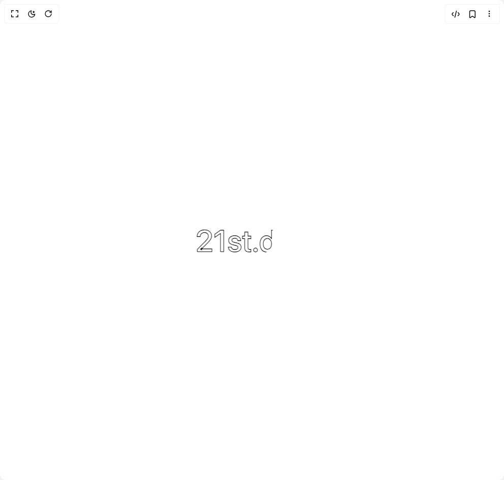

# Build Draw Line Text in BuilderStudio

> Build this component in our Agentic IDE: [BuilderStudio](https://builderstudio.dev).
>
> Join the BuilderStudio community on [Discord](https://discord.gg/QdWeSGCqfe) and [Reddit](https://reddit.com/r/builderstudio).



## Component

- Author group: `paceui`
- Component: `draw-line-text`
- Variant: `default`
- Rendered HTML snapshot: [`rendered.html`](rendered.html)

## BuilderStudio prompt

You are implementing a React component based on a component reference.

## Component identity

- Author: paceui
- Component slug: draw-line-text
- Demo slug: default
- Title: draw-line-text
- Description: 

## Goal

Recreate this component in a React + TypeScript + Tailwind CSS project. Preserve the visual layout, spacing, colors, border radius, shadows, interaction behavior, animation behavior, responsive behavior, and dark mode behavior shown in the rendered demo.

## Implementation requirements

- Use React and TypeScript.
- Use Tailwind CSS classes whenever possible.
- Keep the component self-contained unless the source files require helper components.
- If the source uses CSS variables, custom CSS, animations, or keyframes, include them.
- If the source uses external packages, list and use the required packages.
- Preserve accessibility attributes, button semantics, links, keyboard behavior, and ARIA attributes when visible in the source.
- Do not replace the component with a simplified placeholder.
- Return complete production-ready code.

## Dependencies

No reference metadata available.

## Rendered DOM snapshot

This is the rendered demo HTML extracted from the live preview. Use it to verify structure, class names, visible content, and layout.

```html
<div id="root"><div class="w-screen min-h-screen flex justify-center items-center"><div class="w-screen min-h-screen flex justify-center items-center"><svg class="font-medium" style="user-select: none; width: 221.234px; height: 73.13px;"><text y="60" x="0px" style="stroke: var(--color-foreground); fill: var(--color-foreground); fill-opacity: 0; font-size: 60px; stroke-width: 1.5px; stroke-dasharray: 279.625px; stroke-dashoffset: 0px;">2</text><text y="60" x="34.953125px" style="stroke: var(--color-foreground); fill: var(--color-foreground); fill-opacity: 0; font-size: 60px; stroke-width: 1.5px; stroke-dasharray: 220.875px; stroke-dashoffset: 0px;">1</text><text y="60" x="62.5625px" style="stroke: var(--color-foreground); fill: var(--color-foreground); fill-opacity: 0; font-size: 60px; stroke-width: 1.5px; stroke-dasharray: 233.5px; stroke-dashoffset: 0px;">s</text><text y="60" x="91.75px" style="stroke: var(--color-foreground); fill: var(--color-foreground); fill-opacity: 0; font-size: 60px; stroke-width: 1.5px; stroke-dasharray: 155.5px; stroke-dashoffset: 15px;">t</text><text y="60" x="111.1875px" style="stroke: var(--color-foreground); fill: var(--color-foreground); fill-opacity: 0; font-size: 60px; stroke-width: 1.5px; stroke-dasharray: 109.5px; stroke-dashoffset: 46px;">.</text><text y="60" x="124.875px" style="stroke: var(--color-foreground); fill: var(--color-foreground); fill-opacity: 0; font-size: 60px; stroke-width: 1.5px; stroke-dasharray: 274.75px; stroke-dashoffset: 203px;">d</text><text y="60" x="159.21875px" style="stroke: var(--color-foreground); fill: var(--color-foreground); fill-opacity: 0; font-size: 60px; stroke-width: 1.5px; stroke-dasharray: 254.875px; stroke-dashoffset: 254.875px;">e</text><text y="60" x="191.078125px" style="stroke: var(--color-foreground); fill: var(--color-foreground); fill-opacity: 0; font-size: 60px; stroke-width: 1.5px; stroke-dasharray: 241.25px; stroke-dashoffset: 241.25px;">v</text></svg></div></div></div>
```

## Reference source files

No reference source files were available.
