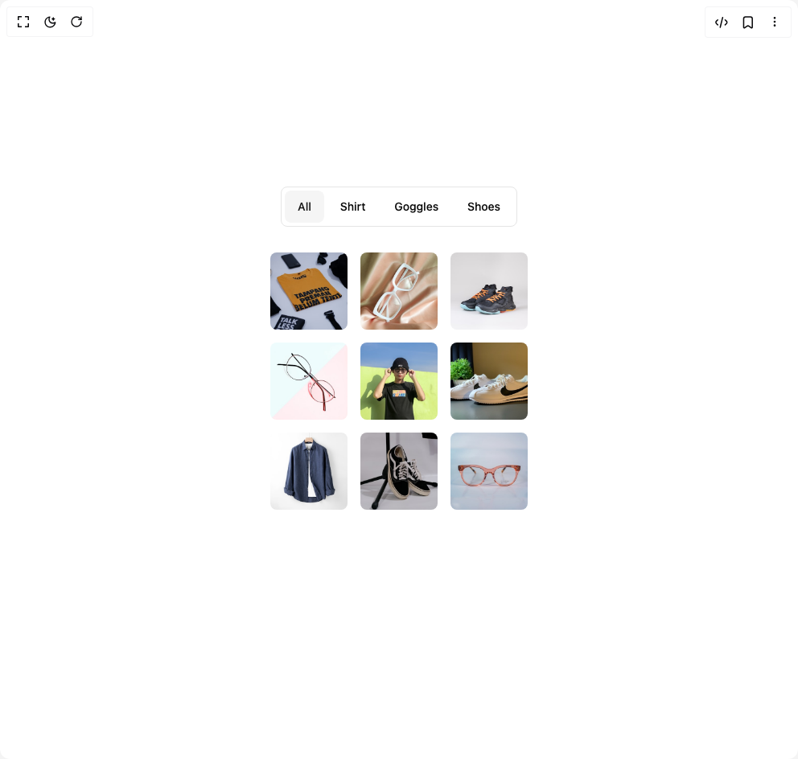

# Build Flip Reveal in BuilderStudio

> Build this component in our Agentic IDE: [BuilderStudio](https://builderstudio.dev).
>
> Join the BuilderStudio community on [Discord](https://discord.gg/QdWeSGCqfe) and [Reddit](https://reddit.com/r/builderstudio).



## Component

- Author group: `paceui`
- Component: `flip-reveal`
- Variant: `default`
- Rendered HTML snapshot: [`rendered.html`](rendered.html)

## BuilderStudio prompt

You are implementing a React component based on a component reference.

## Component identity

- Author: paceui
- Component slug: flip-reveal
- Demo slug: default
- Title: flip-reveal
- Description: 

## Goal

Recreate this component in a React + TypeScript + Tailwind CSS project. Preserve the visual layout, spacing, colors, border radius, shadows, interaction behavior, animation behavior, responsive behavior, and dark mode behavior shown in the rendered demo.

## Implementation requirements

- Use React and TypeScript.
- Use Tailwind CSS classes whenever possible.
- Keep the component self-contained unless the source files require helper components.
- If the source uses CSS variables, custom CSS, animations, or keyframes, include them.
- If the source uses external packages, list and use the required packages.
- Preserve accessibility attributes, button semantics, links, keyboard behavior, and ARIA attributes when visible in the source.
- Do not replace the component with a simplified placeholder.
- Return complete production-ready code.

## Dependencies

No reference metadata available.

## Rendered DOM snapshot

This is the rendered demo HTML extracted from the live preview. Use it to verify structure, class names, visible content, and layout.

```html
<div id="root"><div class="w-screen min-h-screen flex justify-center items-center"><div class="w-screen min-h-screen flex justify-center items-center"><div class="flex min-h-120 flex-col items-center gap-8"><div role="group" dir="ltr" class="flex items-center justify-center gap-1 bg-background rounded-md border p-1" tabindex="0" style="outline: none;"><button type="button" data-state="on" role="radio" aria-checked="true" class="inline-flex items-center justify-center rounded-md text-sm font-medium ring-offset-background transition-colors hover:bg-muted hover:text-muted-foreground focus-visible:outline-none focus-visible:ring-2 focus-visible:ring-ring focus-visible:ring-offset-2 disabled:pointer-events-none disabled:opacity-50 data-[state=on]:bg-accent data-[state=on]:text-accent-foreground bg-transparent h-10 px-3 sm:px-4" tabindex="-1" data-radix-collection-item="">All</button><button type="button" data-state="off" role="radio" aria-checked="false" class="inline-flex items-center justify-center rounded-md text-sm font-medium ring-offset-background transition-colors hover:bg-muted hover:text-muted-foreground focus-visible:outline-none focus-visible:ring-2 focus-visible:ring-ring focus-visible:ring-offset-2 disabled:pointer-events-none disabled:opacity-50 data-[state=on]:bg-accent data-[state=on]:text-accent-foreground bg-transparent h-10 px-3 sm:px-4" tabindex="-1" data-radix-collection-item="">Shirt</button><button type="button" data-state="off" role="radio" aria-checked="false" class="inline-flex items-center justify-center rounded-md text-sm font-medium ring-offset-background transition-colors hover:bg-muted hover:text-muted-foreground focus-visible:outline-none focus-visible:ring-2 focus-visible:ring-ring focus-visible:ring-offset-2 disabled:pointer-events-none disabled:opacity-50 data-[state=on]:bg-accent data-[state=on]:text-accent-foreground bg-transparent h-10 px-3 sm:px-4" tabindex="-1" data-radix-collection-item="">Goggles</button><button type="button" data-state="off" role="radio" aria-checked="false" class="inline-flex items-center justify-center rounded-md text-sm font-medium ring-offset-background transition-colors hover:bg-muted hover:text-muted-foreground focus-visible:outline-none focus-visible:ring-2 focus-visible:ring-ring focus-visible:ring-offset-2 disabled:pointer-events-none disabled:opacity-50 data-[state=on]:bg-accent data-[state=on]:text-accent-foreground bg-transparent h-10 px-3 sm:px-4" tabindex="-1" data-radix-collection-item="">Shoes</button></div><div class="grid grid-cols-3 gap-3 sm:gap-4"><div data-flip="shirt" data-flip-id="auto-1" class="flex" style=""></div><div data-flip="goggles" data-flip-id="auto-2" class="flex" style=""></div><div data-flip="shoes" data-flip-id="auto-3" class="flex" style=""></div><div data-flip="goggles" data-flip-id="auto-4" class="flex" style=""></div><div data-flip="shirt" data-flip-id="auto-5" class="flex" style=""></div><div data-flip="shoes" data-flip-id="auto-6" class="flex" style=""></div><div data-flip="shirt" data-flip-id="auto-7" class="flex" style=""></div> <div data-flip="shoes" data-flip-id="auto-8" class="flex" style=""></div><div data-flip="goggles" data-flip-id="auto-9" class="flex" style=""></div></div></div></div></div></div>
```

## Reference source files

No reference source files were available.
