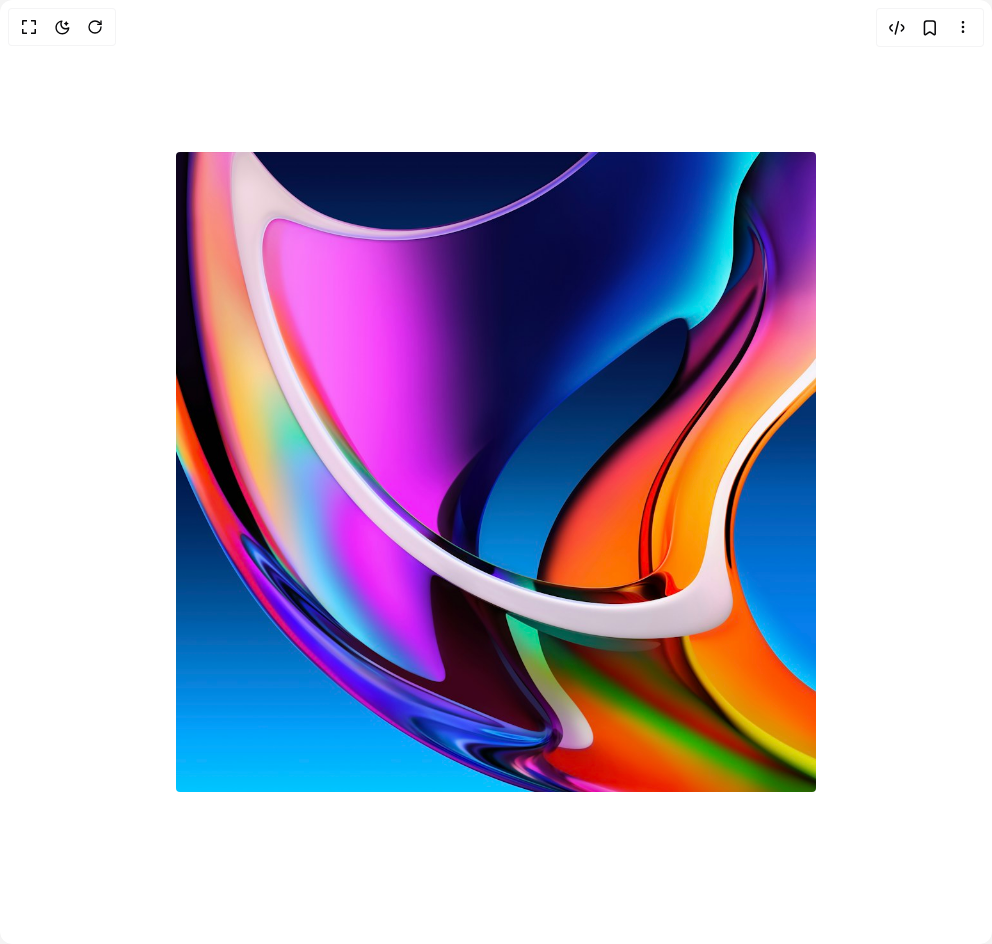

# Build Liquid Cursor in BuilderStudio

> Build this component in our Agentic IDE: [BuilderStudio](https://builderstudio.dev).
>
> Join the BuilderStudio community on [Discord](https://discord.gg/QdWeSGCqfe) and [Reddit](https://reddit.com/r/builderstudio).



## Component

- Author group: `paceui`
- Component: `liquid-cursor`
- Variant: `default`
- Rendered HTML snapshot: [`rendered.html`](rendered.html)

## BuilderStudio prompt

You are implementing a React component based on a component reference.

## Component identity

- Author: paceui
- Component slug: liquid-cursor
- Demo slug: default
- Title: liquid-cursor
- Description: 

## Goal

Recreate this component in a React + TypeScript + Tailwind CSS project. Preserve the visual layout, spacing, colors, border radius, shadows, interaction behavior, animation behavior, responsive behavior, and dark mode behavior shown in the rendered demo.

## Implementation requirements

- Use React and TypeScript.
- Use Tailwind CSS classes whenever possible.
- Keep the component self-contained unless the source files require helper components.
- If the source uses CSS variables, custom CSS, animations, or keyframes, include them.
- If the source uses external packages, list and use the required packages.
- Preserve accessibility attributes, button semantics, links, keyboard behavior, and ARIA attributes when visible in the source.
- Do not replace the component with a simplified placeholder.
- Return complete production-ready code.

## Dependencies

No reference metadata available.

## Rendered DOM snapshot

This is the rendered demo HTML extracted from the live preview. Use it to verify structure, class names, visible content, and layout.

```html
<div id="root"><div class="w-screen min-h-screen flex justify-center items-center"><div class="w-screen min-h-screen flex justify-center items-center"><div class="cursor-none"><div class="pointer-events-none fixed z-999 rounded-full saturate-[180%] backdrop-blur-[2px] dark:saturate-[160%] dark:backdrop-brightness-[0.8]" style="height: 44px; width: 44px; background: radial-gradient(circle, rgba(255, 255, 255, 0.25) 90%, rgba(255, 255, 255, 0.1) 70%, transparent 20%); border: 1px solid rgba(255, 255, 255, 0.25);"></div></div></div></div></div>
```

## Reference source files

No reference source files were available.
