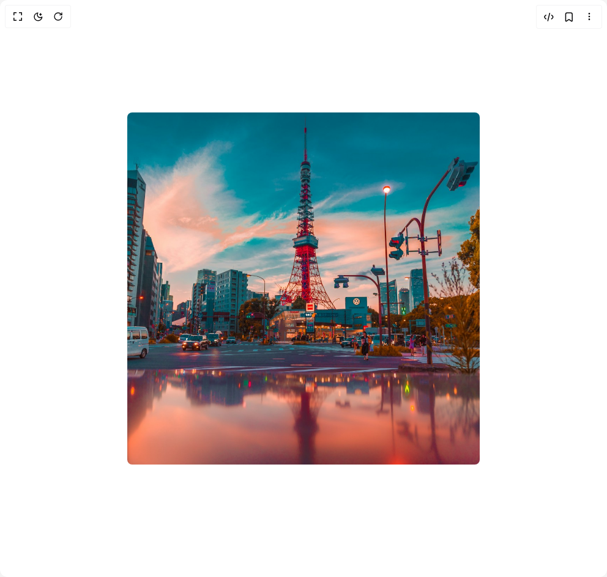

# Build Liquid Glass in BuilderStudio

> Build this component in our Agentic IDE: [BuilderStudio](https://builderstudio.dev).
>
> Join the BuilderStudio community on [Discord](https://discord.gg/QdWeSGCqfe) and [Reddit](https://reddit.com/r/builderstudio).



## Component

- Author group: `paceui`
- Component: `liquid-glass`
- Variant: `default`
- Rendered HTML snapshot: [`rendered.html`](rendered.html)

## BuilderStudio prompt

You are implementing a React component based on a component reference.

## Component identity

- Author: paceui
- Component slug: liquid-glass
- Demo slug: default
- Title: liquid-glass
- Description: 

## Goal

Recreate this component in a React + TypeScript + Tailwind CSS project. Preserve the visual layout, spacing, colors, border radius, shadows, interaction behavior, animation behavior, responsive behavior, and dark mode behavior shown in the rendered demo.

## Implementation requirements

- Use React and TypeScript.
- Use Tailwind CSS classes whenever possible.
- Keep the component self-contained unless the source files require helper components.
- If the source uses CSS variables, custom CSS, animations, or keyframes, include them.
- If the source uses external packages, list and use the required packages.
- Preserve accessibility attributes, button semantics, links, keyboard behavior, and ARIA attributes when visible in the source.
- Do not replace the component with a simplified placeholder.
- Return complete production-ready code.

## Dependencies

No reference metadata available.

## Rendered DOM snapshot

This is the rendered demo HTML extracted from the live preview. Use it to verify structure, class names, visible content, and layout.

```html
<div id="root"><div class="w-screen min-h-screen flex justify-center items-center"><div class="w-screen min-h-screen flex justify-center items-center"><div class="relative cursor-none overflow-hidden"><svg xmlns="http://www.w3.org/2000/svg" width="0" height="0" class="absolute overflow-hidden"><defs><filter id="glass-distortion" x="0%" y="0%" width="100%" height="100%"><feTurbulence type="fractalNoise" baseFrequency="0.008 0.008" numOctaves="2" seed="92" result="noise"></feTurbulence><feGaussianBlur in="noise" stdDeviation="2" result="blurred"></feGaussianBlur><feDisplacementMap in="SourceGraphic" in2="blurred" scale="80" xChannelSelector="R" yChannelSelector="G"></feDisplacementMap></filter></defs></svg><div class="absolute isolate z-999 rounded-(--lg-border-radius) shadow-lg before:absolute before:inset-0 before:z-0 before:rounded-(--lg-border-radius) before:bg-[rgba(255,255,255,var(--lg-tint-opacity))] before:shadow-[inset_0_0_20px_-5px_rgba(255,255,255,0.7)] before:content-[''] after:absolute after:inset-0 after:isolate after:-z-1 after:rounded-(--lg-border-radius) after:[filter:url(#glass-distortion)] after:backdrop-blur-[var(--lg-blur)] after:content-['']" style="--lg-border-radius: 60px; --lg-tint-opacity: 0.1; --lg-blur: 1px; width: 120px; height: 120px;"></div></div></div></div></div>
```

## Reference source files

No reference source files were available.
