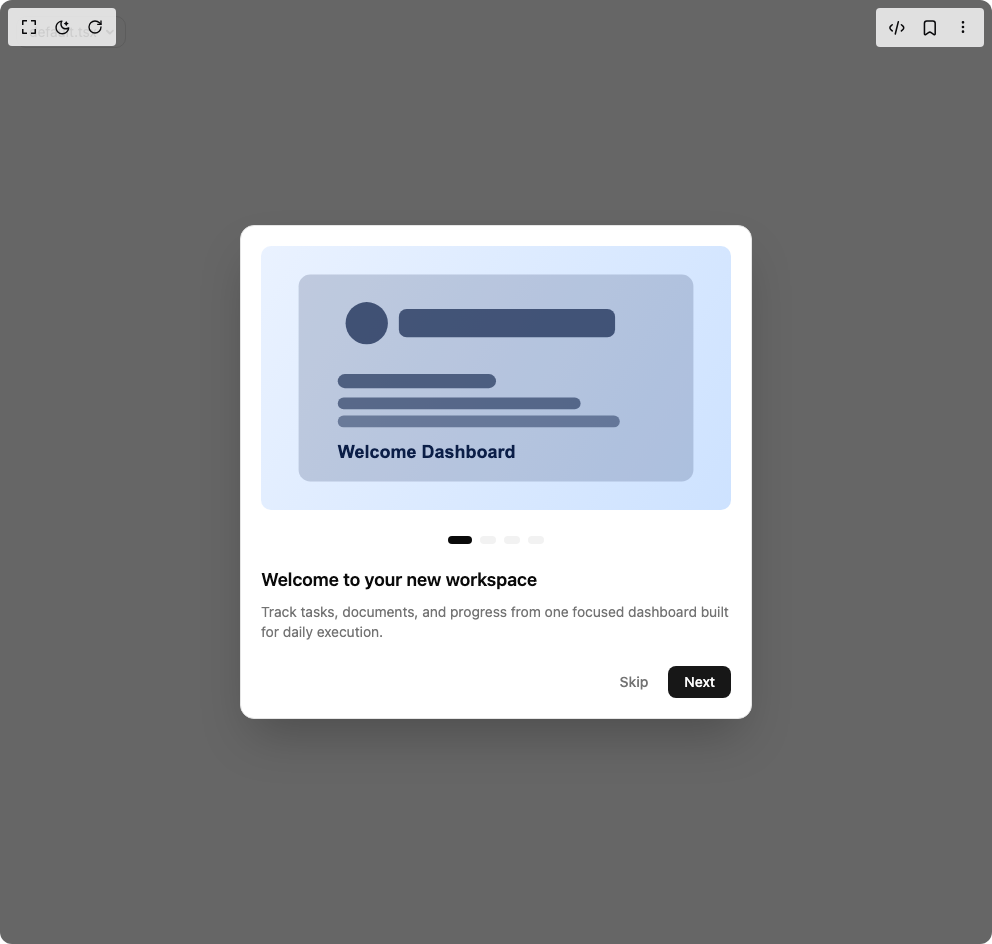

# Build Onboarding Dialog in BuilderStudio

> Build this component in our Agentic IDE: [BuilderStudio](https://builderstudio.dev).
>
> Join the BuilderStudio community on [Discord](https://discord.gg/QdWeSGCqfe) and [Reddit](https://reddit.com/r/builderstudio).



## Component

- Author group: `patrick-xin`
- Component: `onboarding-dialog`
- Variant: `default`
- Rendered HTML snapshot: [`rendered.html`](rendered.html)

## BuilderStudio prompt

You are implementing a React component based on a component reference.

## Component identity

- Author: patrick-xin
- Component slug: onboarding-dialog
- Demo slug: default
- Title: onboarding-dialog
- Description: 

## Goal

Recreate this component in a React + TypeScript + Tailwind CSS project. Preserve the visual layout, spacing, colors, border radius, shadows, interaction behavior, animation behavior, responsive behavior, and dark mode behavior shown in the rendered demo.

## Implementation requirements

- Use React and TypeScript.
- Use Tailwind CSS classes whenever possible.
- Keep the component self-contained unless the source files require helper components.
- If the source uses CSS variables, custom CSS, animations, or keyframes, include them.
- If the source uses external packages, list and use the required packages.
- Preserve accessibility attributes, button semantics, links, keyboard behavior, and ARIA attributes when visible in the source.
- Do not replace the component with a simplified placeholder.
- Return complete production-ready code.

## Dependencies

No reference metadata available.

## Rendered DOM snapshot

This is the rendered demo HTML extracted from the live preview. Use it to verify structure, class names, visible content, and layout.

```html
<div id="root"><div class="w-screen min-h-screen flex justify-center items-center"><div class="fixed top-4 left-4 z-10"><select class="appearance-none h-8 max-w-[200px] text-sm leading-tight rounded-lg pl-3 pr-7 py-0 border bg-background focus:outline-none focus:ring-0"><option value="default.tsx_Demo">default.tsx</option></select><div class="absolute top-1/2 transform -translate-y-1/2 right-2 pointer-events-none"><svg class="w-4 h-4 fill-current" viewBox="0 0 20 20"><path d="M5.516 7.548c.436-.446 1.043-.48 1.576 0L10 10.405l2.908-2.857c.533-.48 1.14-.446 1.576 0 .436.445.408 1.197 0 1.615l-3.734 3.705c-.533.534-1.39.534-1.923 0l-3.734-3.705c-.408-.418-.436-1.17 0-1.615z"></path></svg></div></div><div class="w-screen min-h-screen flex justify-center items-center"><div class="flex items-center justify-center min-h-screen bg-background"><div class="fixed inset-0 z-50 flex items-center justify-center"><div class="absolute inset-0 bg-black/60"></div><div class="relative w-full max-w-lg mx-4 rounded-xl bg-background border border-border shadow-2xl overflow-hidden animate-in fade-in zoom-in-95"><div class="p-3 sm:p-4"><div class="overflow-hidden rounded-lg"><div class="flex" style="transform: translate3d(0px, 0px, 0px);"><div class="flex-[0_0_100%] min-w-0"><div class="p-1"></div></div><div class="flex-[0_0_100%] min-w-0"><div class="p-1"></div></div><div class="flex-[0_0_100%] min-w-0"><div class="p-1"></div></div><div class="flex-[0_0_100%] min-w-0"><div class="p-1"></div></div></div></div><div class="flex items-center justify-center gap-2 mt-3"><div style="opacity: 1; width: 24px;"><button aria-label="Go to Welcome to your new workspace" class="h-2 w-full rounded-full transition-colors cursor-pointer bg-foreground"></button></div><div style="opacity: 0.5; width: 16px;"><button aria-label="Go to Automate repetitive work" class="h-2 w-full rounded-full transition-colors cursor-pointer bg-border hover:bg-muted-foreground"></button></div><div style="opacity: 0.5; width: 16px;"><button aria-label="Go to Collaborate in context" class="h-2 w-full rounded-full transition-colors cursor-pointer bg-border hover:bg-muted-foreground"></button></div><div style="opacity: 0.5; width: 16px;"><button aria-label="Go to Measure outcomes" class="h-2 w-full rounded-full transition-colors cursor-pointer bg-border hover:bg-muted-foreground"></button></div></div><div class="grid mt-4 px-1"><div class="col-start-1 row-start-1" style="pointer-events: auto; opacity: 1;"><h2 class="text-lg font-semibold text-foreground">Welcome to your new workspace</h2><p class="text-sm text-muted-foreground mt-2">Track tasks, documents, and progress from one focused dashboard built for daily execution.</p></div><div class="col-start-1 row-start-1" style="pointer-events: none; opacity: 0;"><h2 class="text-lg font-semibold text-foreground">Automate repetitive work</h2><p class="text-sm text-muted-foreground mt-2">Use smart flows to remove manual busywork and keep your team aligned without extra status meetings.</p></div><div class="col-start-1 row-start-1" style="pointer-events: none; opacity: 0;"><h2 class="text-lg font-semibold text-foreground">Collaborate in context</h2><p class="text-sm text-muted-foreground mt-2">Share feedback directly where decisions happen so updates stay clear, timely, and easy to follow.</p></div><div class="col-start-1 row-start-1" style="pointer-events: none; opacity: 0;"><h2 class="text-lg font-semibold text-foreground">Measure outcomes</h2><p class="text-sm text-muted-foreground mt-2">Turn activity into insights with reporting views that highlight what is improving and what needs attention.</p></div></div><div class="flex items-center justify-between mt-6 px-1 pb-1"><div></div><div class="flex items-center gap-2"><button class="px-3 py-1.5 rounded-md text-sm font-medium text-muted-foreground hover:bg-accent hover:text-foreground transition-colors cursor-pointer">Skip</button><button class="px-4 py-1.5 rounded-md bg-primary text-primary-foreground text-sm font-medium hover:bg-primary/90 transition-colors cursor-pointer">Next</button></div></div></div></div></div></div></div></div></div>
```

## Reference source files

No reference source files were available.
